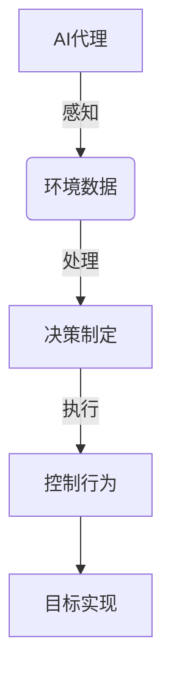
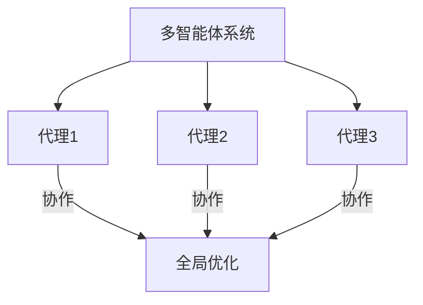
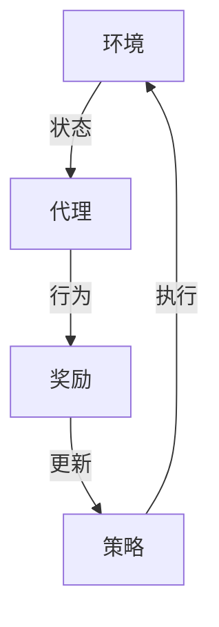

# 交通管理中AI代理的工作流程与应用

## 1.背景介绍

### 1.1 交通拥堵问题

随着城市化进程的加快和汽车保有量的不断增长,交通拥堵已经成为许多城市面临的一个严峻挑战。交通拥堵不仅导致时间和燃料的浪费,还会产生环境污染、能源消耗以及安全隐患等一系列问题。因此,有效地管理和优化交通流量对于缓解城市交通压力至关重要。

### 1.2 传统交通管理系统的局限性

传统的交通管理系统主要依赖人工操作和简单的控制算法,难以适应复杂多变的实时交通状况。此外,这些系统通常缺乏对整体交通网络的全局优化,导致局部优化的决策可能会对整体交通造成不利影响。

### 1.3 AI代理在交通管理中的应用前景

人工智能(AI)技术在交通管理领域展现出巨大的应用潜力。AI代理可以通过感知环境、学习模式并作出智能决策,从而实现对复杂交通系统的实时控制和优化。与传统系统相比,AI代理具有自适应性强、决策智能化等优势,能够更好地应对动态变化的交通场景。

## 2.核心概念与联系

### 2.1 AI代理

AI代理是一种自主系统,能够感知环境、处理信息、制定计划并采取行动以实现特定目标。在交通管理领域,AI代理可以接收来自各种传感器(如闯红灯监控、车辆检测器等)的实时交通数据,并根据这些数据作出相应的决策和控制。



### 2.2 多智能体系统

交通系统是一个复杂的大系统,需要多个AI代理协同工作才能实现整体优化。多智能体系统(Multi-Agent System,MAS)提供了一种有效的框架,允许多个智能代理通过协作、协调和竞争来解决复杂的问题。

在交通管理中,每个路口可以部署一个AI代理,多个代理通过相互协作来优化整个交通网络的流量。这种分布式的方法不仅提高了系统的鲁棒性和可扩展性,而且还能够更好地处理局部交通异常情况。



### 2.3 强化学习

强化学习(Reinforcement Learning)是一种机器学习范式,其中智能体通过与环境的交互来学习如何采取最优行为,以最大化累积奖励。在交通管理中,AI代理可以将交通状态作为环境状态,将控制策略(如调整信号灯时长)作为行为,并根据交通流量的变化来获得奖励或惩罚。通过不断尝试和学习,代理可以逐步优化其控制策略,从而提高整体交通效率。



## 3.核心算法原理具体操作步骤

### 3.1 马尔可夫决策过程

交通管理中的AI代理决策问题可以建模为马尔可夫决策过程(Markov Decision Process,MDP)。MDP由以下几个要素组成:

- 状态集合 $\mathcal{S}$: 表示交通系统的所有可能状态,如车辆数量、拥堵程度等。
- 行为集合 $\mathcal{A}$: 代理可以采取的控制行为,如调整信号灯时长。
- 状态转移概率 $P(s'|s,a)$: 在状态 $s$ 下执行行为 $a$ 后,转移到状态 $s'$ 的概率。
- 奖励函数 $R(s,a)$: 在状态 $s$ 下执行行为 $a$ 所获得的即时奖励。

代理的目标是找到一个最优策略 $\pi^*$,使得在遵循该策略时,从任意初始状态出发,累积的期望奖励最大化。

### 3.2 Q-Learning算法

Q-Learning是一种常用的强化学习算法,适用于解决MDP问题。算法的核心思想是通过不断尝试和更新,逐步学习出一个最优的行为价值函数 $Q(s,a)$,表示在状态 $s$ 下执行行为 $a$ 后可获得的期望累积奖励。

Q-Learning算法的具体步骤如下:

1. 初始化 $Q(s,a)$ 为任意值
2. 对于每个时间步:
    a. 观察当前状态 $s$
    b. 根据 $\epsilon$-贪婪策略选择行为 $a$
    c. 执行行为 $a$,观察下一状态 $s'$ 和即时奖励 $r$
    d. 更新 $Q(s,a)$ 值:
    
    $$Q(s,a) \leftarrow Q(s,a) + \alpha \Big[r + \gamma \max_{a'}Q(s',a') - Q(s,a)\Big]$$
    
    其中 $\alpha$ 是学习率, $\gamma$ 是折扣因子。

3. 重复步骤2,直到收敛

通过上述算法,代理可以逐步学习出一个近似最优的行为价值函数 $Q^*(s,a)$,并据此执行相应的控制策略。

### 3.3 协同Q-Learning

在多智能体系统中,每个代理都需要考虑其他代理的行为,以实现整体最优。协同Q-Learning(Cooperative Q-Learning)是一种分布式的强化学习算法,允许多个代理通过信息交换来学习一个最优的联合行为价值函数。

算法步骤类似于基本Q-Learning,但在更新步骤中,每个代理不仅需要考虑自身的行为和奖励,还需要将其他代理的行为和奖励纳入计算。具体来说,对于代理 $i$,其行为价值函数更新公式为:

$$Q_i(s,\vec{a}) \leftarrow Q_i(s,\vec{a}) + \alpha \Bigg[r_i + \gamma \max_{\vec{a}'}\sum_{j}Q_j(s',\vec{a}') - Q_i(s,\vec{a})\Bigg]$$

其中 $\vec{a}$ 表示所有代理的联合行为, $r_i$ 是代理 $i$ 获得的即时奖励。通过这种方式,每个代理都可以学习到一个与整体目标一致的最优策略。

## 4.数学模型和公式详细讲解举例说明

### 4.1 马尔可夫决策过程的数学表示

马尔可夫决策过程可以用一个五元组 $(\mathcal{S}, \mathcal{A}, P, R, \gamma)$ 来表示,其中:

- $\mathcal{S}$ 是状态集合
- $\mathcal{A}$ 是行为集合
- $P(s'|s,a)$ 是状态转移概率函数
- $R(s,a)$ 是奖励函数
- $\gamma \in [0,1)$ 是折扣因子,用于权衡即时奖励和长期累积奖励的权重

对于任意策略 $\pi$,我们定义其价值函数 $V^\pi(s)$ 为:

$$V^\pi(s) = \mathbb{E}_\pi\Bigg[\sum_{t=0}^\infty \gamma^t R(s_t, a_t) \Big| s_0 = s\Bigg]$$

即在初始状态 $s_0 = s$ 时,按照策略 $\pi$ 执行所获得的期望累积奖励之和。我们的目标是找到一个最优策略 $\pi^*$,使得对于任意状态 $s$,都有 $V^{\pi^*}(s) \geq V^\pi(s)$。

### 4.2 Q-Learning算法的收敛性证明

Q-Learning算法的收敛性可以通过证明其行为价值函数序列 $\{Q_t\}$ 以概率 1 收敛到最优行为价值函数 $Q^*$ 来保证。

首先,我们定义行为价值函数 $Q^\pi(s,a)$ 为:

$$Q^\pi(s,a) = \mathbb{E}_\pi\Bigg[\sum_{t=0}^\infty \gamma^t R(s_t, a_t) \Big| s_0 = s, a_0 = a\Bigg]$$

则有贝尔曼最优方程:

$$Q^*(s,a) = R(s,a) + \gamma \sum_{s'} P(s'|s,a) \max_{a'} Q^*(s',a')$$

我们定义贝尔曼备份算子 $\mathcal{T}$ 为:

$$(\mathcal{T}Q)(s,a) = R(s,a) + \gamma \sum_{s'} P(s'|s,a) \max_{a'} Q(s',a')$$

则 $Q^*$ 是 $\mathcal{T}$ 的不动点。可以证明,如果满足以下两个条件:

1. 所有状态-行为对 $(s,a)$ 被无限次访问
2. 学习率 $\alpha_t$ 满足:
    - $\sum_{t=0}^\infty \alpha_t(s,a) = \infty$
    - $\sum_{t=0}^\infty \alpha_t^2(s,a) < \infty$

那么 Q-Learning 算法的行为价值函数序列 $\{Q_t\}$ 以概率 1 收敛到 $Q^*$。

### 4.3 交通流建模示例

交通流可以用细胞传播模型(Cellular Automata Model)来建模。我们将道路分割成一个个细胞,每个细胞可以被车辆占据或空置。车辆在相邻细胞之间按照一定规则前进,从而模拟实际交通流的运动。

设 $v_i(t)$ 表示时刻 $t$ 时第 $i$ 个细胞的车辆速度,则细胞传播模型的更新规则可以表示为:

$$v_i(t+1) = \min\Big(v_i(t)+1, v_{\max}, d_i(t+1)\Big)$$

其中 $v_{\max}$ 是最大允许速度, $d_i(t+1)$ 是第 $i$ 个细胞前方的空余细胞数。这个规则表示,车辆会尽可能加速前进,但不能超过最大速度,也不能超过前方的空余距离。

基于这个模型,我们可以模拟不同交通控制策略对交通流的影响,并将模拟结果作为强化学习算法的输入,以优化控制策略。

## 5.项目实践:代码实例和详细解释说明

为了更好地理解AI代理在交通管理中的应用,我们将通过一个简单的交通网络模拟示例来演示相关算法的实现。

### 5.1 环境构建

我们首先构建一个简单的交通网络环境,包括4个路口和8条双向道路。每个路口都有一个控制信号灯的AI代理。

```python
import numpy as np

class TrafficEnvironment:
    def __init__(self, n_intersections):
        self.n_intersections = n_intersections
        self.traffic_data = np.zeros((n_intersections, 4))  # 4 directions per intersection
        
    def get_state(self):
        return self.traffic_data.copy()
    
    def step(self, actions):
        # 根据actions更新traffic_data
        # ...
        
        # 计算奖励
        rewards = self.calculate_rewards(actions)
        
        return rewards
    
    def calculate_rewards(self, actions):
        # 根据actions和traffic_data计算奖励
        # ...
        return rewards
```

### 5.2 Q-Learning代理实现

接下来,我们实现一个基于Q-Learning的AI代理,用于控制单个路口的信号灯时长。

```python
import random

class QLearningAgent:
    def __init__(self, state_size, action_size, alpha=0.1, gamma=0.95, epsilon=0.1):
        self.state_size = state_size
        self.action_size = action_size
        self.alpha = alpha  # 学习率
        self.gamma = gamma  # 折扣因子
        self.epsilon = epsilon  # 探索率
        self.q_table = {}  # 行为价值函数表
        
    def get_action(self, state):
        if random.random() < self.epsilon:
            return random.randint(0, self.action_size - 1)  