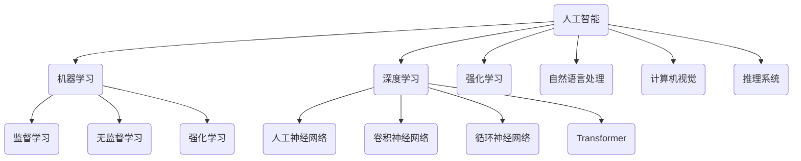

# 人工智能 原理与代码实例讲解

## 1. 背景介绍

人工智能(Artificial Intelligence, AI)是当今科技领域最热门、最具革命性的技术之一。它旨在使机器能够模仿人类的认知功能,如学习、推理、感知和解决问题等。近年来,人工智能的发展日新月异,在多个领域取得了突破性进展,如计算机视觉、自然语言处理、机器学习等,正在深刻影响着我们的生活和工作方式。

### 1.1 人工智能的发展历程

人工智能的概念可以追溯到20世纪50年代,当时一些先驱者提出了"思考的机器"的设想。1956年,约翰·麦卡锡在达特茅斯学院主持了一次会议,会上正式确立了"人工智能"这一术语。此后,人工智能经历了几个重要的发展阶段:

1. 早期阶段(1956-1974):这一时期的研究主要集中在博弈、定理证明和符号推理等领域。
2. 知识工程阶段(1980-1987):专家系统和知识表示成为研究热点。
3. 机器学习兴起(1990s-):benefitting from大数据和计算能力的提升,机器学习算法开始大放异彩。
4. 深度学习时代(2010s-):受到大数据、GPU计算能力和新算法的推动,深度学习技术取得了突破性进展。

### 1.2 人工智能的重要性

人工智能正在彻底改变着我们的生活、工作和社会。它的影响力不亚于工业革命和互联网革命。人工智能的重要性主要体现在以下几个方面:

1. **提高效率和生产力**:人工智能可以自动化许多重复性和耗时的任务,释放人力资源专注于更有价值的工作。
2. **优化决策**:通过分析大量数据,人工智能能够提供更准确、更客观的决策支持。
3. **创新发展**:人工智能为新产品、新服务和新商业模式的创新提供了强大动力。
4. **促进科学发展**:人工智能在医疗、天文、材料等诸多科学领域发挥着重要作用。

虽然人工智能带来了巨大的机遇,但也存在一些挑战和风险,如就业影响、算法偏差、隐私和安全等,需要我们高度重视并采取相应措施。

## 2. 核心概念与联系

要全面理解人工智能,我们需要掌握一些核心概念及其相互关系。下面是一些最为关键的概念:

### 2.1 机器学习

机器学习(Machine Learning)是人工智能的一个重要分支,它赋予机器从数据中自动分析、获取模式并做出决策的能力。机器学习算法可分为三大类:

1. **监督学习**(Supervised Learning):利用标注好的训练数据,学习一个从输入到输出的映射函数。常见算法有线性回归、逻辑回归、支持向量机等。
2. **无监督学习**(Unsupervised Learning):仅利用输入数据,发现其中隐藏的模式或结构。常见算法有聚类、降维等。
3. **强化学习**(Reinforcement Learning):通过与环境的交互,获得奖赏最大化的策略。常用于控制、决策等场景。

### 2.2 深度学习

深度学习(Deep Learning)是机器学习的一个分支,它通过构建深层神经网络模型来自动从数据中学习特征表示。常见的深度学习模型包括:

1. **人工神经网络**(Artificial Neural Network, ANN)
2. **卷积神经网络**(Convolutional Neural Network, CNN):擅长处理网格结构数据,如图像。
3. **循环神经网络**(Recurrent Neural Network, RNN):擅长处理序列数据,如文本、语音。
4. **Transformer**:基于注意力机制的新型网络,在NLP任务中表现卓越。

### 2.3 其他人工智能分支

除了机器学习和深度学习,人工智能还包括以下一些重要分支:

1. **自然语言处理**(Natural Language Processing, NLP):使计算机能够理解和生成人类语言。
2. **计算机视觉**(Computer Vision, CV):赋予机器对图像和视频的理解能力。
3. **推理系统**(Reasoning Systems):模拟人类的逻辑推理和决策过程。
4. **规划算法**(Planning Algorithms):为智能体设计行为序列以完成目标。
5. **机器人技术**(Robotics):控制机器人系统与环境交互。

这些分支彼此交叉、相互促进,共同推动着人工智能的发展。

## 3. 核心算法原理具体操作步骤

在上一节中,我们介绍了人工智能的一些核心概念。接下来,我们将深入探讨几种核心算法的原理和具体操作步骤。

### 3.1 线性回归

线性回归是一种常见的监督学习算法,旨在找到一个最佳拟合的线性方程来描述自变量和因变量之间的关系。线性回归算法的步骤如下:

1. **获取数据集**:包含自变量(features)和因变量(target)的数据集。
2. **数据预处理**:对数据进行标准化或归一化处理。
3. **定义代价函数**:通常使用均方误差(MSE)作为代价函数。
4. **模型训练**:使用梯度下降等优化算法,不断调整模型参数,最小化代价函数。
5. **模型评估**:在测试集上评估模型的性能指标,如均方根误差(RMSE)。
6. **模型调优**:根据评估结果,可尝试特征工程、正则化等技术提升模型性能。

线性回归虽然简单,但在许多实际问题中仍有广泛应用,如股票预测、销量预测等。

### 3.2 逻辑回归

逻辑回归是一种用于分类任务的监督学习算法。它的原理是通过对数几率回归(logistic regression)将输入映射到0到1之间的值,从而得到样本属于某个类别的概率。逻辑回归算法步骤如下:

1. **获取数据集**:包含特征向量和类别标签的数据集。 
2. **数据预处理**:对数据进行标准化或归一化,并进行编码(如one-hot编码)。
3. **定义代价函数**:常用的是交叉熵损失函数。
4. **模型训练**:使用梯度下降等优化算法最小化代价函数。
5. **模型评估**:在测试集上评估分类准确率、精确率、召回率等指标。
6. **模型调优**:可尝试特征选择、正则化等技术提升性能。

逻辑回归常用于二分类问题,如垃圾邮件过滤、疾病检测等。对于多分类问题,则可采用一对多(One-vs-Rest)或一对一(One-vs-One)策略。

### 3.3 支持向量机

支持向量机(Support Vector Machine, SVM)是一种常用的监督学习模型,适用于分类和回归任务。其核心思想是在高维空间中寻找一个最优超平面,将不同类别的样本分开,并最大化两类样本到超平面的距离(即间隔)。SVM算法步骤如下:

1. **获取数据集**:包含特征向量和类别标签的数据集。
2. **选择核函数**:常用的核函数有线性核、多项式核、高斯核等。
3. **定义目标函数**:最大化间隔,同时最小化误分类样本数。
4. **模型训练**:通过对偶优化等方法求解目标函数,得到最优超平面参数。
5. **模型评估**:在测试集上评估分类准确率等指标。
6. **模型调优**:可调整核函数、正则化参数等超参数,提升性能。

SVM的优点是理论基础扎实、泛化性能良好。但对于大规模数据集,求解过程会变得复杂和缓慢。

### 3.4 K-Means聚类

K-Means是一种常用的无监督学习算法,用于对数据进行聚类分析。其基本思想是将n个样本划分为k个簇,使得簇内样本尽可能紧密,簇间样本尽可能疏远。算法步骤如下:

1. **初始化k个聚类中心**:可以随机选择,或使用K-Means++算法。
2. **计算每个样本到各个聚类中心的距离**:常用的距离度量有欧氏距离、曼哈顿距离等。
3. **将每个样本分配到最近的聚类中心所在的簇**
4. **重新计算每个簇的聚类中心**:取该簇所有样本的均值作为新的聚类中心。
5. **重复步骤2-4**:直到聚类中心不再发生变化或达到最大迭代次数。
6. **输出最终的聚类结果**

K-Means算法简单高效,但需要预先指定聚类数目k,且对异常值敏感。可以结合其他技术(如层次聚类)来改进算法性能。

## 4. 数学模型和公式详细讲解举例说明

在上一节中,我们介绍了几种核心算法的原理和步骤。这些算法背后都有一些重要的数学模型和公式支撑,下面我们将对其进行详细讲解和举例说明。

### 4.1 线性回归

在线性回归中,我们假设自变量(features) $X$ 和因变量(target) $y$ 之间存在如下线性关系:

$$y = \theta_0 + \theta_1x_1 + \theta_2x_2 + ... + \theta_nx_n$$

其中, $\theta_i$ 是需要学习的参数,目标是找到一组最优参数 $\theta$,使得预测值 $\hat{y}$ 与真实值 $y$ 之间的误差最小。

常用的代价函数是均方误差(Mean Squared Error, MSE):

$$J(\theta) = \frac{1}{2m}\sum_{i=1}^m(h_\theta(x^{(i)}) - y^{(i)})^2$$

其中, $m$ 是训练样本数量, $h_\theta(x)$ 是模型的预测输出。我们可以使用梯度下降等优化算法来最小化代价函数,从而得到最优参数 $\theta$。

例如,对于一个简单的一元线性回归问题,我们有如下数据:

| 房屋面积(平方米) | 房价(万元) |
|-------------------|------------|
| 50                | 50         |
| 100               | 90         |
| 150               | 130        |
| ...               | ...        |

我们的目标是根据房屋面积来预测房价。经过训练,假设得到的参数为 $\theta_0 = 10, \theta_1 = 0.8$,那么对于一套120平方米的房屋,预测价格为:

$$\hat{y} = 10 + 0.8 \times 120 = 106 (万元)$$

### 4.2 逻辑回归

在二分类问题中,我们希望将输入 $x$ 映射到0到1之间的值,表示样本属于正类的概率。逻辑回归使用 Sigmoid 函数来实现这一映射:

$$h_\theta(x) = \frac{1}{1 + e^{-\theta^Tx}}$$

其中, $\theta$ 是需要学习的参数向量。

对于给定的训练样本 $(x^{(i)}, y^{(i)})$,我们定义代价函数为交叉熵损失:

$$J(\theta) = -\frac{1}{m}\sum_{i=1}^m[y^{(i)}\log h_\theta(x^{(i)}) + (1-y^{(i)})\log(1-h_\theta(x^{(i)}))]$$

我们可以使用梯度下降等优化算法来最小化代价函数,得到最优参数 $\theta$。

例如,在对患者是否患有某种疾病进行分类时,我们有如下训