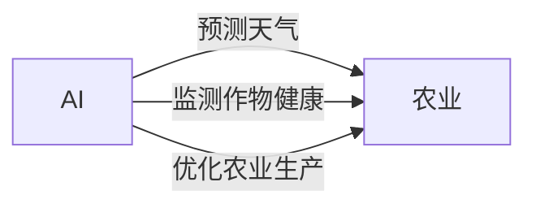

## 1.背景介绍

农业是人类社会的基石，随着科技的发展，人工智能(AI)技术的引入为农业带来了革命性的变化。本文将深入探讨AI在农业领域的应用，以及如何通过AI技术提高农业生产效率和质量。

## 2.核心概念与联系

人工智能是一种模拟人类智能的技术，它可以通过学习和理解数据来做出决策。在农业领域，AI可以用于预测天气、监测作物健康、优化农业生产等多个方面。



## 3.核心算法原理具体操作步骤

AI在农业的应用主要依赖于机器学习算法，特别是深度学习。以下是一个使用深度学习进行作物病害识别的基本步骤：

1. 数据收集：收集大量作物的健康和病害图片。
2. 数据预处理：对图片进行清洗，去除无关的背景噪声，提取作物的关键特征。
3. 模型训练：使用深度学习算法训练模型，使其能够识别出作物的病害。
4. 模型测试：使用未参与训练的数据测试模型的准确性。
5. 模型部署：将训练好的模型部署到农田，通过摄像头等设备实时监测作物的健康状况。

## 4.数学模型和公式详细讲解举例说明

深度学习的基本模型是神经网络，其中最简单的形式是感知机。感知机模型可以表示为：

$$ f(x) = sign(w \cdot x + b) $$

其中，$w$是权重，$x$是输入，$b$是偏置，$sign$是符号函数。

深度学习通过反向传播算法来更新权重和偏置，优化模型的预测效果。

## 5.项目实践：代码实例和详细解释说明

以下是一个使用Python和深度学习框架TensorFlow进行作物病害识别的简单示例：

```python
import tensorflow as tf
from tensorflow.keras import layers

# 构建模型
model = tf.keras.Sequential()
model.add(layers.Conv2D(32, (3, 3), activation='relu', input_shape=(150, 150, 3)))
model.add(layers.MaxPooling2D((2, 2)))
model.add(layers.Conv2D(64, (3, 3), activation='relu'))
model.add(layers.MaxPooling2D((2, 2)))
model.add(layers.Conv2D(64, (3, 3), activation='relu'))

# 编译模型
model.compile(optimizer='adam',
              loss=tf.keras.losses.SparseCategoricalCrossentropy(from_logits=True),
              metrics=['accuracy'])

# 训练模型
model.fit(train_images, train_labels, epochs=10)

# 测试模型
test_loss, test_acc = model.evaluate(test_images,  test_labels, verbose=2)
```

## 6.实际应用场景

AI在农业的应用广泛，如通过无人机进行作物病害的监测和识别，通过AI预测模型进行作物产量预测，通过机器学习优化农田灌溉和施肥等。

## 7.工具和资源推荐

推荐使用Python语言和TensorFlow框架进行AI模型的开发，使用OpenCV库进行图像处理，使用Kaggle平台获取农业相关的数据集。

## 8.总结：未来发展趋势与挑战

随着AI技术的发展，其在农业的应用将更加广泛和深入，如通过AI进行精准农业管理，通过AI进行农业自动化等。但同时也面临一些挑战，如数据获取难，模型泛化能力差等。

## 9.附录：常见问题与解答

Q: AI在农业的应用有哪些？
A: AI在农业的应用包括但不限于：作物病害识别，作物产量预测，农田管理等。

Q: 如何获取农业相关的数据？
A: 可以通过公开的数据集平台如Kaggle获取，也可以通过自己的设备如无人机收集。

Q: AI在农业的应用有哪些挑战？
A: AI在农业的应用面临的挑战主要包括数据获取难，模型泛化能力差，农业环境复杂等。

作者：禅与计算机程序设计艺术 / Zen and the Art of Computer Programming