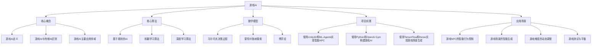

# 人工智能在游戏开发中的应用

## 1. 背景介绍
### 1.1 游戏行业的发展现状
#### 1.1.1 游戏市场规模
#### 1.1.2 游戏类型多样化
#### 1.1.3 玩家需求不断提高
### 1.2 人工智能技术的发展
#### 1.2.1 机器学习和深度学习
#### 1.2.2 自然语言处理
#### 1.2.3 计算机视觉
### 1.3 人工智能在游戏领域的应用前景
#### 1.3.1 提升游戏体验
#### 1.3.2 降低开发成本
#### 1.3.3 创造新的游戏类型

## 2. 核心概念与联系
### 2.1 游戏AI的定义
### 2.2 游戏AI与传统AI的区别
### 2.3 游戏AI的主要应用领域
#### 2.3.1 游戏角色的智能行为
#### 2.3.2 游戏场景的智能生成
#### 2.3.3 游戏难度的动态调整
#### 2.3.4 游戏测试与平衡
### 2.4 游戏AI与其他游戏技术的联系
#### 2.4.1 游戏引擎
#### 2.4.2 物理引擎
#### 2.4.3 图形渲染

## 3. 核心算法原理具体操作步骤
### 3.1 基于规则的AI
#### 3.1.1 有限状态机
#### 3.1.2 行为树 
#### 3.1.3 规则引擎
### 3.2 机器学习算法
#### 3.2.1 监督学习
##### 3.2.1.1 决策树
##### 3.2.1.2 支持向量机
##### 3.2.1.3 神经网络
#### 3.2.2 无监督学习 
##### 3.2.2.1 聚类算法
##### 3.2.2.2 关联规则
#### 3.2.3 强化学习
##### 3.2.3.1 Q-Learning
##### 3.2.3.2 SARSA
##### 3.2.3.3 Deep Q Network
### 3.3 深度学习算法
#### 3.3.1 卷积神经网络（CNN）
#### 3.3.2 循环神经网络（RNN）
#### 3.3.3 生成对抗网络（GAN）

## 4. 数学模型和公式详细讲解举例说明
### 4.1 马尔可夫决策过程（MDP）
#### 4.1.1 MDP的定义
#### 4.1.2 MDP的数学表示
#### 4.1.3 MDP在游戏AI中的应用
### 4.2 蒙特卡洛树搜索（MCTS） 
#### 4.2.1 MCTS的基本原理
#### 4.2.2 MCTS的四个步骤
##### 4.2.2.1 选择
##### 4.2.2.2 扩展
##### 4.2.2.3 仿真
##### 4.2.2.4 回溯
#### 4.2.3 MCTS在游戏AI中的应用
### 4.3 博弈论
#### 4.3.1 博弈论基础
#### 4.3.2 纳什均衡
#### 4.3.3 博弈论在游戏AI中的应用

## 5. 项目实践：代码实例和详细解释说明
### 5.1 使用Unity3D和ML-Agents实现智能NPC
#### 5.1.1 Unity3D环境搭建
#### 5.1.2 ML-Agents插件安装与配置
#### 5.1.3 创建NPC Agent
#### 5.1.4 设计奖励函数
#### 5.1.5 训练与测试
### 5.2 使用Python和OpenAI Gym构建游戏AI
#### 5.2.1 OpenAI Gym环境介绍
#### 5.2.2 创建游戏环境
#### 5.2.3 实现强化学习算法
#### 5.2.4 训练与评估
### 5.3 使用TensorFlow和Keras实现游戏场景生成
#### 5.3.1 数据集准备
#### 5.3.2 GAN模型设计
#### 5.3.3 模型训练
#### 5.3.4 生成结果分析

## 6. 实际应用场景
### 6.1 游戏NPC的智能行为控制
#### 6.1.1 敌人AI
#### 6.1.2 队友AI
#### 6.1.3 非玩家角色（NPC）AI
### 6.2 游戏场景的智能生成
#### 6.2.1 地形生成
#### 6.2.2 关卡设计
#### 6.2.3 游戏资源生成
### 6.3 游戏难度的动态调整
#### 6.3.1 基于玩家技能的难度调整
#### 6.3.2 基于玩家行为的难度调整
#### 6.3.3 自适应游戏难度系统
### 6.4 游戏测试与平衡
#### 6.4.1 自动化游戏测试
#### 6.4.2 游戏数值平衡
#### 6.4.3 游戏机制优化

## 7. 工具和资源推荐
### 7.1 游戏引擎
#### 7.1.1 Unity3D
#### 7.1.2 Unreal Engine
#### 7.1.3 Cocos2d
### 7.2 机器学习框架
#### 7.2.1 TensorFlow
#### 7.2.2 PyTorch
#### 7.2.3 Keras
### 7.3 开源项目与资源
#### 7.3.1 OpenAI Gym
#### 7.3.2 Unity ML-Agents
#### 7.3.3 GameAIResources

## 8. 总结：未来发展趋势与挑战
### 8.1 游戏AI的未来发展方向
#### 8.1.1 更加智能化和个性化
#### 8.1.2 跨平台与云端AI
#### 8.1.3 AI辅助游戏开发
### 8.2 游戏AI面临的挑战
#### 8.2.1 算法性能与效率
#### 8.2.2 数据获取与标注
#### 8.2.3 AI的可解释性与可控性
### 8.3 游戏AI的伦理与社会影响
#### 8.3.1 AI生成内容的版权问题
#### 8.3.2 AI对游戏公平性的影响
#### 8.3.3 AI在游戏中的伦理边界

## 9. 附录：常见问题与解答
### 9.1 如何选择合适的游戏AI算法？
### 9.2 游戏AI训练需要多少数据？
### 9.3 游戏AI的训练时间需要多长？
### 9.4 如何评估游戏AI的性能？
### 9.5 游戏AI是否会取代人类游戏设计师？

人工智能技术的快速发展为游戏行业带来了新的机遇和挑战。游戏开发者们正在积极探索如何将人工智能应用于游戏开发的各个环节，以提升游戏体验、降低开发成本、创造新的游戏类型。本文从背景介绍、核心概念、算法原理、数学模型、项目实践、应用场景等多个角度，全面探讨了人工智能在游戏开发中的应用现状、关键技术以及未来发展趋势。

游戏AI与传统AI有着显著的区别，游戏AI更加注重实时性、可玩性和娱乐性。游戏AI的主要应用领域包括游戏角色的智能行为控制、游戏场景的智能生成、游戏难度的动态调整以及游戏测试与平衡。这些应用领域涉及了游戏开发的方方面面，对提升游戏品质和玩家体验具有重要意义。

在游戏AI的实现中，既有基于规则的方法，如有限状态机、行为树和规则引擎，也有基于数据驱动的机器学习和深度学习算法，如监督学习、无监督学习、强化学习以及各种神经网络模型。不同的算法适用于不同的游戏AI任务，选择合适的算法是游戏AI开发的关键。

除了算法，游戏AI还涉及许多数学模型和理论，如马尔可夫决策过程、蒙特卡洛树搜索和博弈论等。这些数学工具为游戏AI的设计和优化提供了理论基础，有助于提高游戏AI的性能和效率。

在实际项目中，游戏开发者可以使用各种游戏引擎、机器学习框架和开源资源来实现游戏AI。例如，使用Unity3D和ML-Agents可以方便地实现智能NPC，使用Python和OpenAI Gym可以快速构建游戏AI原型，使用TensorFlow和Keras可以实现游戏场景的智能生成。这些工具和资源极大地降低了游戏AI开发的门槛，使得更多的开发者能够参与到游戏AI的创新中来。

展望未来，游戏AI将向着更加智能化、个性化和云端化的方向发展。同时，游戏AI也面临着算法性能、数据获取、可解释性等方面的挑战。此外，游戏AI还涉及版权、公平性和伦理等社会问题，需要游戏开发者和相关stakeholders共同探讨和应对。

总之，人工智能为游戏开发注入了新的活力，推动了游戏行业的创新和变革。游戏开发者应该积极拥抱人工智能技术，深入理解游戏AI的核心概念、算法原理和应用场景，并在实践中不断探索和优化，以创造出更加智能、更加有趣、更加吸引玩家的游戏作品。

作者：禅与计算机程序设计艺术 / Zen and the Art of Computer Programming