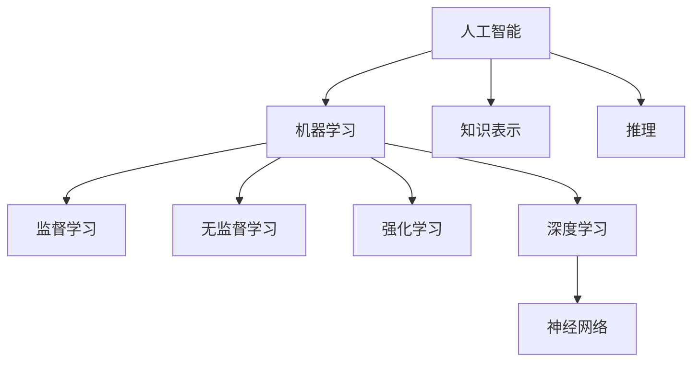

# 人工智能算法(AI Algorithms) - 原理与代码实例讲解

## 1.背景介绍
人工智能(Artificial Intelligence, AI)是计算机科学领域最前沿、最令人兴奋的分支之一。它致力于创造能够模仿人类智能的机器,让计算机能够像人一样思考、学习和解决问题。人工智能算法是实现人工智能的核心,它们赋予了机器学习、推理、决策的能力。

近年来,人工智能技术取得了突飞猛进的发展,从语音识别、图像分类到自然语言处理,人工智能正在深刻改变着我们的生活。掌握人工智能算法已成为计算机从业者的必备技能。本文将深入探讨几种主流的人工智能算法,阐述其核心原理,并给出详细的代码实例,帮助读者全面理解和实践人工智能技术。

### 1.1 人工智能的发展历程
#### 1.1.1 人工智能的起源
#### 1.1.2 人工智能的黄金时期
#### 1.1.3 人工智能的低谷
#### 1.1.4 人工智能的复兴

### 1.2 人工智能的应用领域
#### 1.2.1 计算机视觉
#### 1.2.2 自然语言处理 
#### 1.2.3 语音识别
#### 1.2.4 机器人技术
#### 1.2.5 专家系统

## 2.核心概念与联系
要深入理解人工智能算法,首先需要掌握一些核心概念。本节将介绍人工智能领域的关键术语和它们之间的联系。

### 2.1 机器学习
机器学习是人工智能的一个分支,它使计算机能够从数据中学习,而无需显式编程。通过学习算法,机器可以在给定输入的情况下调整自身的参数,从而对新数据做出准确的预测或决策。

### 2.2 深度学习
深度学习是机器学习的一个子集,它模仿人脑的结构和功能,使用多层神经网络从数据中学习表征。深度学习能够从原始数据中自动提取特征,在图像识别、语音识别等领域取得了巨大成功。

### 2.3 神经网络 
神经网络是一种模仿生物神经系统的计算模型,由大量的节点(即神经元)组成,节点之间通过带权重的连接传递信号。通过调整权重,神经网络可以学习到输入和输出之间复杂的非线性关系。

### 2.4 监督学习与无监督学习
监督学习是一种常见的机器学习范式,它使用带标签的训练数据来学习一个函数,将输入映射到期望的输出。相比之下,无监督学习使用没有标签的数据,旨在发现数据中隐藏的结构和模式。

### 2.5 强化学习
强化学习是一种让智能体通过与环境的交互来学习最优行为策略的方法。智能体根据环境反馈的奖励或惩罚来不断调整自己的行为,最终学会执行特定任务。

以下是这些核心概念之间的关系图:



## 3.核心算法原理具体操作步骤
本节将详细介绍几种主流的人工智能算法,包括它们的原理和具体操作步骤。

### 3.1 支持向量机(SVM)
支持向量机是一种常用的监督学习算法,特别适用于二分类问题。它的基本思想是在特征空间中找到一个最优的分离超平面,使得两个类别的样本能够被超平面很好地分开。

SVM的具体步骤如下:
1. 将训练样本映射到高维特征空间。
2. 在特征空间中找到能够最大化两类样本间隔的超平面。
3. 使用松弛变量允许一定程度的分类错误。
4. 利用核技巧处理非线性问题。
5. 对新样本进行分类预测。

### 3.2 决策树(Decision Tree)
决策树是一种直观易懂的分类和回归算法。它通过递归地划分特征空间,生成一个树形结构的决策模型。决策树的每个内部节点表示对某个特征的测试,每个分支对应一个测试结果,每个叶节点存储一个类别标签。

决策树的生成步骤如下:
1. 选择最优的特征作为根节点,按照该特征的取值划分数据集。
2. 对每个子数据集递归执行步骤1,直到满足停止条件。
3. 将每个叶节点标记为数据集中出现次数最多的类别。

### 3.3 K最近邻(KNN)
K最近邻是一种基本的监督学习算法,常用于分类和回归任务。它的核心思想是根据样本的特征相似性进行预测。对于一个新样本,KNN算法会在训练集中找到与其最相似的K个样本,然后根据这K个"邻居"的类别或值来决定新样本的预测结果。

KNN算法的步骤如下:
1. 计算新样本与每个训练样本之间的距离(如欧氏距离)。
2. 选取距离最近的K个训练样本作为"邻居"。
3. 对于分类任务,新样本的类别由"邻居"中出现最频繁的类别决定;对于回归任务,新样本的值由"邻居"的值的平均值决定。

### 3.4 随机森林(Random Forest)
随机森林是一种集成学习算法,它通过构建多个决策树并将它们的预测结果进行组合来提高模型的性能。随机森林在训练时引入了随机性,每棵决策树使用数据集的不同随机子集进行训练,并在每个节点随机选择一部分特征进行划分。

随机森林的训练步骤如下:
1. 从原始训练集中采样生成多个自助样本(bootstrap sample)。
2. 对每个自助样本,训练一棵决策树:在每个节点随机选择一部分特征,找到最优的分割点。
3. 重复步骤1和2,生成指定数量的决策树。
4. 对新样本的预测结果通过所有决策树的投票(分类)或平均(回归)产生。

## 4.数学模型和公式详细讲解举例说明
本节将详细讲解人工智能算法中涉及的一些关键数学模型和公式,并给出具体的例子帮助理解。

### 4.1 支持向量机的数学模型
支持向量机的目标是找到一个超平面 $w^Tx+b=0$,使得两类样本能够被超平面最大间隔地分开。这可以表示为以下优化问题:

$$
\min_{w,b} \frac{1}{2}||w||^2 \\
s.t. \quad y_i(w^Tx_i+b) \geq 1, \quad i=1,2,...,n
$$

其中,$x_i$是第$i$个样本的特征向量,$y_i$是其对应的类别标签(取值为1或-1),$n$是样本总数。

引入拉格朗日乘子$\alpha_i \geq 0$,将优化问题转化为其对偶形式:

$$
\max_{\alpha} \sum_{i=1}^n \alpha_i - \frac{1}{2} \sum_{i=1}^n \sum_{j=1}^n \alpha_i \alpha_j y_i y_j x_i^T x_j \\
s.t. \quad \sum_{i=1}^n \alpha_i y_i = 0, \quad \alpha_i \geq 0, \quad i=1,2,...,n
$$

求解出最优的$\alpha$后,可得到超平面的参数:

$$
w = \sum_{i=1}^n \alpha_i y_i x_i \\
b = y_j - \sum_{i=1}^n \alpha_i y_i x_i^T x_j
$$

对于非线性问题,可以使用核函数$K(x_i,x_j)$将样本映射到高维空间,优化目标变为:

$$
\max_{\alpha} \sum_{i=1}^n \alpha_i - \frac{1}{2} \sum_{i=1}^n \sum_{j=1}^n \alpha_i \alpha_j y_i y_j K(x_i,x_j)
$$

常用的核函数包括多项式核和高斯核(RBF)。

### 4.2 决策树的信息增益和基尼指数
决策树在每个节点选择最优划分特征时,通常使用信息增益或基尼指数作为评价指标。

给定数据集$D$和特征$A$,信息增益定义为:

$$
Gain(D,A) = Ent(D) - \sum_{v=1}^V \frac{|D^v|}{|D|} Ent(D^v)
$$

其中,$Ent(D)$是数据集$D$的信息熵:

$$
Ent(D) = -\sum_{k=1}^K \frac{|C_k|}{|D|} \log_2 \frac{|C_k|}{|D|}
$$

$|C_k|$是数据集$D$中属于第$k$类的样本数,$K$是类别总数。$D^v$是特征$A$取第$v$个值时对应的子数据集。

基尼指数定义为:

$$
Gini(D) = 1 - \sum_{k=1}^K (\frac{|C_k|}{|D|})^2
$$

特征$A$的基尼指数为:

$$
Gini\_index(D,A) = \sum_{v=1}^V \frac{|D^v|}{|D|} Gini(D^v)
$$

决策树在每个节点选择信息增益最大(或基尼指数最小)的特征进行划分。

### 4.3 K最近邻的距离度量
K最近邻算法中,样本之间的相似性由距离度量来衡量。常用的距离度量包括:

欧氏距离:

$$
d(x,y) = \sqrt{\sum_{i=1}^n (x_i-y_i)^2}
$$

曼哈顿距离:

$$
d(x,y) = \sum_{i=1}^n |x_i-y_i|
$$

明可夫斯基距离:

$$
d(x,y) = (\sum_{i=1}^n |x_i-y_i|^p)^{\frac{1}{p}}
$$

其中,$x=(x_1,x_2,...,x_n)$和$y=(y_1,y_2,...,y_n)$是两个$n$维特征向量。

## 5.项目实践：代码实例和详细解释说明
本节将通过Python代码实例,演示如何使用scikit-learn库实现几种主要的人工智能算法,并对关键步骤进行详细解释。

### 5.1 支持向量机的实现
```python
from sklearn import datasets
from sklearn.model_selection import train_test_split
from sklearn.svm import SVC

# 加载iris数据集
iris = datasets.load_iris()
X = iris.data
y = iris.target

# 划分训练集和测试集
X_train, X_test, y_train, y_test = train_test_split(X, y, test_size=0.3, random_state=42)

# 创建SVM分类器
svm = SVC(kernel='rbf', C=1.0, gamma='scale')

# 训练模型
svm.fit(X_train, y_train)

# 在测试集上评估模型
accuracy = svm.score(X_test, y_test)
print("Accuracy: {:.2f}".format(accuracy))
```

这个例子首先加载了经典的iris数据集,然后使用`train_test_split`函数将数据划分为训练集和测试集。接着,创建了一个SVM分类器`SVC`,指定了核函数为RBF,正则化参数`C`为1.0,`gamma`参数为'scale'(根据数据范围自动调整)。然后,调用`fit`方法在训练数据上训练SVM模型。最后,使用`score`方法在测试集上评估模型的准确率。

### 5.2 决策树的实现
```python
from sklearn import datasets
from sklearn.model_selection import train_test_split
from sklearn.tree import DecisionTreeClassifier

# 加载iris数据集
iris = datasets.load_iris()
X = iris.data
y = iris.target

# 划分训练集和测试集
X_train, X_test, y_train, y_test = train_test_split(X, y, test_size=0.3, random_state=42)

# 创建决策树分类器
dt = DecisionTreeClassifier(criterion='gini', max_depth=4, random_state=42)

# 训练模型
dt.fit(X_train, y_train)

# 在测试集上评估