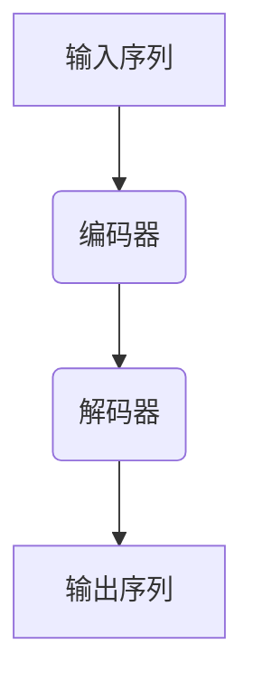

# 从GPT到ChatGPT

## 1. 背景介绍

### 1.1 人工智能的崛起

人工智能(Artificial Intelligence, AI)是当代科技领域最令人兴奋和具有变革性的技术之一。自20世纪中叶诞生以来,AI已经在各个领域取得了长足的进步,从语音识别、图像处理到自动驾驶和医疗诊断等,AI技术正在深刻改变着我们的生活和工作方式。

在AI的发展历程中,自然语言处理(Natural Language Processing, NLP)一直是最具挑战性的领域之一。语言的复杂性和多样性使得计算机难以真正理解和生成人类语言。然而,近年来,随着深度学习(Deep Learning)技术的飞速发展,NLP领域取得了突破性的进展,其中最引人注目的就是大型语言模型(Large Language Model, LLM)的出现。

### 1.2 GPT:大型语言模型的里程碑

2018年,OpenAI发布了GPT(Generative Pre-trained Transformer),这是第一个真正具有突破性的大型语言模型。GPT采用了自注意力(Self-Attention)机制和transformer架构,通过在大量文本数据上进行预训练,能够捕捉到语言的深层次结构和语义信息。

GPT的出现为NLP领域带来了革命性的变化。它不仅展示了生成高质量文本的能力,而且还可以在各种下游任务中表现出色,如文本分类、机器翻译和问答系统等。GPT的成功证明了大型语言模型在自然语言处理中的巨大潜力,为后续的模型发展奠定了基础。

### 1.3 GPT-2和GPT-3:规模化的语言模型

在GPT的基础上,OpenAI继续推进大型语言模型的发展。2019年,他们发布了GPT-2,其参数规模比GPT大了10倍,达到了15亿个参数。GPT-2不仅在生成文本质量上有所提升,而且还展现出了更强大的语言理解能力。

2020年,OpenAI再次突破自己,推出了GPT-3,这是一个规模高达1750亿个参数的巨型语言模型。GPT-3的出现引起了全球的关注,它展示了惊人的语言生成和理解能力,可以执行各种复杂的语言任务,如创作小说、编写代码、回答开放式问题等。GPT-3的成功进一步证明了,通过增加模型规模和训练数据,语言模型的性能可以获得显著提升。

## 2. 核心概念与联系

### 2.1 自注意力机制(Self-Attention)

自注意力机制是GPT系列模型的核心技术之一。传统的序列模型(如RNN和LSTM)采用递归的方式处理序列数据,存在计算效率低下和梯度消失等问题。而自注意力机制则允许模型直接捕捉序列中任意两个位置之间的关系,从而更好地建模长距离依赖。

在自注意力机制中,每个输入元素都会与其他元素进行关联,计算出一个注意力分数,表示该元素对其他元素的重要性。通过这种方式,模型可以自适应地关注序列中最相关的部分,从而提高了语义理解和生成的能力。

自注意力机制可以形式化表示为:

$$\text{Attention}(Q, K, V) = \text{softmax}(\frac{QK^T}{\sqrt{d_k}})V$$

其中,Q(Query)表示查询向量,K(Key)表示键向量,V(Value)表示值向量,而$d_k$是缩放因子,用于防止点积过大导致的梯度不稳定问题。

### 2.2 Transformer架构

Transformer是GPT等大型语言模型采用的核心架构。它完全基于自注意力机制,摒弃了传统的递归神经网络结构,从而解决了序列建模中的长距离依赖问题。

Transformer架构主要由编码器(Encoder)和解码器(Decoder)两个部分组成。编码器负责处理输入序列,将其映射到一个连续的表示空间中;而解码器则根据编码器的输出,生成目标序列。

在自然语言生成任务中,Transformer架构采用了"编码器-解码器"的结构,其中编码器对输入序列进行编码,解码器则根据编码器的输出生成目标序列。而在语言模型任务中,Transformer架构只使用了解码器部分,通过自回归(Auto-Regressive)的方式生成文本。

Transformer架构的核心思想是通过自注意力机制捕捉序列中元素之间的依赖关系,从而更好地建模长距离依赖。这种全新的架构设计极大地提高了模型的并行计算能力和训练效率,为大规模语言模型的发展奠定了基础。

### 2.3 预训练与微调(Pre-training and Fine-tuning)

大型语言模型的另一个关键技术是预训练与微调(Pre-training and Fine-tuning)范式。这种范式分为两个阶段:

1. **预训练(Pre-training)**: 在大规模的未标注文本数据上训练语言模型,使其学习到通用的语言知识和表示能力。这个过程通常需要消耗大量的计算资源和时间。

2. **微调(Fine-tuning)**: 在特定的下游任务上,使用已经预训练好的语言模型作为起点,并在相应的标注数据集上进行进一步的训练,使模型适应具体的任务。这个过程相对高效,可以快速获得良好的性能。

预训练与微调范式的优势在于,它可以充分利用大规模的未标注数据,学习到通用的语言表示,从而减少了对大量标注数据的依赖。同时,通过在下游任务上进行微调,模型可以快速适应特定的任务,提高性能表现。

这种范式在GPT系列模型中得到了广泛应用,也被后续的大型语言模型(如BERT、RoBERTa等)所采纳,成为了当代NLP领域的主流范式。

## 3. 核心算法原理具体操作步骤

### 3.1 GPT模型训练

GPT模型的训练过程可以分为两个阶段:预训练和微调。

#### 3.1.1 预训练阶段

预训练阶段的目标是在大规模的未标注文本数据上训练语言模型,使其学习到通用的语言知识和表示能力。具体步骤如下:

1. **数据准备**: 收集大量的未标注文本数据,如网页、书籍、新闻等。对数据进行预处理,如去除HTML标签、分词、标记化等。

2. **模型初始化**: 初始化Transformer解码器模型的参数,包括embedding层、自注意力层、前馈神经网络层等。

3. **语言模型训练**: 采用自回归(Auto-Regressive)的方式,对模型进行语言模型训练。具体来说,给定一个文本序列$x_1, x_2, \ldots, x_n$,模型的目标是最大化下一个词的条件概率$P(x_{t+1}|x_1, x_2, \ldots, x_t)$。通过最小化交叉熵损失函数,模型可以学习到生成下一个词的概率分布。

4. **优化与训练**: 使用优化算法(如Adam)和大规模的计算资源(如TPU或GPU集群),对模型进行迭代训练,直至收敛或达到预期的性能水平。

预训练过程通常需要消耗大量的计算资源和时间,但它可以使模型学习到通用的语言表示,为后续的微调奠定基础。

#### 3.1.2 微调阶段

在特定的下游任务上,我们需要对预训练好的语言模型进行微调,使其适应具体的任务。具体步骤如下:

1. **任务数据准备**: 收集与下游任务相关的标注数据集,如文本分类、机器翻译、问答等。对数据进行预处理和标记化。

2. **模型初始化**: 加载预训练好的语言模型参数,作为微调的起点。根据任务需求,可能需要对模型进行适当的修改,如添加任务特定的输出层。

3. **微调训练**: 在标注的任务数据集上对模型进行进一步的训练,使用与任务相关的损失函数和优化算法。通过微调,模型可以学习到任务特定的知识和表示。

4. **评估与调优**: 在验证集上评估模型的性能,根据需要调整超参数或训练策略,直至达到满意的性能水平。

微调阶段相对高效,可以快速获得良好的性能表现。同时,由于利用了预训练模型的通用语言表示,微调所需的标注数据量也相对较小。

### 3.2 GPT-2和GPT-3的训练

GPT-2和GPT-3的训练过程与GPT类似,但由于它们的规模更大,因此对计算资源和训练策略有更高的要求。

#### 3.2.1 GPT-2训练

GPT-2的参数规模为15亿,比GPT大了10倍。为了训练这样一个大型模型,OpenAI采取了以下策略:

1. **数据扩充**: 除了使用互联网上的公开数据,OpenAI还收集了大量的书籍、网页和其他文本数据,总计达到了40GB的规模。

2. **模型并行训练**: GPT-2的训练采用了模型并行的方式,将模型分割到多个GPU上进行训练,从而提高了训练效率。

3. **混合精度训练**:为了节省内存和加速训练,GPT-2使用了混合精度训练(Mixed Precision Training)技术,将部分计算从FP32精度降低到FP16精度,从而提高了计算效率。

4. **逐步预热(Gradual Warmup)**:在训练初期,GPT-2采用了较小的学习率,然后逐步增大学习率,以避免训练过程中的不稳定性。

通过这些策略,GPT-2在WebText数据集上进行了几个月的训练,最终达到了令人印象深刻的性能水平。

#### 3.2.2 GPT-3训练

作为当前最大的语言模型,GPT-3的参数规模高达1750亿,训练它的难度可想而知。OpenAI在GPT-3的训练中采取了以下关键策略:

1. **海量数据**: GPT-3使用了来自互联网的大约570GB的文本数据进行训练,包括网页、书籍、维基百科等多种来源。

2. **模型并行与数据并行**: GPT-3采用了模型并行和数据并行相结合的训练方式,将模型分割到多个TPU芯片上进行并行计算,同时也对训练数据进行了分片。

3. **反向传播优化**: OpenAI开发了一种新的反向传播算法,可以在有限的内存下高效地训练大型模型,从而降低了训练成本。

4. **混合精度训练**:与GPT-2类似,GPT-3也使用了混合精度训练技术,提高了计算效率。

5. **迭代式训练**: GPT-3的训练过程分为多个阶段,每个阶段都会在前一阶段的基础上进行进一步的训练,逐步提高模型的性能。

经过数月的训练,GPT-3终于问世。它展现出了惊人的语言生成和理解能力,在各种下游任务上都取得了卓越的表现,引领着大型语言模型的新浪潮。

## 4. 数学模型和公式详细讲解举例说明

在GPT系列模型中,自注意力机制(Self-Attention)是一个关键的数学模型。它允许模型直接捕捉序列中任意两个位置之间的关系,从而更好地建模长距离依赖。

### 4.1 自注意力机制的数学原理

自注意力机制的核心思想是计算一个注意力分数矩阵,表示输入序列中每个元素对其他元素的重要性。具体来说,给定一个输入序列$X = (x_1, x_2, \ldots, x_n)$,我们首先将其映射到查询(Query)、键(Key)和值(Value)三个向量空间中,得到$Q = (q_1, q_2, \ldots, q_n)$、$K = (k_1, k_2, \ldots, k_n)$和$V = (v_1, v_2, \ldots, v_n)$。

然后,我们计算查询$q_i$与所有键$k_j$之间的点积,并除以一个