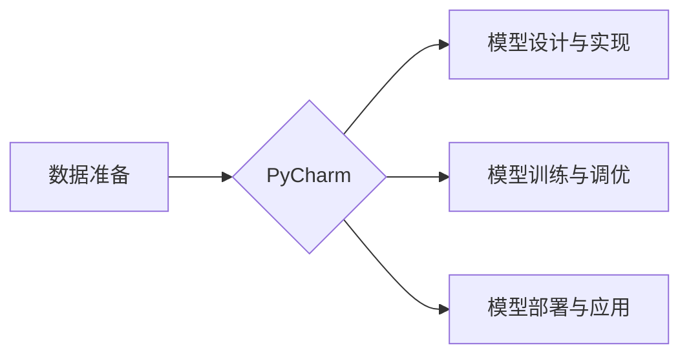

# 从零开始大模型开发与微调：PyCharm的下载与安装

## 1. 背景介绍
### 1.1 大模型开发的兴起
近年来,随着人工智能技术的飞速发展,尤其是自然语言处理和深度学习领域的突破,大模型(Large Language Model)开发与应用逐渐成为业界关注的焦点。从OpenAI的GPT系列、Google的BERT和T5,到国内的ERNIE、CPM等,各大科技巨头和研究机构纷纷投入大量资源,致力于研发更加强大、高效的大模型。

### 1.2 PyCharm在大模型开发中的重要性
要进行大模型的开发与微调,一个高效、易用的集成开发环境(IDE)是必不可少的。而PyCharm无疑是Python开发者的首选之一。它提供了智能代码补全、高级调试、代码重构等一系列强大功能,大大提升了开发效率。此外,PyCharm还内置了对主流深度学习框架如TensorFlow、PyTorch的支持,使得大模型开发更加方便快捷。

### 1.3 本文的主要内容
本文将从零开始,手把手教大家如何下载并安装PyCharm,为后续的大模型开发打下基础。我们会详细介绍PyCharm的系统要求、下载渠道、安装步骤等,同时给出一些实用的配置建议,帮助读者快速上手PyCharm,开启大模型开发之旅。

## 2. 核心概念与联系
### 2.1 集成开发环境(IDE)
集成开发环境是一种功能强大的软件开发工具,集代码编辑、编译、调试、项目管理等功能于一体。相比普通的代码编辑器,IDE提供了更加智能、高效的开发体验,能够大幅提升开发效率。

### 2.2 Python解释器
Python是一种解释型语言,需要通过Python解释器来执行Python代码。PyCharm内置了对多个Python解释器版本的支持,可以方便地创建和管理Python虚拟环境。

### 2.3 虚拟环境
Python虚拟环境是一种隔离的Python运行环境,每个虚拟环境都有自己独立的Python解释器、库和脚本。使用虚拟环境可以避免不同项目之间的依赖冲突,是Python开发的最佳实践之一。

### 2.4 PyCharm与大模型开发的关系
下图展示了PyCharm在大模型开发流程中的重要作用:



PyCharm贯穿了大模型开发的整个流程,为每个阶段提供了必要的工具和支持,是开发者高效完成大模型开发不可或缺的利器。

## 3. 核心操作步骤
### 3.1 PyCharm的下载
#### 3.1.1 下载渠道
PyCharm分为社区版(Community)和专业版(Professional)。社区版完全免费,包含了核心的Python开发功能,适合大多数个人开发者。专业版在社区版的基础上增加了一些高级特性,如远程开发、Web开发等,主要面向企业用户。我们可以从以下渠道下载PyCharm:

- 官网下载: https://www.jetbrains.com/pycharm/download/
- 国内镜像: https://www.jetbrains.com.cn/pycharm/download/

#### 3.1.2 选择版本
在下载页面,我们需要根据操作系统(Windows/macOS/Linux)选择对应的安装包。此外,还要选择PyCharm的版本。目前最新的PyCharm 2023.1已经发布,带来了一系列新特性和改进。但对于新手来说,选择稳定的2022.3版本也是不错的选择。

### 3.2 PyCharm的安装
#### 3.2.1 Windows
1. 运行下载的PyCharm安装包(如pycharm-community-2022.3.exe)
2. 选择安装路径,建议安装在非系统盘
3. 根据向导提示完成安装,安装完成后可以选择立即运行PyCharm

#### 3.2.2 macOS
1. 双击下载的DMG文件(如pycharm-community-2022.3.dmg),打开安装窗口
2. 将PyCharm图标拖拽到Applications文件夹,完成安装
3. 在Launchpad或应用程序文件夹中找到PyCharm,点击运行

#### 3.2.3 Linux
1. 将下载的tar.gz安装包(如pycharm-community-2022.3.tar.gz)解压到安装目录,如/opt/PyCharm
2. 进入PyCharm的bin目录,运行pycharm.sh脚本启动PyCharm

### 3.3 PyCharm的配置
#### 3.3.1 设置Python解释器
首次运行PyCharm时,我们需要设置Python解释器:

1. 点击"New Project",选择"Pure Python"
2. 在"Interpreter"下拉框中选择已安装的Python解释器,如Python 3.9
3. 点击"Create",完成Python解释器设置

#### 3.3.2 安装必要的插件
PyCharm提供了丰富的插件,可以扩展其功能。对于大模型开发,我们推荐安装以下插件:

- Jupyter:提供了对Jupyter Notebook的支持
- Markdown:提供了Markdown文件的预览和编辑功能
- .env files support:提供了对.env环境变量文件的支持

在PyCharm的"Preferences"(macOS)或"Settings"(Windows/Linux)中,选择"Plugins",搜索并安装上述插件即可。

#### 3.3.3 其他常用设置
- 外观主题:PyCharm提供了多种外观主题,可以在"Preferences/Settings - Appearance & Behavior - Appearance"中选择
- 字体设置:在"Preferences/Settings - Editor - Font"中可以设置编辑器字体
- 快捷键:PyCharm提供了大量的快捷键,可以大幅提升开发效率。在"Preferences/Settings - Keymap"中可以查看和自定义快捷键

## 4. 数学模型和公式详解
PyCharm的安装和配置过程主要涉及到软件工程和人机交互的相关知识,一般不涉及复杂的数学模型。但在使用PyCharm进行大模型开发时,我们会经常接触到一些数学概念和公式,如:

### 4.1 交叉熵损失函数
交叉熵损失函数是评估模型输出与真实标签差异的常用指标,定义如下:

$$
L = -\sum_{i=1}^{n} y_i \log(p_i)
$$

其中$y_i$为真实标签,$p_i$为模型预测的概率。

### 4.2 Adam优化器
Adam是一种自适应学习率的优化算法,结合了动量(Momentum)和RMSprop的优点。其参数更新公式为:

$$
\begin{aligned}
m_t &= \beta_1 m_{t-1} + (1 - \beta_1) g_t \\
v_t &= \beta_2 v_{t-1} + (1 - \beta_2) g_t^2 \\
\hat{m}_t &= \frac{m_t}{1 - \beta_1^t} \\
\hat{v}_t &= \frac{v_t}{1 - \beta_2^t} \\
\theta_t &= \theta_{t-1} - \frac{\eta}{\sqrt{\hat{v}_t} + \epsilon} \hat{m}_t
\end{aligned}
$$

其中$m_t$和$v_t$分别是梯度的一阶矩和二阶矩估计,$\beta_1$和$\beta_2$是衰减率,$\eta$是学习率,$\epsilon$是平滑项。

在PyCharm中使用深度学习框架如PyTorch时,我们会经常用到这些数学概念和公式。掌握它们的含义和用法,对于理解和优化大模型的训练过程至关重要。

## 5. 项目实践:使用PyCharm训练语言模型
下面我们以训练一个基于PyTorch的语言模型为例,演示如何使用PyCharm进行大模型开发。

### 5.1 创建PyCharm项目
1. 打开PyCharm,选择"New Project"
2. 选择"Pure Python",设置项目位置和Python解释器
3. 点击"Create"完成项目创建

### 5.2 安装依赖库
在PyCharm的"Terminal"中,输入以下命令安装PyTorch等依赖:

```bash
pip install torch torchvision torchaudio
```

### 5.3 准备数据集
我们使用经典的Penn Treebank数据集进行语言模型训练。在PyCharm中新建data目录,将数据集文件(如ptb.train.txt)放入其中。

### 5.4 定义模型
在PyCharm中新建model.py文件,定义语言模型的架构:

```python
import torch.nn as nn

class RNNLM(nn.Module):
    def __init__(self, vocab_size, embed_size, hidden_size):
        super(RNNLM, self).__init__()
        self.embed = nn.Embedding(vocab_size, embed_size)
        self.rnn = nn.LSTM(embed_size, hidden_size)
        self.fc = nn.Linear(hidden_size, vocab_size)
        
    def forward(self, x, h):
        x = self.embed(x)
        out, (h, c) = self.rnn(x, h)
        out = self.fc(out)
        return out, (h, c)
```

### 5.5 实现训练逻辑
在PyCharm中新建train.py文件,实现语言模型的训练逻辑:

```python
import torch
import torch.nn as nn
from torch.utils.data import DataLoader
from model import RNNLM

# 超参数设置
batch_size = 20
embed_size = 128 
hidden_size = 256
num_epochs = 10
lr = 0.001

# 加载Penn Treebank数据集
train_data = ...
train_loader = DataLoader(train_data, batch_size=batch_size)

# 初始化模型
vocab_size = len(train_data.vocab)
model = RNNLM(vocab_size, embed_size, hidden_size)
criterion = nn.CrossEntropyLoss()
optimizer = torch.optim.Adam(model.parameters(), lr=lr)

# 训练模型
for epoch in range(num_epochs):
    for x, y in train_loader:
        optimizer.zero_grad()
        h = torch.zeros(1, batch_size, hidden_size)
        c = torch.zeros(1, batch_size, hidden_size)
        out, (h, c) = model(x, (h, c))
        loss = criterion(out.view(-1, vocab_size), y.view(-1))
        loss.backward()
        optimizer.step()
        
    print(f"Epoch {epoch+1}/{num_epochs}, Loss: {loss.item():.4f}")
    
print("Training finished!")
```

### 5.6 运行训练脚本
在PyCharm中右键点击train.py,选择"Run 'train'"即可开始训练。我们可以在PyCharm的"Run"窗口查看训练日志,评估模型的训练效果。

通过上述步骤,我们就在PyCharm中成功训练了一个基于PyTorch的语言模型。借助PyCharm强大的编码和调试功能,我们可以方便地进行大模型的开发和优化工作。

## 6. 实际应用场景
PyCharm在大模型开发中有着广泛的应用,下面列举几个常见的场景:

### 6.1 自然语言处理
使用PyCharm + PyTorch/TensorFlow开发各类NLP模型,如机器翻译、文本分类、命名实体识别、文本生成等。PyCharm提供的代码补全、调试等功能可以极大提升NLP任务的开发效率。

### 6.2 计算机视觉
使用PyCharm + PyTorch/TensorFlow/OpenCV开发计算机视觉模型,如图像分类、目标检测、语义分割等。PyCharm良好的代码管理和重构能力,使得复杂的CV模型开发变得更加易于管理和维护。

### 6.3 推荐系统
使用PyCharm + PyTorch/TensorFlow开发个性化推荐模型。PyCharm提供的Python Web开发框架支持,如Django、Flask等,可以方便地将训练好的推荐模型部署到Web服务中。

### 6.4 强化学习
使用PyCharm + PyTorch/TensorFlow/OpenAI Gym开发强化学习算法,如DQN、PPO等。PyCharm良好的代码导航和查找功能,可以帮助我们快速定位和修复强化学习训练过程中的问题。

总之,PyCharm作为一款功能强大的Python IDE,在各类大模型开发任务中都能发挥重要作用,帮助开发者更高效、更便捷地完成模型的开发和调试工作。

## 7. 工具和资源推荐
### 7.1 PyCharm官方文档
PyCharm的官方文档是学习和使用PyCharm的权威资料,包含了详尽的功能介绍和使用指南。