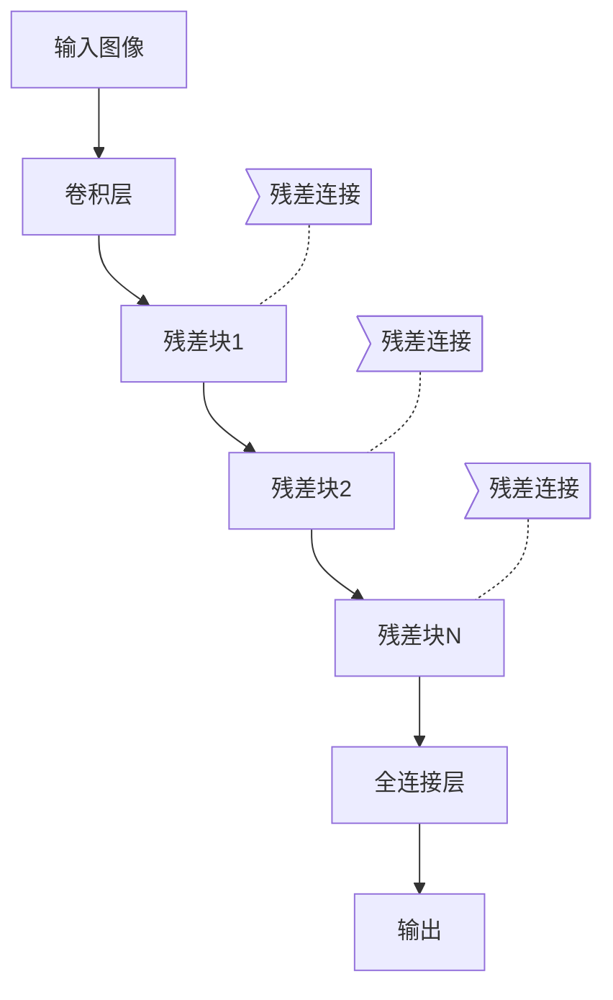

# 从零开始大模型开发与微调：ResNet实战：CIFAR-10数据集分类

## 1. 背景介绍

### 1.1 深度学习与计算机视觉

在过去的几年中，深度学习技术在计算机视觉领域取得了令人瞩目的成就。传统的机器学习算法依赖于手工设计的特征提取器,而深度学习则通过训练数据自动学习特征表示,大大提高了模型的性能和泛化能力。

### 1.2 图像分类任务

图像分类是计算机视觉中最基础和广泛研究的任务之一。给定一张图像,模型需要预测该图像属于哪个类别。常见的数据集包括 MNIST 手写数字识别、CIFAR-10/100 物体分类、ImageNet 等。

### 1.3 CIFAR-10 数据集

CIFAR-10 数据集由 60,000 张 32x32 的彩色图像组成,涵盖 10 个类别:飞机、汽车、鸟类、猫、鹿、狗、青蛙、马、船和卡车。它是计算机视觉领域一个经典的小型数据集,通常用于测试和基准评估新模型。

## 2. 核心概念与联系

### 2.1 卷积神经网络

卷积神经网络(Convolutional Neural Network, CNN)是深度学习在计算机视觉领域的核心模型。它由卷积层、池化层和全连接层组成,能够自动学习图像的层次特征表示。

#### 2.1.1 卷积层

卷积层对输入图像进行卷积操作,提取局部特征。卷积核作为滤波器在图像上滑动,生成特征映射。

#### 2.1.2 池化层

池化层对特征映射进行下采样,减小数据量并提取主要特征,实现一定的平移不变性。常用的池化方式包括最大池化和平均池化。

#### 2.1.3 全连接层

全连接层将前面层的特征映射展平,并与权重矩阵相乘,输出分类预测概率。

### 2.2 残差网络(ResNet)

随着网络深度的增加,信息在网络中传递时会发生梯度消失或爆炸的问题,导致训练困难。残差网络(Residual Network, ResNet)通过引入残差连接,允许信息直接从前层传递到后层,有效解决了深层网络的梯度问题。



### 2.3 数据增广

由于 CIFAR-10 数据集的规模有限,为了提高模型的泛化能力,通常需要对训练数据进行增广。常用的数据增广方法包括随机裁剪、水平翻转、填充等。

### 2.4 迁移学习与微调

在实际应用中,我们通常无法获得足够的标注数据来从头训练一个大型模型。迁移学习允许我们在大型数据集(如 ImageNet)上预训练模型,然后在目标数据集上进行微调,提高模型性能并节省计算资源。

## 3. 核心算法原理具体操作步骤

在本节中,我们将介绍如何从零开始构建一个 ResNet 模型,并在 CIFAR-10 数据集上进行训练和评估。

### 3.1 导入必要的库

```python
import torch
import torchvision
import torchvision.transforms as transforms
import torch.nn as nn
import torch.nn.functional as F
import torch.optim as optim
```

### 3.2 定义残差块

残差块是 ResNet 的核心组件,它包含两个卷积层和一个残差连接。

```python
class ResidualBlock(nn.Module):
    def __init__(self, in_channels, out_channels, stride=1, downsample=None):
        super(ResidualBlock, self).__init__()
        self.conv1 = nn.Conv2d(in_channels, out_channels, kernel_size=3, stride=stride, padding=1, bias=False)
        self.bn1 = nn.BatchNorm2d(out_channels)
        self.conv2 = nn.Conv2d(out_channels, out_channels, kernel_size=3, stride=1, padding=1, bias=False)
        self.bn2 = nn.BatchNorm2d(out_channels)
        self.downsample = downsample

    def forward(self, x):
        residual = x
        out = self.conv1(x)
        out = self.bn1(out)
        out = F.relu(out)
        out = self.conv2(out)
        out = self.bn2(out)
        if self.downsample:
            residual = self.downsample(x)
        out += residual
        out = F.relu(out)
        return out
```

### 3.3 定义 ResNet 模型

我们将构建一个 18 层的 ResNet 模型,包含 4 个残差块组。

```python
class ResNet(nn.Module):
    def __init__(self, block, layers, num_classes=10):
        super(ResNet, self).__init__()
        self.in_channels = 64
        self.conv = nn.Conv2d(3, 64, kernel_size=3, stride=1, padding=1, bias=False)
        self.bn = nn.BatchNorm2d(64)
        self.layer1 = self.make_layer(block, 64, layers[0])
        self.layer2 = self.make_layer(block, 128, layers[1], stride=2)
        self.layer3 = self.make_layer(block, 256, layers[2], stride=2)
        self.layer4 = self.make_layer(block, 512, layers[3], stride=2)
        self.avg_pool = nn.AvgPool2d(kernel_size=4)
        self.fc = nn.Linear(512, num_classes)

    def make_layer(self, block, out_channels, blocks, stride=1):
        downsample = None
        if stride != 1 or self.in_channels != out_channels:
            downsample = nn.Sequential(
                nn.Conv2d(self.in_channels, out_channels, kernel_size=1, stride=stride, bias=False),
                nn.BatchNorm2d(out_channels),
            )
        layers = []
        layers.append(block(self.in_channels, out_channels, stride, downsample))
        self.in_channels = out_channels
        for i in range(1, blocks):
            layers.append(block(out_channels, out_channels))
        return nn.Sequential(*layers)

    def forward(self, x):
        out = self.conv(x)
        out = self.bn(out)
        out = F.relu(out)
        out = self.layer1(out)
        out = self.layer2(out)
        out = self.layer3(out)
        out = self.layer4(out)
        out = self.avg_pool(out)
        out = out.view(out.size(0), -1)
        out = self.fc(out)
        return out
```

### 3.4 数据预处理

我们将对 CIFAR-10 数据集进行预处理,包括数据增广和标准化。

```python
transform_train = transforms.Compose([
    transforms.RandomCrop(32, padding=4),
    transforms.RandomHorizontalFlip(),
    transforms.ToTensor(),
    transforms.Normalize((0.4914, 0.4822, 0.4465), (0.2023, 0.1994, 0.2010)),
])

transform_test = transforms.Compose([
    transforms.ToTensor(),
    transforms.Normalize((0.4914, 0.4822, 0.4465), (0.2023, 0.1994, 0.2010)),
])

trainset = torchvision.datasets.CIFAR10(root='./data', train=True, download=True, transform=transform_train)
trainloader = torch.utils.data.DataLoader(trainset, batch_size=128, shuffle=True, num_workers=2)

testset = torchvision.datasets.CIFAR10(root='./data', train=False, download=True, transform=transform_test)
testloader = torch.utils.data.DataLoader(testset, batch_size=100, shuffle=False, num_workers=2)
```

### 3.5 模型训练

我们将使用交叉熵损失函数和 SGD 优化器来训练模型。

```python
net = ResNet(ResidualBlock, [2, 2, 2, 2])
criterion = nn.CrossEntropyLoss()
optimizer = optim.SGD(net.parameters(), lr=0.1, momentum=0.9, weight_decay=5e-4)

for epoch in range(100):
    running_loss = 0.0
    for i, data in enumerate(trainloader, 0):
        inputs, labels = data
        optimizer.zero_grad()
        outputs = net(inputs)
        loss = criterion(outputs, labels)
        loss.backward()
        optimizer.step()
        running_loss += loss.item()
        if i % 100 == 99:
            print('[%d, %5d] loss: %.3f' % (epoch + 1, i + 1, running_loss / 100))
            running_loss = 0.0

print('Finished Training')
```

### 3.6 模型评估

最后,我们将在测试集上评估训练好的模型。

```python
correct = 0
total = 0
with torch.no_grad():
    for data in testloader:
        images, labels = data
        outputs = net(images)
        _, predicted = torch.max(outputs.data, 1)
        total += labels.size(0)
        correct += (predicted == labels).sum().item()

print('Accuracy of the network on the 10000 test images: %d %%' % (100 * correct / total))
```

## 4. 数学模型和公式详细讲解举例说明

在卷积神经网络中,卷积层和池化层是两个关键的操作。

### 4.1 卷积层

卷积层的作用是提取输入数据的局部特征。卷积操作可以用下式表示:

$$
S(i, j) = (I * K)(i, j) = \sum_{m}\sum_{n}I(i+m, j+n)K(m, n)
$$

其中,$ I $ 表示输入数据, $ K $ 表示卷积核, $ S $ 表示输出特征映射。卷积核在输入数据上滑动,对每个位置进行点乘和操作,生成新的特征映射。

例如,对于一个 $ 3 \times 3 $ 的卷积核和一个 $ 5 \times 5 $ 的输入数据,卷积操作可以计算如下:

$$
\begin{bmatrix}
1 & 0 & 1 & 0 & 0\\
0 & 1 & 0 & 0 & 1\\
1 & 0 & 0 & 1 & 0\\
0 & 0 & 1 & 0 & 1\\
0 & 1 & 0 & 1 & 0
\end{bmatrix} *
\begin{bmatrix}
1 & 0 & 1\\
0 & 1 & 0\\
1 & 0 & 1
\end{bmatrix} =
\begin{bmatrix}
2 & 1 & 2\\
1 & 2 & 2\\
2 & 2 & 1
\end{bmatrix}
$$

### 4.2 池化层

池化层的作用是下采样特征映射,减小数据量并提取主要特征。最大池化和平均池化是两种常用的池化方式。

最大池化可以用下式表示:

$$
y_{i,j} = \max_{(m,n) \in R_{i,j}} x_{m,n}
$$

其中, $ x $ 表示输入特征映射, $ y $ 表示输出特征映射, $ R_{i,j} $ 表示输出元素 $ (i,j) $ 对应的池化区域。

例如,对于一个 $ 4 \times 4 $ 的输入特征映射和 $ 2 \times 2 $ 的池化窗口,最大池化操作可以计算如下:

$$
\begin{bmatrix}
1 & 3 & 2 & 4\\
5 & 6 & 7 & 8\\
9 & 7 & 5 & 6\\
8 & 7 & 6 & 5
\end{bmatrix} \xrightarrow{\text{max pool}} 
\begin{bmatrix}
6 & 8\\
9 & 7
\end{bmatrix}
$$

## 5. 项目实践：代码实例和详细解释说明

在本节中,我们将提供一个完整的代码示例,展示如何使用 PyTorch 构建 ResNet 模型并在 CIFAR-10 数据集上进行训练和评估。

### 5.1 导入必要的库

```python
import torch
import torchvision
import torchvision.transforms as transforms
import torch.nn as nn
import torch.nn.functional as F
import torch.optim as optim
```

### 5.2 定义残差块

```python
class ResidualBlock(nn.Module):
    def __init__(self, in_channels, out_channels, stride=1, downsample=None):
        super(ResidualBlock, self).__init__()
        self.conv1 = nn.Conv2d(in_channels, out_channels, kernel_size=3, stride=stride, padding=1, bias=False)
        self.bn1 = nn.BatchNorm2d(out_channels)
        self.conv2 = nn.Conv2d(out_channels, out_channels, kernel_size=3, stride=1, padding=1, bias=False)
        self.bn2 = nn.BatchNorm2d(out_channels)
        self.downsample = dow