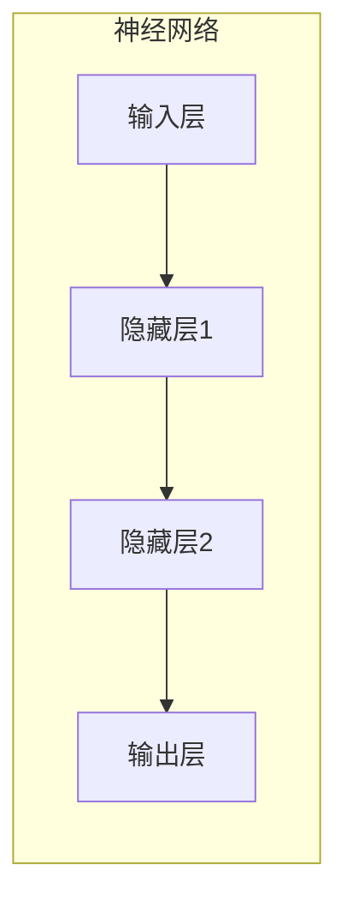
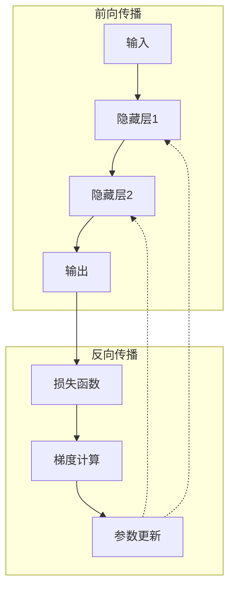
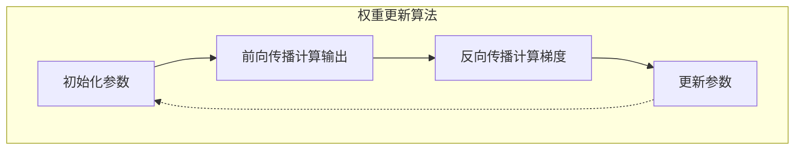

# 从零开始大模型开发与微调：反向传播神经网络两个基础算法详解

## 1.背景介绍

### 1.1 人工智能的兴起

人工智能(Artificial Intelligence, AI)是当代科技发展的重要领域之一,其影响力已经渗透到生活和工作的方方面面。随着数据和计算能力的不断增长,AI技术取得了长足进步,尤其是深度学习(Deep Learning)的出现,使得AI在语音识别、图像识别、自然语言处理等领域取得了突破性的进展。

### 1.2 深度学习与神经网络

深度学习是机器学习的一个分支,它的核心思想是通过构建具有多层非线性变换的神经网络模型,从大量数据中自动学习特征表示和模式,从而解决复杂的问题。神经网络本质上是一种数学模型,由大量的参数组成,通过调整这些参数来拟合数据,从而实现特定的功能。

### 1.3 反向传播算法的重要性

神经网络的训练过程是一个反复迭代的过程,需要不断调整网络参数以最小化损失函数。反向传播算法(Backpropagation)是训练神经网络的核心算法之一,它通过计算损失函数对每个参数的梯度,并利用梯度下降法不断更新参数,从而优化网络性能。反向传播算法的出现,使得深层神经网络的训练成为可能,是深度学习取得巨大成功的关键因素之一。

## 2.核心概念与联系

### 2.1 神经网络的基本结构

神经网络是由多层神经元组成的网络结构,每个神经元接收来自前一层的输入,经过加权求和和非线性激活函数的处理,产生输出传递到下一层。整个网络由输入层、隐藏层和输出层组成,通过层与层之间的连接,实现从输入到输出的映射关系。



### 2.2 前向传播与反向传播

在神经网络的训练过程中,包含两个重要的步骤:前向传播(Forward Propagation)和反向传播(Backpropagation)。

- 前向传播: 将输入数据通过网络层层传递,计算每一层的输出,最终得到网络的预测结果。
- 反向传播: 根据预测结果与真实标签之间的差异(损失函数),计算每个参数对损失函数的梯度,并利用梯度下降法更新参数,使损失函数最小化。



反向传播算法是通过链式法则,计算每个参数对损失函数的梯度,从而实现参数的更新。这个过程需要两个重要的算法:误差反向传播算法和权重更新算法。

## 3.核心算法原理具体操作步骤

### 3.1 误差反向传播算法

误差反向传播算法(Error Backpropagation)是计算每个参数梯度的关键步骤。它通过从输出层开始,逐层向前计算每个参数对损失函数的偏导数,从而得到参数的梯度。具体步骤如下:

1. 前向传播计算网络输出
2. 计算输出层的误差项(输出与真实标签之差)
3. 计算输出层参数的梯度
4. 从输出层开始,逐层向前计算每层参数的梯度
5. 重复步骤2-4,直到计算完所有参数的梯度


### 3.2 权重更新算法

权重更新算法(Weight Update)是利用计算得到的梯度,通过梯度下降法更新网络参数的过程。具体步骤如下:

1. 初始化网络参数(权重和偏置)
2. 前向传播计算网络输出
3. 反向传播计算每个参数的梯度
4. 根据梯度和学习率,更新每个参数的值
5. 重复步骤2-4,直到网络收敛或达到最大迭代次数



通过不断迭代这个过程,网络参数会逐渐优化,使得损失函数最小化,从而提高网络的预测性能。

## 4.数学模型和公式详细讲解举例说明

### 4.1 神经网络数学模型

神经网络可以用数学模型来描述,每一层的计算过程如下:

$$
\begin{aligned}
z^{(l)} &= W^{(l)}a^{(l-1)} + b^{(l)} \\
a^{(l)} &= g(z^{(l)})
\end{aligned}
$$

其中:

- $a^{(l)}$表示第$l$层的激活值向量
- $z^{(l)}$表示第$l$层的加权输入向量
- $W^{(l)}$表示第$l$层的权重矩阵
- $b^{(l)}$表示第$l$层的偏置向量
- $g(\cdot)$表示激活函数,如sigmoid、ReLU等

### 4.2 损失函数

为了衡量网络预测结果与真实标签之间的差异,我们需要定义一个损失函数(Loss Function)。常用的损失函数包括均方误差(Mean Squared Error, MSE)和交叉熵损失(Cross-Entropy Loss)等。

对于回归问题,通常使用均方误差:

$$
J(W, b) = \frac{1}{m}\sum_{i=1}^{m}(y^{(i)} - \hat{y}^{(i)})^2
$$

其中$y^{(i)}$表示第$i$个样本的真实标签,$\hat{y}^{(i)}$表示网络预测的输出。

对于分类问题,通常使用交叉熵损失:

$$
J(W, b) = -\frac{1}{m}\sum_{i=1}^{m}\sum_{j=1}^{C}y_j^{(i)}\log(\hat{y}_j^{(i)})
$$

其中$y_j^{(i)}$表示第$i$个样本属于第$j$类的真实标签(0或1),$\hat{y}_j^{(i)}$表示网络预测第$i$个样本属于第$j$类的概率。

### 4.3 梯度计算

反向传播算法的核心是计算每个参数对损失函数的梯度。根据链式法则,我们可以计算出每个参数的梯度:

$$
\begin{aligned}
\frac{\partial J}{\partial W^{(l)}} &= \frac{\partial J}{\partial z^{(l)}} \frac{\partial z^{(l)}}{\partial W^{(l)}} \\
\frac{\partial J}{\partial b^{(l)}} &= \frac{\partial J}{\partial z^{(l)}} \frac{\partial z^{(l)}}{\partial b^{(l)}}
\end{aligned}
$$

其中$\frac{\partial J}{\partial z^{(l)}}$可以通过反向传播算法计算得到。

### 4.4 参数更新

利用计算得到的梯度,我们可以使用梯度下降法更新网络参数:

$$
\begin{aligned}
W^{(l)} &= W^{(l)} - \alpha \frac{\partial J}{\partial W^{(l)}} \\
b^{(l)} &= b^{(l)} - \alpha \frac{\partial J}{\partial b^{(l)}}
\end{aligned}
$$

其中$\alpha$表示学习率,控制了参数更新的步长。

## 5.项目实践：代码实例和详细解释说明

为了更好地理解反向传播算法,我们将通过一个简单的Python代码示例来实现一个全连接神经网络,并使用反向传播算法进行训练。

### 5.1 定义网络结构

首先,我们定义一个简单的全连接神经网络,包含一个输入层、一个隐藏层和一个输出层。

```python
import numpy as np

# 网络参数
input_size = 2  # 输入层神经元数量
hidden_size = 3  # 隐藏层神经元数量
output_size = 1  # 输出层神经元数量

# 初始化权重和偏置
W1 = np.random.randn(input_size, hidden_size)  # 输入层到隐藏层的权重
b1 = np.zeros((1, hidden_size))  # 隐藏层的偏置
W2 = np.random.randn(hidden_size, output_size)  # 隐藏层到输出层的权重
b2 = np.zeros((1, output_size))  # 输出层的偏置
```

### 5.2 定义激活函数和损失函数

我们使用Sigmoid函数作为激活函数,均方误差作为损失函数。

```python
# 激活函数(Sigmoid)
def sigmoid(x):
    return 1 / (1 + np.exp(-x))

# 损失函数(均方误差)
def mse_loss(y_true, y_pred):
    return np.mean((y_true - y_pred) ** 2)
```

### 5.3 前向传播

实现前向传播过程,计算网络输出。

```python
# 前向传播
def forward_propagation(X):
    # 输入层到隐藏层
    z1 = np.dot(X, W1) + b1
    a1 = sigmoid(z1)
    
    # 隐藏层到输出层
    z2 = np.dot(a1, W2) + b2
    y_pred = z2
    
    return y_pred, a1
```

### 5.4 反向传播

实现反向传播算法,计算每个参数的梯度。

```python
# 反向传播
def backward_propagation(X, y_true, y_pred, a1):
    # 输出层梯度
    dz2 = y_pred - y_true
    dW2 = np.dot(a1.T, dz2)
    db2 = np.sum(dz2, axis=0, keepdims=True)
    
    # 隐藏层梯度
    dz1 = np.dot(dz2, W2.T) * sigmoid(a1) * (1 - sigmoid(a1))
    dW1 = np.dot(X.T, dz1)
    db1 = np.sum(dz1, axis=0, keepdims=True)
    
    return dW1, db1, dW2, db2
```

### 5.5 权重更新

利用计算得到的梯度,更新网络参数。

```python
# 权重更新
def update_weights(dW1, db1, dW2, db2, learning_rate):
    global W1, b1, W2, b2
    W1 -= learning_rate * dW1
    b1 -= learning_rate * db1
    W2 -= learning_rate * dW2
    b2 -= learning_rate * db2
```

### 5.6 训练过程

将前向传播、反向传播和权重更新组合在一起,实现网络的训练过程。

```python
# 训练参数
epochs = 10000  # 训练轮数
learning_rate = 0.1  # 学习率

# 训练数据
X_train = np.array([[0, 0], [0, 1], [1, 0], [1, 1]])
y_train = np.array([[0], [1], [1], [0]])

# 训练循环
for epoch in range(epochs):
    # 前向传播
    y_pred, a1 = forward_propagation(X_train)
    
    # 计算损失
    loss = mse_loss(y_train, y_pred)
    
    # 反向传播
    dW1, db1, dW2, db2 = backward_propagation(X_train, y_train, y_pred, a1)
    
    # 更新权重
    update_weights(dW1, db1, dW2, db2, learning_rate)
    
    # 打印损失
    if epoch % 1000 == 0:
        print(f"Epoch {epoch}, Loss: {loss}")
```

通过上述代码,我们可以训练