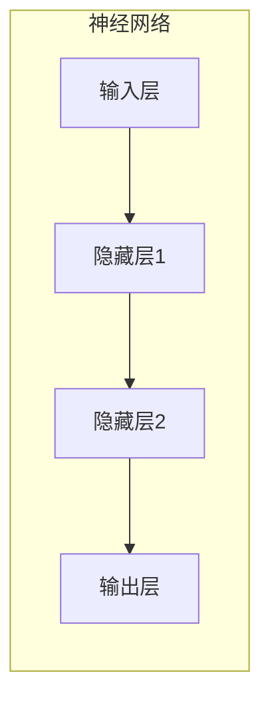
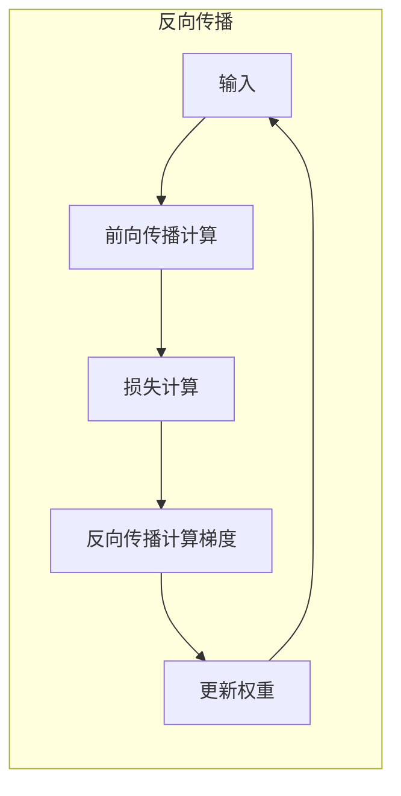
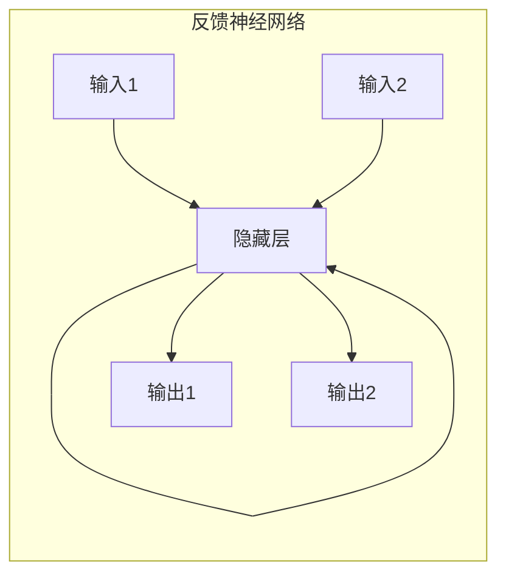

# 从零开始大模型开发与微调：反馈神经网络反向传播算法介绍

## 1.背景介绍

### 1.1 神经网络的兴起

近年来,人工智能领域取得了令人瞩目的进展,其中神经网络在计算机视觉、自然语言处理、推荐系统等诸多领域展现出了强大的能力。神经网络的发展可以追溯到上世纪 40 年代,当时的神经网络模型主要是受生物神经元结构的启发而提出的简单数学模型。但由于计算能力和数据的限制,早期的神经网络只能解决一些简单的线性问题。

直到 20 世纪 80 年代,反向传播(Backpropagation)算法的提出,才为训练多层神经网络提供了一种有效的方法。反向传播算法能够通过误差反向传播的方式,自动调整神经网络中的权重参数,从而使网络能够学习到输入和输出之间的复杂映射关系。这为解决更加复杂的非线性问题开辟了新的道路。

### 1.2 大模型时代的到来

21 世纪以来,benefiting from 计算能力的飞速提升、海量训练数据的积累以及一些突破性算法的出现,神经网络模型的规模和性能都得到了极大的提升。2018 年,谷歌提出的 Transformer 模型在机器翻译等自然语言处理任务中取得了突破性的进展,标志着大模型时代的到来。

大模型(Large Model)通常指参数量在数十亿甚至上百亿的巨大神经网络模型。这些大模型通过在海量数据上进行预训练,能够学习到通用的语义和知识表示,从而在下游任务上展现出强大的泛化能力。目前,大模型已经在自然语言处理、计算机视觉、推理等多个领域取得了领先的性能表现。

### 1.3 微调技术的重要性

虽然大模型在预训练阶段就已经学习到了丰富的知识,但要将其应用到特定的下游任务中,通常还需要进行一定程度的微调(Fine-tuning)。微调是指在保留大模型主体结构的基础上,对部分层或参数进行进一步的训练,使其能够适应特定任务的需求。

合理的微调策略对于充分发挥大模型的潜力至关重要。一方面,过度微调可能会导致模型"遗忘"之前学习到的通用知识;另一方面,微调不足则无法让模型充分吸收任务相关的知识。因此,如何设计高效的微调算法,平衡通用知识和任务特定知识的学习,成为了大模型研究的一个重要课题。

## 2.核心概念与联系

### 2.1 神经网络基本概念

神经网络是一种由大量互连的简单计算单元(神经元)组成的数学模型,旨在模拟生物神经系统的工作原理。每个神经元接收来自其他神经元的输入信号,经过加权求和和非线性激活函数的处理后,产生自身的输出信号。通过不断调整神经元之间的连接权重,神经网络可以学习到输入和输出之间的映射关系。

上图展示了一个典型的全连接神经网络结构,包括输入层、隐藏层和输出层。信号从输入层开始,经过一系列的加权求和和非线性变换,最终在输出层产生预测结果。

### 2.2 反向传播算法

反向传播算法是训练多层神经网络的一种广泛使用的技术,其核心思想是通过计算损失函数相对于每个权重的梯度,并沿着梯度的反方向更新权重,从而最小化损失函数的值。

上图展示了反向传播算法的基本流程:

1. 前向传播计算:根据当前的权重参数,计算神经网络在给定输入下的预测输出。
2. 损失计算:将预测输出与真实标签进行比较,计算损失函数的值。
3. 反向传播计算梯度:根据链式法则,计算损失函数相对于每个权重参数的梯度。
4. 更新权重:沿着梯度的反方向,更新每个权重参数的值。

通过不断迭代上述过程,神经网络的权重参数会逐渐收敛到一个能够最小化损失函数的状态,从而实现对训练数据的拟合。

### 2.3 反馈神经网络

反馈神经网络(Recurrent Neural Network, RNN)是一种特殊的神经网络结构,专门用于处理序列数据(如文本、语音、视频等)。与传统的前馈神经网络不同,RNN 在隐藏层之间引入了循环连接,使得网络在处理序列数据时能够捕捉到时序信息。

上图展示了一个简单的 RNN 结构。在处理序列数据时,RNN 会逐个处理每个时间步的输入,并将当前时间步的隐藏状态与下一时间步的输入一同传递给网络,从而捕捉到序列中的时序依赖关系。

虽然 RNN 理论上能够捕捉任意长度的序列依赖关系,但在实践中,由于梯度消失或爆炸的问题,它只能有效地建模较短的序列。为了解决这一问题,长短期记忆网络(Long Short-Term Memory, LSTM)和门控循环单元(Gated Recurrent Unit, GRU)等变体被提出,通过引入门控机制来更好地捕捉长期依赖。

## 3.核心算法原理具体操作步骤

### 3.1 反向传播算法详解

反向传播算法的核心思想是通过计算损失函数相对于每个权重参数的梯度,并沿着梯度的反方向更新权重,从而最小化损失函数的值。具体操作步骤如下:

1. **前向传播计算**

给定一个输入样本 $x$,通过前向传播计算得到神经网络的预测输出 $\hat{y}$。对于一个包含 $L$ 层的全连接神经网络,前向传播计算过程可以表示为:

$$
\begin{aligned}
a^{(1)} &= x \\
z^{(l)} &= W^{(l)}a^{(l-1)} + b^{(l)}, \quad l=2,\dots,L \\
a^{(l)} &= \sigma(z^{(l)}), \quad l=2,\dots,L-1 \\
\hat{y} &= a^{(L)}
\end{aligned}
$$

其中 $W^{(l)}$ 和 $b^{(l)}$ 分别表示第 $l$ 层的权重矩阵和偏置向量, $\sigma(\cdot)$ 是非线性激活函数(如 ReLU、Sigmoid 等)。

2. **计算损失函数**

将预测输出 $\hat{y}$ 与真实标签 $y$ 进行比较,计算损失函数 $\mathcal{L}(\hat{y}, y)$ 的值。常见的损失函数包括均方误差损失、交叉熵损失等。

3. **反向传播计算梯度**

根据链式法则,计算损失函数 $\mathcal{L}$ 相对于每个权重参数的梯度。对于第 $l$ 层的权重矩阵 $W^{(l)}$ 和偏置向量 $b^{(l)}$,梯度计算过程如下:

$$
\begin{aligned}
\delta^{(L)} &= \nabla_{a^{(L)}} \mathcal{L}(\hat{y}, y) \\
\delta^{(l)} &= \left( (W^{(l+1)})^T \delta^{(l+1)} \right) \odot \sigma'(z^{(l)}), \quad l=L-1,\dots,2 \\
\nabla_{W^{(l)}} \mathcal{L} &= \delta^{(l+1)} (a^{(l)})^T, \quad l=1,\dots,L-1 \\
\nabla_{b^{(l)}} \mathcal{L} &= \delta^{(l+1)}, \quad l=1,\dots,L-1
\end{aligned}
$$

其中 $\odot$ 表示元素wise 乘积, $\sigma'(\cdot)$ 是激活函数的导数。上述过程被称为反向传播,因为梯度是从输出层开始,逐层向前传播计算的。

4. **更新权重参数**

根据计算得到的梯度,使用优化算法(如随机梯度下降、Adam 等)更新每个权重参数的值:

$$
\begin{aligned}
W^{(l)} &\leftarrow W^{(l)} - \eta \nabla_{W^{(l)}} \mathcal{L}, \quad l=1,\dots,L-1 \\
b^{(l)} &\leftarrow b^{(l)} - \eta \nabla_{b^{(l)}} \mathcal{L}, \quad l=1,\dots,L-1
\end{aligned}
$$

其中 $\eta$ 是学习率,控制着每次更新的步长大小。

通过不断迭代上述过程,神经网络的权重参数会逐渐收敛到一个能够最小化损失函数的状态,从而实现对训练数据的拟合。

### 3.2 反馈神经网络反向传播

对于反馈神经网络(RNN),由于引入了时序依赖关系,反向传播算法需要进行一定的修改。我们以一个简单的 RNN 结构为例,介绍反向传播在 RNN 中的具体计算过程。

假设输入序列为 $\{x_1, x_2, \dots, x_T\}$,对应的真实标签序列为 $\{y_1, y_2, \dots, y_T\}$。RNN 在每个时间步 $t$ 的计算过程如下:

$$
\begin{aligned}
h_t &= \sigma(W_{hh} h_{t-1} + W_{xh} x_t + b_h) \\
o_t &= W_{ho} h_t + b_o
\end{aligned}
$$

其中 $h_t$ 是时间步 $t$ 的隐藏状态, $o_t$ 是对应的输出, $W_{hh}$、$W_{xh}$、$W_{ho}$ 分别是隐藏层到隐藏层、输入到隐藏层、隐藏层到输出层的权重矩阵, $b_h$ 和 $b_o$ 是相应的偏置向量。

在训练阶段,我们需要最小化整个序列的损失函数:

$$
\mathcal{L} = \sum_{t=1}^T \mathcal{L}(o_t, y_t)
$$

其中 $\mathcal{L}(o_t, y_t)$ 是时间步 $t$ 的损失函数(如交叉熵损失)。

反向传播的计算过程如下:

1. **前向传播计算**

按照上述公式,依次计算每个时间步的隐藏状态 $h_t$ 和输出 $o_t$。

2. **计算损失函数**

计算每个时间步的损失 $\mathcal{L}(o_t, y_t)$,并求和得到整个序列的损失函数 $\mathcal{L}$。

3. **反向传播计算梯度**

从最后一个时间步 $T$ 开始,依次计算每个时间步的梯度:

$$
\begin{aligned}
\delta_t^o &= \nabla_{o_t} \mathcal{L}(o_t, y_t) \\
\delta_t^h &= (W_{ho}^T \delta_t^o + \delta_{t+1}^h W_{hh}) \odot \sigma'(h_t) \\
\nabla_{W_{ho}} \mathcal{L} &\leftarrow \nabla_{W_{ho}} \mathcal{L} + \delta_t^o h_t^T \\
\nabla_{W_{hh}} \mathcal{L} &\leftarrow \nabla_{W_{hh}} \mathcal{L} + \delta_t^h h_{t-1}^T \\
\nabla_{W_{xh}} \