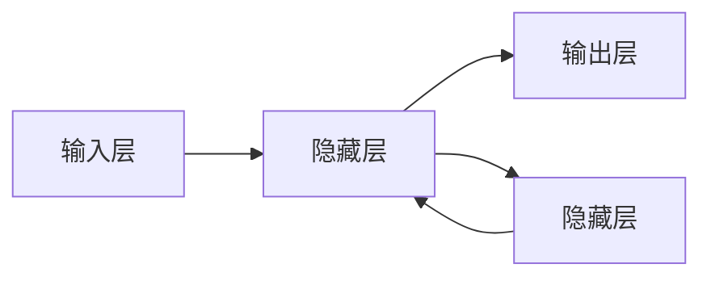
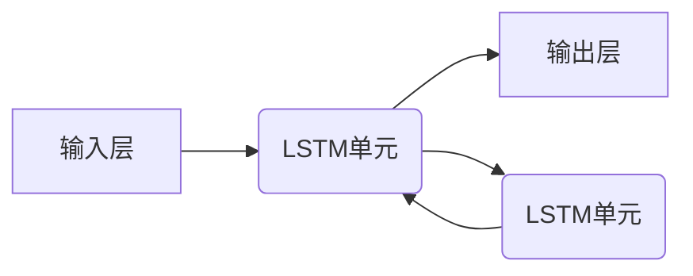
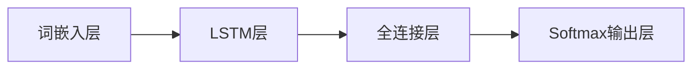

# 从零开始大模型开发与微调：实战：循环神经网络与情感分类

## 1. 背景介绍

### 1.1 自然语言处理的重要性

在当今信息时代,自然语言处理(NLP)已成为人工智能领域中最重要和具有挑战性的研究方向之一。随着互联网和移动设备的普及,大量非结构化的文本数据被产生,对这些数据进行智能处理和分析已成为当务之急。NLP技术在信息检索、文本挖掘、问答系统、机器翻译等领域发挥着关键作用。

### 1.2 情感分析的应用前景

情感分析是NLP的一个重要分支,旨在自动识别、提取、处理和理解文本中的主观信息,如观点、情绪、评价等。随着社交媒体的兴起,情感分析在商业智能、品牌监控、客户服务等领域受到了广泛关注。准确的情感分析可以帮助企业更好地了解客户需求,优化产品和服务。

### 1.3 循环神经网络在NLP中的应用

传统的NLP方法,如基于统计的机器学习模型,在处理序列数据(如文本)时存在局限性。循环神经网络(RNN)由于其对序列数据建模的优势,成为NLP领域的重要模型之一。RNN能够捕捉文本中的上下文信息,从而更好地理解语义。本文将重点介绍如何利用RNN进行情感分析任务。

## 2. 核心概念与联系

### 2.1 循环神经网络



循环神经网络(RNN)是一种特殊的人工神经网络,它引入了循环连接,使网络能够对序列数据进行建模。与传统的前馈神经网络不同,RNN在隐藏层之间存在循环连接,允许信息在序列步骤之间传递,从而捕捉序列数据中的动态行为。

RNN在每个时间步骤t,都会根据当前输入$x_t$和上一时间步的隐藏状态$h_{t-1}$计算当前的隐藏状态$h_t$,并输出$y_t$。数学表达式如下:

$$
h_t = f_W(x_t, h_{t-1})\\
y_t = g_U(h_t)
$$

其中,$f_W$和$g_U$分别表示由参数$W$和$U$确定的非线性函数。这种循环结构使RNN能够对任意长度的序列进行处理,并在每个时间步骤利用之前的信息。

### 2.2 长短期记忆网络(LSTM)

尽管RNN在理论上能够学习长期依赖关系,但在实践中由于梯度消失/爆炸问题,它难以有效捕捉长距离的上下文信息。为解决这一问题,研究人员提出了长短期记忆网络(LSTM)。

LSTM是RNN的一种变体,它通过精心设计的门控机制,能够更好地捕捉长期依赖关系。LSTM的核心思想是引入了三个门:遗忘门、输入门和输出门,用于控制信息的流动。这些门由sigmoid函数和元素级乘积运算组成,能够学习何时保留或遗忘历史信息,以及何时利用当前输入。



LSTM单元的数学表达式如下:

$$
\begin{aligned}
f_t &= \sigma(W_f \cdot [h_{t-1}, x_t] + b_f) & & \text{遗忘门} \\
i_t &= \sigma(W_i \cdot [h_{t-1}, x_t] + b_i) & & \text{输入门} \\
\tilde{C}_t &= \tanh(W_C \cdot [h_{t-1}, x_t] + b_C) & & \text{候选细胞状态} \\
C_t &= f_t \odot C_{t-1} + i_t \odot \tilde{C}_t & & \text{细胞状态} \\
o_t &= \sigma(W_o \cdot [h_{t-1}, x_t] + b_o) & & \text{输出门} \\
h_t &= o_t \odot \tanh(C_t) & & \text{隐藏状态}
\end{aligned}
$$

其中,$\sigma$表示sigmoid函数,$\odot$表示元素级乘积。LSTM通过精心设计的门控机制,能够更好地捕捉长期依赖关系,从而在许多NLP任务中取得了卓越的表现。

### 2.3 词嵌入

在将文本输入到神经网络之前,需要首先将文本转换为数值向量表示。传统的one-hot编码方式存在维度灾难和无法捕捉词义相似性等问题。词嵌入(Word Embedding)通过将每个词映射到一个低维的连续向量空间,能够较好地解决这些问题。

常用的词嵌入方法包括Word2Vec、GloVe等。这些方法通过在大规模语料库上训练,能够自动学习到每个词的语义和上下文信息,使得语义相似的词在向量空间中彼此靠近。将词嵌入作为神经网络的输入,可以显著提高模型的性能。

## 3. 核心算法原理具体操作步骤

### 3.1 数据预处理

在进行情感分析任务之前,需要对原始文本数据进行预处理,包括以下步骤:

1. **文本清洗**: 去除HTML标签、特殊字符、URLs等无用信息。
2. **分词**: 将文本按照语义单位(如单词或字符)进行分割。
3. **去除停用词**: 移除高频但无实际意义的词语,如"the"、"is"等。
4. **词形还原**: 将单词转换为基本形式,如将"running"转换为"run"。
5. **构建词表**: 统计语料库中出现的所有词,并为每个词分配一个唯一的索引。

### 3.2 构建LSTM模型

在完成数据预处理后,我们可以构建LSTM模型进行情感分析。以下是LSTM模型的基本结构:



1. **词嵌入层**: 将每个词映射为一个低维的密集向量表示。
2. **LSTM层**: 对输入序列进行编码,捕捉上下文信息。可以堆叠多个LSTM层。
3. **全连接层**: 将LSTM的输出映射到一个固定长度的向量表示。
4. **Softmax输出层**: 对向量进行归一化,输出每个类别的概率分数。

在训练过程中,我们需要定义损失函数(如交叉熵损失)和优化算法(如Adam),并使用反向传播算法更新模型参数,最小化损失函数。

### 3.3 模型训练和评估

训练LSTM模型的一般步骤如下:

1. **准备数据**: 将数据集划分为训练集、验证集和测试集。
2. **初始化模型**: 根据任务需求设置模型参数,如词嵌入维度、LSTM层数、隐藏单元数等。
3. **模型训练**: 使用训练集对模型进行训练,并在验证集上监控模型性能,防止过拟合。
4. **模型评估**: 在测试集上评估模型的泛化能力,计算相关指标,如准确率、F1分数等。
5. **模型调优**: 根据评估结果,调整模型参数或架构,重复训练和评估过程。

在训练过程中,还需注意一些技巧,如梯度裁剪、dropout正则化等,以提高模型的泛化能力。

## 4. 数学模型和公式详细讲解举例说明

在前面的章节中,我们已经介绍了LSTM的基本原理和数学表达式。现在,让我们通过一个具体的例子,更深入地理解LSTM的工作机制。

假设我们有一个简单的情感分类任务,需要判断一个句子是正面还是负面。给定句子"This movie is amazing!"。

1. **词嵌入层**

首先,我们需要将每个词映射为一个低维的密集向量表示。假设我们使用100维的词嵌入,那么句子"This movie is amazing!"的词嵌入表示为:

$$
\begin{bmatrix}
\vec{v}_\text{This} \\
\vec{v}_\text{movie} \\
\vec{v}_\text{is} \\
\vec{v}_\text{amazing}
\end{bmatrix} =
\begin{bmatrix}
0.2 & -0.1 & \cdots & 0.4 \\
-0.3 & 0.6 & \cdots & -0.2 \\
0.1 & 0.2 & \cdots & -0.1 \\
0.7 & 0.5 & \cdots & 0.3
\end{bmatrix}
$$

2. **LSTM层**

接下来,我们将词嵌入序列输入到LSTM层。对于每个时间步骤t,LSTM单元根据当前输入$x_t$和上一时间步的隐藏状态$h_{t-1}$计算当前的隐藏状态$h_t$。

假设在时间步骤t=1时,LSTM单元的初始状态为$h_0=\vec{0}$和$C_0=\vec{0}$。对于第一个词"This",LSTM单元的计算过程如下:

$$
\begin{aligned}
f_1 &= \sigma(W_f \cdot [h_0, \vec{v}_\text{This}] + b_f) \\
i_1 &= \sigma(W_i \cdot [h_0, \vec{v}_\text{This}] + b_i) \\
\tilde{C}_1 &= \tanh(W_C \cdot [h_0, \vec{v}_\text{This}] + b_C) \\
C_1 &= f_1 \odot \vec{0} + i_1 \odot \tilde{C}_1 \\
o_1 &= \sigma(W_o \cdot [h_0, \vec{v}_\text{This}] + b_o) \\
h_1 &= o_1 \odot \tanh(C_1)
\end{aligned}
$$

对于后续的时间步骤,LSTM单元将利用上一步的隐藏状态$h_1$和当前输入$\vec{v}_\text{movie}$计算新的隐藏状态$h_2$,如此循环,直到处理完整个序列。

3. **全连接层和Softmax输出层**

最后,我们将LSTM的最终隐藏状态$h_T$输入到全连接层,得到一个固定长度的向量表示$\vec{y}$。然后,通过Softmax函数,我们可以获得每个类别的概率分数:

$$
\begin{aligned}
\vec{y} &= W_y h_T + b_y \\
P(y=\text{positive}) &= \frac{e^{\vec{y}_\text{positive}}}{\sum_j e^{\vec{y}_j}} \\
P(y=\text{negative}) &= \frac{e^{\vec{y}_\text{negative}}}{\sum_j e^{\vec{y}_j}}
\end{aligned}
$$

在训练过程中,我们将最大化正确类别的概率,从而学习LSTM模型的参数。

通过这个例子,我们可以更好地理解LSTM是如何处理序列数据的。LSTM通过门控机制和内部状态的传递,能够有效地捕捉长期依赖关系,从而在许多NLP任务中取得出色的表现。

## 5. 项目实践:代码实例和详细解释说明

为了更好地理解LSTM在情感分析任务中的应用,我们将使用Python和PyTorch框架构建一个LSTM模型,并在IMDB电影评论数据集上进行训练和评估。

### 5.1 数据准备

首先,我们需要导入所需的库和数据集:

```python
import torch
import torch.nn as nn
from torchtext.datasets import IMDB
from torchtext.data import Field, BucketIterator

# 设置文本字段
text_field = Field(tokenize='spacy', lower=True, batch_first=True)
label_field = Field(sequential=False, use_vocab=False, is_target=True)

# 加载数据集
train_data, test_data = IMDB.splits(text_field, label_field, root='./data')

# 构建词表
text_field.build_vocab(train_data, max_size=25000, vectors="glove.6B.100d")

# 创建数据迭代器
train_iter, test_iter = BucketIterator.splits(
    (train_data, test_data), batch_