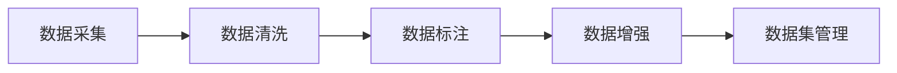

# 从零开始大模型开发与微调：数据集的获取与处理

## 1. 背景介绍
### 1.1 大模型的兴起与发展
近年来,随着深度学习技术的不断进步,以Transformer为基础的大规模预训练语言模型(Large Pre-trained Language Models,PLMs)在自然语言处理(NLP)领域取得了显著的成果。从GPT、BERT到GPT-3,这些大模型展示了在各种NLP任务上的卓越表现,引领了NLP技术的新潮流。

### 1.2 大模型面临的挑战
尽管大模型取得了瞩目的成绩,但它们的训练和应用仍然面临诸多挑战:
- 海量高质量训练数据的获取
- 计算资源的高昂成本  
- 模型的通用性和可解释性不足
- 领域适配和知识迁移的困难

### 1.3 本文的目标与贡献
本文将聚焦于大模型训练过程中的首要环节——数据集的获取与处理,系统地探讨相关的核心概念、关键技术和最佳实践。我们的目标是为NLP研究者和从业者提供一份全面实用的指南,助力大模型的开发与应用。本文的主要贡献包括:

1. 梳理数据集获取与处理的核心概念与技术路线
2. 介绍数据清洗、数据增强等关键步骤的原理与实现
3. 总结不同类型NLP任务的数据集构建最佳实践
4. 分享数据集管理的工具与资源推荐
5. 展望数据驱动的NLP技术未来发展趋势与挑战

## 2. 核心概念与联系
### 2.1 有监督学习与无监督学习
根据训练数据是否带有标注信息,机器学习任务可分为有监督学习(Supervised Learning)和无监督学习(Unsupervised Learning)两大类:

- 有监督学习:训练数据由输入特征和对应的标签组成,目标是学习输入到标签的映射关系。代表任务有文本分类、命名实体识别等。
- 无监督学习:训练数据仅包含输入特征,没有标签信息。目标是发掘数据内在的模式和结构。代表任务有词向量训练、文本聚类等。

### 2.2 预训练与微调
预训练(Pre-training)和微调(Fine-tuning)是当前大模型的两阶段训练范式:

- 预训练阶段:在大规模无标注语料上进行自监督学习,让模型习得通用的语言知识和表征能力。常见的预训练任务有语言模型、去噪自编码器等。
- 微调阶段:在下游任务的小规模标注数据上对预训练模型进行监督学习,使其适应特定任务。微调一般只训练模型的部分参数,以提高效率和泛化性能。

### 2.3 数据集获取与处理的关键步骤
构建高质量的NLP数据集通常包括以下关键步骤:

1. 数据采集:从网页、文档、数据库等渠道获取原始文本数据。
2. 数据清洗:去除噪声、格式化、过滤低质数据,提升数据质量。 
3. 数据标注:为原始数据添加标签,转化为有监督的训练数据。
4. 数据增强:扩充训练数据规模和多样性,提高模型的鲁棒性。
5. 数据集管理:组织、存储和版本控制数据集,方便团队协作。

下图展示了这些步骤之间的逻辑关系:



## 3. 核心算法原理与操作步骤
### 3.1 数据采集
数据采集是获取原始文本数据的过程。对于不同的数据源,我们可以采用相应的采集技术:

- 网页数据:利用爬虫程序自动抓取和解析网页内容。需要处理反爬机制、动态加载等问题。
- 文档数据:从PDF、Word等格式的文档中提取纯文本内容。需要考虑文档解析和版权问题。
- 数据库:通过SQL查询从结构化数据库中获取所需的文本字段。

数据采集的一般操作步骤如下:

1. 确定数据源和采集目标
2. 选择合适的采集工具和技术方案
3. 设计采集流程和数据存储格式
4. 实施采集程序,获取原始数据
5. 检查数据的完整性和合规性

### 3.2 数据清洗
数据清洗旨在提升原始数据的质量,为后续处理奠定基础。常见的数据清洗任务包括:

- 去除HTML标签、特殊字符等噪声
- 转换不同的文本编码格式为统一形式
- 过滤掉低质量、重复、无关的数据
- 分句、分词、词性标注等文本预处理

数据清洗可以遵循如下步骤:

1. 分析原始数据的特点和噪声类型
2. 确定清洗规则和处理流程
3. 选用合适的文本处理库和正则表达式工具
4. 实现自动化的数据清洗管道
5. 人工抽检清洗结果,迭代优化规则

### 3.3 数据标注 
数据标注是将原始文本转化为结构化训练数据的关键一环。根据任务类型,标注形式可以分为:

- 分类标注:为文本样本指定预定义的类别标签
- 序列标注:为文本中的每个词汇分配特定的属性标签
- 关系标注:标识文本片段之间的语义关联
- 文本匹配:判断两个文本在语义上是否等价

数据标注需要遵循严谨的流程和质量把控:

1. 制定标注规范,明确任务定义和标签体系
2. 选择高效的标注工具,支持多人协作与进度管理
3. 对标注人员进行培训,保证对规范的一致理解 
4. 实施标注任务,定期复核标注质量
5. 对低质量标注数据进行清洗和修订

### 3.4 数据增强
数据增强通过对原有数据进行变换,生成新的训练样本,从而扩充数据规模、引入数据多样性。NLP常用的数据增强技术有:

- 同义词替换:使用WordNet等知识库的同义词替换原词汇
- 回译:将文本翻译为其他语言,再翻译回原语言,引入表达变体 
- 随机插入、删除、交换词汇
- 使用预训练语言模型生成句子扩展
- 利用对抗生成网络合成新样本

数据增强的基本操作步骤为:

1. 分析原始数据的特点和局限性
2. 确定合适的数据增强技术
3. 设置数据增强的参数和策略
4. 生成增强后的数据样本
5. 评估增强数据的质量和分布特性

## 4. 数学模型和公式详细讲解
### 4.1 文本表示模型
将离散的文本符号转化为连续的数值向量是NLP的基础。常见的文本表示模型包括:

- One-hot编码:将词汇映射为高维稀疏向量,每个维度对应一个词。
$$\mathbf{x}_i = [0,\dots,1,\dots,0]$$
其中向量的第$i$个元素为1,其余为0。

- TF-IDF:根据词频(TF)和逆文档频率(IDF)为词汇赋权,突出关键词。
$$\mathrm{tfidf}(t,d,D) = \mathrm{tf}(t,d) \times \mathrm{idf}(t,D)$$
其中$\mathrm{tf}(t,d)$为词$t$在文档$d$中的频率,$\mathrm{idf}(t,D)$为$\log\frac{|D|}{|\{d\in D:t\in d\}|}$。

- Word2Vec:通过浅层神经网络学习词嵌入向量,让语义相近的词有相似的向量表示。其目标函数为:
$$\mathcal{L} = -\sum_{w\in\mathcal{V}}\sum_{c\in\mathcal{C}(w)}\log p(c|w)$$
其中$\mathcal{V}$为词表,$\mathcal{C}(w)$为词$w$的上下文窗口,$p(c|w)$为给定中心词$w$生成背景词$c$的概率。

### 4.2 文本分类模型
文本分类旨在将文本样本划分到预定义的类别。传统的文本分类模型以机器学习为主:

- 朴素贝叶斯:假设各个特征相互独立,根据贝叶斯定理计算后验概率:
$$P(c|x) = \frac{P(c)P(x|c)}{P(x)} \propto P(c)\prod_{i=1}^nP(x_i|c)$$
其中$c$为类别,$x$为文本特征向量。

- 逻辑回归:使用Sigmoid函数将线性回归的输出映射为概率:
$$P(y=1|x) = \frac{1}{1+e^{-(\mathbf{w}^T\mathbf{x}+b)}}$$
其中$\mathbf{w}$和$b$分别为权重向量和偏置项。

- 支持向量机:寻找高维特征空间中的最大间隔超平面,对应优化目标:
$$\min_{\mathbf{w},b} \frac{1}{2}\|\mathbf{w}\|^2 \quad \mathrm{s.t.} \quad y_i(\mathbf{w}^T\mathbf{x}_i+b) \geq 1, \forall i$$

近年来,深度学习模型如CNN、RNN、Transformer在文本分类任务上展现出优异的性能。它们能够自动学习层次化的文本特征表示,无需复杂的特征工程。

### 4.3 命名实体识别模型
命名实体识别(NER)是一项典型的序列标注任务,旨在识别文本中的人名、地名、机构名等命名实体。主流的NER模型采用条件随机场(CRF)来建模标签之间的转移关系:

- 线性链CRF:将输入序列$\mathbf{x}$映射为标签序列$\mathbf{y}$的概率为:
$$p(\mathbf{y}|\mathbf{x}) = \frac{1}{Z(\mathbf{x})}\exp\left(\sum_{i=1}^n\sum_{j=1}^m \lambda_j t_j(y_{i-1},y_i,\mathbf{x},i)+\sum_{i=1}^n\sum_{k=1}^l \mu_k s_k(y_i,\mathbf{x},i)\right)$$
其中$t_j$和$s_k$分别为转移特征函数和状态特征函数,$\lambda_j$和$\mu_k$为对应的权重,$Z(\mathbf{x})$为归一化因子。

- BiLSTM-CRF:在线性链CRF前加入双向LSTM编码层,学习词汇的上下文表示:
$$\mathbf{h}_i = [\overrightarrow{\mathbf{h}}_i;\overleftarrow{\mathbf{h}}_i]$$
$$\overrightarrow{\mathbf{h}}_i = \mathrm{LSTM}(\overrightarrow{\mathbf{h}}_{i-1},\mathbf{x}_i)$$
$$\overleftarrow{\mathbf{h}}_i = \mathrm{LSTM}(\overleftarrow{\mathbf{h}}_{i+1},\mathbf{x}_i)$$
其中$\mathbf{h}_i$为第$i$个词的隐藏状态,$\mathbf{x}_i$为其词嵌入向量。

- BERT-CRF:使用预训练的BERT模型作为编码器,捕捉词汇的深层语义信息。

## 5. 项目实践：代码实例和详细解释
下面我们以一个简单的文本分类任务为例,演示如何使用Python进行数据集的获取与处理。

### 5.1 数据采集
我们从Kaggle下载一个公开的新闻分类数据集:

```python
!kaggle datasets download -d rmisra/news-category-dataset
!unzip news-category-dataset.zip
```

该数据集包含5万条新闻文本,分属于41个类别。原始数据的格式为CSV文件:

```python
import pandas as pd

df = pd.read_csv("News_Category_Dataset_v2.json", lines=True)
df.head()
```

|     | link                                       | headline                             | category   | short_description                             | authors                  | date                |
|----:|:-------------------------------------------|:-------------------------------------|:-----------|:-------------------------------------------