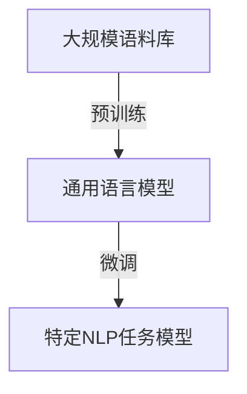
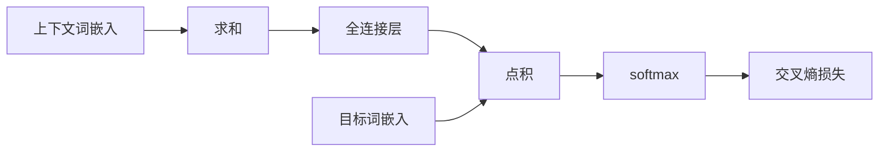
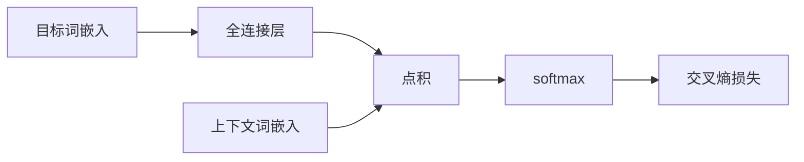

# 从零开始大模型开发与微调：有趣的词嵌入

## 1. 背景介绍

### 1.1 自然语言处理的重要性

在当今信息时代,自然语言处理(Natural Language Processing, NLP)已成为人工智能领域中最重要和最具挑战性的研究方向之一。它旨在使计算机能够理解和生成人类语言,从而实现人机自然交互。随着大数据和计算能力的不断提高,NLP技术在诸多领域得到了广泛应用,如机器翻译、智能问答、情感分析、文本摘要等。

### 1.2 词嵌入在NLP中的作用

词嵌入(Word Embedding)是NLP中一种将词汇映射到连续向量空间的技术,使相似词语在该向量空间中彼此靠近。高质量的词嵌入对于构建高性能的NLP模型至关重要,因为它能够捕捉词与词之间的语义和句法关系。传统的one-hot编码无法体现词与词之间的关联性,而词嵌入则能很好地解决这一问题。

### 1.3 大模型与微调

近年来,随着计算能力和数据量的不断增长,大型神经网络模型(如BERT、GPT等)在NLP任务中取得了卓越的表现。这些大模型通过在大规模语料库上进行预训练,学习了丰富的语义和句法知识。然而,直接将预训练模型应用于下游任务往往会导致性能下降。因此,需要对预训练模型进行微调(Fine-tuning),使其适应特定的NLP任务。

本文将探讨如何从零开始开发大型NLP模型,并对其进行微调以获得高质量的词嵌入表示,为各种NLP任务做好准备。

## 2. 核心概念与联系

### 2.1 词嵌入的核心思想

词嵌入的核心思想是将词汇映射到一个低维连续向量空间中,使得语义相似的词在该向量空间中彼此靠近。这种表示方式不仅能够捕捉词与词之间的语义关系,还能较好地解决one-hot编码存在的维度灾难问题。

### 2.2 词嵌入与神经网络模型

神经网络模型在NLP任务中发挥着重要作用,而词嵌入则是这些模型的基础输入表示形式。通过将词嵌入作为输入,神经网络模型能够更好地捕捉词与词之间的关系,从而提高模型的性能。

### 2.3 预训练与微调

预训练(Pre-training)是指在大规模语料库上训练一个通用的语言模型,使其学习丰富的语义和句法知识。而微调(Fine-tuning)则是在特定的下游任务上,对预训练模型进行进一步的训练和调整,使其更好地适应该任务。

预训练和微调的结合使用,能够充分利用大规模语料库中蕴含的知识,同时又能针对具体任务进行优化,从而获得更好的性能。



## 3. 核心算法原理具体操作步骤

### 3.1 Word2Vec

Word2Vec是一种流行的词嵌入算法,由Google于2013年提出。它包含两种模型:连续词袋模型(CBOW)和Skip-Gram模型。

#### 3.1.1 CBOW模型

CBOW模型的目标是根据上下文词预测目标词。具体来说,给定一个上下文窗口内的词序列,模型会预测位于该窗口中心的目标词。

1. 将上下文词的词嵌入相加,得到上下文向量
2. 将上下文向量输入到一个全连接层,得到分数向量
3. 将分数向量与目标词的词嵌入进行点积,得到预测值
4. 使用softmax函数计算预测值的概率分布
5. 最小化预测值与真实目标词之间的交叉熵损失



#### 3.1.2 Skip-Gram模型

Skip-Gram模型的目标是根据目标词预测上下文词。具体来说,给定一个目标词,模型会预测位于该词周围的上下文词序列。

1. 将目标词的词嵌入输入到一个全连接层,得到投影向量
2. 将投影向量与上下文词的词嵌入进行点积,得到分数向量
3. 使用softmax函数计算分数向量的概率分布
4. 最小化预测值与真实上下文词之间的交叉熵损失



通过上述步骤,Word2Vec能够学习到高质量的词嵌入表示,捕捉词与词之间的语义和句法关系。

### 3.2 GloVe

GloVe(Global Vectors for Word Representation)是另一种流行的词嵌入算法,由斯坦福大学于2014年提出。它的核心思想是利用词与词之间的共现统计信息来学习词嵌入。

1. 构建共现矩阵,统计语料库中每对词的共现次数
2. 将共现矩阵中的每个元素替换为其对数值
3. 构建一个加权最小二乘问题,目标是使词嵌入之间的点积近似于替换后的共现矩阵元素
4. 使用梯度下降法或其他优化算法求解该最小二乘问题,得到词嵌入表示

GloVe能够有效地捕捉词与词之间的全局统计信息,从而学习到高质量的词嵌入表示。

### 3.3 FastText

FastText是Facebook于2016年提出的一种词嵌入算法,它是Word2Vec的扩展版本。FastText不仅能够学习单词级别的词嵌入,还能够学习字符级别的词嵌入,从而更好地处理未见词和形态学变化。

1. 将每个单词表示为字符n-gram的集合
2. 为每个字符n-gram学习一个向量表示
3. 将单词的词嵌入表示为其所有字符n-gram向量的总和
4. 使用与Word2Vec类似的目标函数和优化算法训练字符n-gram向量

通过字符级别的表示,FastText能够更好地捕捉单词的内部结构和形态学信息,从而提高词嵌入的质量。

## 4. 数学模型和公式详细讲解举例说明

### 4.1 Word2Vec中的softmax函数

在Word2Vec算法中,softmax函数用于将分数向量转换为概率分布。对于给定的分数向量$\mathbf{s} = (s_1, s_2, \dots, s_V)$,其中$V$是词表大小,softmax函数定义为:

$$
P(w_i | \text{context}) = \frac{e^{s_i}}{\sum_{j=1}^{V} e^{s_j}}
$$

其中,$P(w_i | \text{context})$表示在给定上下文的情况下,目标词$w_i$的条件概率。

然而,当词表大小$V$非常大时,计算softmax函数的分母项会变得非常耗时。为了解决这个问题,Word2Vec采用了两种技术:

1. **层次softmax**:将softmax函数转化为一个基于哈夫曼树的层次问题,从而将计算复杂度从$\mathcal{O}(V)$降低到$\mathcal{O}(\log V)$。
2. **负采样**:通过对正例和负例进行采样,将softmax函数近似为一个二分类问题,从而避免计算分母项。

### 4.2 GloVe中的加权最小二乘问题

在GloVe算法中,我们需要求解一个加权最小二乘问题,目标是使词嵌入之间的点积近似于替换后的共现矩阵元素。具体来说,我们希望最小化以下损失函数:

$$
J = \sum_{i, j=1}^{V} f(X_{ij}) \left( w_i^T \tilde{w}_j + b_i + \tilde{b}_j - \log X_{ij} \right)^2
$$

其中:

- $V$是词表大小
- $X$是共现矩阵,其中$X_{ij}$表示词$w_i$和词$w_j$的共现次数
- $w_i$和$\tilde{w}_j$分别是词$w_i$和词$w_j$的词嵌入
- $b_i$和$\tilde{b}_j$是用于捕捉词频信息的偏置项
- $f(x)$是一个权重函数,用于减小常见词对的影响

通过梯度下降法或其他优化算法求解上述最小二乘问题,我们就能够得到高质量的词嵌入表示。

## 5. 项目实践:代码实例和详细解释说明

在这一部分,我们将通过一个实际的代码示例,展示如何使用Python和深度学习框架(如PyTorch或TensorFlow)从头开始训练一个Word2Vec模型,并对其进行微调以获得高质量的词嵌入表示。

### 5.1 数据准备

首先,我们需要准备一个语料库作为训练数据。在这个示例中,我们将使用一个简单的文本文件作为语料库。

```python
# 读取语料库文件
with open('corpus.txt', 'r', encoding='utf-8') as f:
    corpus = f.read().split()
```

### 5.2 构建词表

接下来,我们需要构建一个词表,将每个单词映射到一个唯一的整数索引。

```python
# 构建词表
word_to_idx = {word: idx for idx, word in enumerate(set(corpus))}
idx_to_word = {idx: word for word, idx in word_to_idx.items()}
vocab_size = len(word_to_idx)
```

### 5.3 定义Word2Vec模型

我们将定义一个简单的Word2Vec模型,包括输入层、embedding层和输出层。

```python
import torch
import torch.nn as nn

class Word2Vec(nn.Module):
    def __init__(self, vocab_size, embedding_dim):
        super(Word2Vec, self).__init__()
        self.embeddings = nn.Embedding(vocab_size, embedding_dim)
        self.output = nn.Linear(embedding_dim, vocab_size)

    def forward(self, input_words):
        embeds = self.embeddings(input_words)
        output = self.output(embeds)
        log_probs = nn.functional.log_softmax(output, dim=-1)
        return log_probs
```

### 5.4 训练Word2Vec模型

接下来,我们将定义一个训练函数,使用负采样技术和随机梯度下降算法训练Word2Vec模型。

```python
import random

def train(model, corpus, window_size, num_negatives, epochs, learning_rate):
    losses = []
    optimizer = torch.optim.SGD(model.parameters(), lr=learning_rate)

    for epoch in range(epochs):
        epoch_loss = 0
        random.shuffle(corpus)

        for i in range(len(corpus)):
            target_word = corpus[i]
            context_words = get_context_words(corpus, i, window_size)
            negative_words = get_negative_samples(corpus, target_word, num_negatives)

            # 准备输入和目标
            input_words = context_words + negative_words
            targets = [1] * len(context_words) + [0] * len(negative_words)

            # 前向传播
            log_probs = model(input_words)
            loss = nn.functional.binary_cross_entropy_with_logits(log_probs, torch.tensor(targets))

            # 反向传播和优化
            optimizer.zero_grad()
            loss.backward()
            optimizer.step()

            epoch_loss += loss.item()

        losses.append(epoch_loss / len(corpus))
        print(f"Epoch {epoch+1}, Loss: {losses[-1]}")

    return model.embeddings.weight.data
```

在上述函数中,我们使用了`get_context_words`和`get_negative_samples`两个辅助函数来获取目标词的上下文词和负采样词。

### 5.5 微调Word2Vec模型

经过上述步骤,我们已经训练好了一个Word2Vec模型,并获得了初始的词嵌入表示。接下来,我们可以对该模型进行微调,使其更好地适应特定的NLP任务。

假设我们有一个文本分类任务,我们可以在Word2Vec模型的基础上添加一些额外的层,构建一个用于文本分类的模型。

```python