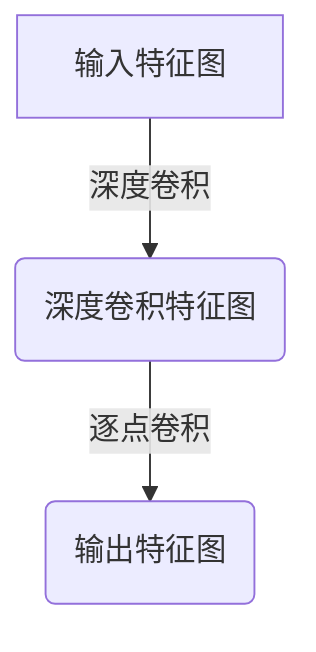

# 从零开始大模型开发与微调：深度可分离卷积的定义

## 1.背景介绍

### 1.1 深度学习的兴起

近年来,深度学习在计算机视觉、自然语言处理、语音识别等众多领域取得了巨大成功,成为人工智能领域最炙手可热的技术之一。其核心思想是通过构建深层神经网络模型,从大量数据中自动学习特征表示,从而解决传统机器学习算法难以解决的复杂问题。

### 1.2 大模型的重要性

随着数据量和计算能力的不断增长,深度神经网络模型也变得越来越大。大模型由于其强大的表示能力,在自然语言处理、计算机视觉等领域展现出卓越的性能。然而,训练如此庞大的模型需要消耗大量计算资源,给硬件和算力带来了巨大挑战。

### 1.3 高效模型设计的需求

为了在有限的硬件资源下训练和部署大型深度学习模型,高效的模型设计变得至关重要。研究人员提出了多种模型压缩和加速技术,其中深度可分离卷积(Depthwise Separable Convolution)就是一种行之有效的方法,它可以大幅减少模型的计算量和参数数量,同时保持较高的精度。

## 2.核心概念与联系

### 2.1 卷积神经网络

卷积神经网络(Convolutional Neural Network, CNN)是深度学习中最成功的模型之一,广泛应用于计算机视觉和自然语言处理等领域。CNN的核心操作是卷积(Convolution),它通过滤波器(Filter)在输入特征图上滑动,提取局部特征并生成新的特征图。

$$
y_{ij} = \sum_{m}\sum_{n}w_{mn}x_{i+m,j+n}
$$

其中$y_{ij}$是输出特征图上的像素值,$x_{i+m,j+n}$是输入特征图上的像素值,$w_{mn}$是卷积核的权重。

### 2.2 标准卷积的缺陷

标准卷积操作存在一些缺陷,主要有:

1. **计算量大**: 对于每个输出通道,需要对所有输入通道进行卷积操作,计算量随着输入输出通道数的增加而迅速增长。
2. **参数多**: 每个输出通道需要对应一组独立的卷积核参数,参数数量也随着输入输出通道数的增加而迅速增长。

这使得在资源受限的环境(如移动设备)中,部署大型CNN模型变得困难。

### 2.3 深度可分离卷积

为了解决标准卷积的缺陷,深度可分离卷积(Depthwise Separable Convolution)被提出。它将标准卷积分解为两个更小的卷积操作:深度卷积(Depthwise Convolution)和逐点卷积(Pointwise Convolution),从而大幅减少计算量和参数数量。



## 3.核心算法原理具体操作步骤

### 3.1 深度卷积

深度卷积是深度可分离卷积的第一步操作。它对输入特征图的每个通道分别进行卷积,使用单个卷积核对该通道的所有空间位置进行滤波。这种操作可以有效提取当前通道的空间特征。

$$
g_{ij}^{m} = \sum_{k}\sum_{l}w_{kl}^{m}x_{i+k,j+l}^{m}
$$

其中$g_{ij}^{m}$是第m个输出通道在(i,j)位置的值,$x_{i+k,j+l}^{m}$是第m个输入通道在(i+k,j+l)位置的值,$w_{kl}^{m}$是第m个卷积核的权重。

深度卷积的计算量为:

$$
D_K \times D_K \times D_F \times D_H \times D_W
$$

其中$D_K$是卷积核大小,$D_F$是输入通道数,$D_H$和$D_W$分别是输入特征图的高度和宽度。

由于深度卷积对每个通道分别进行卷积,因此其参数数量为:

$$
D_F \times D_K \times D_K
$$

可以看出,深度卷积的计算量和参数数量都与输出通道数无关,这就避免了标准卷积中输出通道数增加导致的计算和参数的快速增长。

### 3.2 逐点卷积

逐点卷积是深度可分离卷积的第二步操作。它使用$1\times1$的卷积核,对深度卷积的输出特征图进行线性组合,生成新的特征映射。

$$
y_{ij}^{n} = \sum_{m}w_{nm}g_{ij}^{m}
$$

其中$y_{ij}^{n}$是第n个输出通道在(i,j)位置的值,$g_{ij}^{m}$是第m个输入通道在(i,j)位置的值,$w_{nm}$是第n个输出通道对应的卷积核权重。

逐点卷积的计算量为:

$$
D_F \times D_G \times D_H \times D_W
$$

其中$D_F$是输入通道数,$D_G$是输出通道数,$D_H$和$D_W$分别是输入特征图的高度和宽度。

逐点卷积的参数数量为:

$$
D_F \times D_G
$$

由于逐点卷积使用$1\times1$的卷积核,因此其计算量和参数数量都与卷积核大小无关,只与输入输出通道数有关。

### 3.3 深度可分离卷积的总体计算量和参数数量

将深度卷积和逐点卷积结合,深度可分离卷积的总体计算量为:

$$
D_K \times D_K \times D_F \times D_H \times D_W + D_F \times D_G \times D_H \times D_W
$$

总体参数数量为:

$$
D_F \times D_K \times D_K + D_F \times D_G
$$

与标准卷积相比,深度可分离卷积在保持相近精度的情况下,计算量和参数数量都大幅减少,尤其是在输入输出通道数较大时,优势更加明显。

## 4.数学模型和公式详细讲解举例说明

为了更好地理解深度可分离卷积的原理,我们来看一个具体的例子。

假设输入特征图的尺寸为$224\times224\times3$,卷积核大小为$3\times3$,输出通道数为64。我们分别计算标准卷积和深度可分离卷积的计算量和参数数量。

### 4.1 标准卷积

标准卷积的计算量为:

$$
3 \times 3 \times 3 \times 224 \times 224 \times 64 = 1,212,243,712
$$

参数数量为:

$$
3 \times 3 \times 3 \times 64 = 1,728
$$

### 4.2 深度可分离卷积

**深度卷积**

深度卷积的计算量为:

$$
3 \times 3 \times 3 \times 224 \times 224 = 4,032,768
$$

参数数量为:

$$
3 \times 3 \times 3 = 27
$$

**逐点卷积**

逐点卷积的计算量为:

$$
3 \times 64 \times 224 \times 224 = 9,437,184
$$

参数数量为:

$$
3 \times 64 = 192
$$

**总计**

深度可分离卷积的总计算量为:

$$
4,032,768 + 9,437,184 = 13,469,952
$$

总参数数量为:

$$
27 + 192 = 219
$$

可以看出,相比标准卷积,深度可分离卷积的计算量减少了约90倍,参数数量减少了约8倍。这种巨大的计算和参数节省,使得深度可分离卷积在资源受限的环境中部署大型CNN模型变得更加可行。

## 5.项目实践:代码实例和详细解释说明

为了更好地理解深度可分离卷积的实现,我们将使用PyTorch框架编写一个简单的示例代码。

```python
import torch
import torch.nn as nn

# 定义深度可分离卷积层
class DepthwiseSeparableConv(nn.Module):
    def __init__(self, in_channels, out_channels, kernel_size, padding=0, stride=1):
        super(DepthwiseSeparableConv, self).__init__()
        self.depthwise = nn.Conv2d(in_channels, in_channels, kernel_size, padding=padding, stride=stride, groups=in_channels)
        self.pointwise = nn.Conv2d(in_channels, out_channels, 1)

    def forward(self, x):
        x = self.depthwise(x)
        x = self.pointwise(x)
        return x

# 定义示例网络
class ExampleNet(nn.Module):
    def __init__(self):
        super(ExampleNet, self).__init__()
        self.conv1 = DepthwiseSeparableConv(3, 64, 3, padding=1)
        self.relu = nn.ReLU(inplace=True)
        self.maxpool = nn.MaxPool2d(2, 2)
        self.conv2 = DepthwiseSeparableConv(64, 128, 3, padding=1)
        self.fc = nn.Linear(128 * 28 * 28, 10)

    def forward(self, x):
        x = self.conv1(x)
        x = self.relu(x)
        x = self.maxpool(x)
        x = self.conv2(x)
        x = self.relu(x)
        x = self.maxpool(x)
        x = x.view(-1, 128 * 28 * 28)
        x = self.fc(x)
        return x

# 创建示例输入
input = torch.randn(1, 3, 224, 224)

# 创建网络实例
model = ExampleNet()

# 前向传播
output = model(input)
print(output.size())
```

在上面的代码中,我们定义了一个`DepthwiseSeparableConv`类,实现了深度可分离卷积层。它包含两个卷积操作:

1. `self.depthwise`是深度卷积操作,使用`groups=in_channels`参数将输入通道分组,对每个通道分别进行卷积。
2. `self.pointwise`是逐点卷积操作,使用$1\times1$的卷积核对深度卷积的输出进行线性组合。

在`ExampleNet`类中,我们使用了两个深度可分离卷积层,分别具有64和128个输出通道。最后,我们将特征图展平并连接一个全连接层,输出10个类别的预测结果。

运行这段代码,你将看到输出张量的形状为`torch.Size([1, 10])`。

通过这个简单的示例,你可以更好地理解深度可分离卷积在实际代码中的实现方式。在实际项目中,你可以根据具体需求调整卷积层的参数,构建更加复杂和强大的深度可分离卷积神经网络模型。

## 6.实际应用场景

深度可分离卷积由于其高效的计算和参数特性,在各种应用场景中都有广泛的应用。

### 6.1 移动设备和嵌入式系统

在移动设备和嵌入式系统中,硬件资源通常非常有限,因此需要高效的模型来实现实时的计算机视觉和自然语言处理任务。深度可分离卷积可以显著减少计算量和参数数量,使得大型神经网络模型能够在这些资源受限的环境中运行。

谷歌在其移动视觉架构MobileNets中广泛使用了深度可分离卷积,使得在移动设备上运行计算机视觉任务成为可能。此外,许多移动应用程序,如增强现实、实时翻译等,都依赖于深度可分离卷积来实现高效的计算。

### 6.2 服务器端部署

虽然服务器通常具有更强大的计算能力,但对于大规模的深度学习模型来说,计算资源仍然是一个瓶颈。通过使用深度可分离卷积,可以减少模型的计算量和内存占用,从而降低服务器的硬件要求,节省成本。

在自然语言处理领域,Transformer模型广泛采用了深度可分离卷积,以提高模型的计算效率。例如,谷歌的BERT模型就使用了深度可分离卷积来加速自注意力机制的计算。

### 6.3 视频处理

在视频处理任务中,需要对大量的连续帧进行处理,对计算资源的需求非常高。深度可分离