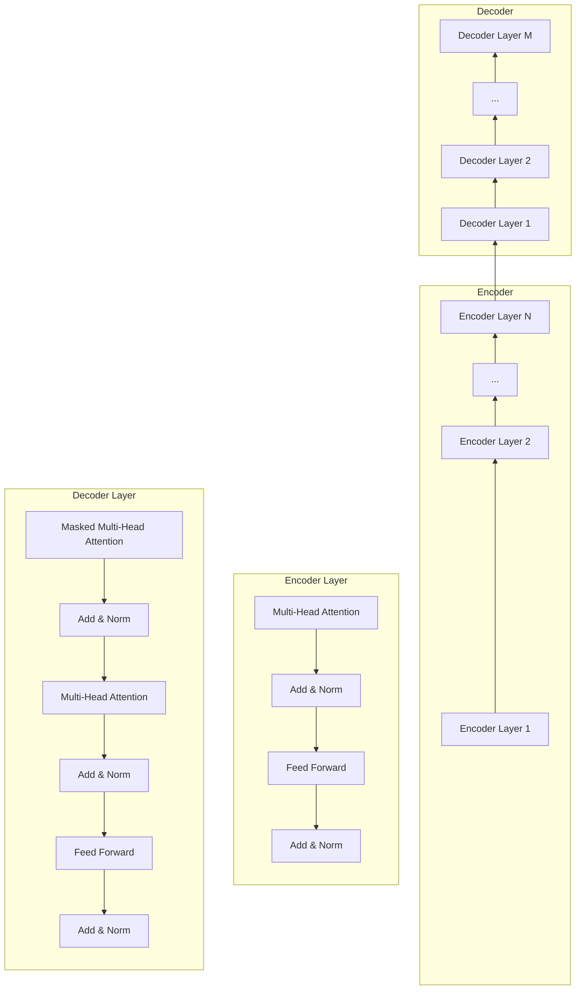
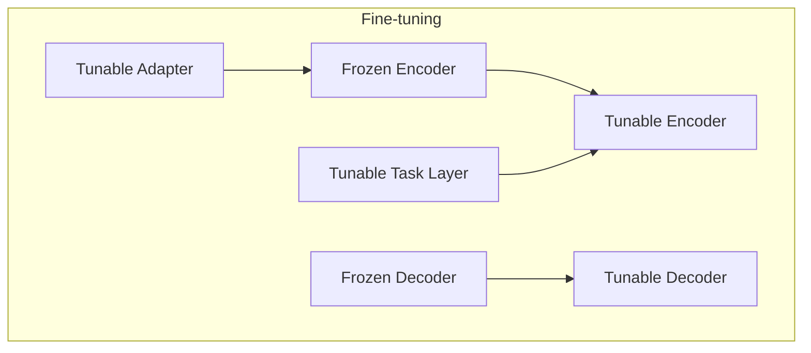

# 从零开始大模型开发与微调：深度的定义以及不同计算层待训练参数的比较

## 1. 背景介绍

### 1.1 大模型的兴起与发展

近年来,随着深度学习技术的不断进步,以 Transformer 为代表的大规模预训练语言模型(Large Pre-trained Language Models,PLMs)在自然语言处理(Natural Language Processing,NLP)领域取得了巨大的成功。从 GPT 系列到 BERT、RoBERTa、XLNet 等,这些大模型展现出了强大的语言理解和生成能力,在机器翻译、问答系统、文本分类、情感分析等诸多任务上取得了 state-of-the-art 的表现。

### 1.2 大模型面临的挑战

尽管大模型取得了瞩目的成就,但它们在实际应用中仍然面临着诸多挑战:

1. 模型规模巨大,训练和推理成本高昂。动辄上亿的参数量使得大模型难以在普通设备上进行训练和部署。
2. 通用性不足,针对特定领域和任务的适应能力有限。预训练的大模型虽然具备强大的语言理解能力,但对于特定领域的任务,往往需要进一步的微调(Fine-tuning)才能达到理想的效果。
3. 可解释性差,模型决策过程难以理解。大模型内部的计算过程错综复杂,人类难以洞察其决策机制,这在某些对可解释性有要求的场景下是个问题。

### 1.3 深度的定义与意义

针对上述挑战,业界和学术界都在积极探索大模型的优化方法。其中一个备受关注的问题是:如何在保证模型性能的同时,减小模型规模,降低计算开销?这就引出了"深度"的概念。

在神经网络中,深度指的是网络的层数。一般认为,网络层数越多,模型的表达能力就越强,但同时计算复杂度也会增加。因此,如何权衡深度和效率,找到最优的网络结构,成为了大模型优化的关键问题之一。

本文将围绕大模型的深度问题展开探讨。我们将首先介绍相关的核心概念,然后分析不同深度下模型参数量和计算量的变化规律,并给出一些优化的思路和方法。最后,我们还将通过实验对比不同深度的模型性能,为大模型的设计和优化提供参考。

## 2. 核心概念与联系

### 2.1 Transformer 结构

Transformer 是当前大模型的主流结构。它由编码器(Encoder)和解码器(Decoder)组成,每个编码器和解码器又包含多个相同的层(Layer)。每个层主要由两大部分组成:自注意力机制(Self-Attention)和前馈神经网络(Feed-Forward Network, FFN)。

其中,自注意力机制用于捕捉输入序列中不同位置之间的依赖关系,使得模型能够在编码输入时考虑上下文信息。而 FFN 则用于对特征进行非线性变换,提升模型的表达能力。

### 2.2 模型深度

模型深度指的是 Transformer 中编码器或解码器的层数。通常,层数越多,模型的深度就越大。

深度对模型性能的影响主要体现在两个方面:

1. 特征提取能力:更深的网络能够提取更加抽象和高层次的特征,有助于模型对复杂模式的理解和建模。
2. 信息传递能力:更深的网络能够在更远的距离上建立依赖关系,有助于捕捉长距离的语义信息。

### 2.3 参数量与计算量

除了深度,影响模型性能和效率的另外两个关键因素是参数量和计算量。

参数量指的是模型中所有可训练的权重参数的总数。它决定了模型的表达能力上限。一般来说,参数量越大,模型就越强大,但也越难训练和部署。

计算量指的是模型在前向和反向传播过程中所需的浮点运算数(FLOPs)。它决定了模型的推理速度和能耗。计算量越大,模型的训练和推理就越慢,对硬件的要求也越高。

深度、参数量和计算量三者之间存在着紧密的联系。在 Transformer 结构下,增加深度会同时增加参数量和计算量。因此,如何在三者之间取得平衡,是大模型优化的核心问题。

### 2.4 不同层的作用与区别

Transformer 中不同层的作用和重要性是有区别的。一般认为,浅层主要负责提取局部的、低层次的特征,而深层则更侧重全局的、高层次的特征。

此外,不同层的参数对模型性能的影响也不尽相同。研究表明,浅层的参数对模型性能的影响更大,而深层的参数则相对次要。这意味着,在模型压缩时,我们可以优先考虑减少深层的参数,以尽可能保留浅层的特征提取能力。

下图展示了 Transformer 的整体结构以及各个组件之间的关系:

## 3. 核心算法原理与具体操作步骤

### 3.1 自注意力机制

自注意力机制是 Transformer 的核心组件之一。它的主要思想是,对于输入序列的每个位置,通过注意力机制计算其与其他所有位置的相关性,从而获得该位置的上下文表示。

具体来说,自注意力机制的计算过程如下:

1. 将输入序列 $X \in \mathbb{R}^{n \times d}$ 通过三个线性变换得到查询矩阵 $Q$、键矩阵 $K$ 和值矩阵 $V$:

$$
\begin{aligned}
Q &= XW^Q \\
K &= XW^K \\
V &= XW^V
\end{aligned}
$$

其中,$W^Q, W^K, W^V \in \mathbb{R}^{d \times d_k}$ 是可学习的权重矩阵。

2. 计算查询矩阵和键矩阵的相似度得到注意力分数矩阵 $A$:

$$
A = \text{softmax}(\frac{QK^T}{\sqrt{d_k}})
$$

3. 将注意力分数矩阵与值矩阵相乘,得到输出表示 $H$:

$$
H = AV
$$

在实际应用中,Transformer 通常使用多头自注意力机制,即将 $Q$、$K$、$V$ 分别划分为 $h$ 个子空间,在每个子空间内独立地执行上述计算,最后将所有子空间的输出拼接起来。这样可以让模型在不同的子空间内关注不同的特征模式,提升表达能力。

### 3.2 前馈神经网络

前馈神经网络是 Transformer 中另一个重要组件。它的作用是对自注意力的输出进行非线性变换,提取更高层次的特征。

FFN 的计算过程如下:

$$
\text{FFN}(x) = \max(0, xW_1 + b_1)W_2 + b_2
$$

其中,$W_1 \in \mathbb{R}^{d \times d_{ff}}, b_1 \in \mathbb{R}^{d_{ff}}, W_2 \in \mathbb{R}^{d_{ff} \times d}, b_2 \in \mathbb{R}^d$ 是可学习的权重矩阵和偏置向量,$d_{ff}$ 是 FFN 的隐藏层维度。

可以看到,FFN 实际上是一个两层的感知机,中间使用 ReLU 激活函数。这种结构简单而有效,能够显著提升模型的非线性表达能力。

### 3.3 残差连接与层归一化

除了自注意力和 FFN,Transformer 中还使用了残差连接(Residual Connection)和层归一化(Layer Normalization)来促进梯度传播和加速收敛。

残差连接指的是将某一层的输入直接加到输出上,形成一个"短路连接":

$$
y = f(x) + x
$$

其中,$f(x)$ 表示该层的计算函数(如自注意力或 FFN)。残差连接使得梯度可以直接流向浅层,缓解了深度网络中的梯度消失问题。

层归一化则在每一层的输出上进行归一化操作:

$$
\text{LN}(x) = \frac{x - \mu}{\sqrt{\sigma^2 + \epsilon}} * \gamma + \beta
$$

其中,$\mu$ 和 $\sigma^2$ 分别是 $x$ 在特征维度上的均值和方差,$\gamma$ 和 $\beta$ 是可学习的缩放和偏移参数。层归一化有助于稳定每一层的输出分布,加速模型训练。

### 3.4 微调策略

在实际应用中,我们通常先在大规模语料上预训练一个通用的 Transformer 模型,然后在特定任务的数据集上进行微调,以适应任务的特点。

微调的核心思路是,固定预训练模型的部分参数,只更新与任务相关的少量参数。这样可以在降低计算开销的同时,最大限度地利用预训练模型学到的通用语言知识。

常见的微调策略包括:

1. 固定编码器,只微调解码器。这适用于生成类任务,如机器翻译和摘要生成。
2. 固定 Transformer 的浅层,只微调深层。这适用于对语义理解要求较高的任务,如阅读理解和自然语言推理。
3. 在浅层插入适配模块,在深层插入任务模块。这是一种更灵活的微调方式,可以在不破坏原有结构的情况下,针对性地增强模型的特定能力。

下图展示了几种典型的微调策略:

## 4. 数学模型和公式详细讲解举例说明

为了量化分析深度对模型参数量和计算量的影响,我们需要建立数学模型。以下是一个简化的 Transformer 模型,用于说明深度、参数量和计算量之间的关系。

### 4.1 模型定义

假设编码器和解码器的层数分别为 $N$ 和 $M$,每层的参数量为 $p$,序列长度为 $n$,特征维度为 $d$,词表大小为 $V$。

则单层 Transformer 的参数量为:

$$
p = 4d^2 + 2dd_{ff} + d + d_{ff}
$$

其中,$4d^2$ 是自注意力的参数量(假设使用单头注意力),$2dd_{ff}$ 是 FFN 的参数量。

编码器和解码器的总参数量分别为:

$$
\begin{aligned}
P_{\text{enc}} &= Np \\
P_{\text{dec}} &= Mp
\end{aligned}
$$

输入嵌入和输出嵌入的参数量为:

$$
\begin{aligned}
P_{\text{emb}} &= dV \\
P_{\text{out}} &= Vd
\end{aligned}
$$

因此,整个模型的总参数量为:

$$
P = P_{\text{enc}} + P_{\text{dec}} + P_{\text{emb}} + P_{\text{out}} = (N+M)p + 2dV
$$

可以看到,总参数量与层数 $N$ 和 $M$ 成正比。

### 4.2 计算量分析

对于单层 Transformer,自注意力的计算量为 $O(n^2d)$,FFN 的计算量为 $O(nd_{ff})$。因此,单层的总计算量为:

$$
C = O(n^2d + nd_{ff})
$$

编码器和解码器的总计算量分别