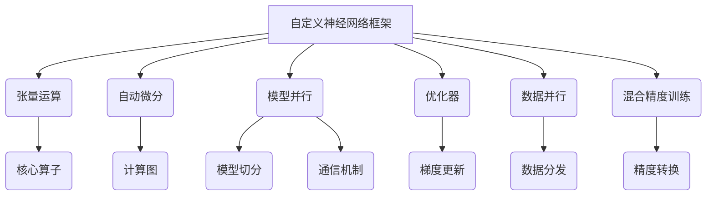

# 从零开始大模型开发与微调：自定义神经网络框架的具体实现

## 1. 背景介绍

### 1.1 大模型时代的到来

近年来,大型神经网络模型在自然语言处理、计算机视觉、推荐系统等多个领域取得了令人瞩目的成就。这些模型通过在大规模数据集上进行预训练,学习到了丰富的知识表示,并展现出了强大的泛化能力。代表性的大模型有 GPT-3、BERT、ViT 等,它们在下游任务上取得了超越人类的性能表现。

大模型的兴起,标志着人工智能进入了一个新的发展阶段。相比于传统的机器学习模型,大模型具有以下优势:

1. 更强大的表示能力
2. 更好的泛化性能
3. 更易于迁移学习
4. 更高的数据高效率

然而,大模型也面临着诸多挑战,如巨大的计算资源需求、训练数据质量要求高、模型可解释性差等。因此,如何高效地开发和微调大模型,成为了当前研究的热点问题。

### 1.2 自定义神经网络框架的重要性

虽然目前已经有一些成熟的深度学习框架如 PyTorch、TensorFlow 等,但是在大模型的开发过程中,这些通用框架往往难以满足特定的需求。例如,在分布式训练、模型并行、自定义优化器等方面,需要对框架进行深度定制化开发。

因此,自定义神经网络框架变得尤为重要。通过自定义框架,我们可以:

1. 实现高度优化的算子和内核
2. 支持灵活的模型并行策略
3. 定制高效的通信机制
4. 集成自定义的优化器和学习率调度器
5. 提供更好的可扩展性和可维护性

本文将介绍如何从零开始开发一个自定义的神经网络框架,并基于该框架实现大模型的训练和微调。我们将涵盖框架的核心模块、算法原理、数学模型等内容,并通过实例代码展示具体的实现细节。

## 2. 核心概念与联系

在开发自定义神经网络框架之前,我们需要了解一些核心概念及它们之间的联系。这些概念构成了框架的基础,对于理解和实现框架至关重要。

以上是自定义神经网络框架的核心概念及它们之间的关系。下面将对每个概念进行详细介绍。

### 2.1 张量运算

张量是深度学习框架的基础数据结构,它是一个多维数组。神经网络中的大部分操作都可以表示为张量运算,如矩阵乘法、卷积、池化等。因此,高效的张量运算是框架性能的关键。

在自定义框架中,我们需要实现一套高度优化的张量运算核心算子,如 GEMM、Conv、ReLU 等。这些算子需要针对不同的硬件平台(CPU、GPU、TPU等)进行优化,以充分发挥硬件的计算能力。

### 2.2 自动微分

自动微分是深度学习框架的核心功能之一,它用于计算神经网络中各个参数的梯度,从而实现模型的训练和优化。

在自定义框架中,我们需要实现一个高效的自动微分引擎。常见的实现方式有基于静态计算图的反向传播和基于动态计算图的反向模式自动微分。前者需要预先构建计算图,然后沿着计算图进行反向传播;后者则是在正向计算时记录运算信息,在反向传播时根据记录的信息计算梯度。

### 2.3 模型并行

对于大型神经网络模型,单个设备(GPU或TPU)的计算能力和内存往往无法满足要求。因此,我们需要采用模型并行的策略,将模型切分到多个设备上进行并行计算。

在自定义框架中,我们需要实现灵活的模型切分机制,支持不同的切分策略,如张量并行、层并行等。同时,还需要实现高效的通信机制,在不同设备之间传输数据和梯度。

### 2.4 优化器

优化器是深度学习框架中另一个核心模块,它负责根据计算出的梯度来更新模型参数,从而实现模型的训练和优化。

在自定义框架中,我们需要实现常用的优化器,如 SGD、Adam、AdamW 等。同时,还需要支持自定义优化器的扩展,以满足特定场景的需求。此外,学习率调度器也是优化器模块的一个重要组成部分,它用于动态调整学习率,以提高模型的收敛性能。

### 2.5 数据并行

除了模型并行,数据并行也是一种常用的并行策略。在数据并行中,每个设备会加载完整的模型,但只处理一部分训练数据。通过在多个设备上并行计算,可以加速训练过程。

在自定义框架中,我们需要实现高效的数据分发机制,将训练数据均匀地分发到各个设备上。同时,还需要实现梯度聚合功能,将各个设备计算出的梯度进行聚合,以更新模型参数。

### 2.6 混合精度训练

混合精度训练是一种提高计算效率的技术。在训练过程中,我们可以使用较低精度(如FP16或BF16)进行计算,然后将结果转换为较高精度(如FP32)进行参数更新。这种方式可以显著减少计算量和内存占用,从而加速训练过程。

在自定义框架中,我们需要实现精度转换功能,支持在不同精度之间自动转换。同时,还需要对核心算子进行混合精度优化,以确保计算的准确性和效率。

## 3. 核心算法原理具体操作步骤

在上一节中,我们介绍了自定义神经网络框架的核心概念。本节将详细阐述这些概念背后的算法原理及具体实现步骤。

### 3.1 张量运算

张量运算是深度学习框架的基础,高效的张量运算对于框架的整体性能至关重要。我们将介绍两个核心算子的实现原理:矩阵乘法(GEMM)和卷积(Conv)。

#### 3.1.1 矩阵乘法(GEMM)

矩阵乘法是深度学习中最常见的运算之一,它是全连接层和注意力机制的核心计算部分。高效实现 GEMM 对于加速模型训练和推理至关重要。

GEMM 的基本算法思路是将矩阵分块,然后对每个块进行乘法运算,最后将结果累加得到最终结果。具体步骤如下:

1. 将输入矩阵 A 和 B 分块,每个块的大小为 $m \times k$ 和 $k \times n$。
2. 对于每个块对 $(A_{ij}, B_{jk})$,计算它们的乘积 $C_{ik} = A_{ij} \times B_{jk}$。
3. 将所有块的乘积结果累加,得到最终的矩阵乘积 $C = A \times B$。

为了提高计算效率,我们可以采用以下优化策略:

1. 利用 CPU 或 GPU 的矢量化指令集,如 AVX、AVX2 等,实现向量化计算。
2. 对于 GPU,利用共享内存和线程束(warp)实现协作线程并行。
3. 优化内存访问模式,提高内存带宽利用率。
4. 通过循环展开和线程块分组等技术,减少线程发射和同步开销。

#### 3.1.2 卷积(Conv)

卷积运算是卷积神经网络的核心,它对于图像处理、自然语言处理等任务都有广泛应用。高效实现卷积运算对于加速模型训练和推理至关重要。

卷积运算的基本思路是将输入特征图(feature map)与卷积核(kernel)进行滑动窗口运算,得到输出特征图。具体步骤如下:

1. 初始化输出特征图,大小为 $(H_{out}, W_{out}, C_{out})$。
2. 对于每个输出像素点 $(h_{out}, w_{out})$,计算其对应的输入窗口区域。
3. 将输入窗口数据与卷积核进行张量乘法,得到该像素点的输出值。
4. 重复步骤 2 和 3,直到计算完所有输出像素点。

为了提高卷积运算的效率,我们可以采用以下优化策略:

1. 利用 CPU 或 GPU 的矢量化指令集,实现向量化计算。
2. 对于 GPU,利用共享内存和线程束实现协作线程并行。
3. 采用 im2col 和 GEMM 的融合策略,将卷积运算转化为矩阵乘法。
4. 通过循环展开、线程块分组等技术,减少线程发射和同步开销。
5. 优化内存访问模式,提高内存带宽利用率。
6. 利用 Winograd 或 FFT 等快速卷积算法,进一步优化卷积计算。

### 3.2 自动微分

自动微分是深度学习框架的核心功能之一,它用于计算神经网络中各个参数的梯度,从而实现模型的训练和优化。我们将介绍两种常见的自动微分实现方式:基于静态计算图的反向传播和基于动态计算图的反向模式自动微分。

#### 3.2.1 基于静态计算图的反向传播

基于静态计算图的反向传播是一种常见的自动微分实现方式,它需要预先构建计算图,然后沿着计算图进行反向传播。具体步骤如下:

1. 定义计算图中的节点,每个节点表示一个张量运算。
2. 在正向传播时,计算每个节点的输出值,并记录计算过程中所需的中间值。
3. 在反向传播时,从损失函数节点出发,沿着计算图反向传播,计算每个节点的梯度。
4. 利用链式法则,将每个节点的梯度传递给其输入节点。
5. 重复步骤 4,直到计算出所有待优化参数的梯度。

基于静态计算图的优点是计算高效,缺点是灵活性较差,需要预先定义好计算图的结构。

#### 3.2.2 基于动态计算图的反向模式自动微分

基于动态计算图的反向模式自动微分是另一种常见的自动微分实现方式,它在正向计算时记录运算信息,在反向传播时根据记录的信息计算梯度。具体步骤如下:

1. 定义一个 `Tensor` 类,用于表示张量及其梯度信息。
2. 在正向计算时,记录每个张量的创建操作及其输入张量。
3. 在反向传播时,从损失张量出发,利用记录的操作信息,按照链式法则计算每个张量的梯度。
4. 将计算出的梯度存储在对应的 `Tensor` 对象中。
5. 重复步骤 3 和 4,直到计算出所有待优化参数的梯度。

基于动态计算图的优点是灵活性强,缺点是计算开销较大,需要记录大量的中间信息。

### 3.3 模型并行

对于大型神经网络模型,单个设备的计算能力和内存往往无法满足要求。因此,我们需要采用模型并行的策略,将模型切分到多个设备上进行并行计算。我们将介绍两种常见的模型并行策略:张量并行和层并行。

#### 3.3.1 张量并行

张量并行是一种常见的模型并行策略,它将张量(如权重矩阵)在其某个维度上进行切分,然后分发到不同的设备上进行并行计算。具体步骤如下:

1. 确定需要切分的张量及其切分维度。
2. 将张量在指定维度上