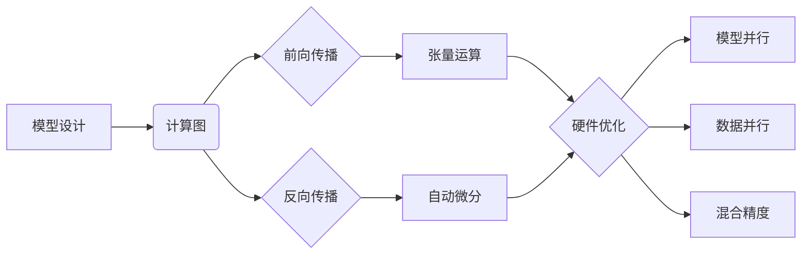

好的,我会严格按照您的要求和约束条件,以《从零开始大模型开发与微调:自定义神经网络框架的基本设计》为题,撰写一篇有深度、有见解的技术博客文章。以下是文章正文:

# 从零开始大模型开发与微调:自定义神经网络框架的基本设计

## 1. 背景介绍
### 1.1 大模型的兴起与应用 
近年来,随着深度学习的蓬勃发展,大规模预训练语言模型(Large Pre-trained Language Models,PLMs)逐渐成为自然语言处理(NLP)领域的研究热点。从2018年Google发布BERT[1]开始,各大科技公司和研究机构纷纷推出了自己的大模型,如OpenAI的GPT系列[2]、Google的T5[3]、华为的盘古[4]等。这些大模型在下游NLP任务上取得了State-of-the-Art(SOTA)的性能表现,极大地推动了NLP技术的进步和落地应用。

大模型之所以能取得如此瞩目的成绩,主要归功于其强大的语言理解和生成能力。通过在海量无标注语料上进行自监督预训练,大模型能学习到丰富的语言知识,建立起对文本的深层语义表征。在此基础上,只需少量标注数据微调,就能快速适应下游任务,实现零样本(zero-shot)、小样本(few-shot)学习,大幅降低了任务适配的成本。

### 1.2 大模型定制化开发面临的挑战
尽管大模型展现出了巨大的应用潜力,但对于企业和开发者而言,直接使用现有的开源大模型还面临诸多挑战:
1. 通用大模型的知识覆盖面广但不够精细,缺乏特定领域的专业知识,难以满足垂直行业的应用需求。
2. 不同任务场景对模型性能、计算效率、响应速度等要求各不相同,需要针对性地优化模型架构和推理部署方案。
3. 用户的数据隐私和知识产权保护日益受到重视,许多敏感数据无法直接用于模型训练,需要探索联邦学习、隐私计算等隐私保护机制。
4. 模型的可解释性和可控性有待加强,在任务输出中引入先验知识和规则约束,确保生成内容的安全合规。

因此,掌握大模型定制化开发与微调的技术至关重要。本文将介绍如何从零开始设计一个支持大模型训练的神经网络框架,并给出实践案例,帮助读者快速上手大模型开发。

## 2. 核心概念与联系
在深入讨论神经网络框架的设计之前,我们先来了解一些核心概念:

### 2.1 张量(Tensor)
张量是多维数组的推广,是神经网络进行数值计算的基本数据结构。标量可以看作0维张量,向量是1维张量,矩阵是2维张量。张量的维度称为阶(Rank),形状(Shape)描述了各个维度的长度。例如,一个形状为[batch_size, seq_len, hidden_size]的3阶张量,表示一个大小为batch_size的小批量(mini-batch),序列长度为seq_len,隐藏层维度为hidden_size。

### 2.2 计算图(Computation Graph)
计算图是一种用于描述复杂计算的数据结构,由一系列算子(Operator)节点和张量边组成的有向无环图(DAG)。算子节点表示数学运算或张量操作,如矩阵乘、卷积、激活函数等;张量边表示算子节点的输入输出。通过计算图,可以清晰地表示前向传播(forward propagation)的计算过程,同时也方便自动求导和反向传播(back propagation)。现代深度学习框架如PyTorch[5]、TensorFlow[6]都是基于计算图的思想构建的。

### 2.3 自动微分(Automatic Differentiation)
自动微分是深度学习框架的核心功能之一,它利用链式法则(chain rule),自动计算复杂函数(如神经网络)关于自变量的梯度。与数值微分相比,自动微分计算精度高、数值稳定性好,且可以显著降低求导的代码复杂度。根据构建计算图的时机,自动微分可分为静态图模式和动态图模式。静态图在代码运行前先构建完整的计算图,之后重复使用;动态图则是运行时即时构建计算图,灵活性更高。

### 2.4 模型并行(Model Parallelism)与数据并行(Data Parallelism)
大模型的参数量动辄上亿,单个GPU/TPU已无法装下完整模型。因此,需要采用模型并行和数据并行技术,将模型和数据分布到多个设备上,实现分布式训练。模型并行是指将模型的不同部分(如层、张量)划分到不同设备,而数据并行是指将数据划分到不同设备做重复计算,只在梯度上做归并(all-reduce)。模型并行的代表方案有流水线并行(Pipeline Parallelism)[7]、张量切片(Tensor-slicing)[8]等,数据并行的代表方案有分布式数据并行(Distributed Data Parallel,DDP)[9]。

### 2.5 混合精度训练(Mixed Precision Training)
传统的神经网络训练使用32位浮点数(FP32)进行计算,但实际上很多场景并不需要如此高的精度。使用较低精度如16位浮点数(FP16),可以减少显存占用、加速计算,但需要谨慎处理数值溢出问题。因此,业界提出了混合精度训练的方法[10],在前向传播和反向传播中使用FP16,而在梯度更新阶段使用FP32,兼顾了速度和精度。

下面我们通过一个简单的示意图来展示这些概念之间的联系:



## 3. 核心算法原理与具体步骤

接下来,我们详细讲解如何实现一个简单的支持自动微分的神经网络框架。该框架将包含以下核心组件:

### 3.1 张量(Tensor)
我们首先定义Tensor类,作为框架的基本数据结构。Tensor封装了底层的数值数组,并记录了在前向传播时需要保存的中间结果,以及反向传播时需要的梯度信息。

```python
class Tensor:
    def __init__(self, data, requires_grad=False):
        self.data = data
        self.requires_grad = requires_grad
        self.grad = None
        self.prev = None
        self.op = None
```

其中,data是NumPy数组,requires_grad表示是否需要求导,grad保存梯度,prev和op用于构建计算图。

### 3.2 算子(Operator)
算子是构建计算图的基本单元,执行张量运算并记录操作历史。每个算子都需要实现forward和backward方法,分别用于前向传播和反向传播。我们以矩阵乘(MatMul)算子为例:

```python
class MatMul:
    def forward(self, a, b):
        res = Tensor(a.data @ b.data, requires_grad=a.requires_grad or b.requires_grad)
        res.prev = (a, b)
        res.op = self
        return res
        
    def backward(self, grad):
        a, b = self.prev
        if a.requires_grad:
            a.grad += grad @ b.data.T
        if b.requires_grad:
            b.grad += a.data.T @ grad
```

前向传播时,将输入张量a和b做矩阵乘法,结果保存在新的张量res中,并记录res的操作历史。反向传播时,根据矩阵乘的梯度公式,计算a和b的梯度。

### 3.3 自动微分引擎(Autograd Engine)
有了张量和算子,我们就可以构建计算图了。计算图的前向传播对应着张量运算的顺序执行,而反向传播则需要按照相反的顺序,自动计算中间结果对叶子节点的梯度。这就是自动微分引擎的职责。

我们定义一个简单的自动微分函数autograd,输入一个标量张量,自动计算其对叶子节点的梯度:

```python
def autograd(root):
    order = []
    visited = set()
    def dfs(node):
        if node not in visited:
            visited.add(node)
            if node.op:
                for i in node.prev:
                    dfs(i)
            order.append(node)
    dfs(root)
    
    root.grad = 1
    for node in reversed(order):
        if node.op:
            node.op.backward(node.grad)
```

autograd函数首先对计算图做深度优先搜索(DFS),得到反向传播的执行顺序order。然后,将根节点梯度初始化为1,再按照order的逆序,调用每个节点对应算子的backward方法,即可得到所有叶子节点的梯度。

### 3.4 神经网络层(Layer)
万事俱备,我们可以开始搭建神经网络了。一个典型的神经网络由多个层(Layer)串联而成,每一层都是一个特殊的算子,接受输入张量,经过变换后输出新的张量。以最基础的全连接层(Linear)为例:

```python
class Linear:
    def __init__(self, in_features, out_features):
        self.W = Tensor(np.random.randn(in_features, out_features), requires_grad=True)
        self.b = Tensor(np.random.randn(out_features), requires_grad=True)
        
    def __call__(self, x):
        return x @ self.W + self.b
```

全连接层有两个可学习参数:权重W和偏置b,前向传播时执行 $y=xW+b$ 的张量运算。注意这里我们重载了 `__call__` 方法,所以Linear实例可以像函数一样直接调用。

类似地,我们可以实现其他常见的网络层,如卷积层(Conv2d)、循环神经网络层(RNN)等。这里限于篇幅不再赘述。

### 3.5 损失函数(Loss Function)
训练神经网络的目的是最小化损失函数,衡量模型预测值与真实值之间的差异。常见的损失函数有均方误差(MSE)、交叉熵(Cross Entropy)等。这里我们以MSE为例:

```python
def mse_loss(pred, target):
    return ((pred - target) ** 2).mean()
```

损失函数的输出是一个标量张量,我们可以调用autograd函数,自动计算其对模型参数的梯度。

### 3.6 优化器(Optimizer)
有了梯度信息,我们就可以使用优化算法,如随机梯度下降(SGD),对模型参数进行更新,最小化损失函数。以SGD为例:

```python
class SGD:
    def __init__(self, params, lr):
        self.params = params
        self.lr = lr
        
    def step(self):
        for p in self.params:
            p.data -= self.lr * p.grad
            p.grad = None
```

SGD优化器接受一个参数列表params和学习率lr,每次调用step方法,都会沿着负梯度方向更新参数,并清空梯度。

## 4. 数学模型与公式推导

前面我们介绍了如何实现一个简单的神经网络框架,这里再补充一些重要的数学原理。

### 4.1 前向传播
对于一个L层的前馈神经网络,其第l层的前向传播可以表示为:

$$
\begin{aligned}
z^{(l)} &= W^{(l)}a^{(l-1)} + b^{(l)} \\
a^{(l)} &= \sigma(z^{(l)})
\end{aligned}
$$

其中,$W^{(l)},b^{(l)}$是第l层的权重和偏置参数,$a^{(l-1)}$是上一层的输出,$\sigma$是激活函数,如ReLU、Sigmoid等。

整个前向传播的过程可以用一个复合函数表示:

$$
\hat{y} = f(x; W, b) = f_L \circ f_{L-1} \circ \cdots \circ f_1(x)
$$

其中,$\hat{y}$是模型的预测输出,$f_l$表示第l层的前向传播函数。

### 4.2 反向传播
反向传播是一种高效计算梯度的算法,基于链式法则,自动计算损失函数$J$对每一层参数$W^{(l)},b^{(l