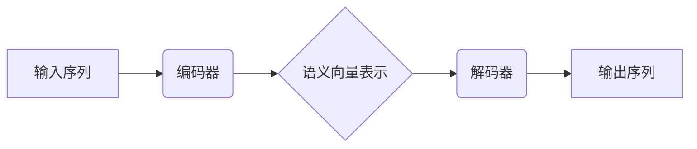
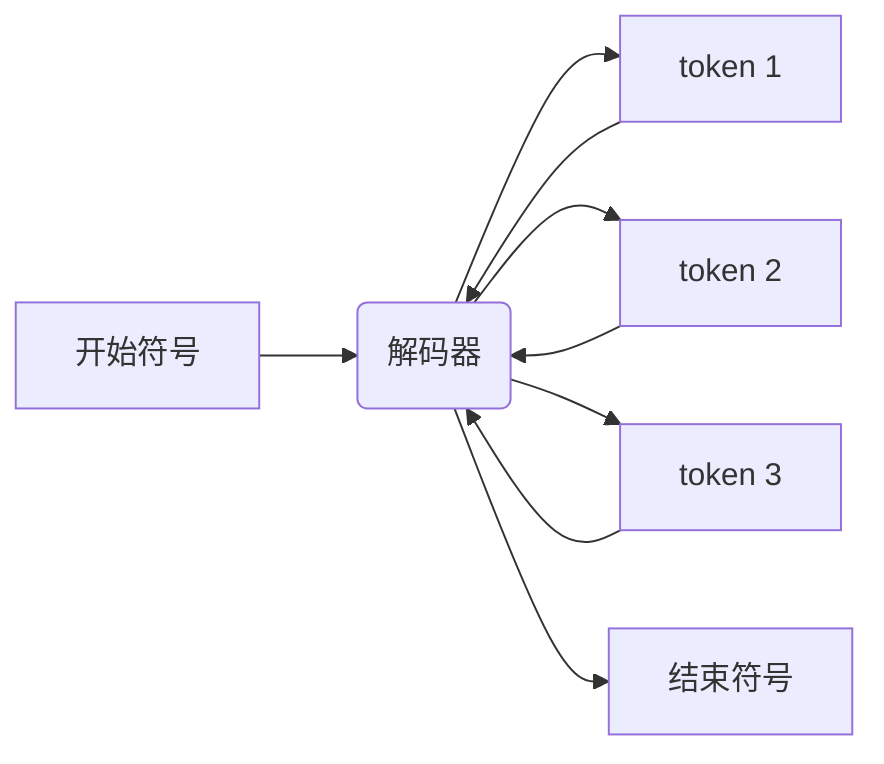
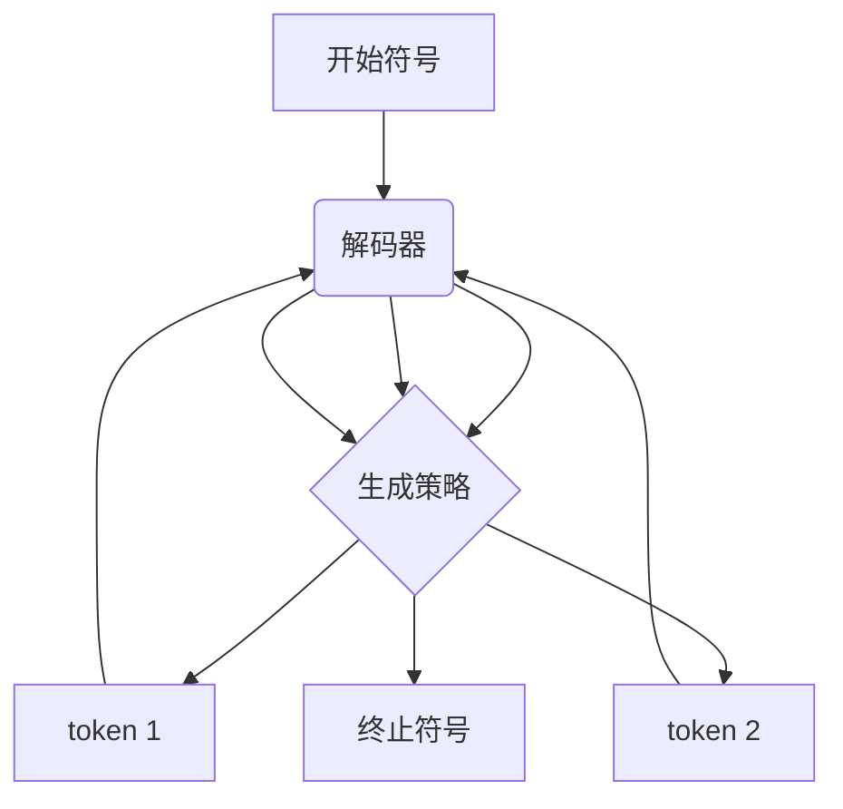

# 从零开始大模型开发与微调：解码器的实现

## 1.背景介绍

### 1.1 大模型的兴起

近年来,大型语言模型(Large Language Models, LLMs)在自然语言处理(NLP)领域取得了令人瞩目的成就。这些模型通过在海量文本数据上进行预训练,学习到了丰富的语言知识和上下文信息,从而在下游任务上展现出了强大的泛化能力。

代表性的大模型包括GPT-3、BERT、T5等,它们在机器翻译、文本生成、问答系统等诸多任务上都取得了超越人类的性能。这些成就引发了学术界和工业界对大模型的广泛关注,也推动了大模型在更多领域的应用探索。

### 1.2 大模型的挑战

尽管大模型取得了巨大成功,但它们也面临着一些挑战:

- **计算资源消耗巨大**:训练大模型需要大量的计算资源,包括GPU、TPU等昂贵的硬件设施。
- **数据需求量大**:训练高质量的大模型需要海量的高质度数据,这对数据采集、清洗和标注提出了很高的要求。
- **可解释性差**:大模型通常是黑盒模型,其内部机理并不透明,缺乏可解释性。
- **安全性和可控性**:大模型存在潜在的安全隐患,如生成有害内容、隐私泄露等,需要加强模型的安全性和可控性。

### 1.3 解码器在大模型中的重要性

解码器(Decoder)是序列生成模型(如机器翻译、文本生成等)中的关键组件,负责根据输入生成目标序列。在大模型中,解码器扮演着核心角色,直接决定了模型的输出质量。

本文将重点介绍解码器的实现原理和技术细节,旨在帮助读者从零开始掌握大模型开发和微调的核心技术,为未来的模型创新和应用奠定基础。

## 2.核心概念与联系

### 2.1 序列生成任务

序列生成任务是指根据给定的输入序列(如源语言文本)生成相应的目标序列(如目标语言文本)。常见的序列生成任务包括:

- **机器翻译**:将一种语言的文本翻译成另一种语言。
- **文本生成**:根据给定的提示(如新闻标题)生成相应的文本(如新闻正文)。
- **对话系统**:根据对话历史生成下一个回复。

这些任务都可以归结为序列到序列(Sequence-to-Sequence, Seq2Seq)的建模问题。

### 2.2 Seq2Seq模型

Seq2Seq模型是序列生成任务的主要模型框架,由编码器(Encoder)和解码器(Decoder)两部分组成:

1. **编码器(Encoder)**: 将输入序列编码为语义向量表示。
2. **解码器(Decoder)**: 根据语义向量表示生成目标序列。

编码器和解码器通常采用基于注意力机制(Attention Mechanism)的神经网络架构,如Transformer、LSTM等。其中,Transformer由于其并行性和长距离依赖建模能力,在大模型中得到了广泛应用。



### 2.3 自回归生成

解码器通常采用自回归(Autoregressive)生成策略,即每次生成一个新的token时,都需要条件于已生成的token序列。这种生成方式能够很好地捕捉序列内部的依赖关系,但也带来了一些缺陷,如生成效率低下、暴露偏置(Exposure Bias)等。



### 2.4 生成策略

解码器可以采用不同的生成策略来控制输出序列,主要包括:

- **贪婪搜索(Greedy Search)**: 每次选择概率最大的token。
- **束搜索(Beam Search)**: 维护多个候选序列,每次选择概率最大的前K个token进行扩展。
- **采样(Sampling)**: 根据token概率分布进行随机采样,可控制输出的多样性。
- **最大互信息(Mutual Information Maximization)**: 选择与已生成序列最相关的token。

不同的生成策略在输出质量、多样性、计算效率等方面有所权衡。

## 3.核心算法原理具体操作步骤

### 3.1 Transformer解码器

Transformer解码器是当前大模型中广泛采用的解码器架构,它基于自注意力(Self-Attention)机制,能够有效捕捉长距离依赖关系。

Transformer解码器的主要组成部分包括:

1. **输入嵌入(Input Embeddings)**: 将输入token转换为向量表示。
2. **位置编码(Positional Encoding)**: 引入位置信息,使模型能够捕捉序列的顺序信息。
3. **掩码多头自注意力(Masked Multi-Head Self-Attention)**: 通过掩码机制,确保每个token只能关注之前的token,避免了未来信息的泄露。
4. **前馈网络(Feed-Forward Network)**: 对注意力输出进行非线性变换,提取更高层次的特征。
5. **规范化(Normalization)**: 通过层归一化(Layer Normalization)或批归一化(Batch Normalization)稳定训练过程。


### 3.2 自回归生成过程

在自回归生成过程中,解码器需要逐步生成目标序列的每个token。具体步骤如下:

1. 将起始符号(`<bos>`)输入解码器,获得初始隐状态。
2. 基于当前隐状态,通过生成策略(如贪婪搜索、束搜索等)预测下一个token。
3. 将预测的token作为输入,更新解码器隐状态。
4. 重复步骤2和3,直到生成终止符号(`<eos>`)或达到最大长度。

在每一步生成时,解码器需要通过掩码机制,确保只关注之前生成的token,避免未来信息的泄露。



### 3.3 生成策略实现

不同的生成策略有不同的实现方式,下面以贪婪搜索和束搜索为例进行说明:

1. **贪婪搜索(Greedy Search)**: 在每一步,选择概率最大的token作为输出。

```python
def greedy_search(decoder, max_len, start_token, end_token):
    output = [start_token]
    state = decoder.init_state()
    
    for _ in range(max_len):
        logits, state = decoder(output, state)
        token = logits.argmax(-1)
        output.append(token)
        if token == end_token:
            break
    
    return output
```

2. **束搜索(Beam Search)**: 在每一步,维护K个最可能的候选序列,并对它们进行扩展。

```python
def beam_search(decoder, max_len, start_token, end_token, beam_size=3):
    output_seqs = [[start_token] for _ in range(beam_size)]
    states = [decoder.init_state() for _ in range(beam_size)]
    
    for _ in range(max_len):
        all_logits, all_states = [], []
        for seq, state in zip(output_seqs, states):
            logits, state = decoder(seq, state)
            all_logits.append(logits)
            all_states.append(state)
        
        scores = torch.cat(all_logits, dim=1).log_softmax(-1)
        scores, indices = torch.topk(scores, beam_size)
        
        output_seqs, states = [], []
        for score, idx in zip(scores, indices):
            seq_idx = idx // scores.shape[-1]
            token_idx = idx % scores.shape[-1]
            output_seqs.append(output_seqs[seq_idx] + [token_idx])
            states.append(all_states[seq_idx])
        
        output_seqs = [seq for seq in output_seqs if seq[-1] != end_token]
    
    return output_seqs
```

其他生成策略如采样、最大互信息等也有相应的实现方式,不再赘述。

## 4.数学模型和公式详细讲解举例说明

### 4.1 自注意力机制

自注意力机制是Transformer解码器的核心,它能够捕捉序列内部的长距离依赖关系。给定一个序列 $X = (x_1, x_2, \dots, x_n)$,自注意力机制计算每个位置 $i$ 的表示 $y_i$ 如下:

$$y_i = \sum_{j=1}^n \alpha_{ij}(x_jW^V)$$

其中,
- $W^V$ 是一个可学习的值向量映射矩阵
- $\alpha_{ij}$ 是注意力权重,表示位置 $i$ 对位置 $j$ 的关注程度

注意力权重 $\alpha_{ij}$ 通过以下公式计算:

$$\alpha_{ij} = \frac{\exp(e_{ij})}{\sum_{k=1}^n \exp(e_{ik})}$$
$$e_{ij} = (x_iW^Q)(x_jW^K)^T$$

其中,
- $W^Q$ 和 $W^K$ 分别是查询向量和键向量的映射矩阵
- $e_{ij}$ 表示位置 $i$ 和位置 $j$ 之间的相关性分数

通过这种注意力机制,每个位置的表示都是所有位置的加权和,权重由位置之间的相关性决定。这使得模型能够自适应地捕捉长距离依赖关系。

### 4.2 掩码多头自注意力

为了避免未来信息的泄露,解码器采用了掩码多头自注意力机制。在计算注意力权重时,对于每个位置 $i$,我们将其与所有 $j < i$ 的位置进行关注,而将 $j \geq i$ 的位置掩码为 $-\infty$,从而确保每个位置只能关注之前的位置。

$$\alpha_{ij} = \begin{cases}
\frac{\exp(e_{ij})}{\sum_{k=1}^i \exp(e_{ik})} & \text{if } j < i \\
0 & \text{if } j \geq i
\end{cases}$$

此外,为了捕捉不同的子空间特征,Transformer采用了多头注意力机制。具体来说,对于每个注意力头 $h$,我们有独立的映射矩阵 $W_h^Q$、$W_h^K$、$W_h^V$,得到不同的注意力表示:

$$\text{head}_h = \text{Attention}(XW_h^Q, XW_h^K, XW_h^V)$$

最终,多头注意力的输出是所有头的注意力表示的拼接:

$$\text{MultiHead}(X) = \text{Concat}(\text{head}_1, \dots, \text{head}_h)W^O$$

其中 $W^O$ 是一个可学习的输出映射矩阵。

通过掩码和多头机制,Transformer解码器能够有效地捕捉序列内部的依赖关系,同时避免了未来信息的泄露。

## 5.项目实践:代码实例和详细解释说明

为了更好地理解解码器的实现细节,我们提供了一个基于PyTorch的简化版Transformer解码器代码示例。

### 5.1 解码器架构

```python
class TransformerDecoder(nn.Module):
    def __init__(self, vocab_size, d_model, nhead, num_layers, dim_feedforward, max_len, dropout=0.1):
        super(TransformerDecoder, self).__init__()
        self.word_emb = nn.Embedding(vocab_size, d_model)
        self.pos_encoder = PositionalEncoding(d_model, max_len=max_len)
        
        decoder_layers = nn.TransformerDecoderLayer(d_model, nhead, dim_feedforward, dropout)
        self.transformer_decoder = nn.TransformerDecoder(decoder_layers, num_layers)
        
        self.out = nn.Linear(d_model, vocab_size)
        
    def forward(self, tgt, memory, tgt