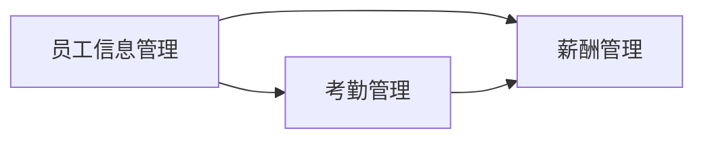

## 1.背景介绍

在当前信息化的社会环境中，企业员工管理系统已经成为企业运营不可或缺的一部分。它能够帮助企业进行高效的员工管理，包括员工信息管理、考勤管理、薪酬管理等。本文将详细介绍企业员工管理系统的设计和代码实现，希望能为您提供一些参考和启示。

## 2.核心概念与联系

企业员工管理系统主要涉及到以下几个核心概念：

- 员工信息管理：包括员工的基本信息、职务信息、工资信息等。
- 考勤管理：包括员工的打卡记录、请假记录、迟到早退记录等。
- 薪酬管理：包括员工的工资计算、奖金发放、社保缴纳等。

这些核心概念之间存在着紧密的联系，比如通过员工信息管理可以获取员工的职务信息，进而影响到薪酬管理中的工资计算。



## 3.核心算法原理具体操作步骤

企业员工管理系统的实现主要涉及到以下几个步骤：

1. 设计数据库：根据核心概念设计出对应的数据库表结构，如员工信息表、考勤记录表、薪酬记录表等。
2. 实现数据操作接口：针对每个数据库表，实现增删改查等基本操作的接口。
3. 实现业务逻辑：如考勤管理中的打卡记录处理、薪酬管理中的工资计算等。
4. 实现用户界面：提供用户友好的操作界面，使用户能够方便地进行各项操作。

## 4.数学模型和公式详细讲解举例说明

在企业员工管理系统中，薪酬管理是一个涉及到数学模型和公式的重要部分。例如，员工的月工资可能由基本工资、奖金、津贴等多个部分组成，我们可以用以下的公式来表示：

$$
工资 = 基本工资 + 奖金 + 津贴
$$

在实际操作中，这些各部分的金额可能还会受到各种因素的影响，如员工的职务、工作年限、考勤记录等，因此需要进行相应的处理。

## 5.项目实践：代码实例和详细解释说明

下面我们以员工信息管理的数据操作接口为例，给出一段具体的代码实现。

```python
class EmployeeInfo:
    def __init__(self, db):
        self.db = db

    def add_employee(self, name, position, salary):
        sql = "INSERT INTO employees (name, position, salary) VALUES (%s, %s, %s)"
        self.db.execute(sql, (name, position, salary))

    def get_employee(self, name):
        sql = "SELECT * FROM employees WHERE name = %s"
        return self.db.query(sql, (name,))

    def update_employee(self, name, position=None, salary=None):
        sql = "UPDATE employees SET position = %s, salary = %s WHERE name = %s"
        self.db.execute(sql, (position, salary, name))

    def delete_employee(self, name):
        sql = "DELETE FROM employees WHERE name = %s"
        self.db.execute(sql, (name,))
```

这段代码定义了一个`EmployeeInfo`类，用于操作员工信息表。其中，`add_employee`方法用于添加新的员工信息，`get_employee`方法用于查询员工信息，`update_employee`方法用于更新员工信息，`delete_employee`方法用于删除员工信息。

## 6.实际应用场景

企业员工管理系统广泛应用于各类企业和机构，如制造业企业、服务业企业、政府机构等。它可以帮助企业提高员工管理的效率和准确性，降低人力资源管理的成本，提升企业的运营效率。

## 7.工具和资源推荐

在实现企业员工管理系统时，以下工具和资源可能会对您有所帮助：

- 数据库管理系统：如MySQL、PostgreSQL等。
- 后端开发语言：如Python、Java、C#等。
- 前端开发框架：如React、Vue、Angular等。
- 项目管理工具：如Git、Jira、Trello等。

## 8.总结：未来发展趋势与挑战

随着信息化和数字化的发展，企业员工管理系统将会越来越智能化，如利用人工智能进行自动化的考勤管理、薪酬计算等。同时，数据安全和隐私保护也将是企业员工管理系统面临的重要挑战。我们需要不断探索和创新，以满足企业的实际需求，提升企业的运营效率。

## 9.附录：常见问题与解答

1. 问：企业员工管理系统的数据如何保证安全？
答：企业员工管理系统的数据安全可以通过多种方式来保证，如数据加密、访问控制、审计日志等。

2. 问：企业员工管理系统如何处理大量的员工数据？
答：企业员工管理系统可以通过数据库的优化、数据的分片、数据的索引等方式来处理大量的员工数据。

3. 问：企业员工管理系统如何适应企业的不同需求？
答：企业员工管理系统可以通过模块化的设计、配置化的设置、插件化的扩展等方式来适应企业的不同需求。

作者：禅与计算机程序设计艺术 / Zen and the Art of Computer Programming