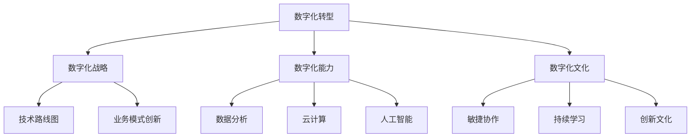

# 企业数字化项目从1-10建设方案

## 1.背景介绍

在当今数字化时代,企业面临着前所未有的机遇与挑战。数字化转型已经成为企业保持竞争力、提高效率、优化客户体验的必由之路。然而,数字化转型并非一蹴而就,需要系统规划和分步实施。本文将为您提供一个从1到10的企业数字化项目建设方案,帮助企业有序推进数字化转型。

## 2.核心概念与联系

企业数字化涉及多个核心概念,包括但不限于:

1. **数字化转型(Digital Transformation)**: 利用数字技术彻底改变企业的业务模式、流程和运营方式。
2. **数字化战略(Digital Strategy)**: 指导企业数字化转型的总体规划和路线图。
3. **数字化能力(Digital Capabilities)**: 企业利用数字技术创造价值的能力,包括数据分析、云计算、人工智能等。
4. **数字化文化(Digital Culture)**: 企业内部支持和推动数字化转型的文化氛围和价值观。

这些概念相互关联、相辅相成,构成了企业数字化转型的核心框架。



## 3.核心算法原理具体操作步骤

企业数字化转型并非一蹴而就,需要分步骤、有计划地推进。我们将数字化转型过程分为10个阶段,每个阶段都有其核心任务和具体操作步骤。

### 阶段1: 数字化战略制定

1. 成立数字化转型领导小组,由高层领导牵头。
2. 评估企业当前数字化现状,包括技术基础设施、人员技能、业务流程等。
3. 确定数字化转型目标,如提高运营效率、优化客户体验、开拓新业务等。
4. 制定数字化战略,包括技术路线图、组织变革计划、投资预算等。
5. 与全体员工沟通数字化战略,获取认同和支持。

### 阶段2: 数字化文化培育

1. 从高层领导做起,树立数字化思维,积极拥抱变革。
2. 开展数字化培训,提升员工数字化技能。
3. 建立敏捷协作机制,鼓励跨部门协作。
4. 营造创新氛围,鼓励员工提出创新想法。
5. 制定激励机制,奖励数字化实践的优秀案例。

### 阶段3: 数字化基础设施建设

1. 评估现有IT基础设施,制定升级或重建计划。
2. 建设云计算平台,实现资源按需分配。
3. 部署大数据平台,支持数据采集、存储和分析。
4. 构建企业级网络和信息安全体系。
5. 制定IT治理框架,规范IT系统开发和运维。

### 阶段4: 数据治理与分析

1. 建立数据治理机制,规范数据采集、存储、使用和共享。
2. 整合企业内外部数据源,构建统一的数据湖。
3. 开发数据分析模型,挖掘数据价值。
4. 建立数据可视化平台,支持数据驱动决策。
5. 培养数据分析人才,提高企业数据分析能力。

### 阶段5: 智能化业务流程优化

1. 梳理和优化现有业务流程,消除冗余和低效环节。
2. 引入流程自动化技术,如工作流引擎、机器人流程自动化(RPA)等。
3. 基于大数据和人工智能,实现业务流程智能优化。
4. 建立流程监控和持续改进机制。
5. 培养业务流程优化人才,提高企业流程优化能力。

### 阶段6: 客户体验数字化升级

1. 构建全渠道客户体验平台,实现线上线下无缝融合。
2. 利用大数据和人工智能,实现个性化营销和精准推荐。
3. 开发智能客服系统,提升客户服务质量和效率。
4. 建立客户反馈和投诉处理机制,持续优化客户体验。
5. 培养客户体验设计和优化人才。

### 阶段7: 产品和服务数字化创新

1. 基于数字技术,重塑产品和服务设计理念。
2. 开发基于物联网、大数据、人工智能的智能产品和服务。
3. 构建产品生命周期管理(PLM)系统,支持产品全生命周期管理。
4. 建立产品和服务创新机制,鼓励员工提出创新想法。
5. 培养产品设计和研发人才,提高企业创新能力。

### 阶段8: 数字化运营管理

1. 构建智能化供应链管理系统,提高供应链效率和透明度。
2. 建立智能制造执行系统(MES),实现制造过程数字化。
3. 部署企业资源计划(ERP)系统,集成企业各项资源。
4. 引入预测性维护技术,提高设备运行效率和可靠性。
5. 培养数字化运营管理人才,提高企业运营效率。

### 阶段9: 企业生态系统构建

1. 与上下游合作伙伴建立数字化合作关系。
2. 开放企业数据和API,支持生态系统数据共享和协同。
3. 构建企业级数字化平台,集成各类应用和服务。
4. 吸引外部开发者加入,共同丰富企业生态系统。
5. 培养生态系统管理和运营人才。

### 阶段10: 持续优化和创新

1. 建立数字化转型持续改进机制,不断优化和创新。
2. 跟踪新兴数字技术发展趋势,评估应用前景。
3. 鼓励员工持续学习,提升数字化能力。
4. 与业内先进企业交流,吸收成功经验。
5. 持续投入数字化转型,保持竞争优势。

## 4.数学模型和公式详细讲解举例说明

在企业数字化转型过程中,我们需要借助一些数学模型和公式来量化和优化决策。以下是一些常见的数学模型和公式:

### 1. 数字化成熟度模型

数字化成熟度模型用于评估企业数字化转型的现状和进度。一种常见的模型是由咨询公司Deloitte提出的数字化成熟度模型,它将企业数字化成熟度分为6个阶段:

1. 数字化新手(Digital Novice)
2. 数字化跟随者(Digital Follower)
3. 数字化集成者(Digital Integrator)
4. 数字化创新者(Digital Innovator)
5. 数字化领导者(Digital Leader)
6. 数字化先驱者(Digital Pioneer)

企业可以根据这个模型,评估自身所处的数字化成熟度阶段,并制定相应的发展策略。

### 2. 数字化投资回报模型

数字化转型需要大量投资,因此我们需要评估投资回报情况。一种常见的模型是净现值(NPV)模型,公式如下:

$$NPV = \sum_{t=0}^{T}\frac{C_t}{(1+r)^t}$$

其中:
- $C_t$表示第t年的现金流量
- $r$表示折现率
- $T$表示项目持续年限

如果NPV大于0,则表明投资是合理的。

### 3. 客户生命周期价值模型

在数字化转型过程中,我们需要重点关注客户体验和客户价值。客户生命周期价值(CLV)模型可以帮助我们量化单个客户的价值,公式如下:

$$CLV = \sum_{t=0}^{T}\frac{M_t}{(1+r)^t}$$

其中:
- $M_t$表示第t年的客户贡献利润
- $r$表示折现率
- $T$表示客户生命周期年限

通过计算CLV,我们可以优化营销和服务策略,提高客户价值。

### 4. 供应链优化模型

数字化转型可以优化企业供应链,提高效率和响应速度。一种常见的供应链优化模型是线性规划模型,公式如下:

$$\begin{aligned}
\text{minimize} \quad & \sum_{i=1}^{m} \sum_{j=1}^{n} c_{ij} x_{ij} \\
\text{subject to} \quad & \sum_{j=1}^{n} x_{ij} = a_i, \quad i=1,\ldots,m \\
                       & \sum_{i=1}^{m} x_{ij} \leq b_j, \quad j=1,\ldots,n \\
                       & x_{ij} \geq 0, \quad i=1,\ldots,m, \quad j=1,\ldots,n
\end{aligned}$$

其中:
- $x_{ij}$表示从供应商i运送到需求点j的数量
- $c_{ij}$表示从供应商i运送到需求点j的单位成本
- $a_i$表示供应商i的供应量
- $b_j$表示需求点j的需求量

通过求解这个线性规划模型,我们可以得到最优的供应链配送方案。

以上只是一些常见的数学模型和公式,在实际应用中还有许多其他模型和公式可以使用,具体取决于企业的需求和场景。

## 5.项目实践:代码实例和详细解释说明

在企业数字化转型过程中,我们需要开发各种应用系统和平台。以下是一些常见的代码实例,供参考:

### 1. 数据采集和处理

```python
import pandas as pd

# 读取数据
data = pd.read_csv('sales_data.csv')

# 数据清洗
data = data.dropna(subset=['sales'])  # 删除销售额为空的记录
data = data[data['product'] != 'Unknown']  # 删除未知产品记录

# 数据转换
data['date'] = pd.to_datetime(data['date'])
data['year'] = data['date'].dt.year
data['month'] = data['date'].dt.month

# 数据聚合
sales_by_product = data.groupby('product')['sales'].sum()
sales_by_month = data.groupby(['year', 'month'])['sales'].sum()

# 保存结果
sales_by_product.to_csv('sales_by_product.csv')
sales_by_month.to_csv('sales_by_month.csv')
```

这段代码演示了如何使用Python的Pandas库读取、清洗、转换和聚合销售数据。数据清洗步骤删除了无效记录,数据转换步骤提取了年份和月份信息,数据聚合步骤按产品和月份分别计算了销售总额。最后,结果被保存为CSV文件,可以用于后续分析。

### 2. 数据可视化

```python
import matplotlib.pyplot as plt
import seaborn as sns

# 读取数据
sales_data = pd.read_csv('sales_data.csv')

# 绘制线形图
plt.figure(figsize=(12, 6))
sns.lineplot(x='date', y='sales', data=sales_data)
plt.title('Sales Trend')
plt.xlabel('Date')
plt.ylabel('Sales')
plt.xticks(rotation=45)
plt.show()

# 绘制柱状图
plt.figure(figsize=(8, 6))
sales_by_product = sales_data.groupby('product')['sales'].sum().reset_index()
sns.barplot(x='product', y='sales', data=sales_by_product)
plt.title('Sales by Product')
plt.xlabel('Product')
plt.ylabel('Sales')
plt.xticks(rotation=45)
plt.show()
```

这段代码使用Python的Matplotlib和Seaborn库绘制了销售数据的线形图和柱状图。线形图展示了销售额的时间趋势,柱状图展示了按产品分类的销售总额。这些可视化图表可以帮助我们更直观地理解数据,支持数据驱动决策。

### 3. 机器学习模型

```python
import pandas as pd
from sklearn.linear_model import LinearRegression
from sklearn.model_selection import train_test_split

# 读取数据
data = pd.read_csv('advertising_data.csv')

# 准备数据
X = data[['TV', 'Radio', 'Newspaper']]
y = data['Sales']

# 拆分训练集和测试集
X_train, X_test, y_train, y_test = train_test_split(X, y, test_size=0.2, random