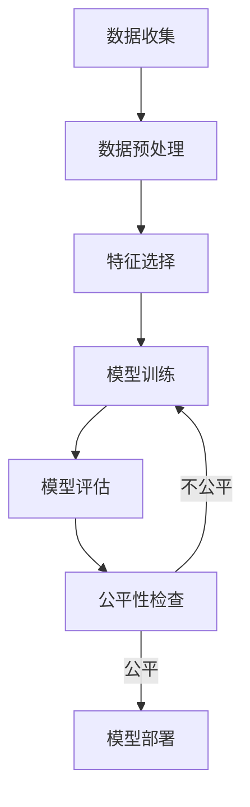
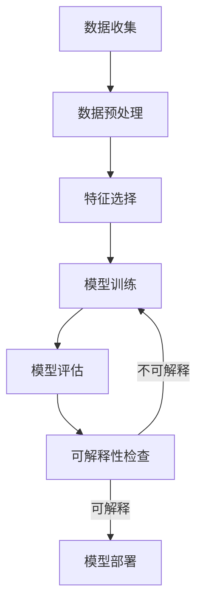
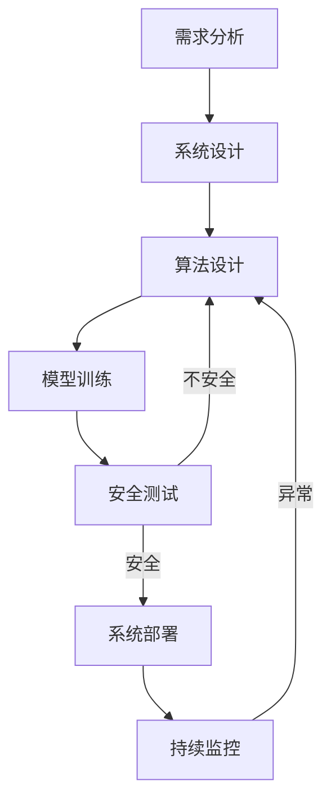

# 伦理问题 (Ethical Issues)

## 1. 背景介绍

随着人工智能(AI)技术的快速发展和广泛应用,伴随而来的是一系列棘手的伦理问题。这些问题涉及AI系统的设计、开发、部署和使用,影响着个人、社会和全球。我们有责任确保AI的发展遵循道德和伦理准则,促进人类的利益,同时避免潜在的危害。

### 1.1 AI伦理问题的重要性

伦理问题对AI的发展至关重要,因为它们直接关系到人类的福祉、自主权和尊严。忽视这些问题可能会导致严重的负面后果,如歧视、隐私侵犯、就业冲击和潜在的existential risk(存在风险)。通过审慎地解决伦理挑战,我们可以确保AI的发展符合人类的价值观和利益。

### 1.2 AI伦理问题的复杂性

AI伦理问题通常是复杂的,因为它们涉及多个利益相关者、多重价值观和多种技术。例如,在设计自动驾驶汽车的决策算法时,我们需要权衡乘客安全、行人安全、交通效率等多个因素。此外,不同文化和社会对伦理的看法也存在差异,这增加了解决方案的复杂性。

## 2. 核心概念与联系

### 2.1 人工智能的定义

人工智能(AI)是一门研究如何使机器模拟人类智能行为的科学,包括学习、推理、规划、感知和语言处理等能力。AI系统通过算法和数据训练,获得类似于人类的认知功能。

### 2.2 伦理学概念

伦理学是研究道德原则和价值观的学科,旨在指导人类行为,区分对错。一些核心伦理原则包括:

- 功利主义(Utilitarianism):最大化整体的幸福和利益
- 义务论(Deontology):基于规则和责任的道德准则
- 美德伦理学(Virtue Ethics):强调品格和美德

### 2.3 AI伦理的核心原则

虽然不同组织和学者对AI伦理原则有不同的阐述,但存在一些共同的核心原则:

1. **人本主义(Human-Centricity)**: AI应服务于人类的利益和价值观
2. **公平性(Fairness)**: AI系统应该公正对待所有个人,避免歧视
3. **透明度(Transparency)**: AI系统的决策过程应该透明和可解释
4. **隐私保护(Privacy Protection)**: AI不应侵犯个人隐私
5. **安全性和可控性(Safety and Controllability)**: AI系统应当安全可靠,并受到适当控制
6. **问责制(Accountability)**: AI系统的开发者和使用者应对其影响负责

这些原则为解决AI伦理问题提供了指导方向。

### 2.4 AI伦理与其他领域的关系

AI伦理与法律、政策、社会学、心理学等多个领域密切相关。例如,隐私保护需要相应的法律法规;公平性需要考虑社会文化因素;问责制需要明确的政策和监管机制。因此,解决AI伦理问题需要跨学科的协作。

## 3. 核心算法原理具体操作步骤

虽然AI伦理问题涉及广泛的社会、法律和哲学层面,但在技术层面,我们也可以通过算法设计来部分解决或缓解一些伦理问题。以下是一些常见的AI算法原理和具体操作步骤:

### 3.1 公平机器学习算法



1. **数据收集**: 收集代表性强、无偏差的训练数据
2. **数据预处理**: 处理缺失值、异常值,进行标准化等
3. **特征选择**: 选择与任务相关、无歧视性的特征
4. **模型训练**: 使用公平机器学习算法(如预测平等机会、平等机会等)训练模型
5. **模型评估**: 使用公平性指标(如统计率平等等)评估模型公平性
6. **公平性检查**: 如果模型不公平,返回步骤4重新训练
7. **模型部署**: 部署满足公平性要求的模型

常用的公平机器学习算法包括:预测平等机会、平等机会、校准等等。

### 3.2 可解释AI算法



1. **数据收集**: 收集高质量的训练数据
2. **数据预处理**: 处理缺失值、异常值,进行标准化等
3. **特征选择**: 选择与任务相关、可解释的特征
4. **模型训练**: 使用可解释AI算法(如LIME、SHAP等)训练模型
5. **模型评估**: 使用可解释性指标评估模型可解释性
6. **可解释性检查**: 如果模型不可解释,返回步骤4重新训练
7. **模型部署**: 部署满足可解释性要求的模型

常用的可解释AI算法包括:LIME、SHAP、决策树等。

### 3.3 AI安全算法



1. **需求分析**: 分析系统安全需求,如隐私保护、鲁棒性等
2. **系统设计**: 设计满足安全需求的系统架构
3. **算法设计**: 设计安全AI算法,如对抗训练、可验证AI等
4. **模型训练**: 使用安全AI算法训练模型
5. **安全测试**: 对模型进行安全测试,如对抗样本测试、形式验证等
6. **系统部署**: 部署满足安全要求的系统
7. **持续监控**: 持续监控系统运行,发现异常及时更新算法

常用的AI安全算法包括:对抗训练、可验证AI、联邦学习等。

以上算法原理和步骤旨在通过技术手段部分缓解AI伦理问题,但仍需结合法律、政策、教育等其他措施来全面解决。

## 4. 数学模型和公式详细讲解举例说明

在解决AI伦理问题的过程中,数学模型和公式扮演着重要角色。以下是一些常见的数学模型和公式,以及它们在AI伦理中的应用。

### 4.1 统计率平等(Statistical Parity)

统计率平等是衡量算法公平性的一种重要指标,它要求不同人口统计群体的正面结果比例相等。数学表达式如下:

$$P(\hat{Y}=1|A=0) = P(\hat{Y}=1|A=1)$$

其中,$\hat{Y}$表示算法的预测结果,$A$表示敏感属性(如种族、性别等)。当上式成立时,算法对不同群体的正面结果率相等,满足统计率平等。

**示例**:假设一个贷款审批系统,如果白人和非裔美国人获得贷款批准的概率相等,那么该系统就满足统计率平等。

然而,统计率平等往往过于严格,可能会牺牲模型的预测精度。因此,我们还需要考虑其他公平性指标。

### 4.2 校准(Calibration)

校准要求对于具有相同风险分数的个体,无论其属于哪个人口统计群体,其实际风险水平都应该相等。数学表达式为:

$$P(Y=1|\hat{Y}=y, A=0) = P(Y=1|\hat{Y}=y, A=1)$$

其中,$Y$表示真实结果,$\hat{Y}$表示预测结果,$A$表示敏感属性。当上式成立时,算法对不同群体的预测校准。

**示例**:假设一个疾病风险预测系统,如果对于风险分数为0.7的个体,无论其种族或性别,实际患病概率都相等,那么该系统就满足校准公平性。

### 4.3 SHAP值(SHapley Additive exPlanations)

SHAP值是一种解释机器学习模型预测的方法,它基于联合游戏理论,为每个特征赋予对模型预测的贡献值。SHAP值的计算公式为:

$$\phi_i = \sum_{S\subseteq N\backslash\{i\}}\frac{|S|!(|N|-|S|-1)!}{|N|!}[f_{x}(S\cup\{i\})-f_{x}(S)]$$

其中,$\phi_i$表示第$i$个特征的SHAP值,$N$是特征集合,$f$是模型预测函数,$x$是输入样本。

通过计算并可视化SHAP值,我们可以解释模型的预测逻辑,从而提高模型的透明度和可解释性,部分缓解"黑箱"问题。

**示例**:对于一个预测患者住院风险的模型,我们可以使用SHAP值解释为什么某个患者被预测为高风险,是因为其年龄、BMI等特征的贡献。

### 4.4 形式验证(Formal Verification)

形式验证是一种数学方法,用于证明系统或算法满足特定的规范或属性。在AI安全领域,我们可以使用形式验证来证明AI系统满足某些安全性质,如鲁棒性、可靠性等。

常见的形式验证方法包括:

- 定理证明(Theorem Proving)
- 模型检查(Model Checking)
- 抽象解释(Abstract Interpretation)

这些方法通过建立数学模型和推理规则,对系统进行严格的形式化分析和验证。

**示例**:对于一个自动驾驶系统的决策算法,我们可以使用形式验证方法证明在任何情况下,该算法都不会导致车辆撞击行人。

虽然形式验证具有很强的理论保证,但由于计算复杂度的限制,它只适用于相对简单的AI系统和算法。对于大规模的深度学习模型,形式验证往往不可行。

通过上述数学模型和公式,我们可以在一定程度上量化和优化AI系统在公平性、透明度和安全性等方面的表现,从而部分缓解相关的伦理问题。但是,这些技术手段仍有局限性,需要与其他措施相结合,才能全面解决AI伦理挑战。

## 5. 项目实践:代码实例和详细解释说明

为了更好地理解AI伦理相关的算法原理,我们将通过一个公平机器学习的实例项目进行说明。该项目旨在构建一个公平的信用评分模型,避免种族歧视。

### 5.1 数据集

我们使用UCI机器学习库中的"Adult"数据集,该数据集包含48842个样本,每个样本描述一个人的人口统计和就业信息,标签为该人年收入是否超过50000美元。我们将"race"作为敏感属性,目标是构建一个对不同种族公平的收入预测模型。

### 5.2 数据预处理

```python
import pandas as pd

data = pd.read_csv('adult.csv')

# 处理缺失值
data = data.dropna()

# 对类别特征进行One-Hot编码
categorical_features = ['workclass', 'education', 'marital-status', 'occupation', 'relationship', 'race', 'sex', 'native-country']
data = pd.get_dummies(data, columns=categorical_features)

# 将标签二值化
data['income'] = data['income'].apply(lambda x: 1 if x == '>50K' else 0)

# 拆分训练集和测试集
from sklearn.model_selection import train_test_split
X_train, X_test, y_train, y_test = train_test_split(data.drop('income', axis=1), data['income'], test_size=0.2, random_state=42)
```

### 5.3 模型训练

我们使用预测平等机会(Equalized Odds)算法训练逻辑回归模型,该算法通过约束条件优化,使得不同种族群体的真正率(True Positive Rate)和