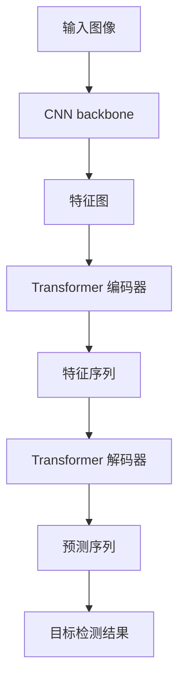
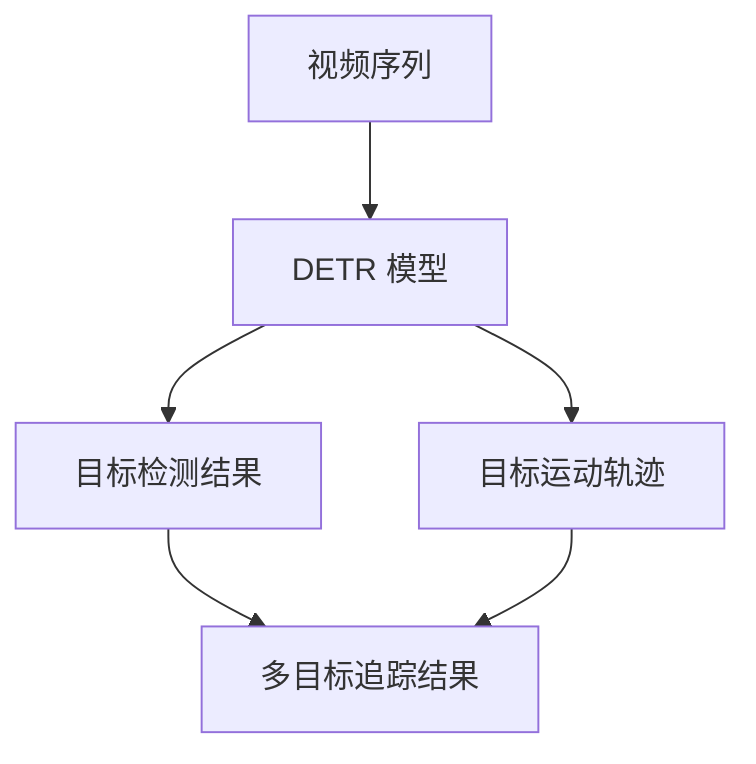

# "使用DETR进行多目标追踪的实践"

## 1.背景介绍

### 1.1 多目标追踪的重要性

在计算机视觉领域,多目标追踪(Multi-Object Tracking,MOT)是一个极具挑战的任务。它旨在在视频序列中跟踪检测到的多个目标对象,并为每个目标分配一个唯一的标识符。多目标追踪广泛应用于安防监控、交通管理、人机交互等诸多领域,对于理解复杂场景中目标的运动行为至关重要。

### 1.2 传统方法的局限性

传统的多目标追踪方法通常分为两个阶段:目标检测和数据关联。在目标检测阶段,利用诸如Faster R-CNN等目标检测算法在每一帧图像上检测出感兴趣的目标。而在数据关联阶段,则需要将同一目标在不同帧中的检测结果正确关联起来,形成完整的轨迹。这种分步骤的方法存在一些固有缺陷:

1. 错误累积:两个独立的步骤会导致错误的累积和传播。
2. 缺乏上下文信息:仅依赖当前帧的信息,无法充分利用时空上下文。
3. 复杂的后处理:需要设计复杂的数据关联策略来解决ID交换等问题。

### 1.3 DETR在多目标追踪中的应用

最近,基于Transformer的目标检测模型DETR(DEtection TRansformer)凭借其出色的性能引起了广泛关注。DETR将目标检测任务建模为一个集中于全局的序列到序列的预测问题,避免了传统方法中目标提议生成和非最大值抑制等复杂步骤。由于其端到端的性质和强大的建模能力,DETR在多目标追踪任务中展现出了巨大的潜力。

本文将详细介绍如何将DETR应用于多目标追踪任务,并分享一些实践经验和技巧。我们将探讨DETR在该任务中的优缺点、相关的改进方法,以及在实际应用中需要注意的问题。

## 2.核心概念与联系

### 2.1 DETR模型概述

DETR是一种基于Transformer的目标检测模型,它将目标检测任务建模为一个序列到序列的预测问题。具体来说,DETR将一个输入图像编码为一个压缩的特征表示,然后利用Transformer解码器从该特征表示中预测一组目标边界框及其相应的类别。

DETR的核心思想是通过全局注意力机制来捕获目标之间的关系,从而更好地处理遮挡和密集场景。与传统的基于区域提议的方法不同,DETR直接从图像特征中并行预测所有目标,避免了复杂的后处理步骤。



### 2.2 DETR在多目标追踪中的应用

将DETR应用于多目标追踪任务的关键在于,我们不仅需要在每一帧上检测目标,还需要在时间维度上关联这些检测结果。DETR的序列到序列建模方式为此提供了一个自然的解决方案。

具体来说,我们可以将视频序列作为输入,利用DETR在每一帧上检测目标,同时预测每个目标在后续帧中的运动轨迹。这种方式允许DETR充分利用时空上下文信息,从而提高追踪的准确性和鲁棒性。



### 2.3 注意力机制在多目标追踪中的作用

注意力机制是DETR在多目标追踪任务中表现出色的关键所在。通过全局注意力,DETR能够捕获目标之间的相互关系,从而更好地处理遮挡和密集场景。此外,注意力机制还能够捕获目标在时间维度上的运动模式,为准确的轨迹预测提供了有力支持。

在实践中,我们发现注意力机制不仅能够提高追踪的准确性,还能够增强模型的鲁棒性。例如,在目标短暂消失的情况下,注意力机制可以利用上下文信息来推断目标的位置,从而避免ID交换等错误。

## 3.核心算法原理具体操作步骤 

### 3.1 DETR模型结构

DETR的核心结构包括一个CNN backbone、一个Transformer编码器和一个Transformer解码器。

1. **CNN backbone**:用于从输入图像提取特征图,常用的选择包括ResNet和EfficientNet等。
2. **Transformer编码器**:对特征图进行编码,生成一个压缩的特征序列,用于捕获全局信息。
3. **Transformer解码器**:根据特征序列预测一组目标边界框及其相应的类别和运动轨迹。

在训练过程中,DETR采用了一种称为"set-based loss"的损失函数,它将预测的目标集合与ground truth目标集合进行匹配,并计算二者之间的损失。这种损失函数避免了传统方法中复杂的匹配过程,使得DETR能够以端到端的方式进行训练。

### 3.2 DETR在多目标追踪中的改进

为了更好地应用DETR于多目标追踪任务,研究人员提出了一些改进方法,主要包括:

1. **时空注意力机制**:在原始的DETR中,注意力机制仅在空间维度上进行建模。为了捕获目标在时间维度上的运动模式,一种常见的改进是引入时空注意力机制,允许模型同时关注空间和时间上下文。
2. **运动编码**:另一种改进是在输入序列中显式地编码目标的运动信息,例如速度和加速度等,以帮助模型更好地预测轨迹。
3. **多阶段训练**:由于多目标追踪任务的复杂性,一种常见的做法是分阶段进行训练。例如,先在静态图像上预训练目标检测模型,然后在视频序列上微调以学习运动模式。

### 3.3 DETR在多目标追踪中的具体操作步骤

以下是将DETR应用于多目标追踪任务的典型操作步骤:

1. **数据预处理**:将视频序列分割为固定长度的片段,每个片段包含连续的多帧图像。对每一帧进行目标检测和运动编码,生成输入序列。
2. **模型训练**:使用改进后的DETR模型,在带有ground truth标注的视频数据集上进行训练。可以采用多阶段训练策略,先在静态图像上预训练,再在视频序列上微调。
3. **推理**:在测试阶段,将待测视频序列输入到训练好的DETR模型中,获得每一帧的目标检测结果和预测的运动轨迹。
4. **后处理**:对预测结果进行后处理,包括轨迹关联、ID分配、滤波等步骤,以获得最终的多目标追踪结果。

需要注意的是,由于DETR是一种端到端的方法,因此后处理步骤相对传统方法而言会更加简单。但是,合理的后处理策略仍然对追踪性能有着重要影响。

## 4.数学模型和公式详细讲解举例说明

### 4.1 DETR的损失函数

DETR采用了一种称为"set-based loss"的损失函数,它将预测的目标集合与ground truth目标集合进行匹配,并计算二者之间的损失。具体来说,损失函数包括以下几个部分:

1. **匈牙利算法(Hungarian algorithm)**: 用于在预测集合和ground truth集合之间找到最优的一对一匹配。
2. **边界框损失(Bounding box loss)**: 计算匹配目标对之间的边界框回归损失,通常采用GIoU(Generalized Intersection over Union)损失。
3. **类别损失(Classification loss)**: 计算匹配目标对之间的类别预测损失,通常采用交叉熵损失。

DETR的总损失函数可以表示为:

$$L = \lambda_{cls}L_{cls} + \lambda_{bbox}L_{bbox} + \lambda_{giou}L_{giou}$$

其中$L_{cls}$是类别损失,$L_{bbox}$是边界框回归损失,$L_{giou}$是GIoU损失,而$\lambda$项是对应的损失权重。

在多目标追踪任务中,我们还需要考虑目标运动轨迹的预测损失。一种常见的做法是将轨迹预测建模为一个序列到序列的问题,并采用类似于机器翻译任务中使用的损失函数,例如带有teacher forcing的交叉熵损失。

### 4.2 注意力机制

注意力机制是DETR的核心所在,它允许模型在编码和解码过程中关注输入序列的不同部分。在DETR中,注意力机制主要分为两种:

1. **编码器自注意力(Encoder Self-Attention)**:用于捕获输入特征序列中元素之间的相互依赖关系。
2. **解码器交叉注意力(Decoder Cross-Attention)**:用于将解码器的输出与编码器的输出进行关联。

编码器自注意力可以表示为:

$$Attention(Q, K, V) = softmax(\frac{QK^T}{\sqrt{d_k}})V$$

其中$Q$、$K$和$V$分别表示查询(Query)、键(Key)和值(Value)。$d_k$是缩放因子,用于防止内积过大导致softmax函数的梯度较小。

解码器交叉注意力的计算方式类似,不过查询来自于解码器的输出,而键和值来自于编码器的输出。

在多目标追踪任务中,注意力机制不仅能够捕获目标之间的空间关系,还能够捕获目标在时间维度上的运动模式,从而提高追踪的准确性和鲁棒性。

### 4.3 时空注意力机制

为了更好地捕获目标在时空维度上的运动模式,一种常见的改进是引入时空注意力机制。时空注意力机制将空间注意力和时间注意力结合起来,允许模型同时关注空间和时间上下文。

具体来说,时空注意力机制可以表示为:

$$Attention_{st}(Q, K, V) = softmax(\frac{Q(K_s \oplus K_t)^T}{\sqrt{d_k}})V$$

其中$K_s$和$K_t$分别表示空间键和时间键,而$\oplus$表示拼接操作。通过这种方式,模型可以同时关注目标在空间和时间维度上的信息,从而更好地预测目标的运动轨迹。

时空注意力机制不仅可以应用于编码器自注意力,还可以应用于解码器交叉注意力,从而进一步提高模型的性能。

## 5.项目实践:代码实例和详细解释说明

在这一部分,我们将提供一个基于PyTorch实现的DETR多目标追踪示例项目,并对关键代码进行详细解释。

### 5.1 项目结构

```
detr-mot/
├── data/
│   ├── datasets/
│   └── transforms/
├── models/
│   ├── detr.py
│   ├── backbone.py
│   ├── transformer.py
│   └── ...
├── utils/
│   ├── metrics.py
│   ├── visualization.py
│   └── ...
├── train.py
├── eval.py
└── README.md
```

- `data/`目录包含数据加载和预处理相关的代码。
- `models/`目录包含DETR模型的实现。
- `utils/`目录包含一些实用函数,如评估指标计算和可视化工具。
- `train.py`是用于训练DETR多目标追踪模型的主脚本。
- `eval.py`是用于在测试集上评估模型性能的脚本。

### 5.2 数据加载和预处理

我们首先看一下如何加载和预处理多目标追踪数据集。以流行的MOT挑战赛数据集为例,每个视频序列都包含了多帧图像和对应的ground truth标注文件。我们需要将这些数