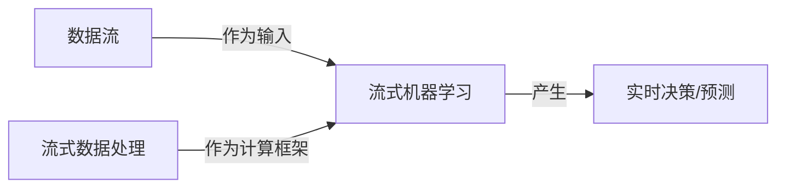

# 使用Flink进行流式机器学习

## 1.背景介绍

### 1.1 大数据时代的机遇与挑战

在当今时代,数据已经成为了推动社会发展和创新的关键驱动力。随着物联网、移动互联网、社交媒体等新兴技术的快速发展,海量的数据正以前所未有的速度被生成和传输。这些数据不仅体现在数据量的爆炸式增长,更体现在数据的多样性、流动性和实时性等特征。传统的基于批处理的大数据处理框架已经难以满足实时数据处理的需求,流式计算应运而生。

与批处理不同,流式计算是一种持续的、无边界的计算模型,可以实时处理源源不断到来的数据流。流式计算具有低延迟、高吞吐量、容错性强等优点,非常适合处理实时数据,例如物联网传感器数据、网络日志、金融交易数据等。

与此同时,机器学习和人工智能技术也在飞速发展,不断渗透到各个领域,成为驱动智能化发展的核心动力。然而,传统的机器学习模型往往是基于静态数据训练而成,难以适应动态变化的数据流。为了充分利用实时数据,提高模型的准确性和适用性,将机器学习与流式计算相结合,形成了流式机器学习(Streaming Machine Learning)这一全新的研究领域。

流式机器学习旨在从持续不断的数据流中提取有价值的信息,并实时更新模型,从而能够快速响应数据变化,捕捉潜在的模式和趋势。这种新型的机器学习范式为实时决策、实时预测、实时异常检测等应用场景提供了强有力的支持,在金融风险管理、网络安全、智能交通等领域有着广阔的应用前景。

### 1.2 Flink:流式计算的瑞士军刀

Apache Flink是一个开源的分布式流式数据处理框架,它能够在有限的资源下对无界数据流进行高效、准确的处理。Flink不仅支持纯粹的流式计算,还支持批处理,可以将批处理作为流式计算的一个特例。Flink的设计理念是通过统一的流处理模型,为批处理和流式处理提供一致的编程模型和运行环境。

Flink具有低延迟、高吞吐量、精确一次语义(Exactly-once)、容错性强等优点,非常适合构建流式数据处理应用。与此同时,Flink还提供了丰富的API和库,涵盖了机器学习、图计算、复杂事件处理等多个领域,使其成为流式计算的"瑞士军刀"。

本文将重点介绍如何利用Flink进行流式机器学习,包括Flink流式机器学习的核心概念、算法原理、实现方法、应用场景等内容,旨在为读者提供一个全面的理解和实践指南。

## 2.核心概念与联系

在深入探讨Flink流式机器学习之前,我们需要先了解一些核心概念及它们之间的关系。

### 2.1 数据流(Data Stream)

在Flink中,数据流是一个无界、持续的数据序列,可以从各种数据源(如消息队列、文件、socket等)中获取。数据流中的每个元素都是一个数据记录,可以是简单的数值、字符串,也可以是复杂的对象或事件。数据流是Flink进行流式计算的基础。

### 2.2 流式数据处理(Stream Processing)

流式数据处理是指对持续到来的数据流进行实时计算和处理,并输出结果或者触发相应的操作。流式数据处理的关键特点是连续性和无边界性,数据流是无限的,处理过程也是无止境的。与批处理相比,流式处理更加注重低延迟和高吞吐量。

### 2.3 流式机器学习(Streaming Machine Learning)

流式机器学习是机器学习在流式计算场景下的一种应用和拓展。传统的机器学习模型通常是基于静态数据集训练得到的,一旦模型训练完成就无法再更新。而流式机器学习则是在持续的数据流上进行在线学习,能够随时根据新到来的数据动态地更新和调整模型,以适应数据分布的变化。

流式机器学习的核心思想是将模型训练和预测过程融入到流式数据处理的管道中,通过增量式学习算法实现模型的实时更新。这种方式不仅能够充分利用实时数据,还能够提高模型的准确性和鲁棒性,为实时决策提供有力支持。

### 2.4 Flink流式机器学习

Flink流式机器学习是指利用Flink流式计算框架实现流式机器学习应用。Flink提供了FlinkML这一机器学习库,支持多种经典的机器学习算法(如逻辑回归、梯度提升树等)在流式场景下的应用。同时,Flink也支持用户自定义流式机器学习算法,并提供了丰富的API和工具,方便开发者构建复杂的流式机器学习应用。

Flink流式机器学习的核心思路是:

1. 将数据流作为输入源
2. 使用增量式学习算法对流式数据进行在线建模
3. 利用更新后的模型对新到来的数据进行预测或决策
4. 将预测结果输出到下游应用或反馈给模型进行下一轮迭代

这样就形成了一个闭环的流式机器学习过程,能够持续地从数据流中学习,并对实时数据做出快速响应。

### 2.5 核心概念关系

上述核心概念之间的关系可以用下图直观地表示:



其中,数据流作为流式机器学习的输入源,而流式数据处理框架(如Flink)则为流式机器学习提供计算能力。流式机器学习算法在框架上运行,从数据流中学习模型,并产生实时的决策或预测结果。

## 3.核心算法原理具体操作步骤

在流式机器学习中,核心算法的设计理念是增量式学习(Incremental Learning),即模型能够在新数据到来时不断更新和调整,而不需要从头开始重新训练。这种增量式学习方式能够有效地降低计算开销,提高学习效率。

接下来,我们将介绍两种流行的增量式机器学习算法:在线随机梯度下降(Online Stochastic Gradient Descent)和贝叶斯在线学习器(Bayesian Online Learner),并给出它们在Flink中的具体实现步骤。

### 3.1 在线随机梯度下降(Online SGD)

在线随机梯度下降是一种常用的增量式优化算法,广泛应用于逻辑回归、线性回归、支持向量机等监督学习任务中。它的核心思想是:对于每个新到来的训练样本,计算该样本关于模型参数的梯度,并沿着梯度的反方向更新模型参数,从而最小化损失函数。

在Flink中实现在线随机梯度下降算法的步骤如下:

1. 定义数据流源,将训练数据以流的形式输入
2. 初始化模型参数,作为算法的起点
3. 对流中的每个训练样本:
    - 计算该样本关于当前模型参数的梯度
    - 根据学习率,沿梯度反方向更新模型参数
4. 输出最终模型,或者持续输出更新后的模型

以逻辑回归为例,其在线SGD算法的伪代码如下:

```python
# 初始化模型参数
weights = 初始化权重向量()

# 对于每个新到来的训练样本(x, y)
for data_stream:
    x, y = 提取特征和标签(data_stream)
    
    # 计算梯度
    y_pred = sigmoid(np.dot(x, weights))
    gradient = (y_pred - y) * x
    
    # 更新模型参数
    weights = weights - learning_rate * gradient
    
# 输出最终模型
return weights
```

其中,`sigmoid`函数是逻辑回归的激活函数,用于将线性组合的结果映射到(0,1)区间,从而得到概率值。

通过不断迭代上述过程,模型参数`weights`会不断朝着最优方向更新,直至收敛或达到停止条件。这样就完成了模型的增量式训练过程。

### 3.2 贝叶斯在线学习器(Bayesian Online Learner)

贝叶斯在线学习器是一种基于贝叶斯理论的增量式学习算法,常用于分类和回归任务。它的核心思想是将先验知识(如模型参数的初始分布)和观测数据(新到来的训练样本)相结合,通过贝叶斯公式不断更新模型参数的后验分布,从而实现增量式学习。

在Flink中实现贝叶斯在线学习器的步骤如下:

1. 定义数据流源,将训练数据以流的形式输入
2. 初始化模型参数的先验分布
3. 对流中的每个训练样本:
    - 根据观测数据和先验分布,计算模型参数的后验分布
    - 将后验分布作为新的先验分布,用于下一次迭代
4. 输出最终模型参数的后验分布,或者持续输出更新后的分布

以高斯朴素贝叶斯分类器为例,其贝叶斯在线学习器算法的伪代码如下:

```python
# 初始化先验分布参数
先验均值 = 初始化均值向量()
先验精度 = 初始化精度矩阵()

# 对于每个新到来的训练样本(x, y)
for data_stream:
    x, y = 提取特征和标签(data_stream)
    
    # 计算后验分布参数
    后验精度 = 先验精度 + np.outer(x, x)
    后验均值 = (先验精度 @ 先验均值 + y * x) / 后验精度
    
    # 更新先验分布
    先验均值 = 后验均值
    先验精度 = 后验精度
    
# 输出最终模型参数的后验分布
return 先验均值, 先验精度
```

在上述算法中,我们使用了高斯分布作为模型参数的先验和后验分布,并通过不断更新均值向量和精度矩阵(协方差矩阵的逆)来实现增量式学习。

与在线SGD相比,贝叶斯在线学习器能够更好地处理噪声数据和异常值,同时也能够量化模型参数的不确定性,为决策提供更多信息。

## 4.数学模型和公式详细讲解举例说明

在上一节中,我们介绍了两种流行的增量式机器学习算法:在线随机梯度下降和贝叶斯在线学习器。这两种算法都涉及到一些数学模型和公式,接下来我们将对它们进行详细的讲解和举例说明。

### 4.1 在线随机梯度下降(Online SGD)

在线随机梯度下降算法的核心思想是通过不断迭代,使损失函数(Loss Function)最小化。对于每个新到来的训练样本,我们计算该样本关于当前模型参数的梯度,并沿着梯度的反方向更新模型参数,从而逐步减小损失函数的值。

在监督学习任务中,常用的损失函数包括均方误差(Mean Squared Error)、交叉熵损失(Cross Entropy Loss)等。以线性回归为例,其均方误差损失函数可表示为:

$$J(\theta) = \frac{1}{2m}\sum_{i=1}^m(h_\theta(x^{(i)}) - y^{(i)})^2$$

其中:
- $m$是训练样本的数量
- $x^{(i)}$是第$i$个训练样本的特征向量
- $y^{(i)}$是第$i$个训练样本的标签值
- $h_\theta(x)$是线性回归模型,即$h_\theta(x) = \theta^Tx$
- $\theta$是模型参数(权重向量)

我们的目标是找到一组最优的$\theta$值,使得损失函数$J(\theta)$最小。

在线SGD算法通过计算损失函数关于模型参数$\theta$的梯度,并沿着梯