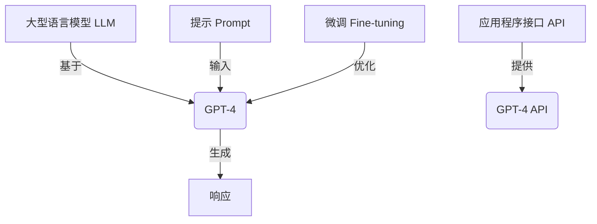

# 使用GPT-4 API

## 1. 背景介绍

在人工智能领域中,大型语言模型(LLM)已经成为一个不可忽视的力量。这些模型通过从海量文本数据中学习,获得了令人惊叹的自然语言理解和生成能力。其中,GPT(Generative Pre-trained Transformer)系列模型无疑是最受关注的LLM之一。

GPT-4是OpenAI最新发布的大型语言模型,它在自然语言处理、推理、多模态等多个领域展现出了卓越的性能。与前代GPT-3相比,GPT-4在很多方面都有了显著的提升,例如更大的模型规模、更强的推理能力、更好的多模态处理能力等。GPT-4不仅能够生成高质量的文本,还能够处理图像、视频等多种模态的输入,为人工智能系统带来了全新的可能性。

随着GPT-4的发布,OpenAI也推出了对应的API服务,允许开发者将GPT-4集成到自己的应用程序中。这为我们开发基于GPT-4的创新应用提供了便利,同时也带来了一些新的挑战和需要注意的地方。本文将详细介绍如何使用GPT-4 API,包括API的基本使用方法、关键参数设置、代码示例、实际应用场景等,旨在为读者提供一个全面的指南。

## 2. 核心概念与联系

在深入探讨GPT-4 API之前,我们需要先了解一些核心概念和它们之间的关系。

### 2.1 大型语言模型(LLM)

大型语言模型(LLM)是一种基于深度学习的自然语言处理模型,通过从海量文本数据中学习,获得了出色的自然语言理解和生成能力。LLM通常采用Transformer等注意力机制来捕捉文本中的长距离依赖关系,从而能够生成连贯、流畅的文本。

GPT-4就是一种LLM,它是OpenAI基于自己的GPT-3模型进行改进和扩展而来的。与GPT-3相比,GPT-4在模型规模、推理能力、多模态处理等方面都有了显著提升。

### 2.2 API(应用程序接口)

API(Application Programming Interface)是一种软件接口,它定义了不同软件组件之间相互通信的规则和约定。通过API,开发者可以轻松地将不同的软件系统集成在一起,实现数据和功能的共享。

在GPT-4的场景中,OpenAI提供了一个API服务,允许开发者将GPT-4的强大能力集成到自己的应用程序中。通过调用API,我们可以向GPT-4发送文本、图像或其他模态的输入,并获取GPT-4生成的响应。

### 2.3 提示(Prompt)

在与LLM交互时,我们需要向模型提供一个"提示"(Prompt),告诉它我们希望它完成什么样的任务。提示可以是一段文本、一个问题、一个指令或者一个上下文场景等。

GPT-4能够根据提示生成相应的响应,例如回答问题、生成文本、解决问题等。提示的质量直接影响了GPT-4的输出质量,因此设计高质量的提示是一个非常重要的技能。

### 2.4 微调(Fine-tuning)

虽然GPT-4已经在广泛的数据上进行了预训练,但是在特定的任务或领域上,它可能还需要进一步的调整和优化。这就需要使用微调(Fine-tuning)技术。

微调是指在预训练模型的基础上,使用特定领域的数据进行额外的训练,以使模型更好地适应该领域的任务。通过微调,我们可以让GPT-4在特定场景下表现得更加出色。

### 2.5 Mermaid 流程图

上图使用Mermaid流程图展示了这些核心概念之间的关系。GPT-4是一种基于大型语言模型(LLM)的模型,OpenAI提供了GPT-4 API供开发者使用。通过向GPT-4发送提示(Prompt),我们可以获取GPT-4生成的响应。此外,我们还可以使用微调(Fine-tuning)技术,让GPT-4在特定领域表现更佳。

## 3. 核心算法原理具体操作步骤

### 3.1 Transformer 架构

GPT-4的核心架构是基于Transformer的,Transformer是一种革命性的序列到序列(Seq2Seq)模型,它能够有效地捕捉输入序列中的长距离依赖关系,从而生成高质量的输出序列。

Transformer的主要组件包括编码器(Encoder)和解码器(Decoder),它们都由多个相同的层组成,每一层都包含多头自注意力机制(Multi-Head Attention)和前馈神经网络(Feed-Forward Neural Network)。

1. **编码器(Encoder)**

编码器的作用是将输入序列(如文本)映射为一系列连续的向量表示,这些向量捕捉了输入序列中的重要信息。编码器中的自注意力机制能够让每个位置的输出向量与输入序列中的所有其他位置相关联,从而捕捉长距离依赖关系。

2. **解码器(Decoder)**

解码器的作用是根据编码器的输出向量生成目标序列(如生成的文本)。解码器中的自注意力机制不仅关注输入序列,还关注已经生成的输出序列,从而能够生成连贯、流畅的文本。

3. **多头自注意力机制(Multi-Head Attention)**

自注意力机制是Transformer的核心组件,它允许模型在计算每个位置的输出向量时,关注输入序列中的所有其他位置。多头自注意力机制是将多个注意力机制的输出进行concatenate,从而捕捉不同的依赖关系模式。

4. **前馈神经网络(Feed-Forward Neural Network)**

前馈神经网络是Transformer中的另一个重要组件,它对每个位置的输出向量进行非线性映射,以提供更丰富的表示能力。

通过编码器-解码器架构、自注意力机制和前馈神经网络的协同工作,Transformer能够有效地建模输入和输出序列之间的映射关系,从而实现高质量的序列生成任务。

### 3.2 GPT-4 模型架构

GPT-4是一种基于Transformer的大型语言模型,它在Transformer的基础上进行了一些关键的改进和扩展。

1. **模型规模扩大**

GPT-4的模型规模比GPT-3大了数倍,拥有更多的参数和更深的网络层数。这使得GPT-4能够捕捉更复杂的语言模式,从而提高了自然语言处理能力。

2. **多模态输入**

GPT-4不仅能够处理文本输入,还能够处理图像、视频等多模态输入。这是通过在模型中引入新的模态编码器来实现的,它能够将不同模态的输入映射到同一个向量空间中,从而实现多模态融合。

3. **推理能力增强**

GPT-4在推理和reasoning方面表现出了更强的能力。这是通过在训练过程中引入了更多的推理任务,以及对模型架构进行了优化,使其能够更好地捕捉因果关系、逻辑推理等。

4. **控制性和一致性**

GPT-4在生成文本时,能够更好地控制输出的风格、语气和一致性。这是通过在训练过程中引入了相关的目标函数和损失函数,以及在生成时引入了一些控制策略。

5. **安全性和可靠性**

GPT-4在安全性和可靠性方面也有了显著的提升。OpenAI采用了一些策略来减少GPT-4生成有害或不当内容的风险,同时也提高了模型的鲁棒性和可靠性。

总的来说,GPT-4在模型规模、多模态处理、推理能力、控制性和安全性等多个方面都有了显著的提升,这使得它在自然语言处理和人工智能领域展现出了卓越的性能。

## 4. 数学模型和公式详细讲解举例说明

在GPT-4的核心算法中,有一些重要的数学模型和公式需要了解。下面我们将详细讲解其中的几个关键部分。

### 4.1 自注意力机制(Self-Attention)

自注意力机制是Transformer的核心组件之一,它能够捕捉输入序列中的长距离依赖关系。对于一个长度为$n$的输入序列$X = (x_1, x_2, \dots, x_n)$,自注意力机制的计算过程如下:

1. 计算查询(Query)、键(Key)和值(Value)向量:

$$
\begin{aligned}
Q &= XW^Q \\
K &= XW^K \\
V &= XW^V
\end{aligned}
$$

其中$W^Q$、$W^K$和$W^V$是可学习的权重矩阵。

2. 计算注意力分数:

$$
\text{Attention}(Q, K, V) = \text{softmax}\left(\frac{QK^T}{\sqrt{d_k}}\right)V
$$

其中$d_k$是缩放因子,用于防止内积过大导致梯度消失或爆炸。

3. 多头自注意力机制:

$$
\text{MultiHead}(Q, K, V) = \text{Concat}(head_1, \dots, head_h)W^O
$$

$$
\text{where } head_i = \text{Attention}(QW_i^Q, KW_i^K, VW_i^V)
$$

多头自注意力机制是将多个注意力头的输出进行拼接,从而捕捉不同的依赖关系模式。

通过自注意力机制,Transformer能够有效地建模输入序列中的长距离依赖关系,从而提高了序列生成任务的性能。

### 4.2 掩码自注意力机制(Masked Self-Attention)

在自回归语言模型(如GPT-4)中,我们需要确保在生成每个位置的输出时,只依赖于该位置之前的输入,而不能利用之后的信息。这就需要使用掩码自注意力机制。

对于一个长度为$n$的输入序列$X = (x_1, x_2, \dots, x_n)$,掩码自注意力机制的计算过程如下:

1. 计算查询、键和值向量,与普通自注意力机制相同。

2. 在计算注意力分数时,引入掩码矩阵$M$:

$$
\text{MaskedAttention}(Q, K, V) = \text{softmax}\left(\frac{QK^T + M}{\sqrt{d_k}}\right)V
$$

其中$M$是一个$n \times n$的掩码矩阵,对于$i \leq j$,$M_{ij} = 0$;对于$i > j$,$M_{ij} = -\infty$。这样就确保了每个位置的输出只依赖于该位置之前的输入。

3. 多头掩码自注意力机制与普通多头自注意力机制类似,只是将普通自注意力头替换为掩码自注意力头。

通过掩码自注意力机制,GPT-4能够生成自回归的文本序列,每个位置的输出只依赖于该位置之前的输入,从而保证了生成的连贯性和一致性。

### 4.3 交叉注意力机制(Cross-Attention)

在处理多模态输入时,GPT-4需要融合来自不同模态的信息。这就需要使用交叉注意力机制。

假设我们有一个文本序列$X = (x_1, x_2, \dots, x_n)$和一个图像序列$Y = (y_1, y_2, \dots, y_m)$,交叉注意力机制的计算过程如下:

1. 计算文本序列的查询向量$Q_X$和图像序列的键向量$K_Y$和值向量$V_Y$:

$$
\begin{aligned}
Q_X &= XW^Q \\
K_Y &= YW^K \\
V_Y &= YW^V
\end{aligned}
$$

2. 计算交叉注意力分数:

$$
\text{CrossAttention}(Q_X, K_Y, V_Y) = \text{softmax}\left(\frac{Q_XK_Y^T}{\sqrt{d_k}}\right)V_Y
$$

3. 将交叉注意力的输出与文本序