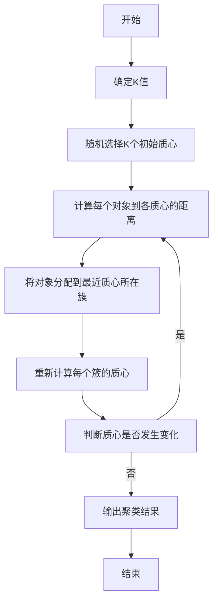

# 使用K-Means对地理信息数据进行聚类

## 1.背景介绍

随着地理信息系统(GIS)和位置服务的快速发展,地理空间数据的采集和积累也呈现出爆炸式增长。如何从这些海量的地理数据中发现有价值的信息和知识,成为当前地理信息科学研究的一个重要课题。聚类分析作为一种无监督学习的数据挖掘技术,可以自动将数据对象划分为多个类别或簇,使得同一簇内的对象相似度较高,而不同簇之间的对象相似度较低。K-Means算法是最经典和最广泛使用的聚类算法之一,具有计算简单、高效快速的特点,非常适合对大规模数据集进行聚类分析。

## 2.核心概念与联系

### 2.1 K-Means聚类算法

K-Means聚类算法的核心思想是通过迭代的方式将数据对象划分为K个簇,使得每个数据对象都属于离它最近的簇的均值。算法的目标是最小化所有对象到其所属簇均值的平方距离之和,即:

$$J = \sum_{i=1}^{K}\sum_{x \in C_i}||x - \mu_i||^2$$

其中,$C_i$表示第i个簇,$\mu_i$表示第i个簇的均值向量。

算法的主要步骤如下:

1. 随机选择K个初始质心
2. 将每个数据对象分配到最近的质心所对应的簇
3. 重新计算每个簇的质心
4. 重复步骤2和3,直到质心不再发生变化

### 2.2 地理信息数据

地理信息数据是描述地理实体的位置、属性和相互关系的数据集合。常见的地理信息数据包括:

- 点数据:如兴趣点(POI)、地理坐标等
- 线数据:如道路、河流等
- 面数据:如行政区划、土地利用等

这些数据通常以矢量或栅格的形式存储,可以用于制作地图、空间分析和决策支持等。

### 2.3 聚类在地理信息数据分析中的应用

将K-Means聚类算法应用于地理信息数据分析,可以发现数据中的空间模式和规律,为相关领域的研究和应用提供有价值的支持,主要应用包括:

- 城市规划:发现城市功能区划分
- 交通运输:识别交通流量热点区域 
- 环境监测:发现污染源聚集区域
- 商业决策:确定商业网点的最佳布局
- 公共安全:识别犯罪活动的高发区域

## 3.核心算法原理具体操作步骤

K-Means聚类算法的具体操作步骤如下:



1. **确定K值**

   K-Means算法需要预先确定要分成的簇的数量K。K值的选择会直接影响聚类的效果,通常可以根据先验知识、聚类评价指标(如轮廓系数)或可视化方法(如肘部法则)来确定一个合适的K值。

2. **随机选择K个初始质心**

   从数据集中随机选择K个对象作为初始质心。

3. **计算每个对象到各质心的距离**

   计算每个数据对象到K个质心的距离,通常使用欧几里得距离:

   $$d(x,y) = \sqrt{\sum_{i=1}^{n}(x_i - y_i)^2}$$

   其中,$x$和$y$是$n$维空间中的两个点。

4. **将对象分配到最近质心所在簇**

   将每个数据对象分配到距离最近的质心所对应的簇。

5. **重新计算每个簇的质心**

   对于每一个簇,重新计算簇的质心,即簇中所有对象的均值向量:

   $$\mu_i = \frac{1}{|C_i|}\sum_{x \in C_i}x$$

6. **判断质心是否发生变化**

   比较新计算出的质心与上一次迭代的质心是否相同。如果相同,则算法收敛,输出聚类结果;否则,返回步骤3,继续迭代。

需要注意的是,K-Means算法对初始质心的选择比较敏感,不同的初始质心可能会导致收敛到不同的局部最优解。因此,通常需要多次运行算法,取最优解作为最终结果。

## 4.数学模型和公式详细讲解举例说明

### 4.1 距离度量

在K-Means算法中,需要计算数据对象与质心之间的距离。最常用的距离度量是欧几里得距离,它在$n$维空间中定义为:

$$d(x,y) = \sqrt{\sum_{i=1}^{n}(x_i - y_i)^2}$$

其中,$x$和$y$是$n$维空间中的两个点,$(x_1,x_2,...,x_n)$和$(y_1,y_2,...,y_n)$分别是它们的坐标。

对于地理信息数据,常用的距离度量还包括:

- 曼哈顿距离(城市街区距离):

  $$d(x,y) = \sum_{i=1}^{n}|x_i - y_i|$$

- 切比雄夫距离(最大分量距离):

  $$d(x,y) = \max_{1 \leq i \leq n}|x_i - y_i|$$

- 地理距离(考虑地球曲率):

  $$d(x,y) = r \cdot \arccos(\sin(\phi_x)\sin(\phi_y) + \cos(\phi_x)\cos(\phi_y)\cos(\lambda_x - \lambda_y))$$

  其中,$r$是地球半径,$\phi$是纬度,$\lambda$是经度。

不同的距离度量会影响聚类的结果,需要根据具体的应用场景选择合适的距离度量。

### 4.2 质心计算

在每次迭代中,需要重新计算每个簇的质心,即簇中所有对象的均值向量:

$$\mu_i = \frac{1}{|C_i|}\sum_{x \in C_i}x$$

其中,$C_i$是第$i$个簇,包含$|C_i|$个数据对象。

对于地理信息数据,质心的计算需要考虑坐标的特殊性。例如,对于经纬度坐标,不能直接计算平均值,需要使用球面平均算法:

$$\begin{aligned}
\overline{\phi} &= \tan^{-1}\left(\frac{\sum_{i=1}^{n}\sin(\phi_i)\cos(\lambda_i)}{\sum_{i=1}^{n}\cos(\phi_i)}\right) \\
\overline{\lambda} &= \tan^{-1}\left(\frac{\sum_{i=1}^{n}\sin(\lambda_i)\cos(\phi_i)}{\sum_{i=1}^{n}\cos(\phi_i)\cos(\lambda_i)}\right)
\end{aligned}$$

其中,$\overline{\phi}$和$\overline{\lambda}$分别是簇的平均纬度和经度。

### 4.3 聚类评价指标

为了评估聚类结果的质量,常用的指标包括:

1. **簇内平方和(WSS):**

   $$\text{WSS} = \sum_{i=1}^{K}\sum_{x \in C_i}||x - \mu_i||^2$$

   WSS值越小,说明簇内的数据对象越紧密。

2. **轮廓系数(Silhouette Coefficient):**

   $$s(i) = \frac{b(i) - a(i)}{\max\{a(i), b(i)\}}$$

   其中,$a(i)$是对象$i$与同簇其他对象的平均距离,$b(i)$是对象$i$与最近簇的平均距离。$s(i)$的取值范围是$[-1,1]$,值越大,说明聚类效果越好。

3. **Calinski-Harabasz指数:**

   $$s(k) = \frac{\text{Trace}B/(k-1)}{\text{Trace}W/(n-k)}$$

   其中,$B$是簇间散布矩阵,$W$是簇内散布矩阵,$n$是数据对象的总数,$k$是簇的数量。$s(k)$值越大,说明聚类效果越好。

通过这些评价指标,可以比较不同$K$值下的聚类结果,选择最优的$K$值。

### 4.4 算法优化

标准的K-Means算法存在一些缺陷,如对初始质心的选择敏感、容易陷入局部最优等。因此,研究人员提出了多种优化算法,如下:

1. **K-Means++:**初始质心的选择策略,能够产生更好的初始簇划分。
2. **小批量K-Means:**每次迭代只使用一部分数据进行质心更新,提高了算法的效率。
3. **模糊C-Means:**允许数据对象以不同的隶属度属于多个簇,适用于模糊数据。
4. **核K-Means:**将数据映射到高维特征空间,以发现非线性模式。

这些优化算法在不同的应用场景下具有一定的优势,需要根据具体问题选择合适的算法。

## 5.项目实践:代码实例和详细解释说明

以下是使用Python中的scikit-learn库实现K-Means聚类的示例代码:

```python
import numpy as np
from sklearn.cluster import KMeans
from sklearn.datasets import make_blobs

# 生成模拟数据
X, y = make_blobs(n_samples=1000, centers=4, n_features=2, random_state=0)

# 创建K-Means模型
kmeans = KMeans(n_clusters=4, random_state=0)

# 训练模型
kmeans.fit(X)

# 获取聚类标签
labels = kmeans.labels_

# 获取质心坐标
centroids = kmeans.cluster_centers_

# 可视化结果
import matplotlib.pyplot as plt
plt.scatter(X[:, 0], X[:, 1], c=labels, s=50, cmap='viridis')
plt.scatter(centroids[:, 0], centroids[:, 1], c='red', s=100, marker='x')
plt.show()
```

代码解释:

1. 导入所需的库和模块。
2. 使用`make_blobs`函数生成模拟的二维数据集,包含4个簇。
3. 创建`KMeans`模型实例,设置簇的数量为4。
4. 使用`fit`方法训练模型,将数据对象划分为4个簇。
5. 获取每个数据对象的聚类标签。
6. 获取每个簇的质心坐标。
7. 使用`matplotlib`库可视化聚类结果,不同颜色表示不同的簇,红色十字标记表示质心位置。

对于地理信息数据,可以将经纬度坐标作为特征输入到K-Means模型中进行聚类。例如,对于一组POI数据,可以按如下方式进行聚类:

```python
import pandas as pd
from sklearn.cluster import KMeans

# 读取POI数据
poi_data = pd.read_csv('poi_data.csv')

# 提取经纬度坐标作为特征
X = poi_data[['longitude', 'latitude']].values

# 创建K-Means模型
kmeans = KMeans(n_clusters=10)

# 训练模型
kmeans.fit(X)

# 获取聚类标签
labels = kmeans.labels_

# 将聚类标签添加到原始数据
poi_data['cluster'] = labels

# 可视化结果
import folium
map = folium.Map(location=[X.mean()[1], X.mean()[0]], zoom_start=12)
for cluster, group in poi_data.groupby('cluster'):
    folium.FeatureGroup(name=f'Cluster {cluster}').add_child(
        folium.GeoJson(
            group[['longitude', 'latitude']].dropna().to_json()
        )
    ).add_to(map)
map
```

代码解释:

1. 读取POI数据,包含经纬度坐标和其他属性信息。
2. 提取经纬度坐标作为特征向量。
3. 创建K-Means模型实例,设置簇的数量为10。
4. 使用`fit`方法训练模型,将POI数据划分为10个簇。
5. 获取每个POI的聚类标签。
6. 将聚类标签添加到原始数据中。
7. 使用`folium`库在地图上可视化聚类结果,每个簇使用不同的颜色表示。