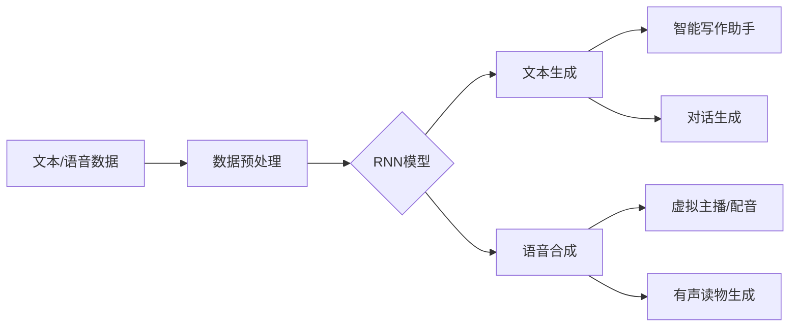

# 使用RNN生成逼真的文本和语音

## 1. 背景介绍
### 1.1 自然语言处理的重要性
### 1.2 文本和语音生成在NLP中的应用
### 1.3 RNN在文本和语音生成中的优势

## 2. 核心概念与联系
### 2.1 RNN的基本原理
#### 2.1.1 RNN的网络结构
#### 2.1.2 RNN的前向传播和反向传播
#### 2.1.3 RNN的变体(LSTM, GRU等)
### 2.2 文本生成的基本思路
#### 2.2.1 语言模型的概念
#### 2.2.2 基于RNN的文本生成流程
### 2.3 语音生成的基本思路 
#### 2.3.1 声学模型和声码器的概念
#### 2.3.2 基于RNN的语音合成流程

## 3. 核心算法原理具体操作步骤
### 3.1 基于RNN的文本生成算法
#### 3.1.1 训练阶段的具体步骤
#### 3.1.2 生成阶段的具体步骤
#### 3.1.3 Beam Search算法改进生成质量
### 3.2 基于RNN的语音合成算法
#### 3.2.1 训练声学模型的具体步骤 
#### 3.2.2 训练声码器的具体步骤
#### 3.2.3 语音合成阶段的具体步骤

## 4. 数学模型和公式详细讲解举例说明
### 4.1 RNN前向传播的数学推导
### 4.2 RNN训练中BPTT算法的数学推导
### 4.3 Beam Search算法的数学描述
### 4.4 语音合成中Griffin-Lim算法的数学原理

## 5. 项目实践：代码实例和详细解释说明
### 5.1 使用PyTorch构建Char RNN文本生成模型
#### 5.1.1 数据预处理
#### 5.1.2 构建RNN网络
#### 5.1.3 模型训练
#### 5.1.4 文本生成
### 5.2 使用TensorFlow构建Tacotron语音合成模型
#### 5.2.1 数据准备  
#### 5.2.2 搭建Tacotron模型
#### 5.2.3 训练声学模型和声码器
#### 5.2.4 语音合成

## 6. 实际应用场景
### 6.1 智能写作助手
### 6.2 虚拟主播/配音
### 6.3 有声读物自动生成
### 6.4 视频游戏中的对话生成

## 7. 工具和资源推荐 
### 7.1 常用的深度学习框架(TensorFlow, PyTorch)
### 7.2 预训练的语言模型(GPT, BERT等)
### 7.3 语音合成工具包(ESPnet, Merlin等)
### 7.4 相关学习资源(教程、论文、开源项目等)

## 8. 总结：未来发展趋势与挑战
### 8.1 基于Transformer的预训练语言模型的发展
### 8.2 多模态语音合成技术的进展
### 8.3 个性化定制语音的需求增长
### 8.4 训练数据和计算资源的瓶颈

## 9. 附录：常见问题与解答
### 9.1 RNN与其他生成模型(如GAN)的比较
### 9.2 如何提高生成文本的连贯性和多样性 
### 9.3 如何提升语音合成的自然度和清晰度
### 9.4 目前SOTA的文本生成和语音合成模型盘点

近年来,随着深度学习技术的飞速发展,自然语言处理(NLP)领域取得了令人瞩目的进展。作为NLP的两大核心任务,文本生成和语音合成受到了学界和业界的广泛关注。传统的文本生成和语音合成方法通常基于规则或统计模型,难以生成出接近人类水平的自然语言。而随着循环神经网络(RNN)的兴起,我们有了一种强大的工具来建模和生成序列数据。RNN善于捕捉序列数据中的长距离依赖关系,非常适合用于文本和语音等时序数据的建模生成。

RNN由于其独特的网络结构,能够很好地建模语言中的上下文信息。相比前馈神经网络,RNN引入了隐藏状态来记忆之前时刻的信息,使得网络具备了处理序列数据的能力。RNN按时间步展开后可以看作一个多层的前馈网络,每一时刻的隐藏状态都受到前一时刻隐藏状态的影响。这种结构赋予了RNN捕捉数据中长距离依赖关系的能力,使其能够生成连贯、流畅的长文本序列。同时RNN也是一种灵活的网络架构,可以根据任务需求设计不同的变体,如LSTM和GRU等,进一步增强了RNN处理长序列的能力。

基于RNN的文本生成的核心是语言模型。语言模型用来计算一个句子的概率,即序列中每个词出现的概率。将语料库中的文本数据喂给RNN进行训练,网络可以学习到词与词之间的依赖关系,从而对文本的概率分布进行建模。生成文本时,我们只需要根据语言模型的概率输出分布,用采样或Beam Search的方式来选择最可能的下一个词,不断迭代直到生成完整的句子。利用RNN强大的建模能力,我们可以训练出效果出众的文本生成模型,用于智能写作助手、对话生成、文章摘要等应用场景。

而在语音合成任务中,RNN则被用来建模语音信号的时序特征。传统的语音合成管道包括声学模型和声码器两大部分。声学模型将输入的文本转换为声学特征序列,声码器再将声学特征转换为语音波形。RNN可以很好地建模语音的韵律、基频等韵律特征。以Tacotron为代表的端到端语音合成模型,使用了编码器-解码器的架构,编码器将输入的文本序列编码为固定长度的特征向量,解码器则是一个RNN网络,根据特征向量解码生成梅尔频谱图。再通过声码器将频谱图转换为语音波形即可获得合成语音。基于RNN的语音合成模型简化了传统语音合成管道,实现了真正的端到端合成。合成的语音更加自然流畅,在虚拟主播、有声读物等场景得到广泛应用。

接下来,我们将详细介绍RNN在文本和语音生成中的原理和实现。首先,我们从数学角度推导RNN的前向计算和反向传播过程,并介绍几种常见的RNN变体及其特点。然后,我们以Char RNN和Tacotron为例,分别演示基于RNN的文本生成和语音合成的代码实现。通过实践环节的学习,读者可以全面掌握RNN的工作原理,并学会搭建自己的文本和语音生成模型。我们还总结了一些在实际应用中的经验和技巧,如数据预处理、超参数调优等,帮助读者提高模型性能。

展望未来,以Transformer为代表的预训练语言模型正在不断刷新NLP任务的性能上限。GPT、BERT等模型在海量语料上进行预训练,可以学习到语言的通用表示。在此基础上微调模型,可以在下游任务上取得优异的表现。同时,语音合成技术也在向多模态的方向发展。通过引入面部特征、情感等其他模态的信息,可以合成出更加生动、富有表现力的语音。另一方面,个性化定制语音的需求也在不断增长。如何利用少量数据快速适配用户的个性化语音,是语音合成领域一个新的研究热点。当然,RNN的训练对语料和算力要求较高,如何高效地利用数据和计算资源,也是工业落地需要攻克的难题。

总的来说,RNN为文本和语音生成任务提供了一种简单灵活的建模方案。RNN善于捕捉序列数据的动态特征,通过端到端的建模,可以生成出接近人类水平的自然语言。随着算力的进一步提升和算法的演进,相信RNN还将在更多场景发挥其威力,为人机交互带来更多惊喜。作为NLP研究者和从业者,我们也应该紧跟时代的步伐,把握技术发展的脉搏,不断探索RNN技术的边界,让机器生成的语言更加智能、更加自然。

作者：禅与计算机程序设计艺术 / Zen and the Art of Computer Programming