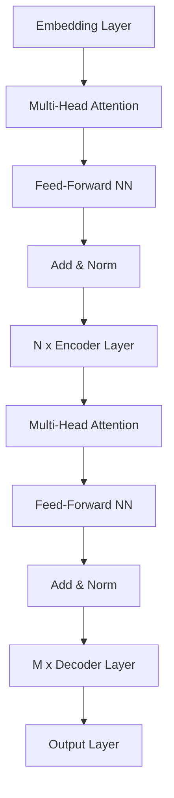

# 使用Transformers解决小样本学习问题

## 1.背景介绍

### 1.1 小样本学习的挑战

在现实世界中,我们经常面临数据稀缺的情况,尤其是在一些专业领域,例如医疗诊断、化学分子分析等,获取大量高质量的标注数据是一个巨大的挑战。传统的机器学习算法需要大量的训练数据才能获得良好的性能,但在小样本数据场景下,这些算法往往表现不佳。

小样本学习(Few-Shot Learning)旨在利用少量示例数据训练出泛化性能良好的模型,以解决数据稀缺问题。这对于降低数据采集和标注的成本,提高模型在新领域的适用性至关重要。

### 1.2 Transformers在小样本学习中的作用

Transformers是一种基于自注意力机制的神经网络架构,最初被用于自然语言处理任务,例如机器翻译、文本生成等。近年来,Transformers也被广泛应用于计算机视觉、语音识别等其他领域。

Transformers具有强大的表示学习能力,能够从大规模无标注数据中学习到丰富的先验知识。通过预训练和微调的范式,Transformers可以在小样本数据上快速收敛,显著提高模型的泛化性能。

本文将深入探讨如何利用Transformers解决小样本学习问题,包括相关核心概念、算法原理、实践案例等,为读者提供全面的理解和实用指导。

## 2.核心概念与联系

### 2.1 小样本学习的形式化定义

小样本学习可以形式化定义为:给定一个支持集(Support Set) $\mathcal{S} = \{(x_i, y_i)\}_{i=1}^{N}$,其中 $x_i$ 是输入样本, $y_i$ 是对应的标签,目标是学习一个模型 $f_{\theta}$,使其能够在查询集(Query Set) $\mathcal{Q} = \{x_j\}_{j=1}^{M}$ 上进行精确的预测,即 $\hat{y}_j = f_{\theta}(x_j)$。支持集和查询集来自同一个任务,但查询集的标签是未知的。

根据支持集中样本的数量,小样本学习可以进一步划分为:

- 一次学习(One-Shot Learning): 支持集中只有一个样本,即 $N=1$。
- 少次学习(Few-Shot Learning): 支持集中有少量样本,通常 $N \leq 20$。

### 2.2 Transformers在小样本学习中的作用

Transformers 在小样本学习中发挥着关键作用,主要体现在以下两个方面:

1. **预训练模型**:通过在大规模无标注数据(如网页数据、书籍等)上预训练,Transformers 可以学习到丰富的先验知识,捕获输入数据的语义和结构信息。这种通用的表示能力为下游任务(包括小样本学习)提供了强大的基础。

2. **微调策略**:在小样本数据上,我们可以基于预训练的 Transformers 模型,通过微调的方式快速适应新的任务。由于预训练模型已经学习到了通用的表示,只需要对最后几层进行微调,就可以在小样本数据上取得良好的性能。

Transformers 预训练和微调的范式为小样本学习提供了一种高效的解决方案,显著降低了数据需求,提高了模型的泛化能力。

## 3.核心算法原理具体操作步骤 

### 3.1 Transformers 模型架构

Transformers 模型的核心是多头自注意力(Multi-Head Attention)和前馈神经网络(Feed-Forward Neural Network)。自注意力机制允许模型捕获输入序列中任意两个位置之间的关系,而前馈神经网络则用于对每个位置的表示进行非线性转换。

Transformers 模型通常由编码器(Encoder)和解码器(Decoder)两部分组成,具体架构如下所示:



其中,编码器用于捕获输入序列的表示,解码器则基于编码器的输出生成目标序列。在小样本学习中,我们主要关注编码器部分,因为它可以为下游任务提供通用的表示。

### 3.2 预训练和微调

Transformers 模型通常采用预训练和微调的范式来解决小样本学习问题。具体步骤如下:

1. **预训练**:在大规模无标注数据(如网页数据、书籍等)上训练 Transformers 模型,目标是学习通用的表示能力。常见的预训练目标包括掩码语言模型(Masked Language Modeling)和下一句预测(Next Sentence Prediction)等。

2. **微调**:在小样本数据上,基于预训练模型进行微调。具体操作是:
   - 将预训练模型的参数作为初始化参数
   - 在小样本数据上进行几个epoch的训练,更新模型参数
   - 对于每个新的任务,只需要微调最后几层,保持底层参数不变

微调过程中,由于预训练模型已经学习到了丰富的先验知识,只需要对少量参数进行更新,就可以快速适应新的任务,从而提高模型在小样本数据上的性能。

### 3.3 示例说明

以文本分类任务为例,具体操作步骤如下:

1. 选择一个适合的预训练 Transformers 模型,如 BERT、RoBERTa 等。
2. 将文本输入转换为模型可接受的格式,例如对于 BERT,需要添加特殊标记 [CLS] 和 [SEP]。
3. 将预训练模型的输出(通常是 [CLS] 标记对应的向量)传递给一个分类头(Classification Head),例如一个线性层和 Softmax 函数。
4. 在小样本数据上进行微调,更新模型参数。
5. 在测试集上评估模型性能。

通过预训练和微调的方式,Transformers 模型可以在小样本数据上取得良好的性能,显著优于从头训练的模型。

## 4.数学模型和公式详细讲解举例说明

### 4.1 自注意力机制

自注意力是 Transformers 模型的核心机制,它允许模型捕获输入序列中任意两个位置之间的关系。给定一个输入序列 $X = (x_1, x_2, \dots, x_n)$,自注意力机制计算每个位置 $i$ 的表示 $z_i$ 如下:

$$z_i = \sum_{j=1}^{n} \alpha_{ij}(x_j W^V)$$

其中 $W^V$ 是一个可学习的值向量(Value Vector),用于线性投影输入向量 $x_j$。注意力权重 $\alpha_{ij}$ 反映了位置 $i$ 对位置 $j$ 的关注程度,计算方式如下:

$$\alpha_{ij} = \frac{e^{s_{ij}}}{\sum_{k=1}^{n}e^{s_{ik}}}$$

$$s_{ij} = (x_iW^Q)(x_jW^K)^T$$

这里 $W^Q$ 和 $W^K$ 分别是查询向量(Query Vector)和键向量(Key Vector)的线性投影矩阵。注意力权重 $\alpha_{ij}$ 通过 Softmax 函数进行归一化,使得每个位置 $i$ 对所有位置 $j$ 的注意力权重之和为 1。

多头自注意力(Multi-Head Attention)是将多个注意力头(Attention Head)的结果进行拼接,从而捕获不同的注意力模式:

$$\text{MultiHead}(X) = \text{Concat}(z_1, z_2, \dots, z_h)W^O$$

其中 $h$ 是注意力头的数量, $W^O$ 是一个可学习的线性投影矩阵。

自注意力机制赋予了 Transformers 模型强大的表示学习能力,能够有效捕获输入序列中的长程依赖关系,这对于小样本学习任务至关重要。

### 4.2 掩码语言模型

掩码语言模型(Masked Language Modeling, MLM)是一种常用的 Transformers 预训练目标。在 MLM 中,我们随机掩码输入序列中的一些标记,模型的目标是基于上下文预测这些被掩码的标记。

具体来说,给定一个输入序列 $X = (x_1, x_2, \dots, x_n)$,我们随机选择一些位置进行掩码,得到掩码后的序列 $\hat{X} = (\hat{x}_1, \hat{x}_2, \dots, \hat{x}_n)$,其中 $\hat{x}_i$ 可能是原始标记 $x_i$,也可能是特殊的掩码标记 [MASK]。模型的目标是最大化掩码位置的条件概率:

$$\mathcal{L}_{\text{MLM}} = -\mathbb{E}_{X}\left[\sum_{i=1}^{n}\mathbb{1}_{\hat{x}_i = \text{[MASK]}}\log P(x_i|\hat{X})\right]$$

其中 $P(x_i|\hat{X})$ 是模型预测的第 $i$ 个位置为 $x_i$ 的条件概率。通过最小化 MLM 损失函数,模型可以学习到捕获上下文信息的能力,从而获得强大的表示学习能力。

MLM 是一种有监督的预训练目标,通过大规模无标注数据的预训练,Transformers 模型可以学习到丰富的先验知识,为下游任务(包括小样本学习)提供强大的基础。

## 5.项目实践:代码实例和详细解释说明

在本节中,我们将通过一个实际案例,演示如何使用 Transformers 解决小样本学习问题。我们将基于 HuggingFace 的 Transformers 库,在 MNIST 数据集上训练一个图像分类模型。

### 5.1 数据准备

首先,我们需要准备小样本数据集。为了模拟小样本学习场景,我们从 MNIST 数据集中随机选取少量样本作为支持集,剩余部分作为查询集。

```python
from torchvision.datasets import MNIST
from torch.utils.data import random_split

# 加载 MNIST 数据集
dataset = MNIST(root='data/', train=True, download=True)

# 划分支持集和查询集
n_shot = 5  # 每个类别选取 5 个样本作为支持集
n_way = 5   # 选取 5 个类别
n_query = 20  # 每个类别选取 20 个样本作为查询集

# 构建支持集和查询集
support_set, query_set = build_few_shot_dataset(dataset, n_shot, n_way, n_query)
```

### 5.2 模型定义

接下来,我们定义 Transformers 模型。我们将使用 ViT (Vision Transformer) 作为基础模型,并在其之上添加一个分类头。

```python
from transformers import ViTFeatureExtractor, ViTForImageClassification
import torch.nn as nn

# 加载预训练的 ViT 模型
feature_extractor = ViTFeatureExtractor.from_pretrained('google/vit-base-patch16-224')
model = ViTForImageClassification.from_pretrained('google/vit-base-patch16-224')

# 替换分类头
model.classifier = nn.Linear(model.config.hidden_size, n_way)
```

### 5.3 微调

现在,我们可以在支持集上进行微调。我们将使用原型网络(Prototypical Network)作为元学习算法,它通过计算支持集样本的平均嵌入来构建每个类别的原型,然后将查询样本与这些原型进行比较,从而进行分类。

```python
from transformers import ViTFeatureExtractor, ViTForImageClassification
import torch.nn.functional as F

def prototypical_loss(model, support, query, n_way):
    # 提取支持集和查询集的特征
    support_features = model(pixel_values=support[0]).last_hidden_state.mean(dim=1)
    query_features = model(pixel_values=query[0]).last_hidden_state.mean(dim=1)
    
    # 计算每个类别的原型
    prototypes = support_features.reshape(n_way, n_shot, -1).mean(dim=1)
    
    # 计算查询样本与原型的距离
    query_distances = -F.pairwise_distance(query_features, prototypes, eps=1e