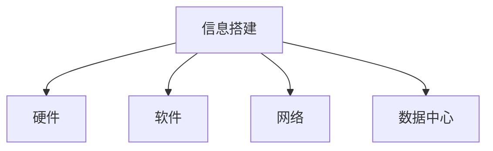
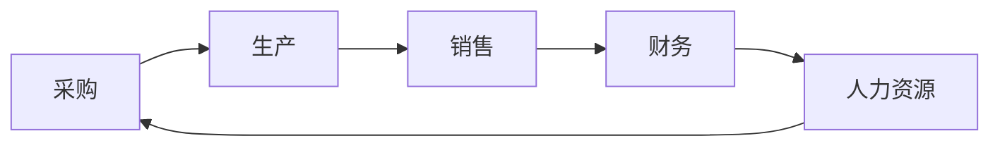
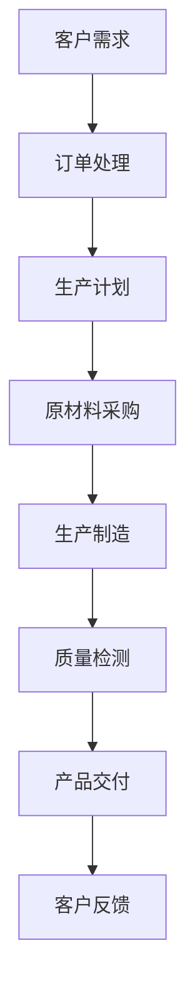
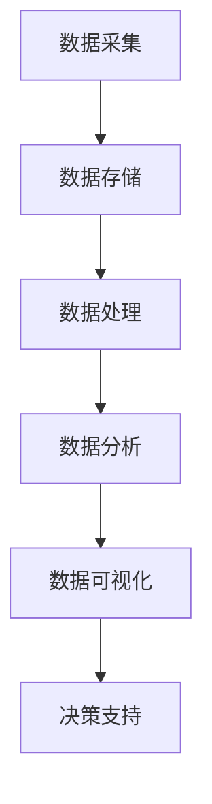
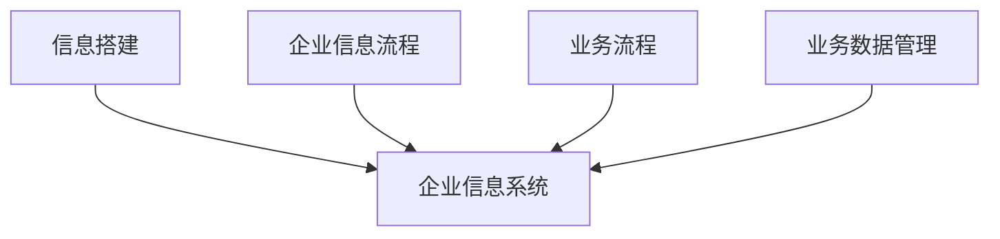
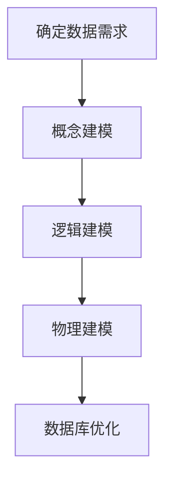
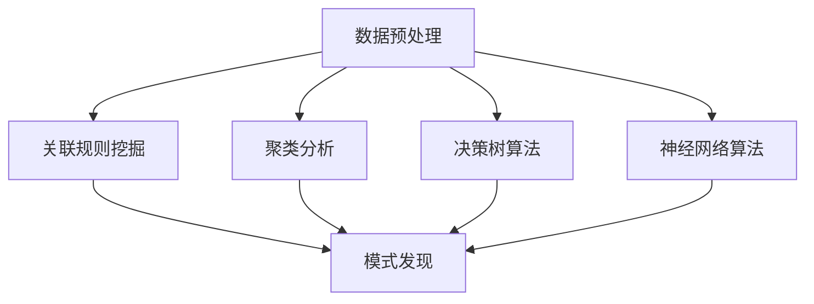
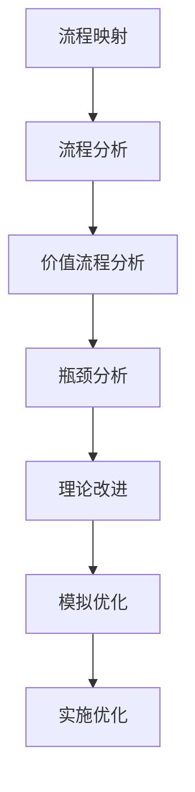
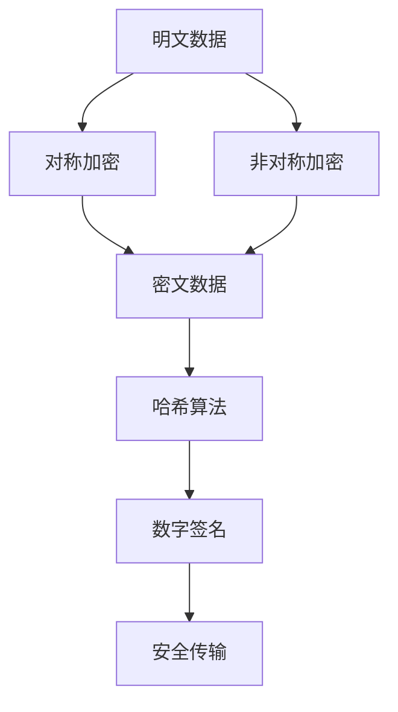
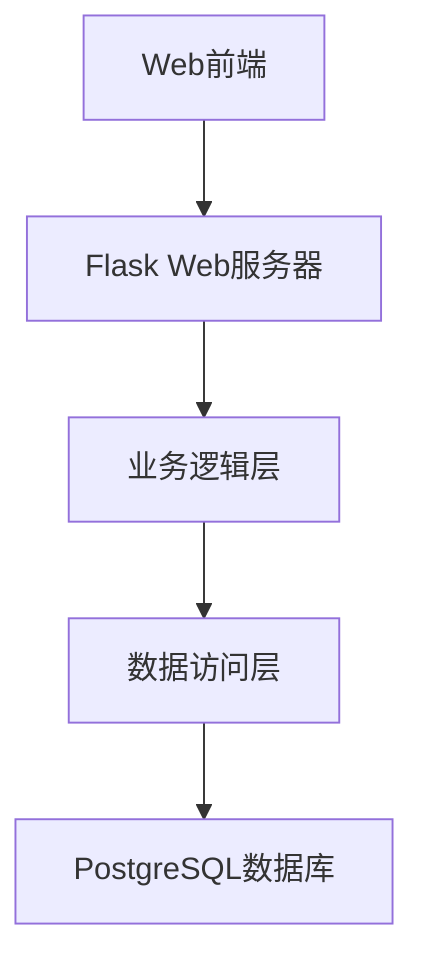

# 信息搭建、企业信息流程、业务流程、业务数据管理系统搭建

## 1.背景介绍

### 1.1 信息化时代的到来

在当今时代,信息技术的快速发展正在推动着各行各业的数字化转型。企业不再仅仅是一个生产或服务的单位,更是一个复杂的信息系统,需要高效地管理内部的信息流程、业务流程以及海量的业务数据。因此,构建一个完善的信息搭建、企业信息流程、业务流程和业务数据管理系统,对于企业的发展至关重要。

### 1.2 信息系统的重要性

信息系统是企业运营的核心支柱,它涵盖了企业内部的各个部门和流程,包括财务、人力资源、销售、供应链等。一个高效的信息系统可以帮助企业实现以下目标:

1. 提高运营效率
2. 优化决策过程
3. 改善客户体验
4. 降低运营成本
5. 增强竞争优势

### 1.3 系统搭建的挑战

然而,搭建一个完整的信息系统并非一蹴而就。企业需要面临诸多挑战,如:

1. 数据整合和管理
2. 系统集成和兼容性
3. 安全性和合规性
4. 用户采纳和培训
5. 持续优化和升级

## 2.核心概念与联系

### 2.1 信息搭建

信息搭建是指构建企业内部的信息基础设施,包括硬件、软件、网络和数据中心等。这是整个信息系统的基石,确保了信息的高效传输和存储。



### 2.2 企业信息流程

企业信息流程是指企业内部各个部门和职能之间的信息交换和传递过程。它确保了企业内部信息的高效流动,支持了业务决策和运营。



### 2.3 业务流程

业务流程是指企业为实现特定业务目标而设计的一系列有序活动。它定义了企业内部各个部门之间的职责分工和协作方式,确保了业务的高效运转。



### 2.4 业务数据管理

业务数据管理是指对企业内部产生的各种业务数据进行收集、存储、处理和分析的过程。它为企业决策提供了数据支持,并且有助于发现业务中的潜在问题和机遇。



### 2.5 系统集成

系统集成是将上述各个部分有机地结合在一起,形成一个完整的企业信息系统。它确保了各个子系统之间的无缝衔接和高效协作,从而实现企业的整体目标。



## 3.核心算法原理具体操作步骤

在搭建企业信息系统的过程中,需要应用多种算法和技术原理,以确保系统的高效性、可靠性和安全性。以下是一些核心算法原理的具体操作步骤:

### 3.1 数据库设计

数据库是企业信息系统的核心组成部分,用于存储和管理各种业务数据。设计一个高效的数据库需要遵循以下步骤:

1. 确定数据需求
2. 进行概念建模(ER图)
3. 进行逻辑建模(关系模型)
4. 进行物理建模(数据库设计)
5. 数据库优化



### 3.2 数据挖掘算法

数据挖掘算法用于从海量业务数据中发现隐藏的模式和规律,为企业决策提供支持。常用的数据挖掘算法包括:

1. 关联规则挖掘(Apriori算法)
2. 聚类分析(K-Means算法)
3. 决策树算法(ID3、C4.5算法)
4. 神经网络算法(BP算法)



### 3.3 业务流程优化

业务流程优化旨在提高企业运营效率,减少浪费,提高客户满意度。常用的优化方法包括:

1. 流程映射和分析
2. 价值流程分析
3. 瓶颈分析
4. 理论改进和模拟



### 3.4 信息安全算法

信息安全是企业信息系统的基石,需要采用各种加密和认证算法来保护数据的机密性、完整性和可用性。常用的安全算法包括:

1. 对称加密算法(DES、AES)
2. 非对称加密算法(RSA)
3. 哈希算法(MD5、SHA)
4. 数字签名算法



## 4.数学模型和公式详细讲解举例说明

在企业信息系统的设计和优化过程中,需要应用多种数学模型和公式,以量化和分析各种因素,从而做出更好的决策。以下是一些常见的数学模型和公式:

### 4.1 线性规划模型

线性规划模型用于求解最优化问题,如生产计划、资源分配等。它的目标是在满足一系列约束条件的前提下,最大化或最小化一个线性目标函数。

目标函数:
$$\max\limits_{x} Z = c_1x_1 + c_2x_2 + \cdots + c_nx_n$$

约束条件:
$$\begin{align*}
a_{11}x_1 + a_{12}x_2 + \cdots + a_{1n}x_n &\leq b_1\\
a_{21}x_1 + a_{22}x_2 + \cdots + a_{2n}x_n &\leq b_2\\
&\vdots\\
a_{m1}x_1 + a_{m2}x_2 + \cdots + a_{mn}x_n &\leq b_m\\
x_1, x_2, \cdots, x_n &\geq 0
\end{align*}$$

其中,$c_i$是目标函数系数,$a_{ij}$是约束条件系数,$b_i$是约束条件常数项。

### 4.2 排队论模型

排队论模型用于分析和优化服务系统中的等待时间和队列长度,如银行柜员服务、呼叫中心等。它的核心是建立描述到达过程和服务过程的数学模型。

单服务台系统:
$$\begin{align*}
L_q &= \frac{\lambda^2}{μ(μ-λ)}\\
W_q &= \frac{\lambda}{μ(μ-λ)}\\
L &= L_q + \frac{\lambda}{μ}\\
W &= W_q + \frac{1}{μ}
\end{align*}$$

其中,$L_q$是队列长度,$W_q$是队列等待时间,$L$是系统长度,$W$是系统等待时间,$\lambda$是到达率,$μ$是服务率。

### 4.3 马尔可夫链模型

马尔可夫链模型用于描述随机过程,如库存管理、设备维修等。它的核心是建立状态转移概率矩阵,并计算稳态概率。

$$P = \begin{bmatrix}
p_{11} & p_{12} & \cdots & p_{1n}\\
p_{21} & p_{22} & \cdots & p_{2n}\\
\vdots & \vdots & \ddots & \vdots\\
p_{n1} & p_{n2} & \cdots & p_{nn}
\end{bmatrix}$$

其中,$p_{ij}$表示从状态$i$转移到状态$j$的概率。

稳态概率$\pi$满足:
$$\pi P = \pi, \sum\limits_{i=1}^n \pi_i = 1$$

### 4.4 网络流模型

网络流模型用于描述物流、交通等网络系统中的流量分配问题。它的核心是建立网络拓扑结构,并求解最大流量或最小费用流。

$$\begin{align*}
\max\limits_{x} &\sum\limits_{j \in V} x_{sj}\\
\text{s.t. } &\sum\limits_{j \in V} x_{ij} - \sum\limits_{j \in V} x_{ji} = 0, \quad \forall i \in V \setminus \{s, t\}\\
&0 \leq x_{ij} \leq c_{ij}, \quad \forall (i, j) \in E
\end{align*}$$

其中,$x_{ij}$表示从节点$i$到节点$j$的流量,$c_{ij}$表示边$(i, j)$的容量,$s$是源点,$t$是汇点。

## 5.项目实践:代码实例和详细解释说明

为了更好地理解和应用上述算法和模型,我们将通过一个实际项目案例来进行实践和说明。该项目是一个基于Python的企业供应链管理系统。

### 5.1 系统架构



该系统采用了经典的三层架构,分别是:

1. Web前端:基于HTML、CSS和JavaScript,提供用户界面。
2. Flask Web服务器:处理HTTP请求,调用业务逻辑层。
3. 业务逻辑层:实现核心业务功能,如订单管理、库存管理等。
4. 数据访问层:与数据库进行交互,执行CRUD操作。
5. PostgreSQL数据库:存储系统数据。

### 5.2 订单管理模块

订单管理模块是系统的核心部分,它实现了以下功能:

1. 创建新订单
2. 查看订单详情
3. 更新订单状态
4. 取消订单

以下是创建新订单的Python代码示例:

```python
from flask import Blueprint, request, jsonify
from models import Order, Product

order_bp = Blueprint('order', __name__, url_prefix='/orders')

@order_bp.route('/', methods=['POST'])
def create_order():
    data = request.get_json()
    customer_id = data.get('customer_id')
    products = data.get('products')

    order = Order(customer_id=customer_id)
    order.save()

    for product_id, quantity in products.items():
        product = Product.get(id=product_id)
        order.add_product(product, quantity)

    return jsonify({'order_id': order.id})
```

在这个示例中,我们首先从请求体中获取客户ID和产品列表。然后,我们创建一个新的`Order`对象,并将其保存到数据库中。接下来,我们遍历产品列表,为每个产品创建一个`OrderItem`对象,并将其与订单关联。最后,我们返回新创建的订单ID。

### 5.3 库存管理模块

库存管理模块负责跟踪和管理产品库存水平。它实现了以下功能:

1. 查看库存水平
2. 调整库存水平
3. 设置库存预警阈值
4. 生成库存报告

以下是查看库存水平