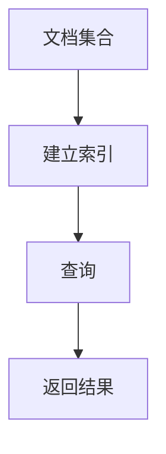

## 1.背景介绍

在如今的信息爆炸时代，海量的数据中隐藏着无数的知识和信息。然而，如何从这些海量的数据中准确、快速地找到我们需要的信息呢？全文检索技术应运而生。

全文检索是一种基于文本的信息检索技术，它可以在大规模文本集合中快速、准确地找到包含指定关键词的文档。全文检索技术广泛应用于搜索引擎、知识库、电子商务等多个领域。

## 2.核心概念与联系

全文检索主要涉及以下几个核心概念：

- **文档(Document)**：文档是全文检索的基本单位，可以是一篇文章、一本书、一个网页等。
- **索引(Index)**：索引是全文检索的核心，它是关键词和文档之间的映射关系。通过索引，我们可以快速找到包含指定关键词的文档。
- **查询(Query)**：查询是用户想要从文档集合中检索的关键词或短语。

全文检索的基本流程如下：



## 3.核心算法原理具体操作步骤

全文检索的核心是建立索引和查询。下面我们详细介绍这两个步骤的操作方法。

### 3.1 建立索引

建立索引的步骤主要包括文档处理、分词、创建倒排索引三个步骤。

#### 3.1.1 文档处理

文档处理主要包括去除标点符号、转换为小写、去除停用词等操作。这些操作可以减少索引的大小，提高查询的效率。

#### 3.1.2 分词

分词是将文档划分为一系列的词项。分词的方法有很多，常见的有基于词典的分词、基于统计的分词等。

#### 3.1.3 创建倒排索引

倒排索引是全文检索的核心，它是关键词和文档之间的映射关系。倒排索引的创建过程如下：

1. 为每个词项创建一个索引项。
2. 将包含该词项的文档ID添加到索引项的文档列表中。
3. 对每个索引项的文档列表进行排序。

### 3.2 查询

查询的步骤主要包括解析查询、检索文档、排序三个步骤。

#### 3.2.1 解析查询

解析查询是将用户输入的查询转换为一系列的词项。

#### 3.2.2 检索文档

检索文档是根据解析后的查询，从倒排索引中找到包含所有查询词项的文档。

#### 3.2.3 排序

排序是根据一定的评分函数，对检索到的文档进行排序，返回最相关的文档。

## 4.数学模型和公式详细讲解举例说明

全文检索中常用的数学模型有布尔模型、向量空间模型、概率模型等。这里我们以向量空间模型为例，详细介绍全文检索的数学模型和公式。

向量空间模型是一种基于词频的模型，它将文档和查询表示为高维空间中的向量。向量的每一维对应一个词项，维度的值对应该词项在文档或查询中的权重。

向量空间模型的核心是计算文档向量和查询向量的相似度。常用的相似度计算方法有余弦相似度、欧氏距离等。这里我们以余弦相似度为例，详细讲解相似度的计算方法。

假设文档向量为 $d = (d_1, d_2, ..., d_n)$，查询向量为 $q = (q_1, q_2, ..., q_n)$，则它们的余弦相似度可以通过下式计算：

$$
sim(d, q) = \frac{\sum_{i=1}^{n}d_i*q_i}{\sqrt{\sum_{i=1}^{n}d_i^2} * \sqrt{\sum_{i=1}^{n}q_i^2}}
$$

其中，$d_i$ 和 $q_i$ 分别是文档和查询在第 $i$ 个词项上的权重。

## 5.项目实践：代码实例和详细解释说明

下面我们以Python的全文检索库Whoosh为例，介绍如何在实际项目中实现全文检索。

```python
from whoosh.index import create_in
from whoosh.fields import *
from whoosh.qparser import QueryParser

# 定义索引结构
schema = Schema(title=TEXT(stored=True), content=TEXT)

# 创建索引
index = create_in("indexdir", schema)

# 添加文档到索引
writer = index.writer()
writer.add_document(title=u"First document", content=u"This is the first document.")
writer.add_document(title=u"Second document", content=u"This is the second document.")
writer.commit()

# 查询
parser = QueryParser("content", index.schema)
query = parser.parse("first")
results = index.searcher().search(query)

# 输出结果
for result in results:
    print(result["title"])
```

这段代码首先定义了索引的结构，然后创建了索引，并添加了两个文档到索引中。然后，我们对索引进行了查询，并输出了查询结果。

## 6.实际应用场景

全文检索技术广泛应用于搜索引擎、知识库、电子商务等多个领域。

- **搜索引擎**：搜索引擎是全文检索的最典型应用。用户输入查询，搜索引擎返回相关的网页。
- **知识库**：知识库中包含大量的文档，全文检索可以帮助用户快速找到相关的文档。
- **电子商务**：电子商务网站中有大量的商品信息，全文检索可以帮助用户快速找到想要的商品。

## 7.工具和资源推荐

全文检索的工具和资源有很多，这里我们推荐几个常用的：

- **Lucene**：Lucene是一个开源的全文检索库，它提供了全文检索的各种功能，包括索引、查询、评分等。
- **Elasticsearch**：Elasticsearch是一个基于Lucene的搜索服务器，它提供了全文检索的各种功能，并且支持分布式。
- **Whoosh**：Whoosh是一个Python的全文检索库，它提供了全文检索的各种功能，包括索引、查询、评分等。

## 8.总结：未来发展趋势与挑战

全文检索技术在过去的几十年中得到了快速的发展，但是随着数据量的增长和用户需求的提高，全文检索面临着新的挑战。

- **大数据处理**：随着数据量的增长，如何处理大规模的数据，提供快速、准确的检索是全文检索的一个重要挑战。
- **多语言处理**：随着全球化的发展，如何处理多种语言，提供准确的检索是全文检索的一个重要挑战。
- **个性化检索**：随着用户需求的提高，如何提供个性化的检索，满足用户的个性化需求是全文检索的一个重要挑战。

全文检索的未来发展趋势主要包括大数据处理、多语言处理、个性化检索等方向。

## 9.附录：常见问题与解答

1. **全文检索和数据库的查询有什么区别？**

全文检索和数据库的查询都是检索技术，但是它们的侧重点不同。数据库的查询侧重于结构化数据的精确查询，而全文检索侧重于文本数据的模糊查询。

2. **全文检索的效率如何？**

全文检索的效率主要取决于索引的效率和查询的效率。索引的效率取决于文档的数量和文档的大小，查询的效率取决于索引的大小和查询的复杂性。

3. **全文检索可以处理哪些类型的数据？**

全文检索主要处理文本数据，包括文章、书籍、网页等。但是通过一些技术，全文检索也可以处理图片、音频等非文本数据。

作者：禅与计算机程序设计艺术 / Zen and the Art of Computer Programming