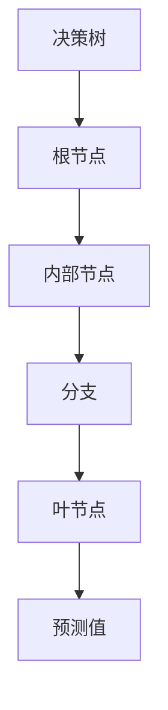
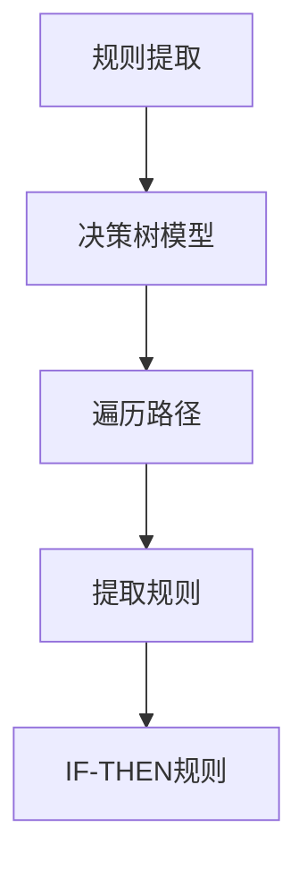
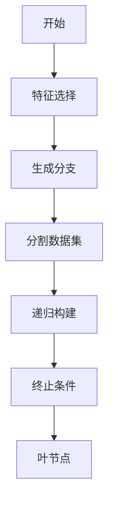
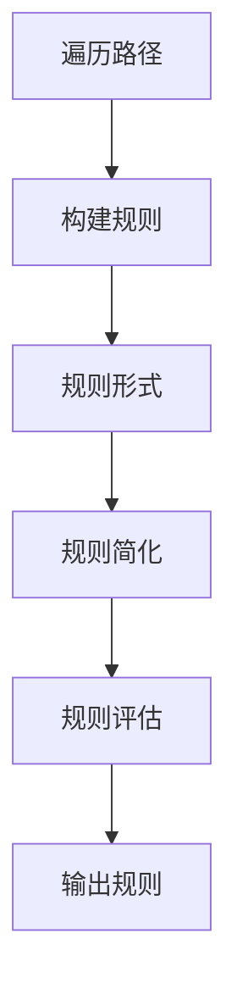

# 决策树与规则提取原理与代码实战案例讲解

## 1.背景介绍

在当今数据主导的时代,机器学习已经渗透到各个领域,成为提取数据价值的关键工具。在众多机器学习算法中,决策树因其易于理解和解释的特性而备受青睐。决策树不仅可以用于预测和分类任务,还可以从训练数据中自动提取可解释的决策规则,这些规则对于人类专家来说是可读且易于理解的。

决策树学习的主要目标是从训练数据构建一个决策树模型,该模型可以对新的数据实例进行预测或分类。决策树由节点和有向边组成,每个内部节点表示对特征的测试,每个分支代表测试的一个输出,而每个叶节点则存储了一个类别标签或回归值。在构建决策树时,算法会根据一定的准则(如信息增益或基尼指数)选择最优特征进行分裂,从而将训练数据递归地划分为较小的子集,直至满足某些停止条件。

除了用于预测和分类之外,决策树还可以用于规则提取。从训练好的决策树中,我们可以遍历从根节点到每个叶节点的路径,将沿途的特征测试组合成一个规则。这些规则通常采用"IF-THEN"形式,易于人类理解和解释。规则提取不仅有助于理解模型的内在决策过程,还可应用于知识发现、决策支持系统等领域。

## 2.核心概念与联系

### 2.1 决策树

决策树是一种有监督学习算法,可用于回归和分类任务。它的工作原理是将特征空间递归地划分为更小的子空间,并在每个子空间中进行简单的预测。



- **根节点(Root Node)**: 决策树的起点,包含完整的数据集。
- **内部节点(Internal Node)**: 根据特征值进行数据分割的节点。
- **分支(Branch)**: 连接父节点和子节点的边,代表特征取值的条件。
- **叶节点(Leaf Node)**: 决策树的终止节点,存储预测的目标值。

### 2.2 规则提取

规则提取是从训练好的机器学习模型中提取可解释的决策规则的过程。对于决策树,可以遍历从根节点到每个叶节点的路径,将沿途的特征测试组合成一个规则。



- **决策树模型**: 已训练好的决策树模型。
- **遍历路径**: 从根节点到每个叶节点的路径。
- **提取规则**: 将路径上的特征测试组合成规则。
- **IF-THEN规则**: 易于理解的决策规则,采用"IF-THEN"形式。

## 3.核心算法原理具体操作步骤

### 3.1 决策树构建算法

决策树的构建算法通常采用自顶向下的递归分治策略,主要包括以下步骤:

1. **开始**: 从整个数据集作为根节点开始。
2. **特征选择**: 根据某种准则(如信息增益或基尼指数)选择最优特征进行分裂。
3. **生成分支**: 根据选定特征的不同取值创建分支。
4. **分割数据集**: 将数据集按照分支划分为更小的子集。
5. **递归构建**: 对每个子集重复步骤2-4,构建子树。
6. **终止条件**: 当满足某些条件时停止递归,将当前节点标记为叶节点。



常用的终止条件包括:

- 当前节点的所有样本属于同一类别
- 没有剩余特征可供分裂
- 树的深度达到预设的最大值
- 当前节点的样本数小于预设的阈值

### 3.2 规则提取算法

从决策树中提取规则的算法步骤如下:

1. **遍历路径**: 从根节点开始,遍历到每个叶节点的路径。
2. **构建规则**: 对于每条路径,将沿途的特征测试组合成一个规则。
3. **规则形式**: 规则通常采用"IF-THEN"形式,如"IF 条件1 AND 条件2 ... THEN 预测值"。
4. **规则简化**: 可选地对规则进行简化,如删除冗余条件或合并相似规则。
5. **规则评估**: 根据一定准则(如准确率、覆盖率等)评估和筛选规则。



规则提取算法的关键在于平衡规则的准确性和简洁性,同时保持足够的解释能力。

## 4.数学模型和公式详细讲解举例说明

### 4.1 信息增益

信息增益是决策树算法中常用的特征选择准则之一。它基于信息论中的信息熵概念,度量了按某个特征进行分裂后,数据集的无序程度减少了多少。

给定一个数据集 $D$,其中包含 $m$ 个样本,属于 $K$ 个类别。令 $p_i$ 表示第 $i$ 类样本的概率,则数据集 $D$ 的信息熵定义为:

$$
Ent(D) = -\sum_{i=1}^{K}p_i\log_2p_i
$$

信息熵 $Ent(D)$ 越大,数据集 $D$ 的无序程度就越高。

对于特征 $A$,假设它有 $v$ 个不同的取值 $\{a_1,a_2,...,a_v\}$,根据特征 $A$ 将数据集 $D$ 划分为 $v$ 个子集 $\{D_1,D_2,...,D_v\}$,则特征 $A$ 对数据集 $D$ 的信息增益定义为:

$$
\begin{aligned}
Gain(D,A) &= Ent(D) - \sum_{j=1}^{v}\frac{|D_j|}{|D|}Ent(D_j) \\
          &= Ent(D) - Ent_A(D)
\end{aligned}
$$

其中,$ Ent_A(D) $ 是经特征 $A$ 分割后的条件熵。信息增益 $Gain(D,A)$ 越大,说明使用特征 $A$ 分割后,数据集的无序程度降低得越多,特征 $A$ 对训练数据集的分类能力越强。

在构建决策树时,我们会选择信息增益最大的特征作为当前节点进行分裂。

### 4.2 基尼指数

基尼指数是另一种常用的特征选择准则,它从分类的纯度角度衡量数据集的无序程度。

给定一个数据集 $D$,其中包含 $K$ 个类别。令 $p_i$ 表示第 $i$ 类样本的概率,则数据集 $D$ 的基尼指数定义为:

$$
Gini(D) = 1 - \sum_{i=1}^{K}p_i^2
$$

基尼指数 $Gini(D)$ 的取值范围为 $[0,1-\frac{1}{K}]$,当数据集 $D$ 中只有一个类别时,基尼指数取最小值 $0$;当各类别的概率均等时,基尼指数取最大值 $1-\frac{1}{K}$。

对于特征 $A$,假设它有 $v$ 个不同的取值 $\{a_1,a_2,...,a_v\}$,根据特征 $A$ 将数据集 $D$ 划分为 $v$ 个子集 $\{D_1,D_2,...,D_v\}$,则特征 $A$ 对数据集 $D$ 的基尼指数减少量定义为:

$$
\begin{aligned}
\Delta Gini(D,A) &= Gini(D) - \sum_{j=1}^{v}\frac{|D_j|}{|D|}Gini(D_j) \\
                &= Gini(D) - Gini_A(D)
\end{aligned}
$$

其中,$ Gini_A(D) $ 是经特征 $A$ 分割后的加权基尼指数。基尼指数减少量 $\Delta Gini(D,A)$ 越大,说明使用特征 $A$ 分割后,数据集的无序程度降低得越多,特征 $A$ 对训练数据集的分类能力越强。

在构建决策树时,我们会选择基尼指数减少量最大的特征作为当前节点进行分裂。

### 4.3 示例

假设我们有一个包含天气情况和是否能够玩游戏的数据集,如下所示:

| 天气 | 温度 | 湿度 | 风力 | 能否玩游戏 |
|------|------|------|------|------------|
| 晴朗 | 高   | 高   | 弱   | 否         |
| 晴朗 | 高   | 高   | 强   | 否         |
| 多云 | 高   | 高   | 弱   | 是         |
| 雨天 | 中等 | 高   | 弱   | 是         |
| 雨天 | 冷   | 普通 | 弱   | 是         |
| 雨天 | 冷   | 普通 | 强   | 否         |
| 多云 | 冷   | 普通 | 强   | 是         |
| 晴朗 | 中等 | 高   | 弱   | 否         |
| 晴朗 | 冷   | 普通 | 弱   | 是         |
| 雨天 | 中等 | 普通 | 弱   | 是         |
| 晴朗 | 中等 | 普通 | 强   | 是         |
| 多云 | 中等 | 高   | 强   | 是         |
| 多云 | 高   | 普通 | 弱   | 是         |
| 雨天 | 中等 | 高   | 强   | 否         |

我们可以计算每个特征的信息增益或基尼指数减少量,选择最优特征进行分裂。以信息增益为例:

1. 计算数据集 $D$ 的信息熵:

   $$
   Ent(D) = -\frac{9}{14}\log_2\frac{9}{14} - \frac{5}{14}\log_2\frac{5}{14} = 0.940
   $$

2. 计算特征"天气"的信息增益:

   $$
   \begin{aligned}
   Ent_\text{天气}(D) &= \frac{5}{14}Ent(\text{晴朗}) + \frac{4}{14}Ent(\text{多云}) + \frac{5}{14}Ent(\text{雨天}) \\
                      &= \frac{5}{14}\left(-\frac{3}{5}\log_2\frac{3}{5} - \frac{2}{5}\log_2\frac{2}{5}\right) \\
                      &\quad + \frac{4}{14}\left(-\frac{3}{4}\log_2\frac{3}{4} - \frac{1}{4}\log_2\frac{1}{4}\right) \\
                      &\quad + \frac{5}{14}\left(-\frac{2}{5}\log_2\frac{2}{5} - \frac{3}{5}\log_2\frac{3}{5}\right) \\
                      &= 0.693 \\
   Gain(D,\text{天气}) &= 0.940 - 0.693 = 0.247
   \end{aligned}
   $$

3. 类似地计算其他特征的信息增益,发现"湿度"的信息增益最大,因此选择"湿度"作为根节点进行分裂。

通过这种方式,我们可以递归地构建整个决策树。在得到决策树后,就可以遍历从根节点到每个叶节点的路径,提取"IF-THEN"形式的决策规则。

## 5.项目实践:代码实例和详细解释说明

以下是使用Python中的scikit-learn库构建决策树和提取规则的代码示例:

```python
from sklearn.tree import DecisionTreeClassifier, export_text
from sklearn.tree import _tree
import numpy as np

# 创