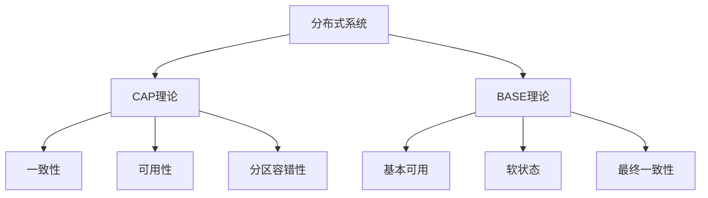
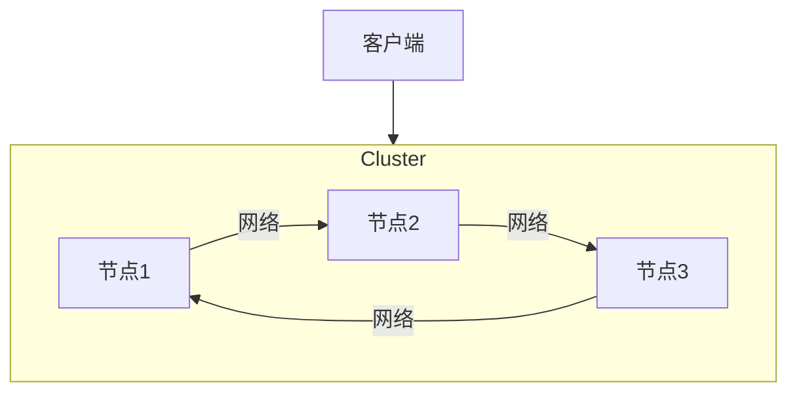

# 分布式系统和容错机制的研究

## 1.背景介绍

在当今快速发展的数字时代,分布式系统已经无处不在,从大型互联网公司的数据中心到个人手机上的移动应用程序。随着业务需求的不断扩展和用户量的持续增长,传统的单体架构已经无法满足高并发、高可用和可扩展性的需求。因此,分布式系统应运而生,成为解决这些挑战的有力手段。

分布式系统是指由多个独立的计算机组件(进程或对象)组成的软件系统,这些组件通过网络进行协调工作以完成共同的任务。与单体系统相比,分布式系统具有以下优势:

1. **高可用性(High Availability)**:通过冗余和负载均衡,分布式系统能够提供持续不间断的服务。
2. **可扩展性(Scalability)**:可以通过添加更多的计算资源来处理更高的负载。
3. **容错性(Fault Tolerance)**:即使某些组件发生故障,整个系统仍然可以继续运行。
4. **透明性(Transparency)**:隐藏了底层系统的复杂性,为用户提供统一的接口。

然而,构建可靠的分布式系统并非易事,需要解决诸多挑战,例如网络分区、节点故障、数据一致性等。因此,容错机制在分布式系统中扮演着至关重要的角色,确保系统在发生故障时能够正常运行,提供持续的服务。

## 2.核心概念与联系

在探讨分布式系统和容错机制之前,我们需要了解一些核心概念:

### 2.1 CAP理论

CAP理论由Eric Brewer于1998年提出,它指出在分布式系统中,不可能同时满足以下三个性质:

- **一致性(Consistency)**:所有节点看到的数据是相同的。
- **可用性(Availability)**:每个请求都能够获得响应(无需等待其他节点)。
- **分区容错性(Partition Tolerance)**:系统能够继续运行,即使发生网络分区。

在实际系统中,我们通常需要在这三个性质之间进行权衡和取舍。例如,对于金融系统,我们更关注数据的一致性;而对于实时系统,我们更关注可用性。

### 2.2 BASE理论

BASE理论是对CAP理论的一种补充和延伸,它指出在设计分布式系统时,我们应该:

- **基本可用(Basically Available)**:系统应该保证基本的可用性。
- **软状态(Soft State)**:系统状态可以有一段时间不同步,但最终会达到一致。
- **最终一致性(Eventual Consistency)**:系统中的所有数据副本经过一段时间后,最终会达到完全一致。

BASE理论认为,在网络分区的情况下,我们可以暂时放松一致性的要求,先保证可用性,然后通过一些机制最终实现数据的一致性。

### 2.3 Mermaid流程图



上图展示了分布式系统中CAP理论和BASE理论的核心概念及其关系。CAP理论阐述了分布式系统中一致性、可用性和分区容错性三者之间的权衡关系,而BASE理论则提出了在网络分区情况下,先保证可用性,再通过一些机制实现最终一致性的设计思路。

## 3.核心算法原理具体操作步骤

为了实现分布式系统的容错性,我们需要采用一些核心算法和机制。下面将介绍几种常见的容错算法及其具体操作步骤。

### 3.1 领导者选举算法

在分布式系统中,经常需要选举一个节点作为领导者(Leader)来协调整个系统的运行。常见的领导者选举算法有:

1. **Raft算法**

Raft算法是一种用于管理复制日志的算法,它能够选举出一个领导者,并且能够在领导者出现故障时重新选举新的领导者。Raft算法的基本步骤如下:

1) 初始化状态,所有节点都是跟随者(Follower)。
2) 跟随者开始选举过程,每个节点都会给自己投票。
3) 如果一个节点获得了大多数节点的选票,它就成为领导者。
4) 领导者开始处理客户端的请求,并将日志复制到其他节点。
5) 如果领导者出现故障,则重新进入选举过程。

2. **Bully算法**

Bully算法是一种基于进程编号的分布式选举算法,具体步骤如下:

1) 当一个进程发现协调者(Coordinator)出现故障时,它会向编号比自己大的所有进程发送选举消息。
2) 如果收到比自己编号大的进程的响应,则终止选举过程。
3) 如果没有收到任何响应,则该进程将自己选举为新的协调者。
4) 新的协调者会通知所有其他进程自己的地址。

### 3.2 两阶段提交协议(2PC)

两阶段提交协议(Two-Phase Commit Protocol, 2PC)是一种用于保证分布式系统中的原子性事务的协议。它由两个阶段组成:

1. **准备阶段(Prepare Phase)**

协调者(Coordinator)向所有参与者(Participant)发送准备请求,询问是否可以执行事务操作。

1) 参与者执行事务操作,并将Undo信息记录到稳定存储器中。
2) 参与者向协调者反馈是否准备好了。

2. **提交阶段(Commit Phase)**

如果协调者收到了所有参与者的"准备好"响应,就向所有参与者发出"提交"请求;否则,发出"回滚"请求。

1) 参与者接收到"提交"请求后,就执行实际的操作。
2) 参与者接收到"回滚"请求后,就执行回滚操作。

尽管2PC协议能够保证事务的原子性,但它存在一些缺陷,例如:单点故障、阻塞问题、数据不一致等。因此,在实际应用中,通常采用更加可靠的三阶段提交协议(3PC)。

### 3.3 Paxos算法

Paxos算法是一种用于达成分布式系统中数据一致性的算法,它能够确保即使有部分节点出现故障,整个系统也能正常运行。Paxos算法的基本步骤如下:

1) 选举一个提议者(Proposer),负责提出提案(Proposal)。
2) 提议者向所有的接受者(Acceptor)发送准备请求(Prepare Request)。
3) 接受者响应最新的已接受提案的编号和值。
4) 提议者根据接受者的响应,选择一个提案值,并向所有接受者发送接受请求(Accept Request)。
5) 接受者接受该提案后,向所有节点发送通知。
6) 一旦提案被大多数接受者接受,该提案的值就是最终确定的值。

Paxos算法能够确保在网络分区、节点故障等情况下,系统仍然能够达成一致。但是,它的实现相对复杂,需要精心设计和严格的正确性证明。

## 4.数学模型和公式详细讲解举例说明

在分布式系统中,我们经常需要使用一些数学模型和公式来描述和分析系统的行为。下面将介绍几种常见的数学模型和公式。

### 4.1 一致性哈希(Consistent Hashing)

一致性哈希是一种分布式哈希算法,常用于负载均衡和数据分片等场景。它的基本思想是将整个哈希空间构成一个环形结构,并将节点和数据映射到这个环形空间上。

假设哈希函数为$hash(x)$,将节点和数据映射到环形空间上的位置为$hash(x)\ \%\ 2^{32}$。对于任意一个数据$key$,我们可以通过以下公式计算它应该存储在哪个节点上:

$$
node(key) = successor(hash(key))
$$

其中,$successor(x)$表示在环形空间上顺时针方向寻找第一个大于或等于$x$的节点。

当节点加入或离开时,只需要重新计算部分数据的存储位置,而不需要重新计算所有数据,从而提高了系统的可扩展性和容错性。

### 4.2 Quorum一致性

在分布式系统中,Quorum一致性是一种常见的数据一致性模型。它的基本思想是将数据复制到多个副本上,并要求在读写操作时获得足够多的副本同意才能执行。

设$N$为副本的总数,$W$为写Quorum的大小,$R$为读Quorum的大小,则必须满足以下条件:

$$
W + R > N
$$

这样可以确保读写操作之间存在至少一个副本的重叠,从而保证数据的一致性。

通常,我们会选择$W=N/2+1$,$R=N/2+1$,这样可以最大程度地提高系统的可用性和容错性。

### 4.3 CAP理论的数学模型

CAP理论可以用一个简单的数学模型来表示:

设$C$表示一致性,$A$表示可用性,$P$表示分区容错性,则CAP理论可以表示为:

$$
C + A + P \leq 2
$$

这个公式表明,在分布式系统中,我们最多只能同时满足两个性质。例如,如果要保证分区容错性($P=1$),那么一致性($C$)和可用性($A$)之间必须做出权衡。

通过这个简单的数学模型,我们可以更好地理解CAP理论,并在设计分布式系统时做出合理的权衡和取舍。

## 5.项目实践:代码实例和详细解释说明

为了更好地理解分布式系统和容错机制,我们将通过一个简单的示例项目来进行实践。该项目使用Go语言实现了一个基于Raft算法的分布式键值存储系统。

### 5.1 系统架构



上图展示了系统的基本架构。整个系统由多个节点组成,每个节点都运行相同的程序,通过网络进行通信。客户端可以向任意一个节点发送请求,而节点之间则使用Raft算法来协调一致性和容错。

### 5.2 Raft算法实现

我们首先定义了`Node`结构体,用于表示一个节点:

```go
type Node struct {
    id         int
    currentTerm int
    votedFor    int
    state       NodeState
    log         []LogEntry
    commitIndex int
    lastApplied int
    nextIndex   []int
    matchIndex  []int
    peers       []string
    transport   Transport
}
```

其中,`currentTerm`表示当前任期,`votedFor`表示在当前任期内投票给了哪个节点,`state`表示节点的当前状态(follower、candidate或leader),`log`是日志条目的列表,`commitIndex`和`lastApplied`分别表示已提交和已应用的最新日志索引。

`nextIndex`和`matchIndex`是用于日志复制的数组,分别记录了需要发送给每个节点的下一个日志条目的索引和已经复制到每个节点的最新日志条目的索引。

`peers`是集群中其他节点的地址列表,`transport`是用于节点间通信的传输层。

接下来,我们实现了Raft算法的核心逻辑:

```go
func (n *Node) runElectionTimer() {
    // 选举超时,成为候选人
    n.becomeCandidate()
    n.currentTerm++
    n.votedFor = n.id
    n.resetElectionTimer()
    // 发送请求投票的RPC
    voteCount := 1
    for _, peer := range n.peers {
        go n.sendRequestVote(peer, n.currentTerm)
    }
    // 等待投票结果
    elect := n.electCh
    vote := <-elect
    if vote.voteGranted {
        voteCount++
        if voteCount > len(n.peers)/2 {
            // 获得大多数票,成为领导者
            n.becomeLeader()
        }
    }