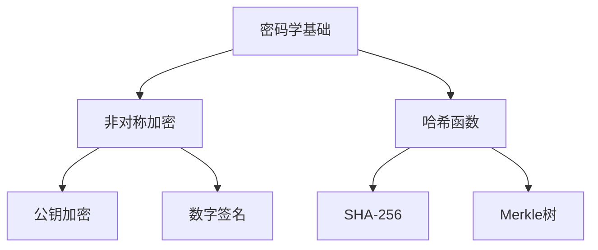
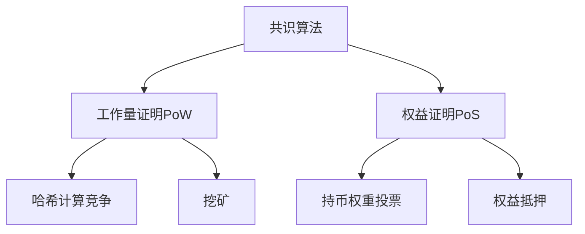
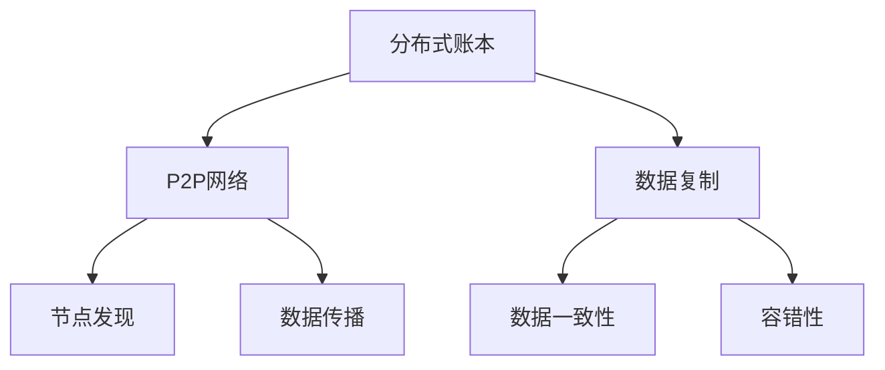
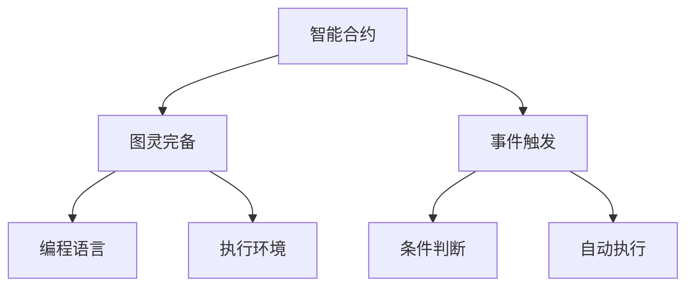
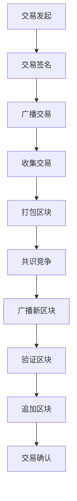
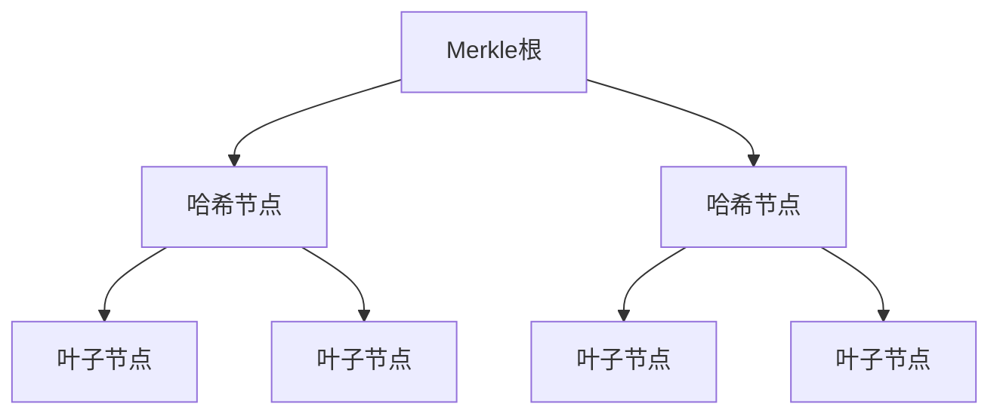

# 区块链技术在金融领域的应用

## 1. 背景介绍

### 1.1 金融行业的痛点与挑战

当前的金融系统面临着诸多挑战和痛点,例如:

- **高昂的交易成本**: 传统金融交易通常涉及多个中介机构,导致高昂的手续费和延迟。
- **缺乏透明度**: 金融交易过程缺乏透明度,容易滋生欺诈和不当行为。
- **效率低下**: 金融交易流程复杂、手续繁琐,效率低下。
- **数据孤岛**: 金融机构之间的数据存在孤岛,难以实现信息共享和互操作性。

### 1.2 区块链技术的兴起

区块链技术作为一种去中心化的分布式账本技术,具有去中介化、不可篡改、可追溯、智能合约等特性,为解决上述痛点带来了新的机遇。区块链通过建立点对点的分布式网络,实现不同节点之间的数据共享和交互,从而提高了交易的透明度和效率。

## 2. 核心概念与联系

### 2.1 区块链的核心概念

1. **区块(Block)**: 区块是区块链系统中用于记录交易数据的基本数据单元,由区块头和区块体两部分组成。
2. **链(Chain)**: 区块通过哈希值按照时间顺序组成一条链,形成不可篡改的数据记录。
3. **共识机制**: 区块链系统中,各节点通过共识算法(如工作量证明、权益证明等)达成对新区块的认可,从而维护整个系统的一致性。
4. **分布式账本**: 区块链实现了一个分布式的、去中心化的账本系统,所有节点共同维护和记录交易数据。
5. **密码学**: 区块链广泛应用了密码学技术,如非对称加密、哈希函数等,确保了交易数据的安全性和不可篡改性。
6. **智能合约**: 区块链支持基于代码的智能合约,可自动执行特定条件下的操作,提高了交易的自动化和可信程度。

### 2.2 区块链与金融的联系

区块链技术与金融行业有着天然的契合关系:

1. **去中介化**: 区块链的去中心化特性,有助于消除金融交易中的中介环节,降低成本。
2. **透明可追溯**: 区块链上的交易数据公开透明、可追溯查询,提高了金融交易的透明度。
3. **不可篡改**: 区块链数据的不可篡改性,确保了金融交易记录的真实可靠。
4. **智能合约**: 智能合约可自动执行金融合同条款,提高金融交易的效率。
5. **跨境支付**: 区块链技术为实现高效、低成本的跨境支付提供了基础设施。

## 3. 核心算法原理具体操作步骤

### 3.1 区块链的基本原理

区块链的核心算法原理主要包括以下几个方面:

1. **密码学基础**: 区块链广泛使用了非对称加密、哈希函数等密码学技术,确保了交易数据的安全性和不可篡改性。



2. **共识算法**: 区块链系统中,各节点通过共识算法达成对新区块的认可,从而维护整个系统的一致性。常见的共识算法有工作量证明(PoW)、权益证明(PoS)等。



3. **分布式账本**: 区块链实现了一个分布式的、去中心化的账本系统,所有节点共同维护和记录交易数据。



4. **智能合约**: 区块链支持基于代码的智能合约,可自动执行特定条件下的操作,提高了交易的自动化和可信程度。



### 3.2 区块链交易流程

区块链上的交易流程大致如下:

1. 交易发起方构建交易请求,使用私钥对交易数据进行签名。
2. 交易请求被广播到整个P2P网络中。
3. 矿工节点收集交易请求,打包进新的区块。
4. 矿工节点通过工作量证明(PoW)或其他共识算法,竞争计算新区块的有效性证明。
5. 获胜的矿工节点将新区块广播到网络中。
6. 其他节点验证新区块的有效性,如果有效则将其追加到本地区块链。
7. 交易被确认并不可逆地记录在区块链上。



## 4. 数学模型和公式详细讲解举例说明

### 4.1 哈希函数与Merkle树

哈希函数和Merkle树是区块链中非常重要的数学模型,用于确保数据的完整性和不可篡改性。

1. **哈希函数**

哈希函数将任意长度的输入数据映射为固定长度的输出值(哈希值),具有以下特性:

- 单向性: 给定输出很难计算出对应的输入
- 雪崩效应: 输入数据的微小变化会导致输出哈希值的巨大变化
- 抗碰撞性: 很难找到两个不同的输入数据具有相同的哈希值

常用的哈希函数包括SHA-256、SHA-3等。

$$
H(x) = y
$$

其中,H为哈希函数,$x$为输入数据,$y$为输出哈希值。

2. **Merkle树**

Merkle树是一种二叉树结构,用于高效地对大量数据进行哈希计算和验证。



对于一组数据$D = \{d_1, d_2, \dots, d_n\}$,构建Merkle树的步骤如下:

1. 计算每个数据块$d_i$的哈希值$h_i = H(d_i)$作为叶子节点
2. 将相邻的两个叶子节点哈希值$h_i$和$h_{i+1}$进行拼接,计算其哈希值作为父节点
3. 重复第2步,直至计算出Merkle根节点

Merkle树的优势在于,只需存储Merkle根和相应的数据块,就可以高效地验证数据的完整性。

### 4.2 工作量证明(PoW)

工作量证明(Proof of Work, PoW)是比特币等加密货币中广泛使用的共识算法,用于防止双重支付和确保系统的安全性。

在PoW中,矿工需要通过大量的计算工作来寻找一个满足特定难度目标的随机数(nonce),从而构造出有效的区块。这个过程被称为"挖矿"。

设定一个难度目标值$T$,要求找到一个nonce值,使得:

$$
H(nonce || prev\_hash || data \dots) \leq T
$$

其中,$H$为哈希函数,$prev\_hash$为上一个区块的哈希值,$data$为当前区块打包的交易数据。

当一个矿工找到满足条件的nonce值时,它就可以构造出一个有效的区块,并将其广播到整个网络中。其他节点可以快速验证该区块的有效性,而不需要重复进行大量的计算工作。

PoW的核心思想是通过大量的计算工作来确保系统的安全性和一致性,但同时也存在能源消耗大、效率低下等问题。

## 5. 项目实践:代码实例和详细解释说明

以下是一个基于Python实现的简单区块链示例,用于演示区块链的基本原理和操作流程。

### 5.1 定义区块结构

```python
import hashlib
import time

class Block:
    def __init__(self, index, transactions, previous_hash):
        self.index = index
        self.transactions = transactions
        self.previous_hash = previous_hash
        self.timestamp = time.time()
        self.nonce = 0
        self.hash = self.compute_hash()

    def compute_hash(self):
        block_string = str(self.index) + str(self.transactions) + str(self.previous_hash) + str(self.timestamp) + str(self.nonce)
        return hashlib.sha256(block_string.encode()).hexdigest()

    def mine_block(self, difficulty):
        while self.hash[:difficulty] != '0' * difficulty:
            self.nonce += 1
            self.hash = self.compute_hash()
        print(f"Block mined with nonce: {self.nonce}")
```

在这个示例中,我们定义了一个`Block`类,用于表示区块链中的单个区块。每个区块包含以下属性:

- `index`: 区块索引
- `transactions`: 打包的交易数据
- `previous_hash`: 前一个区块的哈希值
- `timestamp`: 时间戳
- `nonce`: 工作量证明中的随机数
- `hash`: 当前区块的哈希值

`compute_hash`方法用于计算当前区块的哈希值,而`mine_block`方法则实现了工作量证明算法,通过不断尝试不同的nonce值,直到找到一个满足给定难度目标的有效区块。

### 5.2 构建区块链

```python
blockchain = [Block(0, [], '0')]  # 创建创世区块

def create_block(transactions):
    previous_block = blockchain[-1]
    new_block = Block(len(blockchain), transactions, previous_block.hash)
    new_block.mine_block(2)  # 设置难度目标为2
    blockchain.append(new_block)

create_block([{'sender': 'Alice', 'receiver': 'Bob', 'amount': 5}])
create_block([{'sender': 'Bob', 'receiver': 'Charlie', 'amount': 2}])
```

在这个示例中,我们首先创建了一个包含创世区块的区块链列表。`create_block`函数用于创建新的区块,并将其添加到区块链中。

每个新区块都包含了前一个区块的哈希值,形成了一条不可篡改的链条。通过调用`mine_block`方法,新区块需要进行工作量证明计算,以确保其有效性。

### 5.3 验证区块链的完整性

```python
def is_valid_chain(chain):
    for i in range(1, len(chain)):
        current_block = chain[i]
        previous_block = chain[i - 1]

        if current_block.hash != current_block.compute_hash():
            print(f"Block {i} has been tampered with!")
            return False

        if current_block.previous_hash != previous_block.hash:
            print(f"Block {i} has an invalid previous hash!")
            return False

    return True

print(is_valid_chain(blockchain))  # 输出: True
```

`is_valid_chain`函数用于验证区块链的完整性和一致性。它遍历整个区块链,检查每个区块的哈希值是否正确计算,以及前一个区块的哈希值是否与当前区块的`previous_hash`匹配。如果发现任何异常,函数将返回`False`。

在这个示例中,我们验证了构建的区块链是有效的。

通过这个简单的示例,你可以了解到区块链的基本原理和操作流程,包括区块结构、工作量证明、区块链构建和验证等。当然,实际的区块链系统会比这个示例更加复杂和完备。

## 6. 实际应用场景

区块