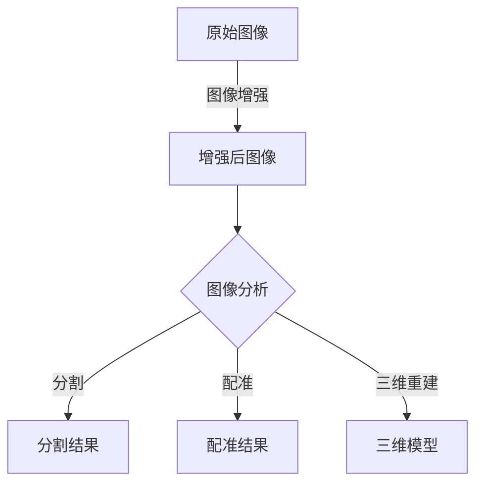

# 医疗影像处理(Medical Imaging)原理与代码实战案例讲解

## 1.背景介绍

### 1.1 医疗影像的重要性

医疗影像技术在现代医疗保健领域扮演着至关重要的角色。它为医生提供了宝贵的诊断工具,能够清晰地可视化人体内部结构和功能,从而帮助医生准确地诊断疾病、规划治疗方案并监测病情进展。医疗影像不仅能够提高诊断的准确性,还能减少患者接受有创性检查的风险。

### 1.2 医疗影像处理概述

医疗影像处理是一门将数字图像处理技术应用于医学图像的跨学科领域。它涉及采集、处理、分析和可视化医学图像数据的各种算法和技术。通过对原始医学图像数据进行增强、分割、配准、可视化等处理,医生可以更清晰地观察感兴趣的解剖结构,从而提高诊断效率和准确性。

### 1.3 医疗影像处理的应用领域

医疗影像处理技术在多个医学领域都有广泛的应用,包括但不限于:

- **放射科影像**: X射线、CT、MRI、PET等
- **病理学影像**: 全滑扫描、虚拟显微切片等
- **内窥镜影像**: 胃镜、肠镜等
- **眼科影像**: 光学相干断层扫描等
- **皮肤科影像**: 皮肤癌筛查等

## 2.核心概念与联系

### 2.1 数字图像表示

在进行医疗影像处理之前,需要先将模拟医学图像转换为数字形式。数字图像由像素阵列组成,每个像素用一个或多个数值表示其强度或颜色。常见的图像存储格式包括BMP、JPEG、PNG、DICOM等。

### 2.2 图像增强

图像增强是改善图像质量、突出感兴趣区域的一种常用技术。包括对比度增强、锐化滤波、去噪等操作。



### 2.3 图像分割

图像分割是将图像划分为多个独立区域的过程,常用于从复杂图像中提取感兴趣的目标结构,如肿瘤、器官等。分割算法包括阈值分割、区域生长、主动轮廓模型等。

### 2.4 图像配准

图像配准是将来自不同传感器、时间或视角的医学图像对准到同一坐标系下,以便进行后续的分析和处理。配准算法包括基于特征的刚性配准、非刚性配准等。

### 2.5 三维重建

三维重建是利用一系列二维医学扫描图像(如CT或MRI序列)重建三维模型的过程,可为外科手术规划、虚拟解剖教学等提供直观的3D可视化支持。

### 2.6 机器学习在医疗影像中的应用  

近年来,机器学习和深度学习技术在医疗影像处理领域得到了广泛应用,在图像分割、病变检测、预后预测等任务中表现出色。常用的深度学习模型包括卷积神经网络(CNN)、递归神经网络(RNN)等。

## 3.核心算法原理具体操作步骤

### 3.1 图像增强算法

#### 3.1.1 直方图均衡化

直方图均衡化是一种常用的对比度增强技术,其基本思想是将原始图像的像素值重新分配,使输出图像的直方图近似于均匀分布,从而增强图像的对比度。

算法步骤:

1. 计算原始图像的直方图
2. 根据累积分布函数构造映射函数
3. 使用映射函数将原始像素值重新分配
4. 输出增强后的图像

#### 3.1.2 中值滤波

中值滤波是一种常用的去噪技术,通过用邻域像素的中值替换中心像素,可以有效消除椒盐噪声和斑点噪声。

算法步骤:

1. 选择滤波窗口大小
2. 对每个像素,提取其邻域像素值
3. 对邻域像素值排序,取中值
4. 用中值替换中心像素值
5. 输出去噪后的图像

### 3.2 图像分割算法

#### 3.2.1 阈值分割

阈值分割是一种简单而有效的分割方法,通过设置一个或多个灰度阈值,将图像分为不同的区域。

算法步骤:

1. 选择合适的阈值(可基于直方图、熵等)
2. 遍历图像每个像素
3. 若像素值大于阈值,归为目标区域
4. 若像素值小于阈值,归为背景区域
5. 输出二值化分割结果

#### 3.2.2 区域生长算法

区域生长是一种基于相似性的分割方法,从种子点出发,不断吸收相邻的相似像素,直到满足某个停止条件。

算法步骤:

1. 选择一个或多个种子点
2. 设置相似性条件(灰度、纹理等)
3. 对每个种子点:
    a. 将其加入区域
    b. 检查相邻未分配像素
    c. 若相似,加入区域,成为新种子点
    d. 重复b-c,直至无相似像素
4. 输出分割后的区域

#### 3.2.3 主动轮廓模型

主动轮廓模型(Active Contour Model)是一种参数曲线或曲面模型,通过能量最小化原理将初始轮廓逐渐演化到目标边界。

算法步骤:

1. 设置初始轮廓,定义内部和外部能量项
2. 计算轮廓上每个点的能量
3. 根据能量梯度,更新每个点的位置
4. 重复2-3,直至收敛或满足停止条件
5. 输出最终轮廓作为分割结果

### 3.3 图像配准算法  

#### 3.3.1 基于特征的刚性配准

基于特征的刚性配准算法通过提取图像的特征点(如角点、边缘等),估计出两幅图像之间的刚性变换(平移、旋转、缩放),从而将它们对准。

算法步骤:  

1. 在参考图像和浮动图像中提取特征点
2. 建立特征点之间的对应关系
3. 估计最优刚性变换参数(如SVD分解)
4. 对浮动图像应用估计的变换
5. 输出配准后的图像

#### 3.3.2 非刚性配准

非刚性配准能够校正更复杂的形变,如解剖结构的弯曲、扭曲等。常用的方法包括基于强度的配准、扭曲场模型等。

算法步骤(以扭曲场模型为例):

1. 初始化参考图像和浮动图像
2. 定义相似性度量(如互信息)和正则化项
3. 优化相似性度量,估计扭曲场
4. 使用扭曲场变换浮动图像
5. 重复2-4,直至收敛或满足停止条件
6. 输出配准后的图像

### 3.4 三维重建算法

#### 3.4.1 基于投影的重建

基于投影的三维重建算法利用从不同角度获取的二维投影数据(如CT扫描数据)重建三维体数据。常用的算法有滤波反投影(FBP)和迭代重建(IR)。

算法步骤(以FBP为例):

1. 对投影数据进行滤波
2. 对滤波后的数据进行反投影操作
3. 重复1-2,直至所有投影角度的数据处理完毕
4. 输出重建的三维体数据

#### 3.4.2 基于曲面的重建  

基于曲面的重建算法通常使用来自不同视角的二维轮廓数据(如MRI切片)构建三维曲面模型。著名算法包括March Cube算法。

算法步骤(以March Cube为例):

1. 将三维空间划分为体元格网格
2. 对每个体元,确定其是否跨越等值面
3. 根据相邻体元的配置,选择合适的三角形网格
4. 合并所有三角形网格
5. 输出重建的三维曲面模型

## 4.数学模型和公式详细讲解举例说明

### 4.1 图像滤波

图像滤波是一种常用的图像处理操作,通过卷积核对图像进行卷积运算,可以实现平滑、锐化、边缘检测等效果。设输入图像为$I(x,y)$,卷积核为$H(x,y)$,则输出图像$O(x,y)$可表示为:

$$O(x,y) = I(x,y) * H(x,y) = \sum_{m}\sum_{n}I(m,n)H(x-m,y-n)$$

其中$*$表示二维卷积运算。

常用的卷积核包括高斯核(用于平滑)、拉普拉斯核(用于锐化)、Sobel核(用于边缘检测)等。以3×3的Sobel水平核为例:

$$H_x = \begin{bmatrix} 
-1 & 0 & 1\\
-2 & 0 & 2\\
-1 & 0 & 1
\end{bmatrix}$$

### 4.2 图像分割能量模型

主动轮廓模型常用的是参数化能量最小化方法。设$C$为闭合参数曲线,能量函数$E(C)$包括内部能量项$E_{int}$和外部能量项$E_{ext}$:

$$E(C) = \int_C E_{int}(C(s))ds + \int_C E_{ext}(C(s))ds$$

内部能量项控制曲线的平滑性,外部能量项推动曲线向目标边界靠拢。最优分割轮廓$C^*$为使能量函数最小化的解:

$$C^* = \arg\min_C E(C)$$

### 4.3 图像配准相似性度量

图像配准中常用的相似性度量有互信息(Mutual Information)、归一化互信息(Normalized Mutual Information)等。设参考图像为$A$,浮动图像为$B$,它们的联合熵为$H(A,B)$,边缘熵分别为$H(A)$和$H(B)$,则互信息定义为:

$$MI(A,B) = H(A) + H(B) - H(A,B)$$

互信息越大,两幅图像的配准程度越高。

### 4.4 三维重建投影模型

在X射线CT扫描中,根据Beer-Lambert定律,射线在穿过物体时的衰减服从:

$$I = I_0e^{-\int\mu(x,y,z)ds}$$

其中$I_0$为入射强度,$I$为出射强度,$\mu(x,y,z)$为物体在$(x,y,z)$处的线性衰减系数。通过测量出射强度并反解上式,可估计出$\mu(x,y,z)$,进而重建物体的三维吸收分布。

## 5.项目实践:代码实例和详细解释说明

以下是一个使用Python和常用库(如NumPy、scikit-image等)实现医学图像分割的示例代码:

```python
import numpy as np
import matplotlib.pyplot as plt
from skimage.filters import threshold_otsu
from skimage.segmentation import active_contour

# 加载图像
image = plt.imread('brain_mri.png')

# 阈值分割
thresh = threshold_otsu(image)
binarized = image > thresh

# 主动轮廓模型分割
snake = active_contour(binarized, np.zeros_like(binarized))

# 可视化结果
fig, axes = plt.subplots(1, 3, figsize=(12, 4))
axes[0].imshow(image, cmap='gray')
axes[0].set_title('Original Image')
axes[1].imshow(binarized, cmap='gray')
axes[1].set_title('Thresholding')
axes[2].imshow(snake, cmap='gray')
axes[2].set_title('Active Contour')
plt.show()
```

代码解释:

1. 导入所需的库和模块。
2. 使用`plt.imread()`加载一张脑部MRI图像。
3. 使用Otsu自动阈值算法对图像进行二值化分割,得到初始分割结果`binarized`。
4. 将二值化图像输入`active_contour