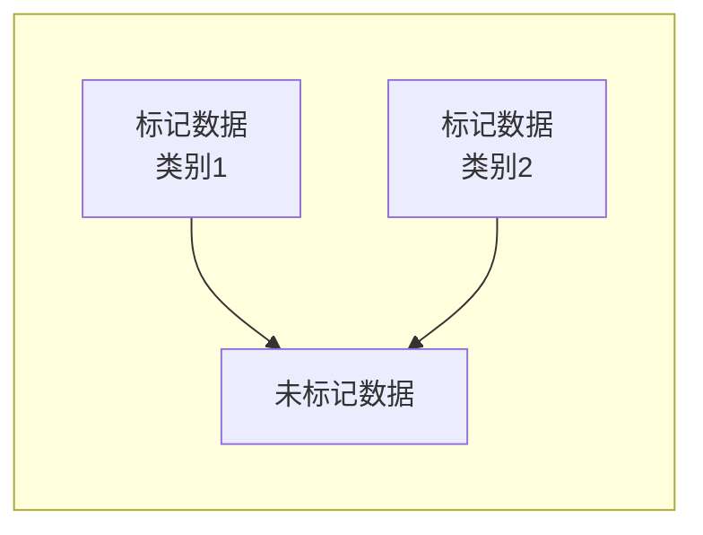
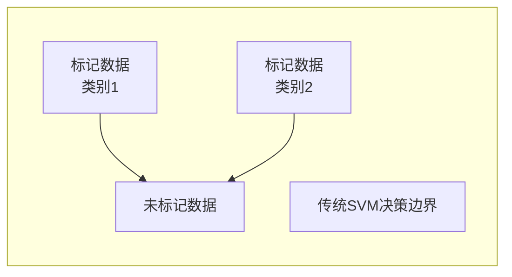
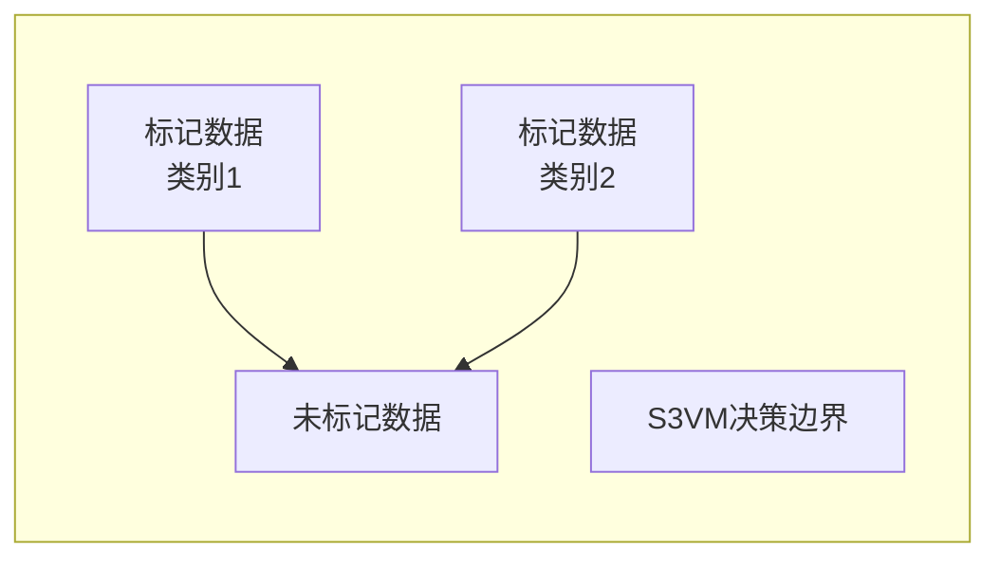

# 半监督支持向量机：利用未标记数据的幕后英雄

## 1. 背景介绍

### 1.1 数据标注的挑战

在机器学习领域中,获取高质量的标记数据一直是一个巨大的挑战。标记数据是指为每个数据实例分配相应的标签或目标值,这是监督学习算法所需的训练数据。然而,手动标记大量数据是一项耗时、昂贵且容易出错的过程。

例如,在图像分类任务中,需要人工标注每张图像中的对象类别;在自然语言处理任务中,需要人工标注每个句子的语义含义。这种人工标注过程不仅费时费力,而且存在主观性和一致性问题。

### 1.2 未标记数据的潜力

与此同时,我们生活在一个数据爆炸的时代。每天都有大量的未标记数据被创建和收集,例如网页、社交媒体内容、传感器数据等。这些未标记数据蕴含着巨大的价值和潜力,但如果仅依赖于标记数据进行训练,就无法充分利用这些宝贵的资源。

### 1.3 半监督学习的崛起

为了解决这一矛盾,半监督学习(Semi-Supervised Learning)应运而生。半监督学习旨在同时利用少量标记数据和大量未标记数据进行模型训练,从而提高模型的性能和泛化能力。

半监督支持向量机(Semi-Supervised Support Vector Machine, S3VM)就是一种非常有影响力的半监督学习算法,它将支持向量机(Support Vector Machine, SVM)的强大分类能力与未标记数据的利用相结合,成为了利用未标记数据的"幕后英雄"。

## 2. 核心概念与联系

### 2.1 支持向量机(SVM)

支持向量机(SVM)是一种监督学习算法,主要用于分类和回归任务。它的核心思想是在高维空间中寻找一个最优超平面,将不同类别的数据实例分隔开来,同时最大化两类实例到超平面的距离(即间隔)。

SVM的优点在于它具有良好的泛化能力,可以有效防止过拟合,并且对噪声和离群点具有较强的鲁棒性。然而,传统的SVM算法只能利用标记数据进行训练,无法利用未标记数据中蕴含的信息。

### 2.2 半监督学习

半监督学习是一种介于监督学习和无监督学习之间的机器学习范式。它同时利用少量标记数据和大量未标记数据进行模型训练,旨在提高模型的性能和泛化能力。

半监督学习的基本思想是,未标记数据虽然没有显式的标签信息,但它们反映了数据的内在分布和结构。通过合理利用未标记数据,可以更好地捕捉数据的本质特征,从而提高模型的泛化能力。

### 2.3 半监督支持向量机(S3VM)

半监督支持向量机(S3VM)将支持向量机(SVM)的强大分类能力与半监督学习的思想相结合,成为了一种利用未标记数据的有力工具。

S3VM的核心思想是,在传统SVM的目标函数基础上,引入一项关于未标记数据的正则化项,以捕捉未标记数据的分布信息。通过优化这个扩展的目标函数,S3VM可以同时利用标记数据和未标记数据进行训练,从而提高模型的性能和泛化能力。

## 3. 核心算法原理具体操作步骤

### 3.1 传统SVM的目标函数

在介绍S3VM的算法原理之前,我们先回顾一下传统SVM的目标函数。

传统SVM的目标函数可以表示为:

$$
\min_{w, b, \xi} \frac{1}{2} \|w\|^2 + C \sum_{i=1}^{l} \xi_i
$$

其中:

- $w$和$b$分别表示超平面的法向量和偏移量
- $\xi_i$是松弛变量,用于处理不可分数据
- $C$是一个正则化参数,用于权衡经验风险和结构风险

该目标函数的第一项$\frac{1}{2} \|w\|^2$是结构风险,旨在最小化模型的复杂度;第二项$C \sum_{i=1}^{l} \xi_i$是经验风险,旨在最小化训练误差。

### 3.2 S3VM的目标函数

S3VM在传统SVM的目标函数基础上,引入了一项关于未标记数据的正则化项,目标函数变为:

$$
\min_{w, b, \xi, f} \frac{1}{2} \|w\|^2 + C \sum_{i=1}^{l} \xi_i + \frac{C^*}{2} \sum_{j=l+1}^{l+u} \|f(x_j)\|^2
$$

其中:

- $f(x_j)$是未标记数据$x_j$的预测值
- $C^*$是另一个正则化参数,用于控制未标记数据的影响程度
- $u$是未标记数据的数量

第三项$\frac{C^*}{2} \sum_{j=l+1}^{l+u} \|f(x_j)\|^2$是关于未标记数据的正则化项,它鼓励未标记数据的预测值接近于0,从而捕捉未标记数据的分布信息。

### 3.3 优化算法

优化S3VM的目标函数是一个二次规划问题,可以使用许多优化算法来求解,如序列最小优化(Sequential Minimal Optimization, SMO)算法、切平面算法(Cutting Plane Algorithm)等。

具体的优化步骤如下:

1. 初始化$w$和$b$,通常将它们设置为0。
2. 对于每个标记数据$(x_i, y_i)$,求解对偶问题,获得对偶变量$\alpha_i$。
3. 对于每个未标记数据$x_j$,求解对偶问题,获得对偶变量$\beta_j$。
4. 根据$\alpha_i$和$\beta_j$更新$w$和$b$。
5. 重复步骤2-4,直到收敛或达到最大迭代次数。

在优化过程中,未标记数据的预测值$f(x_j)$会逐渐趋近于0,从而捕捉未标记数据的分布信息,提高模型的泛化能力。

## 4. 数学模型和公式详细讲解举例说明

### 4.1 S3VM的对偶形式

为了方便优化,我们通常将S3VM的目标函数转换为对偶形式。对偶形式的优化问题可以写为:

$$
\begin{aligned}
\max_{\alpha, \beta} & \sum_{i=1}^{l} \alpha_i - \frac{1}{2} \sum_{i, j=1}^{l} \alpha_i \alpha_j y_i y_j K(x_i, x_j) \\
& - \frac{1}{2C^*} \sum_{i, j=l+1}^{l+u} \beta_i \beta_j K(x_i, x_j) \\
\text{s.t.} & \sum_{i=1}^{l} \alpha_i y_i = 0 \\
& 0 \leq \alpha_i \leq C, \quad i = 1, \ldots, l \\
& \sum_{j=l+1}^{l+u} \beta_j = 0
\end{aligned}
$$

其中:

- $\alpha_i$和$\beta_j$分别是标记数据和未标记数据的对偶变量
- $K(x_i, x_j)$是核函数,用于将数据映射到高维空间
- 第一项是标记数据的对偶目标函数
- 第二项是未标记数据的正则化项
- 约束条件保证了解的可行性

通过求解这个对偶优化问题,我们可以获得$\alpha_i$和$\beta_j$的最优解,进而计算出$w$和$b$。

### 4.2 核函数

在S3VM中,核函数$K(x_i, x_j)$扮演着非常重要的角色。它允许我们在高维空间中进行运算,而无需显式地计算高维映射。

常用的核函数包括:

1. 线性核函数: $K(x_i, x_j) = x_i^T x_j$
2. 多项式核函数: $K(x_i, x_j) = (\gamma x_i^T x_j + r)^d$
3. 高斯核函数: $K(x_i, x_j) = \exp(-\gamma \|x_i - x_j\|^2)$
4. Laplace核函数: $K(x_i, x_j) = \exp(-\gamma \|x_i - x_j\|_1)$

其中,$\gamma$、$r$和$d$是核函数的参数,需要根据具体问题进行调整。

### 4.3 示例说明

为了更好地理解S3VM的工作原理,我们以一个简单的二维数据集为例进行说明。

假设我们有一个二维数据集,包含两个类别的标记数据和一些未标记数据,如下图所示:



我们可以看到,虽然未标记数据没有显式的标签信息,但它们的分布形状可以为我们提供有用的信息。

传统的SVM算法只能利用标记数据进行训练,因此可能会得到如下的决策边界:



可以看到,传统SVM的决策边界并没有很好地捕捉数据的真实分布,因为它忽略了未标记数据的信息。

相比之下,S3VM可以同时利用标记数据和未标记数据进行训练,从而得到如下的决策边界:



我们可以看到,S3VM的决策边界更好地捕捉了数据的真实分布,因为它利用了未标记数据的信息。这就是S3VM相比传统SVM的优势所在。

## 5. 项目实践: 代码实例和详细解释说明

在本节中,我们将使用Python中的scikit-learn库来实现一个简单的S3VM分类器,并在一个玩具数据集上进行测试。

### 5.1 准备数据

首先,我们需要准备一些标记数据和未标记数据。为了简单起见,我们将使用scikit-learn提供的make_blobs函数来生成一些人造数据。

```python
from sklearn.datasets import make_blobs
import numpy as np

# 生成标记数据
X_labeled, y_labeled = make_blobs(n_samples=100, centers=2, n_features=2, random_state=0)

# 生成未标记数据
X_unlabeled = np.r_[X_labeled, make_blobs(n_samples=200, centers=2, n_features=2, random_state=1)[0]]
```

在上面的代码中,我们生成了100个标记数据点和200个未标记数据点,它们分别属于两个不同的类别。

### 5.2 实现S3VM分类器

接下来,我们将使用scikit-learn的SVC类作为基础,实现一个简单的S3VM分类器。

```python
from sklearn.svm import SVC

class S3VMClassifier:
    def __init__(self, kernel='rbf', gamma=0.1, C=1.0, C_unlabeled=1.0):
        self.kernel = kernel
        self.gamma = gamma
        self.C = C
        self.C_unlabeled = C_unlabeled
        self.svm_model = None

    def fit(self, X_labeled, y_labeled, X_unlabeled):
        n_labeled = len(X_labeled)
        n_unlabeled = len(X_unlabeled)

        X_train = np.r_[X_labeled, X_unlabeled]
        y_train = np.r_[y_labeled, np.full(n_unlabeled, -1)]

        self.svm_model = SVC(kernel=self.kernel, gamma=self.gamma, C=self.C)
        self.svm_model.fit(X_train, y_train, sample_weight=np.r_[np.ones(n_labeled), np.full(n_unlabeled, self.C_unlabeled)])

    def predict(self, X):
        return self.svm_model.predict(X)
```

在上面的代码中,我们定义了一个S3VMClassifier类,它继承自scikit-learn的SVC类。在fit