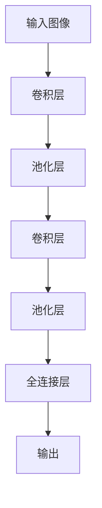

# 卷积神经网络 (CNN) 原理与代码实例讲解

## 1.背景介绍

### 1.1 什么是卷积神经网络？

卷积神经网络(Convolutional Neural Network, CNN)是一种前馈神经网络，它借鉴了生物学上视觉皮层的结构,是专门为解决图像和语音识别问题而设计的。CNN在图像识别、语音识别等领域表现出色,是当前深度学习领域应用最广泛的算法之一。

### 1.2 CNN 发展历史

CNN的概念最早可以追溯到1959年由Hubel和Wiesel提出的猫视觉皮层神经元的研究。1980年,Kunihiko Fukushima提出了神经认知机(Neocognitron),这是CNN的前身。1998年,Yann LeCun等人提出了现代CNN的雏形LeNet,并成功应用于手写数字识别。2012年,AlexNet在ImageNet大赛上取得巨大成功,掀起了深度学习在计算机视觉领域的浪潮。

### 1.3 CNN 应用领域

CNN已广泛应用于图像分类、目标检测、语义分割、图像生成等计算机视觉任务,以及自然语言处理、语音识别等领域。CNN在手写数字识别、人脸识别、无人驾驶、医疗影像分析等领域发挥着重要作用。

## 2.核心概念与联系

### 2.1 CNN 基本结构

CNN通常由卷积层(Convolutional Layer)、池化层(Pooling Layer)和全连接层(Fully Connected Layer)组成。



### 2.2 卷积层

卷积层是CNN的核心部分,它通过卷积核(Kernel)在输入数据上滑动,提取局部特征。卷积层的参数包括卷积核的权重和偏置。

### 2.3 池化层

池化层通常在卷积层之后,对卷积层的输出进行下采样,减小数据量,提高计算效率。常用的池化方式有最大池化(Max Pooling)和平均池化(Average Pooling)。

### 2.4 全连接层

全连接层类似于传统神经网络,将前面层的输出展平后连接到全连接层,进行分类或回归任务。

## 3.核心算法原理具体操作步骤

### 3.1 卷积运算

卷积运算是CNN的核心操作,它通过卷积核在输入数据上滑动,计算局部区域与卷积核的乘积和。

卷积运算步骤:

1. 初始化卷积核权重
2. 在输入数据上滑动卷积核
3. 计算局部区域与卷积核的乘积和
4. 应用激活函数(如ReLU)
5. 添加偏置项

数学表达式:

$$
(I * K)(i,j) = \sum_{m}\sum_{n}I(i+m,j+n)K(m,n)
$$

其中,$I$是输入数据,$K$是卷积核,$(i,j)$是输出特征图的位置。

### 3.2 池化运算

池化运算通过下采样输入数据,减小数据量,提高计算效率。

最大池化步骤:

1. 将输入数据划分为多个区域
2. 对每个区域取最大值作为输出

平均池化步骤:

1. 将输入数据划分为多个区域
2. 对每个区域取平均值作为输出

### 3.3 反向传播

CNN的训练过程与传统神经网络类似,使用反向传播算法更新参数。

反向传播步骤:

1. 前向传播,计算输出
2. 计算损失函数
3. 计算梯度
4. 更新参数(权重和偏置)

## 4.数学模型和公式详细讲解举例说明

### 4.1 卷积层数学模型

卷积层的数学模型可以表示为:

$$
y_{ij}^l = f\left(\sum_{m}\sum_{n}w_{mn}^{l-1}x_{i+m,j+n}^{l-1} + b^l\right)
$$

其中:

- $y_{ij}^l$是第$l$层的输出特征图在位置$(i,j)$的值
- $x_{i+m,j+n}^{l-1}$是第$l-1$层的输入特征图在位置$(i+m,j+n)$的值
- $w_{mn}^{l-1}$是第$l-1$层的卷积核权重
- $b^l$是第$l$层的偏置项
- $f$是激活函数,如ReLU

### 4.2 池化层数学模型

最大池化的数学模型可以表示为:

$$
y_{ij}^l = \max_{(m,n) \in R_{ij}}x_{i+m,j+n}^{l-1}
$$

其中:

- $y_{ij}^l$是第$l$层的输出特征图在位置$(i,j)$的值
- $x_{i+m,j+n}^{l-1}$是第$l-1$层的输入特征图在位置$(i+m,j+n)$的值
- $R_{ij}$是以$(i,j)$为中心的池化区域

平均池化的数学模型可以表示为:

$$
y_{ij}^l = \frac{1}{|R_{ij}|}\sum_{(m,n) \in R_{ij}}x_{i+m,j+n}^{l-1}
$$

其中:

- $|R_{ij}|$是池化区域$R_{ij}$的大小

### 4.3 反向传播数学模型

反向传播的数学模型可以表示为:

$$
\frac{\partial L}{\partial w_{ij}^l} = \sum_{m,n}\frac{\partial L}{\partial y_{mn}^{l+1}}\frac{\partial y_{mn}^{l+1}}{\partial x_{mn}^l}\frac{\partial x_{mn}^l}{\partial w_{ij}^l}
$$

其中:

- $L$是损失函数
- $w_{ij}^l$是第$l$层的权重
- $y_{mn}^{l+1}$是第$l+1$层的输出
- $x_{mn}^l$是第$l$层的输入

通过计算损失函数对权重的梯度,可以使用优化算法(如梯度下降)更新权重。

## 5.项目实践:代码实例和详细解释说明

以下是使用Python和PyTorch库实现CNN进行手写数字识别的代码示例:

```python
import torch
import torch.nn as nn
import torchvision
import torchvision.transforms as transforms

# 定义CNN模型
class CNN(nn.Module):
    def __init__(self):
        super(CNN, self).__init__()
        self.conv1 = nn.Conv2d(1, 16, 3, padding=1)  # 卷积层1
        self.pool1 = nn.MaxPool2d(2, 2)  # 最大池化层1
        self.conv2 = nn.Conv2d(16, 32, 3, padding=1)  # 卷积层2
        self.pool2 = nn.MaxPool2d(2, 2)  # 最大池化层2
        self.fc1 = nn.Linear(32 * 7 * 7, 128)  # 全连接层1
        self.fc2 = nn.Linear(128, 10)  # 全连接层2(输出层)

    def forward(self, x):
        x = self.pool1(torch.relu(self.conv1(x)))
        x = self.pool2(torch.relu(self.conv2(x)))
        x = x.view(-1, 32 * 7 * 7)
        x = torch.relu(self.fc1(x))
        x = self.fc2(x)
        return x

# 加载MNIST数据集
transform = transforms.Compose([transforms.ToTensor(), transforms.Normalize((0.5,), (0.5,))])
trainset = torchvision.datasets.MNIST(root='./data', train=True, download=True, transform=transform)
trainloader = torch.utils.data.DataLoader(trainset, batch_size=64, shuffle=True)
testset = torchvision.datasets.MNIST(root='./data', train=False, download=True, transform=transform)
testloader = torch.utils.data.DataLoader(testset, batch_size=64, shuffle=False)

# 实例化模型、损失函数和优化器
model = CNN()
criterion = nn.CrossEntropyLoss()
optimizer = torch.optim.SGD(model.parameters(), lr=0.01, momentum=0.5)

# 训练模型
num_epochs = 10
for epoch in range(num_epochs):
    running_loss = 0.0
    for i, data in enumerate(trainloader, 0):
        inputs, labels = data
        optimizer.zero_grad()
        outputs = model(inputs)
        loss = criterion(outputs, labels)
        loss.backward()
        optimizer.step()
        running_loss += loss.item()
        if i % 100 == 99:
            print('[%d, %5d] loss: %.3f' % (epoch + 1, i + 1, running_loss / 100))
            running_loss = 0.0

# 测试模型
correct = 0
total = 0
with torch.no_grad():
    for data in testloader:
        images, labels = data
        outputs = model(images)
        _, predicted = torch.max(outputs.data, 1)
        total += labels.size(0)
        correct += (predicted == labels).sum().item()

print('Accuracy of the network on the 10000 test images: %d %%' % (100 * correct / total))
```

代码解释:

1. 定义CNN模型类`CNN`，包含两个卷积层、两个最大池化层和两个全连接层。
2. 加载MNIST手写数字数据集,并进行预处理(归一化)。
3. 实例化模型、损失函数(交叉熵损失)和优化器(随机梯度下降)。
4. 训练模型,进行多轮迭代:
   - 前向传播计算输出
   - 计算损失函数
   - 反向传播计算梯度
   - 更新模型参数
5. 在测试集上评估模型的准确率。

通过这个示例,你可以了解如何使用PyTorch实现CNN,包括定义模型结构、加载数据、训练模型和评估模型性能。

## 6.实际应用场景

CNN在以下领域有广泛的应用:

### 6.1 图像分类

CNN在图像分类任务中表现出色,如ImageNet图像分类挑战赛。CNN可以从图像中提取复杂的特征,并对图像进行准确分类。

### 6.2 目标检测

CNN可以用于目标检测,如人脸检测、行人检测、车辆检测等。目标检测算法通常基于CNN提取图像特征,并使用其他技术(如锚框、区域建议网络等)定位目标。

### 6.3 语义分割

语义分割是将图像像素级别进行分类的任务。CNN可以用于语义分割,如自动驾驶中的道路和障碍物分割。

### 6.4 医疗影像分析

CNN在医疗影像分析领域有广泛应用,如肺部CT扫描分析、皮肤癌筛查等。CNN可以从医疗影像中提取有价值的特征,帮助医生诊断疾病。

### 6.5 自然语言处理

CNN也可以应用于自然语言处理任务,如文本分类、情感分析等。CNN可以从文本中提取语义特征,并进行相应的处理和分类。

## 7.工具和资源推荐

### 7.1 深度学习框架

- PyTorch: 一个基于Python的开源深度学习框架,提供高性能的GPU加速和动态计算图。
- TensorFlow: 由Google开发的开源深度学习框架,支持多种语言和多种设备。
- Keras: 基于TensorFlow或Theano的高级神经网络API,简化了深度学习模型的构建过程。

### 7.2 数据集

- MNIST: 手写数字识别数据集,常用于CNN入门和基准测试。
- ImageNet: 一个大型的图像数据集,包含数百万张图像和数千个类别,用于图像分类和目标检测任务。
- COCO: 一个大型的图像数据集,包含多种对象的实例分割标注,用于目标检测和语义分割任务。

### 7.3 在线资源

- CS231n: 斯坦福大学的计算机视觉课程,提供了优秀的CNN理论和实践教程。
- Deep Learning Book: 由Ian Goodfellow等人撰写的深度学习经典教材。
- GitHub: 包含许多优秀的CNN实现和应用示例。

## 8.总结:未来发展趋势与挑战

CNN在计算机视觉和自然语言处理领域取得了巨大成功,但仍面临一些挑战和发展趋势:

### 8.1 可解释性

虽然CNN在许多任务上表现出色,但它们通常被视为"黑箱"模型,缺乏可解释性。提高CNN的可解释性是一个重要的研究方向,有助于理解模型的决策