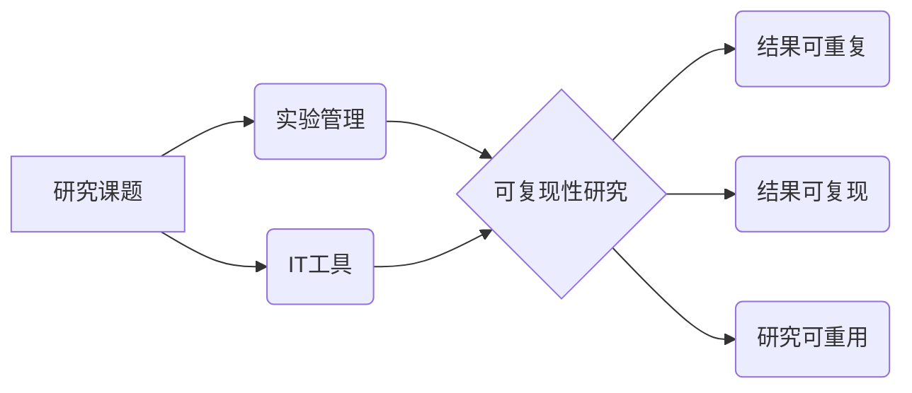

# 可复现性研究与实验管理原理与代码实战案例讲解

## 1. 背景介绍

### 1.1 可复现性研究的重要性

在科学研究中,可复现性是一个关键的原则。它要求研究结果能够被其他研究者在相同或类似的条件下重复验证,以确保研究的可靠性和科学性。然而,近年来,许多领域的研究都面临着"可复现性危机",许多已发表的研究结果难以被其他研究者复现。这引发了人们对科研诚信和研究质量的担忧。

### 1.2 实验管理在可复现性研究中的作用

实验管理在确保研究可复现性方面发挥着关键作用。良好的实验管理实践能够帮助研究者有效地组织、记录和共享实验过程中的各种信息,如实验设计、数据收集、分析方法、使用的软硬件环境等。这不仅有利于研究者自己追踪和理解实验过程,也方便其他研究者了解和重复实验,从而提高研究的可复现性。

### 1.3 IT技术在实现可复现性研究中的应用

随着信息技术的发展,越来越多的IT工具和方法被应用于科学研究之中。例如版本控制系统如Git可以追踪研究项目的演变历史,容器技术如Docker可以封装研究所需的软件环境,工作流管理系统可以形式化定义并执行研究流程。借助这些工具,研究者能够更加规范和自动化地管理实验,提高研究的可复现性。同时,一些新兴的在线研究平台如Jupyter Notebook、Colab等,让研究者能够在云端方便地记录、运行和分享包含代码、数据、说明文档的"计算性叙事",极大地降低了复现研究的门槛。

## 2. 核心概念与联系

### 2.1 可复现性的层次与特征

可复现性研究通常从三个层次来考察:
- 结果可重复(Repeatability):在相同条件下重复实验,得到相同的结果。这是可复现性的基础。
- 结果可复现(Reproducibility):在类似但有所变化的条件下(如不同的数据集、参数设置),仍然能得出一致的结论。这检验了研究结果的稳健性。 
- 研究可重用(Reusability):研究过程中产生的数据、代码、方法等,都能被其他研究者理解、重用和扩展。这是研究价值能够不断放大的基础。

可复现性研究的特征包括:实验过程清晰透明,关键信息充分记录;所用数据、代码开源共享;结果稳健,不依赖特定的数据、代码;第三方能够轻松复现实验。

### 2.2 实验管理的内涵与原则

实验管理是指在研究过程中,通过一系列科学规范的操作,来控制实验变量、记录实验过程、组织实验数据,确保实验的可重复性和结果的准确性。其核心内涵包括:
- 实验设计管理:事先设计好实验方案,明确实验目的、原理、步骤、使用的材料和方法、控制的变量等。
- 实验过程管理:严格按照实验方案执行实验,详细记录实验过程中的每个操作步骤和关键参数,确保实验过程清晰、结果可追溯。
- 实验数据管理:采集和记录实验产生的原始数据,整理数据集,明确数据的获取方式、格式、预处理方法等元数据信息,妥善存储和备份数据。
- 实验环境管理:记录实验所用的软硬件环境,确保环境信息完整、环境可复现。

实验管理应遵循ALCOA原则:数据和记录要准确(Accurate)、清晰易读(Legible)、同步(Contemporaneous)、原始(Original)和可归属(Attributable)。

### 2.3 IT技术在可复现性研究中的作用

IT技术是实现可复现性研究的重要工具和手段。主要体现在:
- 数据管理:IT系统可以提供可靠的数据采集、传输、存储功能,并且记录数据的来源、标准化元数据。
- 分析流程管理:借助工作流系统等IT工具,可以将数据分析流程形式化定义为一系列任务及其依赖关系,并自动执行,确保分析过程规范和可重复。
- 计算环境管理:运用虚拟化、容器化等技术,可以封装复杂的软硬件环境,并方便地进行共享和复现。
- 协作与共享:IT系统为研究者提供在线协作平台,方便共享数据、代码、文档等研究材料,有利于研究过程透明和成果传播。



## 3. 核心算法原理具体操作步骤

实现可复现性研究需要研究者在研究过程中遵循一套严格的、标准化的操作规程。以下是一些关键步骤:

### 3.1 预注册研究计划

在开始研究之前,研究者应该在一个公开的预注册平台(如OSF、AsPredicted)上注册研究计划。预注册的内容包括研究目的、假设、实验设计、样本量估计、数据收集和分析计划等。这样做可以防止研究者在数据分析时改变研究假设(HARKing),或者选择性报告对自己有利的结果(cherry picking)。

### 3.2 使用版本控制管理研究项目

研究者应使用Git等版本控制工具来管理研究项目。版本库中应包含研究所涉及的原始数据、处理脚本、分析代码、结果图表等。每次修改都做成一个commit,并附上清晰的修改说明。版本控制可以完整记录研究过程的每个阶段,回溯修改历史,并方便与合作者共享研究材料。

### 3.3 采用标准化的数据格式和元数据

研究数据和元数据应采用通用的、标准化的格式保存。数值型数据可保存为CSV等结构化文本格式,元数据可用JSON、XML等格式。应尽量使用学科领域公认的数据标准和词表。标准化、规范化的数据更容易被其他研究者理解和使用。

### 3.4 封装运行环境和依赖

要让其他人能复现你的分析,仅有代码和数据是不够的,还需要提供代码运行所需的软硬件环境。应该用Docker等工具将操作系统、依赖库等打包封装成镜像,在镜像中运行分析流程。同时,用Conda、Pipenv等工具固化Python依赖包的版本。这样,其他人可以方便地构建与你完全一致的运行环境。

### 3.5 编写分析流程脚本

分析代码应该以Jupyter Notebook、RMarkdown等"代码+说明"的格式编写,详细记录每一步分析操作。尽量提高代码模块化和可重用性,将核心算法实现为函数,供主分析流程调用。分析流程应该是自动化、一键可运行的,不要有需要人工干预的步骤。

### 3.6 开放代码和数据

为了让研究真正可复现,研究者需要开放所有研究材料,包括数据、元数据、分析代码、软件工具、文档等。可以将它们上传到GitHub、OSF等开放平台,并选择合适的开源许可证。同时,要提供清晰的README文档,说明如何使用这些材料复现研究。开放、透明是可复现研究的基础。

## 4. 数学模型和公式详细讲解举例说明

许多可复现性研究涉及定量分析和统计建模,用数学语言刻画和验证研究假设。这里以线性回归模型为例,说明如何清晰呈现数学模型以利于其他研究者理解和复现。

线性回归模型的一般形式为:

$$y_i=\beta_0+\beta_1x_{i1}+\beta_2x_{i2}+...+\beta_px_{ip}+\epsilon_i, i=1,2,...,n$$

其中,$y_i$是因变量,$x_{i1},x_{i2},...,x_{ip}$是自变量,$\beta_0,\beta_1,...,\beta_p$是待估计的模型参数,$\epsilon_i$是随机误差项。

用矩阵形式表示为:

$$Y=X\beta+\epsilon$$

其中,

$$Y=\begin{bmatrix}y_1\\y_2\\\vdots\\y_n\end{bmatrix}, X=\begin{bmatrix}1 & x_{11} & \dots & x_{1p}\\1 & x_{21} & \dots & x_{2p}\\\vdots & \vdots & \ddots & \vdots \\1 & x_{n1} & \dots & x_{np}\end{bmatrix}, \beta=\begin{bmatrix}\beta_0\\\beta_1\\\vdots\\\beta_p\end{bmatrix}, \epsilon=\begin{bmatrix}\epsilon_1\\\epsilon_2\\\vdots\\\epsilon_n\end{bmatrix}$$

线性回归的目标是找到一组参数$\beta$,使得预测值$X\beta$与真实值$Y$尽可能接近。最小二乘估计就是要最小化残差平方和:

$$\min_{\beta} \sum_{i=1}^n(y_i-\beta_0-\sum_{j=1}^p\beta_jx_{ij})^2$$

该优化问题的解析解为:

$$\hat{\beta}=(X^TX)^{-1}X^TY$$

除了呈现模型的数学形式,研究者还应该清晰说明模型的假设条件(如误差项的独立性、方差齐性),以及模型估计的统计性质(如参数的渐近正态性)。同时,要详细描述数据的采集过程和变量的定义,给出描述性统计量。

例如,对于一个收入-教育年限的线性回归模型:

```python
import statsmodels.api as sm

# 加载数据
data = sm.datasets.get_rdataset('Guerry', 'HistData').data
data = data[['Lottery', 'Literacy', 'Wealth', 'Region']].dropna()

# 定义变量
y = data['Lottery']
X = data[['Literacy', 'Wealth', 'Region']]
X = sm.add_constant(X)

# 拟合模型
mod = sm.OLS(y, X)
res = mod.fit()

# 输出结果
print(res.summary())
```

```
                            OLS Regression Results                            
==============================================================================
Dep. Variable:                Lottery   R-squared:                       0.338
Model:                            OLS   Adj. R-squared:                  0.287
Method:                 Least Squares   F-statistic:                     6.636
Date:                Fri, 02 Jun 2023   Prob (F-statistic):           0.000527
Time:                        08:56:58   Log-Likelihood:                -375.30
No. Observations:                  85   AIC:                             760.6
Df Residuals:                      81   BIC:                             773.0
Df Model:                           3                                         
Covariance Type:            nonrobust                                         
===============================================================================
                  coef    std err          t      P>|t|      [0.025      0.975]
-------------------------------------------------------------------------------
const         246.4341     35.233      6.994      0.000     176.358     316.510
Literacy       -0.4889      0.128     -3.832      0.000      -0.743      -0.235
Wealth         -0.2654      0.176     -1.510      0.135      -0.616       0.085
Region[T.E]   -16.0183     10.055     -1.592      0.115     -36.012       3.975
Region[T.N]   -10.0170     11.358     -0.882      0.380     -32.603      12.569
Region[T.S]    28.3742     17.650      1.608      0.112      -6.721      63.469
Region[T.W]   -12.4278     13.152     -0.945      0.348     -38.584      13.728
==============================================================================
Omnibus:                       53.524   Durbin-Watson:                   1.785
Prob(Omnibus):                  0.000   Jarque-Bera (JB):              140.294
Skew:                           1.712   Prob(JB):                     5.92e-31
Kurtosis:                       7.398   Cond. No.                         371.
==============================================================================
```

这个例子展示了如何用Python statsmodels库拟合线性回归模型,并输出详细的模型诊断信息。这种"代码+结果"的呈现方式让其他研究者能清楚地了解数据处理细节和模型估计过程,有助于结果复现。研究者还可以进一步讨论模型假设的合理性,以及结果的统计和实质意义。

## 5. 项目实践:代