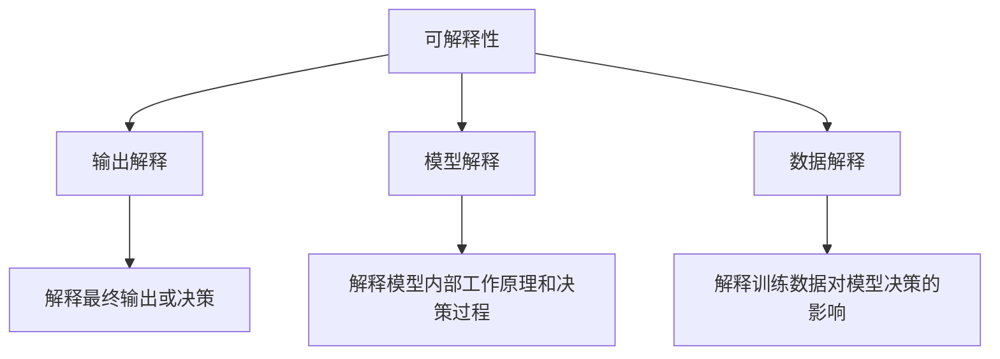
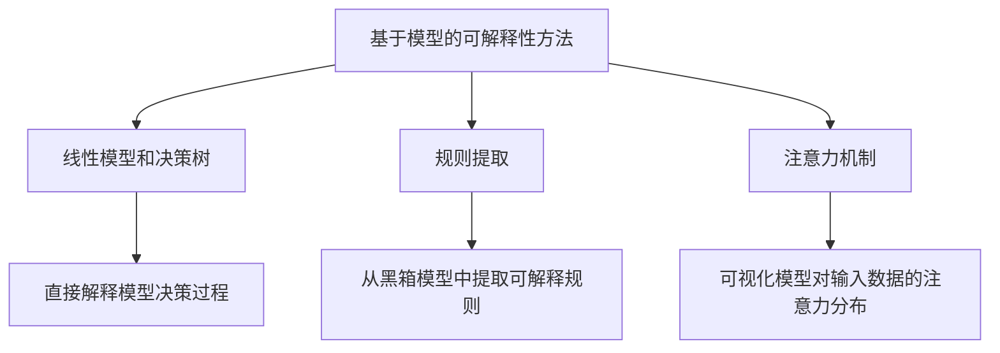
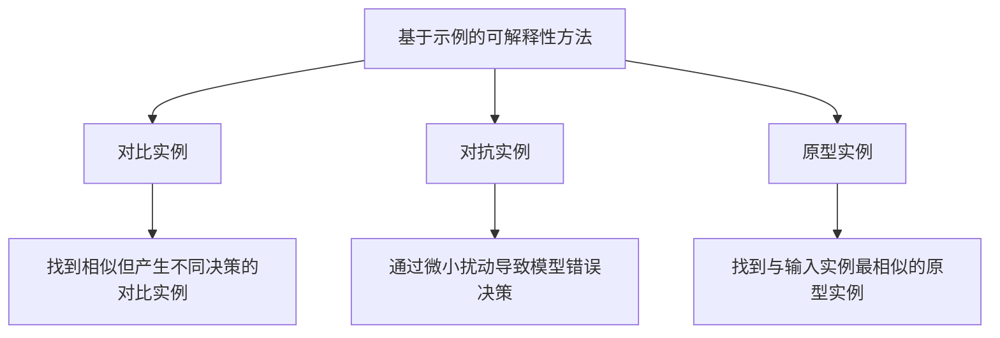
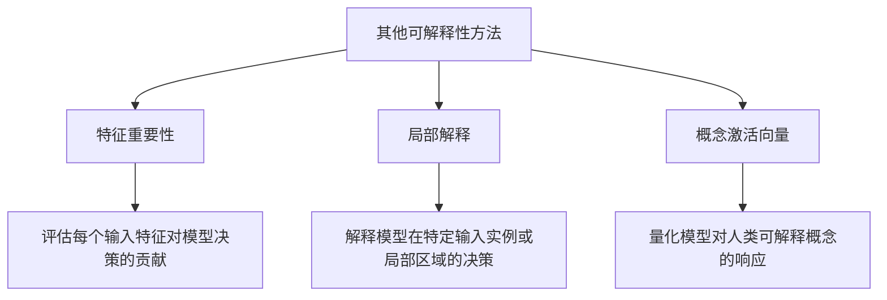

# 可解释的人工智能 (Explainable AI) 原理与代码实例讲解

## 1.背景介绍

### 1.1 人工智能的不可解释性挑战

随着人工智能(AI)系统在各个领域的广泛应用,它们的决策过程变得越来越复杂和不透明。许多AI模型,特别是深度学习模型,被视为"黑箱",其内部工作机制对最终用户来说是难以理解的。这种不可解释性给AI系统的可信度、可靠性和安全性带来了重大挑战。

### 1.2 可解释性的重要性

可解释性对于建立人们对AI系统的信任至关重要。用户需要了解AI是如何做出决策的,以便能够评估其决策的合理性和公平性。此外,在一些高风险领域(如医疗、金融和国防),可解释性也是一个法律和监管要求,以确保AI系统的决策过程是透明和可审计的。

### 1.3 可解释的人工智能(XAI)的兴起

为了解决AI系统的不可解释性问题,可解释的人工智能(Explainable AI,XAI)应运而生。XAI旨在开发能够提供可解释决策的AI模型和技术,使人类能够理解AI是如何做出决策的,以及这些决策背后的原因和推理过程。

## 2.核心概念与联系

### 2.1 可解释性的定义

可解释性是指AI系统能够以人类可理解的方式解释其决策过程和结果的能力。一个可解释的AI系统应该能够回答以下问题:

- 为什么做出这个决策?
- 决策是如何做出的?
- 哪些因素对决策产生了影响?

### 2.2 可解释性与其他AI属性的关系

可解释性与AI系统的其他重要属性密切相关,例如:

- **透明度**: 可解释性有助于提高AI系统的透明度,使其决策过程更加清晰和可审计。
- **公平性**: 通过解释AI决策背后的推理过程,可以发现潜在的偏差和不公平,从而促进AI系统的公平性。
- **可靠性**: 可解释性有助于提高AI系统的可靠性,因为它使人类能够更好地理解和评估AI的决策质量。
- **安全性**: 在一些高风险领域,可解释性是确保AI系统安全运行的关键因素。

### 2.3 可解释性的层次

可解释性可以分为不同的层次,从最基本的输出解释到最复杂的模型解释:

1. **输出解释**: 解释AI系统的最终输出或决策。
2. **模型解释**: 解释AI模型的内部工作原理和决策过程。
3. **数据解释**: 解释训练数据对AI模型决策的影响。

不同层次的可解释性满足不同的需求,并且需要采用不同的技术和方法。



## 3.核心算法原理具体操作步骤

### 3.1 基于模型的可解释性方法

#### 3.1.1 线性模型和决策树

线性模型(如逻辑回归)和决策树是天然可解释的模型,因为它们的决策过程是透明的,并且可以直接解释每个特征对最终决策的贡献。然而,这些模型在处理复杂数据时往往表现不佳。

#### 3.1.2 规则提取

规则提取是一种从黑箱模型(如神经网络)中提取可解释规则的技术。常用的规则提取算法包括:

- **决策集成树(Decision Set Tree)**: 通过训练一组决策树来近似黑箱模型的决策边界。
- **贝叶斯规则列表(Bayesian Rule List)**: 使用贝叶斯优化技术生成一系列可解释的IF-THEN规则。

#### 3.1.3 注意力机制

注意力机制是一种常用于解释深度学习模型的技术,特别是在自然语言处理和计算机视觉领域。它通过可视化模型对输入数据的注意力分布,来解释模型的决策过程。



### 3.2 基于示例的可解释性方法

#### 3.2.1 对比实例

对比实例是一种解释AI决策的技术,它通过找到与原始输入实例相似但产生不同决策的对比实例,来突出影响决策的关键特征。

#### 3.2.2 对抗实例

对抗实例是一种通过对输入实例进行微小扰动,从而导致AI模型做出错误决策的实例。通过分析对抗实例,可以揭示模型的弱点和不稳定性,从而改进模型的可解释性和鲁棒性。

#### 3.2.3 原型实例

原型实例是一种表示某个类别或概念的典型实例。通过找到与输入实例最相似的原型实例,可以解释AI模型将该实例归类为特定类别的原因。



### 3.3 其他可解释性方法

#### 3.3.1 特征重要性

特征重要性是一种评估每个输入特征对模型决策贡献的技术。常用的特征重要性方法包括:

- **置换特征重要性**: 通过置换或删除特征,观察对模型输出的影响。
- **SHAP值(SHapley Additive exPlanations)**: 基于联合游戏理论,计算每个特征对模型输出的边际贡献。

#### 3.3.2 局部解释

局部解释技术旨在解释模型在特定输入实例或局部区域的决策,而不是整个模型。常用的局部解释方法包括:

- **LIME(Local Interpretable Model-agnostic Explanations)**: 通过训练一个本地可解释模型来近似黑箱模型在局部区域的行为。
- **Anchors**: 找到足够"粗糙"但高度可信的规则,作为模型在局部区域决策的解释。

#### 3.3.3 概念激活向量(CAV)

概念激活向量是一种解释深度学习模型的技术,它通过量化模型对人类可解释概念(如颜色、形状等)的响应,来解释模型的决策过程。



## 4.数学模型和公式详细讲解举例说明

### 4.1 SHAP值(SHapley Additive exPlanations)

SHAP值是一种基于联合游戏理论的特征重要性方法,它可以解释任何机器学习模型的预测结果。SHAP值的计算公式如下:

$$\phi_i = \sum_{S \subseteq N \backslash \{i\}} \frac{|S|!(|N|-|S|-1)!}{|N|!}[f_{x}(S \cup \{i\}) - f_{x}(S)]$$

其中:

- $N$ 是所有特征的集合
- $\phi_i$ 是第 $i$ 个特征的 SHAP 值
- $f_{x}(S)$ 是在特征集合 $S$ 上的模型输出
- $f_{x}(S \cup \{i\}) - f_{x}(S)$ 表示第 $i$ 个特征对模型输出的边际贡献

SHAP值的计算过程可以概括为:对于每个特征,计算它在所有可能的特征子集上对模型输出的平均边际贡献。

例如,对于一个线性模型 $y = w_0 + w_1x_1 + w_2x_2$,特征 $x_1$ 的 SHAP 值为 $\phi_1 = w_1$,特征 $x_2$ 的 SHAP 值为 $\phi_2 = w_2$。

### 4.2 LIME(Local Interpretable Model-agnostic Explanations)

LIME是一种局部解释技术,它通过训练一个本地可解释模型来近似黑箱模型在局部区域的行为。LIME的核心思想是:在输入实例 $x$ 的邻域内,通过采样生成一组加权实例 $(z, \pi(z))$,然后训练一个可解释的模型 g 来近似黑箱模型 f 在这个邻域内的行为,即:

$$g = \arg\min_{g \in G} \mathcal{L}(f, g, \pi) + \Omega(g)$$

其中:

- $G$ 是一类可解释模型(如线性模型或决策树)
- $\mathcal{L}(f, g, \pi)$ 是一个损失函数,用于衡量 $g$ 与 $f$ 在加权实例上的差异
- $\Omega(g)$ 是一个正则化项,用于控制 $g$ 的复杂度

通过解释 $g$ 的决策过程,我们可以近似地解释黑箱模型 $f$ 在局部区域的行为。

例如,如果 $g$ 是一个线性模型 $g(z) = w_0 + \sum_{i=1}^{d} w_i z_i$,那么每个特征的系数 $w_i$ 就可以解释该特征对模型输出的贡献。

## 5.项目实践: 代码实例和详细解释说明

在这一部分,我们将通过一个实际的代码示例来演示如何使用 SHAP 和 LIME 这两种可解释性技术来解释机器学习模型的决策过程。我们将使用 Python 编程语言和相关的机器学习库(如 scikit-learn、shap 和 lime)来实现这个示例。

### 5.1 数据准备

我们将使用著名的 UCI 机器学习库中的 "Adult" 数据集,该数据集包含了人口统计数据,目标是根据这些数据预测一个人的年收入是否超过 50,000 美元。

```python
from sklearn.datasets import fetch_openml
from sklearn.model_selection import train_test_split
from sklearn.preprocessing import OneHotEncoder, StandardScaler

# 加载数据集
X, y = fetch_openml('adult', version=1, as_frame=True, return_X_y=True)

# 数据预处理
categorical_cols = X.select_dtypes(include='category').columns
numerical_cols = X.select_dtypes(exclude='category').columns

categorical_encoder = OneHotEncoder(handle_unknown='ignore')
numerical_encoder = StandardScaler()

X_categorical = categorical_encoder.fit_transform(X[categorical_cols])
X_numerical = numerical_encoder.fit_transform(X[numerical_cols])
X_processed = np.concatenate([X_categorical.toarray(), X_numerical], axis=1)

# 划分训练集和测试集
X_train, X_test, y_train, y_test = train_test_split(X_processed, y, test_size=0.2, random_state=42)
```

### 5.2 训练机器学习模型

在这个示例中,我们将使用随机森林分类器作为机器学习模型。

```python
from sklearn.ensemble import RandomForestClassifier

# 训练随机森林分类器
rf_model = RandomForestClassifier(n_estimators=100, random_state=42)
rf_model.fit(X_train, y_train)
```

### 5.3 使用 SHAP 解释模型

我们将使用 SHAP 库来计算每个特征对模型预测的贡献,并可视化这些贡献。

```python
import shap

# 计算 SHAP 值
explainer = shap.TreeExplainer(rf_model)
shap_values = explainer.shap_values(X_test)

# 可视化 SHAP 值
shap.summary_plot(shap_values, X_test, plot_type="bar")
```

上面的代码将生成一个条形图,显示了每个特征对