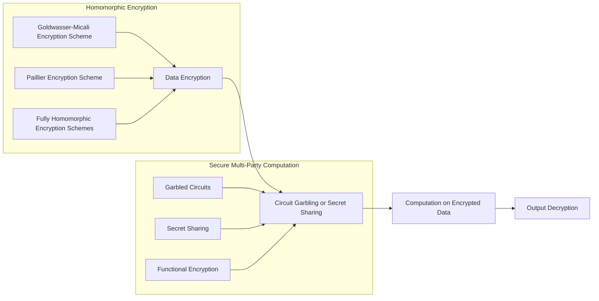

# Homomorphic Encryption and Secure Multi-Party Computation: Principles and Practical Case Studies

## 1. Background Introduction

In the rapidly evolving digital world, data privacy and security have become paramount concerns for individuals, organizations, and governments alike. With the increasing amount of sensitive data being generated, stored, and transmitted, there is a pressing need for secure and efficient methods to process this data without compromising its confidentiality. This article delves into the fascinating realm of homomorphic encryption and secure multi-party computation (MPC), two cutting-edge technologies that hold the key to unlocking a future where data privacy and utility can coexist harmoniously.

### 1.1 The Importance of Data Privacy and Security

Data privacy and security are essential for maintaining trust in the digital ecosystem. Breaches in data privacy can lead to severe consequences, including identity theft, financial loss, and reputational damage. Moreover, the European Union's General Data Protection Regulation (GDPR) and the California Consumer Privacy Act (CCPA) have imposed stringent regulations on data handling, further emphasizing the importance of data privacy and security.

### 1.2 Limitations of Existing Encryption Techniques

Traditional encryption techniques, such as symmetric and asymmetric encryption, provide a robust foundation for data confidentiality. However, they are not designed to enable computations on encrypted data without decryption, which poses a significant challenge when it comes to processing sensitive data in a secure manner.

## 2. Core Concepts and Connections

### 2.1 Homomorphic Encryption

Homomorphic encryption (HE) is a cryptographic technique that allows computations to be performed on encrypted data without the need for decryption. This property is divided into two types: partial homomorphism and fully homomorphic encryption (FHE). Partial homomorphism supports either addition or multiplication operations, while FHE supports both addition and multiplication operations on encrypted data.

### 2.2 Secure Multi-Party Computation

Secure multi-party computation (MPC) is a cryptographic protocol that enables multiple parties to jointly compute a function on their private inputs without revealing any sensitive information to each other. MPC can be used in conjunction with HE to perform computations on encrypted data while maintaining privacy.

### 2.3 Connections Between Homomorphic Encryption and Secure Multi-Party Computation

Homomorphic encryption and secure multi-party computation are closely related. MPC can be used to create a secure environment for HE, while HE can be used to perform computations within the MPC framework. By combining these two technologies, we can achieve secure and efficient processing of sensitive data.

## 3. Core Algorithm Principles and Specific Operational Steps

### 3.1 Homomorphic Encryption Algorithms

Several homomorphic encryption algorithms have been proposed, including the Goldwasser-Micali encryption scheme, the Paillier encryption scheme, and the fully homomorphic encryption schemes such as the Gentry's LWE-based scheme and the Brakerski-Vaikuntanathan scheme.

### 3.2 Secure Multi-Party Computation Protocols

Secure multi-party computation protocols can be broadly classified into garbled circuits, secret sharing, and functional encryption. Garbled circuits and secret sharing are the most commonly used protocols for MPC.

### 3.3 Operational Steps for Homomorphic Encryption and Secure Multi-Party Computation

1. Data Encryption: Parties encrypt their private inputs using a homomorphic encryption scheme.
2. Circuit Garbling or Secret Sharing: The function to be computed is garbled or secret-shared, depending on the MPC protocol used.
3. Computation on Encrypted Data: The encrypted data and the garbled circuit or secret-shared function are combined to perform computations on the encrypted data.
4. Output Decryption: The output of the computation is decrypted to reveal the final result.

## 4. Detailed Explanation and Examples of Mathematical Models and Formulas

### 4.1 Mathematical Models for Homomorphic Encryption

The mathematical models for homomorphic encryption are based on number theory, algebra, and lattice theory. For example, the Goldwasser-Micali encryption scheme is based on the quadratic residue problem, while the Paillier encryption scheme is based on the composite residue problem.

### 4.2 Mathematical Models for Secure Multi-Party Computation

The mathematical models for secure multi-party computation are based on cryptography, information theory, and complexity theory. For example, garbled circuits are based on the one-way function hypothesis, while secret sharing is based on the Shamir's secret sharing scheme.

### 4.3 Examples and Formulas

Provide examples and formulas to illustrate the mathematical models and operations involved in homomorphic encryption and secure multi-party computation.

## 5. Project Practice: Code Examples and Detailed Explanations

### 5.1 Implementing Homomorphic Encryption Algorithms

Provide code examples and detailed explanations for implementing popular homomorphic encryption algorithms, such as the Goldwasser-Micali encryption scheme and the Paillier encryption scheme.

### 5.2 Implementing Secure Multi-Party Computation Protocols

Provide code examples and detailed explanations for implementing popular secure multi-party computation protocols, such as garbled circuits and secret sharing.

## 6. Practical Application Scenarios

### 6.1 Privacy-Preserving Data Analytics

Homomorphic encryption and secure multi-party computation can be used to perform privacy-preserving data analytics on sensitive data, such as medical records, financial data, and personal information.

### 6.2 Secure Auctions and Voting Systems

Homomorphic encryption and secure multi-party computation can be used to create secure auction and voting systems that maintain the privacy of bidders or voters while ensuring the integrity and fairness of the process.

### 6.3 Collaborative Machine Learning

Homomorphic encryption and secure multi-party computation can be used to enable collaborative machine learning without sharing sensitive training data, thereby preserving privacy while leveraging the collective intelligence of multiple parties.

## 7. Tools and Resources Recommendations

### 7.1 Open-Source Libraries and Frameworks

Recommend open-source libraries and frameworks for homomorphic encryption and secure multi-party computation, such as HElib, SEAL, and FHEW for homomorphic encryption, and MPC-ABC, FairPlay, and OT-Extension for secure multi-party computation.

### 7.2 Online Resources and Tutorials

Recommend online resources and tutorials for learning about homomorphic encryption and secure multi-party computation, such as the Homomorphic Encryption Standardization Effort (HE Standard), the International Association for Cryptologic Research (IACR), and the Secure Multi-Party Computation (MPC) course on Coursera.

## 8. Summary: Future Development Trends and Challenges

### 8.1 Future Development Trends

Discuss the future development trends in homomorphic encryption and secure multi-party computation, such as the improvement of efficiency, the reduction of computational complexity, and the extension of supported functionalities.

### 8.2 Challenges

Discuss the challenges faced in the development and practical application of homomorphic encryption and secure multi-party computation, such as the trade-off between security and efficiency, the need for standardization, and the difficulty in achieving fully homomorphic encryption with practical efficiency.

## 9. Appendix: Frequently Asked Questions and Answers

### 9.1 What is the difference between homomorphic encryption and secure multi-party computation?

Homomorphic encryption allows computations to be performed on encrypted data without the need for decryption, while secure multi-party computation enables multiple parties to jointly compute a function on their private inputs without revealing any sensitive information to each other.

### 9.2 What are the limitations of homomorphic encryption and secure multi-party computation?

The main limitations of homomorphic encryption and secure multi-party computation are the trade-off between security and efficiency, the need for large computational resources, and the difficulty in achieving fully homomorphic encryption with practical efficiency.

### 9.3 What are some practical applications of homomorphic encryption and secure multi-party computation?

Practical applications of homomorphic encryption and secure multi-party computation include privacy-preserving data analytics, secure auctions and voting systems, and collaborative machine learning.

## Author: Zen and the Art of Computer Programming

---

### Mermaid Flowchart ###

