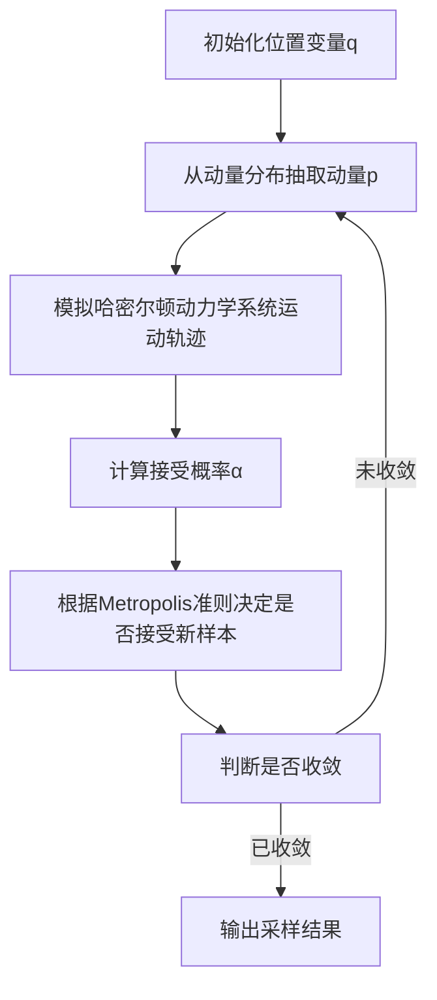

# 哈密尔顿蒙特卡罗(HMC)原理与代码实战案例讲解

## 1. 背景介绍

### 1.1 概述

哈密尔顿蒙特卡罗(Hamiltonian Monte Carlo, HMC)是一种用于采样复杂概率分布的高效马尔可夫链蒙特卡罗(MCMC)算法。它结合了哈密尔顿动力学和蒙特卡罗采样的优点,能够更好地探索参数空间,提高采样效率。HMC在机器学习、统计物理、量子化学等领域有广泛应用。

### 1.2 传统MCMC采样方法的局限性

传统的MCMC采样方法,如Metropolis-Hastings算法和Gibbs采样,在处理高维复杂分布时容易陷入随机游走的困境,导致收敛缓慢。这些算法通过局部探索来构建马尔可夫链,但在高维空间中,由于维数灾难的影响,局部探索很容易被困在局部区域,无法有效地探索整个参数空间。

### 1.3 HMC算法的优势

相比之下,HMC算法利用了参数空间中的几何结构信息,通过模拟哈密尔顿动力学系统的运动来探索参数空间。这种基于动力学的探索方式能够更好地捕捉参数空间的全局结构,从而提高采样效率。HMC算法还具有如下优势:

- 能够有效处理高维、复杂的概率分布
- 能够自动调整步长,适应不同的参数空间
- 采样轨迹具有较高的接受率,减少了计算浪费

## 2. 核心概念与联系

### 2.1 哈密尔顿动力学系统

HMC算法的核心思想源自于哈密尔顿动力学系统。在这种系统中,粒子的运动受到位能和动能的共同作用。通过模拟粒子在这种动力学系统中的运动轨迹,我们可以探索参数空间。

哈密尔顿动力学系统由以下几个要素组成:

- 位置变量(Position)$q$:对应待采样的参数
- 动量变量(Momentum)$p$:辅助变量,用于探索参数空间
- 位能(Potential Energy)$U(q)$:对应概率分布的对数密度函数
- 动能(Kinetic Energy)$K(p)$:通常采用高斯分布
- 哈密尔顿量(Hamiltonian)$H(q,p) = U(q) + K(p)$:系统的总能量

哈密尔顿动力学系统的运动由哈密尔顿方程描述:

$$
\begin{aligned}
\frac{dq}{dt} &= \frac{\partial H}{\partial p} \\
\frac{dp}{dt} &= -\frac{\partial H}{\partial q}
\end{aligned}
$$

### 2.2 HMC算法流程

HMC算法的基本流程如下:

1. 初始化位置变量$q$,从先验分布或上一个样本开始
2. 从动量分布(通常为标准高斯分布)中抽取动量变量$p$
3. 通过数值积分方法(如欧拉法或离子跃迁法)模拟哈密尔顿动力学系统的运动轨迹,得到新的位置和动量$(q^*,p^*)$
4. 计算接受概率$\alpha$,根据Metropolis准则决定是否接受新样本$q^*$
5. 重复步骤2-4,直到收敛

在这个过程中,动量变量$p$充当了一种辅助变量的角色,帮助探索参数空间。通过模拟粒子在哈密尔顿动力学系统中的运动,HMC算法能够更好地捕捉参数空间的几何结构,从而提高采样效率。



## 3. 核心算法原理具体操作步骤

### 3.1 初始化

首先,我们需要初始化位置变量$q$。这可以从先验分布中抽取,或者使用上一个采样结果作为初始值。

### 3.2 抽取动量变量

接下来,我们需要从动量分布中抽取动量变量$p$。通常情况下,动量分布采用标准高斯分布:

$$p \sim \mathcal{N}(0, I)$$

其中$I$是单位矩阵。

### 3.3 模拟哈密尔顿动力学系统

现在,我们需要模拟哈密尔顿动力学系统的运动轨迹,以探索参数空间。这通常通过数值积分方法来实现,如欧拉法或离子跃迁法。

对于欧拉法,我们将时间离散化为$L$个步长$\epsilon$,其中$L\epsilon = \tau$是总的模拟时间。在每个时间步长$\epsilon$,我们根据哈密尔顿方程更新位置和动量变量:

$$
\begin{aligned}
p_{t+\epsilon} &= p_t - \epsilon \frac{\partial U(q_t)}{\partial q_t} \\
q_{t+\epsilon} &= q_t + \epsilon \frac{\partial K(p_{t+\epsilon})}{\partial p_{t+\epsilon}}
\end{aligned}
$$

这个过程重复$L$次,得到新的位置和动量$(q^*,p^*)$。

离子跃迁法是一种更精确的数值积分方法,它将一个时间步长$\epsilon$分成多个更小的子步长,从而提高数值积分的精度。

### 3.4 计算接受概率

模拟完哈密尔顿动力学系统的运动轨迹后,我们需要计算接受新样本$q^*$的概率$\alpha$。这个概率由Metropolis准则给出:

$$\alpha = \min\left(1, \exp\left(-H(q^*,p^*) + H(q,p)\right)\right)$$

其中$H(q,p)$和$H(q^*,p^*)$分别是初始和最终状态的哈密尔顿量。

### 3.5 决定是否接受新样本

根据计算出的接受概率$\alpha$,我们可以决定是否接受新样本$q^*$。具体来说,我们从均匀分布$\mathcal{U}(0,1)$中抽取一个随机数$u$,如果$u < \alpha$,则接受新样本;否则,保留旧样本。

### 3.6 判断收敛

重复上述步骤,直到马尔可夫链收敛。判断收敛的标准有多种,例如检查样本的自相关性、计算有效样本大小等。

## 4. 数学模型和公式详细讲解举例说明

### 4.1 哈密尔顿动力学系统

在HMC算法中,我们模拟了一个哈密尔顿动力学系统的运动轨迹。这个系统由以下几个要素组成:

- 位置变量(Position)$q$:对应待采样的参数
- 动量变量(Momentum)$p$:辅助变量,用于探索参数空间
- 位能(Potential Energy)$U(q)$:对应概率分布的对数密度函数,即$U(q) = -\log\pi(q)$
- 动能(Kinetic Energy)$K(p)$:通常采用高斯分布,即$K(p) = \frac{1}{2}p^TM^{-1}p$,其中$M$是质量矩阵
- 哈密尔顿量(Hamiltonian)$H(q,p) = U(q) + K(p)$:系统的总能量

这个系统的运动由哈密尔顿方程描述:

$$
\begin{aligned}
\frac{dq}{dt} &= \frac{\partial H}{\partial p} = M^{-1}p \\
\frac{dp}{dt} &= -\frac{\partial H}{\partial q} = -\frac{\partial U(q)}{\partial q}
\end{aligned}
$$

我们可以通过数值积分方法,如欧拉法或离子跃迁法,来模拟这个系统的运动轨迹。

### 4.2 欧拉法

欧拉法是一种简单的数值积分方法。对于一个时间步长$\epsilon$,我们根据哈密尔顿方程更新位置和动量变量:

$$
\begin{aligned}
p_{t+\epsilon} &= p_t - \epsilon \frac{\partial U(q_t)}{\partial q_t} \\
q_{t+\epsilon} &= q_t + \epsilon M^{-1}p_{t+\epsilon}
\end{aligned}
$$

这个过程重复$L$次,其中$L\epsilon = \tau$是总的模拟时间。最终,我们得到新的位置和动量$(q^*,p^*)$。

### 4.3 离子跃迁法

离子跃迁法是一种更精确的数值积分方法。它将一个时间步长$\epsilon$分成多个更小的子步长,从而提高数值积分的精度。

对于一个时间步长$\epsilon$,离子跃迁法的更新规则如下:

$$
\begin{aligned}
p_{t+\epsilon/2} &= p_t - \frac{\epsilon}{2} \frac{\partial U(q_t)}{\partial q_t} \\
q_{t+\epsilon} &= q_t + \epsilon M^{-1}p_{t+\epsilon/2} \\
p_{t+\epsilon} &= p_{t+\epsilon/2} - \frac{\epsilon}{2} \frac{\partial U(q_{t+\epsilon})}{\partial q_{t+\epsilon}}
\end{aligned}
$$

这个过程重复$L$次,得到新的位置和动量$(q^*,p^*)$。

离子跃迁法的优点是能够更好地保持哈密尔顿量的守恒性,从而提高采样效率。

### 4.4 接受概率

在模拟完哈密尔顿动力学系统的运动轨迹后,我们需要计算接受新样本$q^*$的概率$\alpha$。这个概率由Metropolis准则给出:

$$\alpha = \min\left(1, \exp\left(-H(q^*,p^*) + H(q,p)\right)\right)$$

其中$H(q,p)$和$H(q^*,p^*)$分别是初始和最终状态的哈密尔顿量。

这个接受概率的公式可以确保HMC算法收敛到正确的平稳分布。

### 4.5 示例:采样二维高斯分布

现在,我们用一个简单的示例来说明HMC算法的工作原理。假设我们想要从一个二维高斯分布$\mathcal{N}(\mu, \Sigma)$中采样,其中$\mu = (0, 0)^T$,

$$\Sigma = \begin{pmatrix}
1 & 0.9 \\
0.9 & 1
\end{pmatrix}$$

我们可以定义位能函数为:

$$U(q) = \frac{1}{2}(q - \mu)^T\Sigma^{-1}(q - \mu)$$

动能函数为:

$$K(p) = \frac{1}{2}p^Tp$$

哈密尔顿量为:

$$H(q,p) = U(q) + K(p)$$

使用欧拉法模拟哈密尔顿动力学系统的运动轨迹,并根据Metropolis准则决定是否接受新样本。经过多次迭代,我们可以得到该高斯分布的采样结果。

## 5. 项目实践:代码实例和详细解释说明

以下是使用Python实现HMC算法采样二维高斯分布的代码示例:

```python
import numpy as np
import matplotlib.pyplot as plt

# 定义目标分布参数
mu = np.array([0, 0])
cov = np.array([[1, 0.9], [0.9, 1]])

# 定义位能函数
def U(q):
    return 0.5 * np.dot(np.dot(q - mu, np.linalg.inv(cov)), q - mu)

# 定义动能函数
def K(p):
    return 0.5 * np.dot(p, p)

# 定义哈密尔顿量函数
def H(q, p):
    return U(q) + K(p)

# HMC采样函数
def hmc_sample(q0, n_samples, n_leapfrog_steps, step_size, burn_in=0):
    samples = np.zeros((n_samples, 2))
    q = q0
    for i in range(n_samples + burn_in):
        p = np.random.randn(2)  # 从标准高斯分布抽取动量
        q_new, p_new = leapfrog(q, p, n_leapfrog