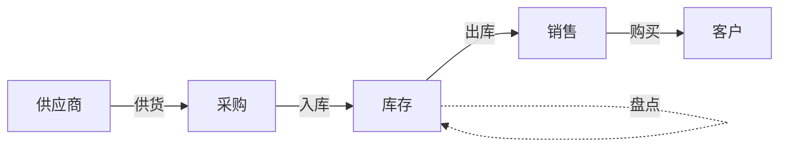

# 商品销售管理系统(进销存)系统详细设计与具体代码实现

## 1. 背景介绍

在当今竞争激烈的商业环境中,企业对高效、可靠的销售管理系统的需求日益增长。一个优秀的商品销售管理系统不仅可以帮助企业实现销售业务的自动化和规范化管理,还能为企业的决策提供数据支持,从而提高企业的竞争力。本文将详细介绍一个基于Java技术的商品销售管理(进销存)系统的设计与实现。

### 1.1 系统概述

商品销售管理系统是一个集进货、销售、库存管理于一体的综合性业务管理系统。系统主要包括基础信息管理、采购管理、销售管理、库存管理、统计报表等模块。通过该系统,可以实现商品信息、供应商信息、客户信息等基础数据的管理,同时对采购、销售、库存等业务进行全面管控,并能够生成各类统计报表,为企业经营决策提供数据支持。

### 1.2 系统目标

本系统的主要目标包括:

1. 实现商品、供应商、客户等基础信息的规范化管理
2. 实现采购、销售、库存等业务流程的自动化和规范化管理  
3. 实现库存预警、自动补货等智能化管理
4. 提供完善的统计报表功能,为企业经营分析提供数据支持
5. 具有良好的系统性能,保证业务高效、稳定运行

## 2. 核心概念与关联

在商品销售管理系统中,涉及到一些核心概念,下面我们来了解一下:

### 2.1 商品(Product)

商品是指企业采购并销售的各类物品。每个商品都有货号、名称、规格、单位、进价、售价等属性。系统支持商品信息的录入、修改、删除等操作。

### 2.2 供应商(Supplier)  

供应商是指向企业供应商品的厂商或代理商。每个供应商有编号、名称、联系人、联系电话、地址等信息。系统支持供应商信息的管理。

### 2.3 客户(Customer)

客户是指从企业购买商品的单位或个人。每个客户有编号、名称、联系人、联系电话、地址等信息,重点客户还有信用额度等信息。

### 2.4 采购(Purchase)

采购是指企业从供应商处购进商品的业务活动。每笔采购单包括单号、采购日期、供应商、采购商品明细、金额、付款状态等信息。

### 2.5 销售(Sale) 

销售是指企业将商品销售给客户的业务活动。每笔销售单包括单号、销售日期、客户、销售商品明细、金额、收款状态等信息。

### 2.6 库存(Inventory)

库存是指企业持有的商品数量。系统对库存进行实时更新,并可设置库存预警值。当某商品库存低于预警值时,系统自动提示需要补货。

以下是这些核心概念之间的关联关系:



从图中可以看出,供应商通过采购向企业供应商品,采购的商品入库后增加库存,销售业务从库存中出库商品,客户通过销售购买商品。同时,系统还支持对库存商品的盘点。

## 3. 核心算法原理与操作步骤

在商品销售管理系统中,涉及到一些核心算法,如库存预警、自动补货等。下面我们以库存预警为例,介绍其原理和实现步骤。

### 3.1 库存预警原理

库存预警是指当商品库存数量低于预设的安全库存值时,系统自动预警提示需要补货。其核心原理可以用以下公式表示:

$预警值 = 日均销量 \times 提前期$

其中,日均销量是指一定时间内(如最近30天)的平均日销量,提前期是指从发出采购订单到货物入库的时间间隔。

### 3.2 库存预警实现步骤

1. 设置预警参数:在系统中为每个商品设置安全库存天数和提前期天数。

2. 计算日均销量:定期(如每天)计算每个商品最近一段时间(如30天)的日均销量。可以使用如下SQL语句:

```sql
SELECT p.product_id, SUM(d.quantity)/30 AS daily_sale
FROM sale_order o 
JOIN sale_order_detail d ON o.order_id = d.order_id
JOIN product p ON d.product_id = p.product_id
WHERE o.date BETWEEN DATE_SUB(NOW(), INTERVAL 30 DAY) AND NOW()
GROUP BY p.product_id;
```

3. 计算预警值:根据上面的公式,计算每个商品的预警值,可以使用如下SQL语句:

```sql
SELECT 
    p.product_id,
    p.name,
    p.safety_stock_days,
    p.lead_time_days,
    ds.daily_sale,
    p.safety_stock_days * ds.daily_sale AS warning_value
FROM product p
JOIN (
    SELECT product_id, SUM(quantity)/30 AS daily_sale 
    FROM sale_order_detail
    WHERE date BETWEEN DATE_SUB(NOW(), INTERVAL 30 DAY) AND NOW()
    GROUP BY product_id
) ds ON p.product_id = ds.product_id;
```

4. 比较库存与预警值:定期(如每天)比较每个商品的当前库存与预警值,如果库存低于预警值,则给出预警提示。可以使用如下SQL语句:

```sql
SELECT
    p.product_id,
    p.name,
    p.stock AS current_stock,
    wv.warning_value,
    (CASE WHEN p.stock < wv.warning_value THEN 'Y' ELSE 'N' END) AS warning
FROM product p
JOIN (
    SELECT
        p.product_id,
        p.safety_stock_days * ds.daily_sale AS warning_value
    FROM product p
    JOIN (
        SELECT product_id, SUM(quantity)/30 AS daily_sale
        FROM sale_order_detail
        WHERE date BETWEEN DATE_SUB(NOW(), INTERVAL 30 DAY) AND NOW()  
        GROUP BY product_id
    ) ds ON p.product_id = ds.product_id
) wv ON p.product_id = wv.product_id;
```

通过以上步骤,就可以实现对商品库存的预警功能。当预警提示出现时,采购人员可以及时下达采购订单,保证库存充足。

## 4. 数学模型和公式详解

在商品销售管理系统中,除了上面提到的库存预警公式,还有一些其他常用的数学模型和公式,如经济订货批量(EOQ)模型、销售预测模型等。下面我们以经济订货批量模型为例进行讲解。

### 4.1 经济订货批量(EOQ)模型

经济订货批量(Economic Order Quantity,EOQ)是指在一定时期内,企业为满足一定的需求量,所订购的最佳经济批量,使得总存储成本和总订货成本之和达到最低。其计算公式为:

$$EOQ = \sqrt{\frac{2DS}{H}}$$

其中,各符号含义如下:  

- $EOQ$:经济订货批量
- $D$:一定时期内的需求量  
- $S$:每次订货的固定费用
- $H$:单位商品的储存成本

通过求解该模型,可以得到最优的订货批量,在保证供应的同时,最小化总成本。

### 4.2 EOQ模型的应用示例

假设某商品的年需求量为1000件,每次订货的固定费用为100元,单位商品的年储存成本为2元。那么其经济订货批量为:

$$EOQ = \sqrt{\frac{2\times 1000 \times 100}{2}} = 100$$

这表明,该商品每次订货100件是最经济的,此时总成本最低。

在系统中,可以为每个商品设置其年需求量、订货固定费用、单位储存成本等参数,当需要采购时,自动根据EOQ模型计算建议的订货量,采购人员可以参考执行。这样可以在保证供应的同时,降低采购和库存成本。

## 5. 项目实践:代码实例与详解

下面我们通过一些代码实例,来了解商品销售管理系统的具体实现。我们将使用Java语言和Spring Boot框架进行开发。

### 5.1 商品管理模块

商品是系统的核心实体之一,我们首先来看看商品的实体类设计:

```java
@Entity
@Table(name = "product")
public class Product {
    @Id
    @GeneratedValue(strategy = GenerationType.IDENTITY) 
    private Long id; //商品ID
    
    private String productNo; //商品编号
    
    private String name; //商品名称
    
    private String spec; //规格
    
    private String unit; //单位
    
    private BigDecimal purchasePrice; //进价
    
    private BigDecimal salePrice; //售价
    
    private BigDecimal safetyStock; //安全库存
    
    private Integer safetyStockDays; //安全库存天数
    
    private Integer leadTimeDays; //提前期天数
    
    //getter和setter方法
}
```

对应的Controller类如下:

```java
@RestController
@RequestMapping("/products")
public class ProductController {

    @Autowired
    private ProductService productService;

    @GetMapping
    public List<Product> getAllProducts() {
        return productService.getAllProducts();
    }
    
    @GetMapping("/{id}")
    public Product getProductById(@PathVariable Long id) {
        return productService.getProductById(id);
    }
    
    @PostMapping
    public Product createProduct(@RequestBody Product product) {
        return productService.createProduct(product);
    }
    
    @PutMapping("/{id}")
    public Product updateProduct(@PathVariable Long id, @RequestBody Product product) {
        return productService.updateProduct(id, product);
    }
    
    @DeleteMapping("/{id}")
    public void deleteProduct(@PathVariable Long id) {
        productService.deleteProduct(id);
    }
}
```

Service实现类:

```java
@Service
public class ProductServiceImpl implements ProductService {

    @Autowired
    private ProductRepository productRepository;
    
    @Override
    public List<Product> getAllProducts() {
        return productRepository.findAll();
    }
    
    @Override
    public Product getProductById(Long id) {
        return productRepository.findById(id).orElse(null);
    }
    
    @Override
    public Product createProduct(Product product) {
        return productRepository.save(product);
    }
    
    @Override
    public Product updateProduct(Long id, Product product) {
        Product existingProduct = productRepository.findById(id).orElse(null);
        if (existingProduct != null) {
            BeanUtils.copyProperties(product, existingProduct);
            return productRepository.save(existingProduct);
        }
        return null;
    }
    
    @Override
    public void deleteProduct(Long id) {
        productRepository.deleteById(id);
    }
}
```

### 5.2 销售管理模块

销售订单是另一个核心实体,其设计如下:

```java
@Entity
@Table(name = "sale_order")
public class SaleOrder {
    @Id
    @GeneratedValue(strategy = GenerationType.IDENTITY)
    private Long id; //订单ID
    
    private String orderNo; //订单编号
    
    private Date createTime; //下单时间
    
    @ManyToOne
    @JoinColumn(name = "customer_id")
    private Customer customer; //客户
    
    @OneToMany(mappedBy = "order", cascade = CascadeType.ALL)
    private List<SaleItem> items = new ArrayList<>(); //订单明细
    
    private BigDecimal totalAmount; //订单总金额
    
    private Integer status; //订单状态
    
    //getter和setter方法
}

@Entity
@Table(name = "sale_item")
public class SaleItem {
    @Id
    @GeneratedValue(strategy = GenerationType.IDENTITY)
    private Long id; //明细ID
    
    @ManyToOne
    @JoinColumn(name = "order_id")
    private SaleOrder order; //所属订单
    
    @ManyToOne
    @JoinColumn(name = "product_id")    
    private Product product; //商品
    
    private BigDecimal price; //销售价格
    
    private Integer quantity; //数量
    
    private BigDecimal amount; //小计金额
    
    //getter和setter方法
}
```

对应的Controller类:

```java
@RestController
@RequestMapping("/sales")
public class SaleController {

    @Autowired
    private SaleService saleService;
    
    @PostMapping
    public SaleOrder createSaleOrder(@RequestBody SaleOrder saleOrder) {
        return saleService.createSaleOrder(saleOrder);
    }
    
    @GetMapping("/{id}")
    public SaleOrder getSaleOrderById(@PathVariable Long id) {
        return saleService.getSaleOrderById(id);
    }
    
    @GetMapping
    public List<SaleOrder> getAllSaleOrders() {
        return saleService.getAllSaleOrders();
    }
}
```

Service实现类:

```java
@Service
public class SaleServiceImpl implements SaleService {

    @Autowired
    private SaleOrderRepository saleOrderRepository;
    
    @Autowired
    private ProductService productService