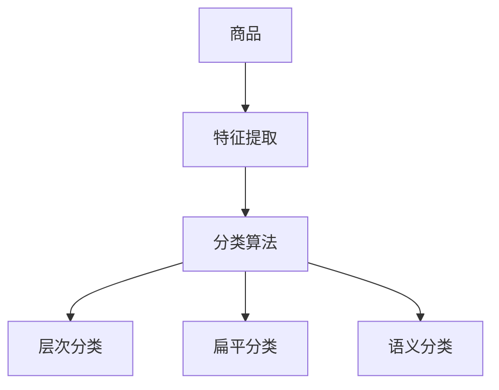
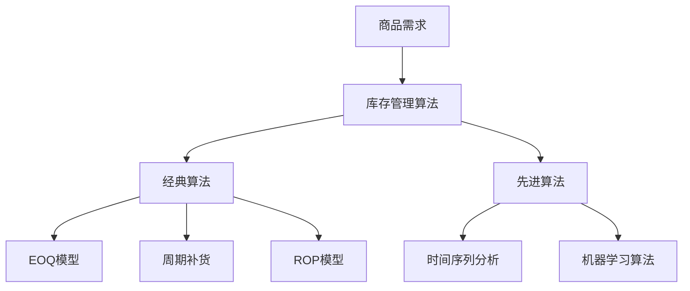
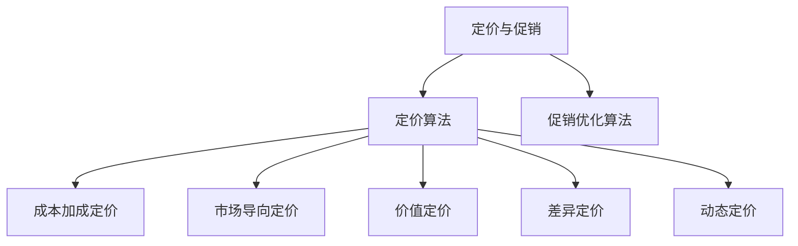
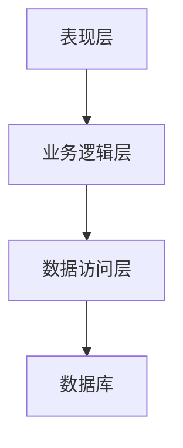
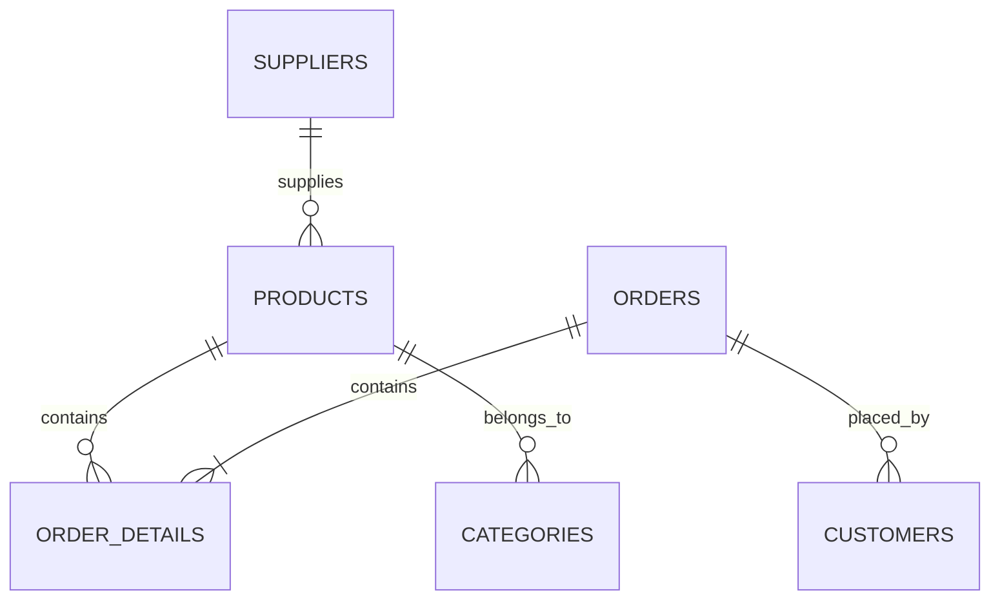

# 商场商品管理系统详细设计与具体代码实现

## 1.背景介绍

随着电子商务的快速发展,商场商品管理系统已成为现代零售业务中不可或缺的重要组成部分。商品管理系统旨在高效管理商品信息、库存、定价、促销活动等,确保商品供应链的顺畅运行。本文将详细介绍商场商品管理系统的设计与实现,为读者提供实用的技术指导。

## 2.核心概念与联系

商品管理系统的核心概念包括:

1. **商品(Product)**: 指系统中销售的实体商品,包括基本信息、价格、库存等属性。

2. **类别(Category)**: 商品按一定规则划分的组,方便检索和管理。

3. **供应商(Supplier)**: 提供商品的上游企业,系统需存储其基本信息。

4. **订单(Order)**: 顾客下单购买商品时生成的订单记录。

5. **库存(Inventory)**: 系统中每种商品的现有库存量。

6. **促销(Promotion)**: 各种促销活动,如打折、买赠等。

这些概念相互关联,构成了商品管理的完整业务流程。

## 3.核心算法原理具体操作步骤

### 3.1 商品分类算法

为有效管理海量商品,需对商品进行合理分类。常用的分类算法有:

1. **层次分类算法**: 根据商品特征,将其划分为不同层级的类别。如电子产品 -> 手机 -> 智能手机。

2. **扁平分类算法**: 将所有商品平行划分为多个类别,无层级关系。

3. **基于语义的分类算法**: 利用自然语言处理技术,根据商品描述自动归类。



### 3.2 库存管理算法

精准的库存管理对商品供应链至关重要,主要算法包括:

1. **经典算法**:
    - 经济订货量(EOQ)模型: 确定每次进货的最佳数量。
    - 周期补货策略: 根据固定周期补货,确保库存不断加注。
    - 再订购点(ROP)模型: 当库存达到设定点时,触发补货。

2. **先进算法**:
    - 时间序列分析: 基于历史数据预测未来需求。
    - 机器学习算法: 训练模型预测商品需求,优化库存管理。



### 3.3 定价与促销策略

合理的定价与促销策略对盈利能力至关重要,核心算法有:

1. **成本加成定价法**: 在商品成本基础上加一定比例作为利润。

2. **市场导向定价法**: 根据市场行情与竞争对手报价确定价格。

3. **价值定价法**: 根据顾客对商品的价值评估确定价格。

4. **差异定价法**: 对不同顾客群体采取不同的定价策略。

5. **动态定价算法**: 实时分析市场供需,动态调整商品价格。

6. **促销优化算法**: 确定最佳的促销时间、力度和范围。



## 4.数学模型和公式详细讲解举例说明

### 4.1 经济订货量(EOQ)模型

EOQ模型用于确定每次进货的最优数量,以期在订货成本和库存成本之间达到平衡。模型公式如下:

$$EOQ = \sqrt{\frac{2DC_o}{C_h}}$$

其中:
- $D$: 年度需求量
- $C_o$: 每次订货的固定成本
- $C_h$: 每单位商品的年度库存持有成本

**示例**: 某商品年需求量为10000件,每次订货固定成本为200元,每件商品的年库存成本为5元,求最优订货量。

$$EOQ = \sqrt{\frac{2 \times 10000 \times 200}{5}} \approx 632 (件)$$

因此,最优订货量为632件。

### 4.2 再订购点(ROP)模型

ROP模型用于确定何时应该下单补货,以免库存耗尽。公式为:

$$ROP = dL + SS$$

其中:
- $d$: 每期需求量(单位时间内平均需求量)
- $L$: 订货延迟期(从下订单到收货所需时间)
- $SS$: 安全库存量(应对需求波动的额外库存)

**示例**: 某商品每周需求量为500件,订货延迟期为2周,为应对需求波动,需保有安全库存1000件,求再订购点。

$$ROP = 500 \times 2 + 1000 = 2000 (件)$$

因此,当库存量降至2000件时,应该下单补货。

### 4.3 成本加成定价法

成本加成定价法是最常见的定价方法,公式为:

$$价格 = 成本 \times (1 + 期望利润率)$$

**示例**: 某商品成本为80元,期望利润率为25%,求应定价格。

$$价格 = 80 \times (1 + 0.25) = 100 (元)$$

因此,该商品应定价为100元。

## 5.项目实践:代码实例和详细解释说明

### 5.1 系统架构

我们采用经典的三层架构设计,包括表现层(前端)、业务逻辑层(后端)和数据访问层。



### 5.2 数据库设计

我们使用关系型数据库存储系统数据,核心表包括:

- 商品(products)表: 存储商品基本信息
- 类别(categories)表: 存储商品类别信息
- 供应商(suppliers)表: 存储供应商信息
- 订单(orders)表: 存储订单信息
- 订单明细(order_details)表: 存储订单中商品明细



### 5.3 后端实现(Python Django)

#### 5.3.1 商品模型

```python
from django.db import models

class Category(models.Model):
    name = models.CharField(max_length=100)
    parent = models.ForeignKey('self', on_delete=models.CASCADE, null=True, blank=True)

class Product(models.Model):
    name = models.CharField(max_length=200)
    description = models.TextField()
    price = models.DecimalField(max_digits=10, decimal_places=2)
    category = models.ForeignKey(Category, on_delete=models.CASCADE)
    supplier = models.ForeignKey('Supplier', on_delete=models.CASCADE)
    stock = models.PositiveIntegerField(default=0)

class Supplier(models.Model):
    name = models.CharField(max_length=200)
    email = models.EmailField()
    phone = models.CharField(max_length=20)
```

#### 5.3.2 视图函数

```python
from django.shortcuts import render, get_object_or_404
from .models import Product, Category

def product_list(request, category_id=None):
    category = None
    categories = Category.objects.all()
    products = Product.objects.filter(available=True)
    if category_id:
        category = get_object_or_404(Category, id=category_id)
        products = products.filter(category=category)
    return render(request, 'shop/product/list.html', {'category': category,
                                                      'categories': categories,
                                                      'products': products})
```

### 5.4 前端实现(React)

#### 5.4.1 商品列表组件

```jsx
import React, { useState, useEffect } from 'react';
import axios from 'axios';

const ProductList = () => {
  const [products, setProducts] = useState([]);

  useEffect(() => {
    const fetchProducts = async () => {
      const response = await axios.get('/api/products/');
      setProducts(response.data);
    };
    fetchProducts();
  }, []);

  return (
    <div>
      <h2>Product List</h2>
      <ul>
        {products.map((product) => (
          <li key={product.id}>{product.name} - ${product.price}</li>
        ))}
      </ul>
    </div>
  );
};

export default ProductList;
```

#### 5.4.2 购物车组件

```jsx
import React, { useState } from 'react';

const ShoppingCart = () => {
  const [cartItems, setCartItems] = useState([]);

  const addToCart = (product) => {
    setCartItems([...cartItems, product]);
  };

  const removeFromCart = (productId) => {
    setCartItems(cartItems.filter((item) => item.id !== productId));
  };

  return (
    <div>
      <h2>Shopping Cart</h2>
      <ul>
        {cartItems.map((item) => (
          <li key={item.id}>
            {item.name} - ${item.price}
            <button onClick={() => removeFromCart(item.id)}>Remove</button>
          </li>
        ))}
      </ul>
      <p>Total: ${cartItems.reduce((total, item) => total + item.price, 0)}</p>
    </div>
  );
};

export default ShoppingCart;
```

以上代码展示了使用Python Django框架构建后端API,以及使用React构建前端界面的基本实现。实际项目中,还需要添加更多功能和错误处理逻辑。

## 6.实际应用场景

商场商品管理系统在现代零售业中有着广泛的应用,主要场景包括但不限于:

1. **大型连锁商超**: 如沃尔玛、家乐福等,需精准管理上万种商品。

2. **电子商务平台**: 如亚马逊、淘宝等,每天处理大量订单。

3. **线上线下一体化零售**: 实现商品信息和库存的无缝对接。

4. **分销和供应链管理**: 高效协调上下游企业的商品流通。

5. **智能仓储物流系统**: 实时监控和调度商品库存。

6. **移动商务应用**: 为用户提供优质的购物体验。

通过高效的商品管理系统,企业能够提高运营效率、降低成本、优化供应链、增强竞争力。

## 7.工具和资源推荐

在构建商品管理系统时,可以利用以下工具和资源:

1. **Python Django框架**: 功能强大的Python Web框架,提供完整的MVC架构。

2. **React前端框架**: 构建现代化、高性能的用户界面。

3. **PostgreSQL数据库**: 稳定高效的开源关系型数据库。

4. **NumPy和Pandas**: 用于数据分析和算法实现。

5. **Scikit-Learn**: 机器学习算法库,用于需求预测等。

6. **Mermaid.js**: 基于JavaScript的图表渲染工具,可绘制流程图等。

7. **LaTex**: 排版数学公式的标记语言。

8. **Git版本控制**: 高效管理项目代码。

9. **云服务平台**: 如AWS、GCP等,提供基础设施和服务。

10. **在线资源**: 技术文档、教程、论坛等,如StackOverflow。

利用这些工具和资源,可以高效地开发和部署商品管理系统。

## 8.总结:未来发展趋势与挑战

商品管理系统将随着技术发展而不断演进,未来的发展趋势包括:

1. **人工智能与大数据分析**: 利用机器学习等技术,实现智能化预测和决策。

2. **物联网与自动化**: 实现商品全生命周期的自动化管理。

3. **云计算与微服务架构**: 提高系统的弹性和可扩展性。

4. **移动互联网与无线技术**: 支持移动端的无缝体验。

5. **增强现实和虚拟现实**: 提升购物体验和可视化能力。

6. **区块链技术**: 确保供应链透明度和信任度。

7. **个性化推荐和营销**: 提供更精准的商品推荐和营销策略。

同时,商品管理系统也面临一些挑战,如数据隐