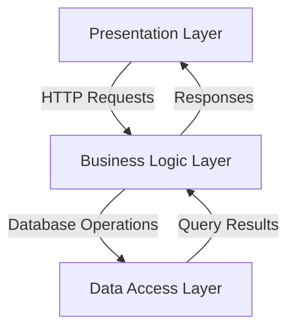

# 图书管理系统详细设计与具体代码实现

## 1. 背景介绍

在当今信息化时代,图书管理系统已成为图书馆、学校和企业等机构的必备工具。图书管理系统可以高效地管理图书资源,提高工作效率,优化用户体验。随着数字化转型的加速,构建一个功能完善、易于使用的图书管理系统变得越来越重要。

图书管理系统的主要功能包括:图书入库、借阅管理、用户管理、报表统计等。通过系统化的管理,可以实现图书资源的集中存储、高效检索和流转控制,从而提高图书资源的利用率。此外,图书管理系统还可以为读者提供在线查询、预约借阅等服务,提升用户体验。

## 2. 核心概念与联系

在深入探讨图书管理系统的设计与实现之前,我们需要了解以下几个核心概念:

1. **图书(Book)**: 图书是图书管理系统的核心实体,包括书名、作者、出版社、ISBN号等属性。
2. **读者(Reader)**: 读者是图书借阅的主体,具有姓名、联系方式等属性。
3. **借阅记录(BorrowRecord)**: 借阅记录记录了读者借阅图书的详细信息,包括借阅日期、应还日期等。
4. **图书分类(BookCategory)**: 图书分类用于对图书进行分类管理,如文学、科技、历史等。

这些核心概念之间存在以下关系:

- 一本图书可以被多个读者借阅,一个读者可以借阅多本图书。
- 每次借阅会生成一条借阅记录。
- 每本图书属于一个图书分类。

## 3. 核心算法原理具体操作步骤

### 3.1 图书入库算法

图书入库是图书管理系统的基础功能,其核心算法步骤如下:

1. 检查图书是否已存在于系统中,通过比对ISBN号或其他唯一标识。
2. 如果图书不存在,则创建新的图书实体,填充图书信息。
3. 将图书实体保存到数据库中。
4. 更新图书库存量。

```python
def add_book(book_info):
    # 检查图书是否已存在
    existing_book = Book.query.filter_by(isbn=book_info.isbn).first()
    if existing_book:
        return False, "图书已存在"

    # 创建新的图书实体
    new_book = Book(
        title=book_info.title,
        author=book_info.author,
        publisher=book_info.publisher,
        isbn=book_info.isbn,
        category_id=book_info.category_id
    )

    # 保存到数据库
    db.session.add(new_book)
    db.session.commit()

    # 更新库存量
    new_book.stock_count += 1
    db.session.commit()

    return True, "图书入库成功"
```

### 3.2 图书借阅算法

图书借阅是图书管理系统的核心功能,其算法步骤如下:

1. 检查读者是否有借阅资格(如是否有欠款、借阅数量是否超限等)。
2. 检查图书是否可借阅(如库存量是否足够、是否已被借出等)。
3. 创建借阅记录,填充借阅信息。
4. 更新图书库存量。
5. 保存借阅记录到数据库。

```python
def borrow_book(reader_id, book_id):
    # 检查读者借阅资格
    reader = Reader.query.get(reader_id)
    if reader.is_blocked or reader.borrowed_count >= reader.max_borrow_count:
        return False, "读者无借阅资格"

    # 检查图书是否可借阅
    book = Book.query.get(book_id)
    if book.stock_count <= 0:
        return False, "图书暂无库存"

    # 创建借阅记录
    borrow_record = BorrowRecord(
        reader_id=reader_id,
        book_id=book_id,
        borrow_date=datetime.now(),
        due_date=datetime.now() + timedelta(days=30)
    )

    # 更新图书库存量
    book.stock_count -= 1

    # 保存借阅记录
    db.session.add(borrow_record)
    db.session.commit()

    return True, "借阅成功"
```

### 3.3 图书归还算法

图书归还是图书管理系统的另一核心功能,其算法步骤如下:

1. 检查借阅记录是否存在。
2. 检查图书是否已归还。
3. 更新图书库存量。
4. 删除借阅记录。

```python
def return_book(borrow_record_id):
    # 检查借阅记录是否存在
    borrow_record = BorrowRecord.query.get(borrow_record_id)
    if not borrow_record:
        return False, "借阅记录不存在"

    # 检查图书是否已归还
    if borrow_record.return_date:
        return False, "图书已归还"

    # 更新图书库存量
    book = borrow_record.book
    book.stock_count += 1

    # 删除借阅记录
    borrow_record.return_date = datetime.now()
    db.session.commit()

    return True, "归还成功"
```

## 4. 数学模型和公式详细讲解举例说明

在图书管理系统中,我们可以使用数学模型和公式来优化算法和提高系统性能。以下是一些常见的数学模型和公式:

### 4.1 图书库存管理模型

图书库存管理是图书管理系统的核心任务之一。我们可以使用经典的经济订货模型(Economic Order Quantity, EOQ)来确定最优库存水平和订货量。EOQ模型的基本公式如下:

$$EOQ = \sqrt{\frac{2DC}{H}}$$

其中:
- $EOQ$ 表示最优订货量
- $D$ 表示年度需求量
- $C$ 表示每次订货的固定成本
- $H$ 表示每单位产品的年度存货持有成本

通过计算EOQ,我们可以确定每次订购图书的最优数量,从而最小化总成本(订货成本和存货持有成本之和)。

### 4.2 图书推荐模型

为了提高读者体验,图书管理系统通常会提供个性化的图书推荐功能。常见的图书推荐算法包括协同过滤(Collaborative Filtering)和基于内容的推荐(Content-based Recommendation)。

协同过滤算法基于用户之间的相似度来预测用户对某个项目的偏好。常用的相似度度量包括余弦相似度和皮尔逊相关系数。余弦相似度的公式如下:

$$\text{sim}(u, v) = \cos(\vec{u}, \vec{v}) = \frac{\vec{u} \cdot \vec{v}}{|\vec{u}||\vec{v}|}$$

其中$\vec{u}$和$\vec{v}$分别表示用户$u$和$v$的评分向量。

基于内容的推荐算法则根据项目的内容特征(如图书的主题、作者等)来预测用户的偏好。常用的相似度度量包括TF-IDF(Term Frequency-Inverse Document Frequency)和Word2Vec等。

### 4.3 图书流通模型

图书流通模型描述了图书在图书馆中的流通过程,包括借阅、归还和库存更新等。我们可以使用马尔可夫链(Markov Chain)来建模图书的流通状态。

假设图书有三种状态:在馆($S_1$)、已借出($S_2$)和维修中($S_3$)。我们可以定义状态转移矩阵$P$如下:

$$P = \begin{pmatrix}
p_{11} & p_{12} & p_{13} \\
p_{21} & p_{22} & p_{23} \\
p_{31} & p_{32} & p_{33}
\end{pmatrix}$$

其中$p_{ij}$表示从状态$i$转移到状态$j$的概率。通过计算稳态概率向量$\pi$,我们可以预测图书在各个状态下的平均停留时间,从而优化图书流通管理。

## 5. 项目实践: 代码实例和详细解释说明

在本节中,我们将提供一个基于Python和Flask框架的图书管理系统示例项目,并详细解释核心代码实现。

### 5.1 系统架构

我们采用经典的三层架构(Presentation Layer, Business Logic Layer, Data Access Layer)设计图书管理系统。系统架构如下所示:



- **Presentation Layer**: 负责处理HTTP请求,渲染视图模板,提供用户界面。
- **Business Logic Layer**: 实现业务逻辑,如图书管理、借阅管理等。
- **Data Access Layer**: 与数据库交互,执行CRUD操作。

### 5.2 核心代码实现

#### 5.2.1 模型定义

我们使用Flask-SQLAlchemy扩展定义数据模型。以下是核心模型的定义:

```python
class Book(db.Model):
    id = db.Column(db.Integer, primary_key=True)
    title = db.Column(db.String(100), nullable=False)
    author = db.Column(db.String(100), nullable=False)
    publisher = db.Column(db.String(100), nullable=False)
    isbn = db.Column(db.String(20), unique=True, nullable=False)
    category_id = db.Column(db.Integer, db.ForeignKey('category.id'), nullable=False)
    stock_count = db.Column(db.Integer, default=0)
    borrow_records = db.relationship('BorrowRecord', backref='book', lazy='dynamic')

class Reader(db.Model):
    id = db.Column(db.Integer, primary_key=True)
    name = db.Column(db.String(100), nullable=False)
    email = db.Column(db.String(120), unique=True, nullable=False)
    is_blocked = db.Column(db.Boolean, default=False)
    max_borrow_count = db.Column(db.Integer, default=5)
    borrowed_count = db.Column(db.Integer, default=0)
    borrow_records = db.relationship('BorrowRecord', backref='reader', lazy='dynamic')

class BorrowRecord(db.Model):
    id = db.Column(db.Integer, primary_key=True)
    reader_id = db.Column(db.Integer, db.ForeignKey('reader.id'), nullable=False)
    book_id = db.Column(db.Integer, db.ForeignKey('book.id'), nullable=False)
    borrow_date = db.Column(db.DateTime, nullable=False)
    due_date = db.Column(db.DateTime, nullable=False)
    return_date = db.Column(db.DateTime)
```

#### 5.2.2 视图函数

以下是一些核心视图函数的实现:

```python
@app.route('/books', methods=['GET'])
def list_books():
    books = Book.query.all()
    return render_template('books.html', books=books)

@app.route('/books/add', methods=['GET', 'POST'])
def add_book():
    form = BookForm()
    if form.validate_on_submit():
        book = Book(
            title=form.title.data,
            author=form.author.data,
            publisher=form.publisher.data,
            isbn=form.isbn.data,
            category_id=form.category.data.id
        )
        db.session.add(book)
        db.session.commit()
        flash('Book added successfully', 'success')
        return redirect(url_for('list_books'))
    return render_template('add_book.html', form=form)

@app.route('/borrow/<int:book_id>', methods=['GET'])
@login_required
def borrow_book(book_id):
    book = Book.query.get_or_404(book_id)
    if book.stock_count <= 0:
        flash('Book is out of stock', 'danger')
        return redirect(url_for('list_books'))

    reader = current_user
    if reader.is_blocked or reader.borrowed_count >= reader.max_borrow_count:
        flash('You are not allowed to borrow more books', 'danger')
        return redirect(url_for('list_books'))

    borrow_record = BorrowRecord(
        reader=reader,
        book=book,
        borrow_date=datetime.utcnow(),
        due_date=datetime.utcnow() + timedelta(days=30)
    )
    book.stock_count -= 1
    reader.borrowed_count += 1
    db.session.add(borrow_record)
    db.session.commit()
    flash('Book borrowed successfully', 'success')
    return redirect(url_for('list_books'))
```

#### 5.2.3 模板渲染

以下是一个简单的模板示例,用于列出所有图书:

```html



<h1>All Books</h1>
<table class="table">
    <thead>
        <tr>
            <th>Title</th>
            <th>Author</th>
            <th>Publisher</th>
            <th>ISBN</th>
            <th>Category</th>
            <th>Stock Count</th>
            <th>Actions</th>
        </tr>
    </thead>
    <tbody>
        
        <tr>
            <td>{{ book.title }}</td>
            <td>{{ book.author }}</td>
            <t