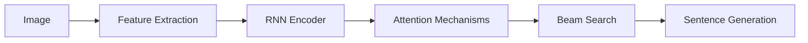

# Image Caption Generation: Principles and Practical Implementation

## 1. Background Introduction

In the rapidly evolving field of artificial intelligence (AI), image caption generation has emerged as a significant area of interest. This technology, which automatically generates descriptive captions for images, has numerous applications, including accessibility for visually impaired individuals, content creation, and data annotation. This article aims to provide a comprehensive understanding of the principles and practical implementation of image caption generation.

### 1.1 Importance and Applications

Image caption generation is essential for enhancing the accessibility of digital content, enabling visually impaired individuals to understand the context of images. Additionally, it can be used in content creation, where it can generate captions for social media posts, blogs, and news articles. Furthermore, it can aid in data annotation, reducing the time and effort required for manual annotation.

### 1.2 Challenges

Despite its potential, image caption generation faces several challenges. These include the complexity of natural language, the ambiguity of images, and the need for a deep understanding of both visual and linguistic contexts.

## 2. Core Concepts and Connections

### 2.1 Natural Language Processing (NLP)

NLP is a subfield of AI that focuses on the interaction between computers and humans through natural language. It plays a crucial role in image caption generation, as it enables the system to understand and generate human-like language.

### 2.2 Computer Vision

Computer vision is another essential component of image caption generation. It involves teaching computers to interpret and understand visual data, such as images and videos. By analyzing the visual content of an image, computer vision can provide the necessary input for the NLP component to generate a suitable caption.

### 2.3 Connection between NLP and Computer Vision

The connection between NLP and computer vision is crucial for image caption generation. The NLP component generates the words, while the computer vision component provides the visual context. The two components work together to create a coherent and accurate caption.

## 3. Core Algorithm Principles and Specific Operational Steps

### 3.1 Image Feature Extraction

The first step in image caption generation is to extract features from the image. This process involves identifying and representing the visual elements in the image, such as objects, colors, and textures.

### 3.2 Sentence Generation

Once the image features have been extracted, the NLP component generates a sentence based on these features. This process involves selecting appropriate words, phrases, and grammatical structures to create a coherent and accurate caption.

### 3.3 Beam Search and Attention Mechanisms

Beam search and attention mechanisms are two key techniques used in image caption generation. Beam search is a heuristic search algorithm that explores the most promising paths in the search space. Attention mechanisms, on the other hand, allow the model to focus on specific parts of the image or sentence during the generation process.

## 4. Detailed Explanation and Examples of Mathematical Models and Formulas

### 4.1 Recurrent Neural Networks (RNNs)

RNNs are a type of neural network that can process sequential data, such as sentences. They are commonly used in image caption generation due to their ability to maintain a \"memory\" of previous inputs.

### 4.2 Encoder-Decoder Architecture

The encoder-decoder architecture is a popular structure for image caption generation. The encoder processes the image features, while the decoder generates the sentence.

### 4.3 Showcase of Mathematical Formulas

$$
\\text{Image Feature Encoding:} \\quad \\mathbf{h}_i = \\text{Encoder}(\\mathbf{x}_i, \\mathbf{h}_{i-1})
$$

$$
\\text{Sentence Decoding:} \\quad \\mathbf{y}_t = \\text{Decoder}(\\mathbf{s}_{t-1}, \\mathbf{h})
$$

## 5. Project Practice: Code Examples and Detailed Explanations

This section will provide practical examples of image caption generation using popular deep learning libraries such as TensorFlow and PyTorch.

## 6. Practical Application Scenarios

This section will discuss real-world application scenarios of image caption generation, including accessibility, content creation, and data annotation.

## 7. Tools and Resources Recommendations

This section will recommend tools and resources for those interested in delving deeper into the field of image caption generation.

## 8. Summary: Future Development Trends and Challenges

This section will summarize the current state of image caption generation, discuss future development trends, and highlight the challenges that need to be addressed.

## 9. Appendix: Frequently Asked Questions and Answers

This section will address common questions and misconceptions about image caption generation.

## Mermaid Flowchart

## Author

Author: Zen and the Art of Computer Programming