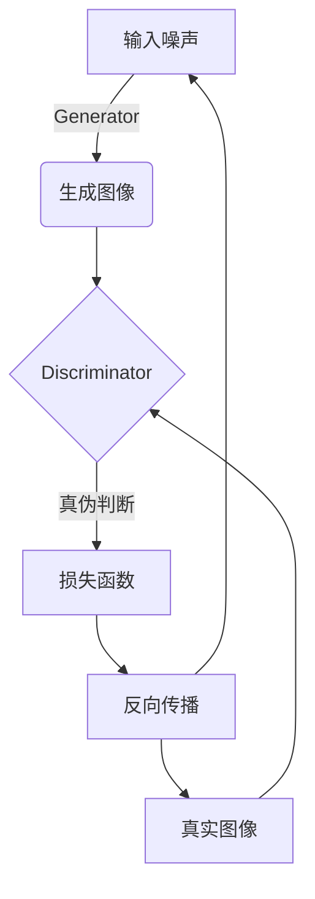
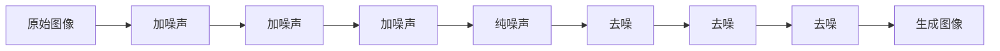

# 图像生成(Image Generation) - 原理与代码实例讲解

## 1.背景介绍

### 1.1 什么是图像生成

图像生成(Image Generation)是一种利用计算机技术从无到有地创建或渲染图像的过程。近年来,借助人工智能和深度学习技术的飞速发展,图像生成已经成为计算机视觉和多媒体领域的一个热门研究方向。

图像生成技术可以广泛应用于多个领域,例如计算机图形学、视觉特效、游戏开发、医学影像、艺术创作等。通过图像生成,我们可以根据文本描述、草图或其他形式的输入,自动合成逼真的图像,大大提高了图像内容创作的效率和质量。

### 1.2 图像生成的挑战

尽管图像生成技术取得了长足进步,但仍面临着诸多挑战:

1. **多样性**: 如何生成多样化、细节丰富的高质量图像?
2. **一致性**: 如何确保生成图像与输入条件(如文本描述)保持高度一致?  
3. **可控性**: 如何实现对生成图像的精细控制,如改变物体位置、颜色等?
4. **高分辨率**: 如何高效生成高分辨率图像?
5. **计算效率**: 如何提高图像生成的计算效率?

### 1.3 主流图像生成方法

目前,主流的图像生成方法主要包括:

1. **生成对抗网络(GAN)**
2. **变分自编码器(VAE)**  
3. **扩散模型(Diffusion Models)** 
4. **像素CNN/PixelCNN**

其中,GAN和扩散模型因其可以生成逼真、细节丰富的图像,备受关注。本文将重点介绍这两种方法的原理、实现细节及应用案例。

## 2.核心概念与联系

### 2.1 生成对抗网络(GAN)

生成对抗网络(Generative Adversarial Networks, GAN)是一种由生成器(Generator)和判别器(Discriminator)组成的无监督学习框架。

1. **生成器(Generator)**: 将随机噪声作为输入,通过上采样、卷积等操作生成目标图像。
2. **判别器(Discriminator)**: 接收真实图像和生成图像,判断其真伪,并将判断结果反馈给生成器。
3. **对抗训练**:生成器和判别器相互对抗,生成器尽量生成"骗过"判别器的逼真图像,判别器则努力区分真伪图像。通过这种对抗训练,双方的能力不断提升,最终生成器可以生成高质量图像。

GAN的关键是生成器和判别器之间的对抗博弈,可以借鉴**最小最大博弈**的思想,将生成器和判别器的损失函数建模为**最小化-最大化**的形式:

$$\min_G \max_D V(D,G) = \mathbb{E}_{x\sim p_{data}(x)}[\log D(x)] + \mathbb{E}_{z\sim p_z(z)}[\log(1-D(G(z)))]$$

其中,$p_{data}(x)$是真实数据分布,$p_z(z)$是噪声先验分布。

GAN在生成图像、增强数据、图像翻译等领域有广泛应用,但也存在训练不稳定、模式坍缩等问题。

### 2.2 扩散模型(Diffusion Models)

扩散模型是一种新兴的生成模型,可以高效生成高保真、多样化的图像。它的基本思路是:

1. **正向扩散过程**: 将数据(如图像)添加高斯噪声,逐步"扩散"至纯噪声分布。
2. **反向过程**: 从纯噪声出发,逐步"去噪",最终恢复成原始图像。

反向过程的关键是训练一个噪声预测模型,根据当前的噪声图像预测应该去除的噪声分量。通过大量训练数据和强大的模型(如U-Net),噪声预测模型可以学习到图像的潜在结构和语义信息,从而生成逼真图像。

扩散模型的数学原理可以用如下马尔可夫链来表示:

$$q(x_t|x_0)=\prod_{t'=1}^{t}q(x_{t'}|x_{t'-1})$$

其中,$x_0$是原始数据,$x_t$是加入噪声后的数据,$q(x_t|x_{t-1})$是从$x_{t-1}$到$x_t$的噪声转移概率。训练目标是最大化反向过程的概率:

$$\max_{\theta}\mathbb{E}_{x_0,\epsilon}\left[\log p_\theta(x_0|x_T)\right]$$

扩散模型生成图像质量高、多样性好,并且可以实现文本到图像等多模态生成,是目前最先进的生成模型之一。但训练计算开销大,推理速度较慢,是其主要缺陷。

## 3.核心算法原理具体操作步骤  

### 3.1 生成对抗网络(GAN)原理及训练步骤

#### 3.1.1 GAN原理

GAN的核心思想是构建一个**生成器网络G**和一个**判别器网络D**,通过两者之间的对抗博弈,驱使生成器生成逼真的图像。具体来说:

1. **生成器G**: 将随机噪声$z$输入到生成器,经过上采样、卷积等操作,输出一张"假"图像$G(z)$。
2. **判别器D**: 接收真实图像$x$和生成图像$G(z)$作为输入,输出一个概率值$D(x)$或$D(G(z))$,表示输入图像为真实图像的概率。
3. **对抗训练**:
   - 生成器G希望生成的图像$G(z)$被判别器D判定为真实图像,即$\max_G D(G(z))$。
   - 判别器D希望能够正确区分真实图像$x$和生成图像$G(z)$,即$\max_D D(x)$且$\min_D D(G(z))$。

生成器G和判别器D相互对抗,形成一个**最小-最大博弈**,目标函数为:

$$\min_G \max_D V(D,G) = \mathbb{E}_{x\sim p_{data}(x)}[\log D(x)] + \mathbb{E}_{z\sim p_z(z)}[\log(1-D(G(z)))]$$

通过交替优化生成器G和判别器D,使得生成器可以学习到真实图像的数据分布,从而生成逼真的图像。

#### 3.1.2 GAN训练步骤

1. **初始化**:初始化生成器G和判别器D的网络参数。
2. **采样真实数据和噪声数据**:从真实数据集中采样一批图像$x$,并从噪声先验分布(如高斯分布)中采样一批噪声$z$。
3. **生成器前向传播**:将噪声$z$输入生成器G,生成一批假图像$G(z)$。
4. **判别器前向传播**:将真实图像$x$和生成图像$G(z)$输入判别器D,计算它们被判定为真实图像的概率$D(x)$和$D(G(z))$。
5. **计算损失函数**:根据上述公式计算判别器损失$\log D(x)$和$\log(1-D(G(z)))$的均值,以及生成器损失$\log(1-D(G(z)))$的均值。
6. **反向传播和优化**:
   - 固定生成器G,对判别器D进行反向传播,更新其参数,使其能够更好地区分真伪图像。
   - 固定判别器D,对生成器G进行反向传播,更新其参数,使其能够生成更逼真的图像"骗过"判别器。
7. **重复训练**:重复步骤2-6,直至模型收敛。

通过上述对抗训练过程,生成器G和判别器D的能力不断提升,最终生成器可以生成高质量、逼真的图像。

### 3.2 扩散模型原理及训练步骤

#### 3.2.1 扩散模型原理

扩散模型的核心思想是通过学习从纯噪声图像到真实图像的逆向过程,从而实现图像生成。具体分为两个阶段:

1. **正向扩散过程**:将原始图像$x_0$添加高斯噪声,逐步"扩散"至纯噪声图像$x_T$。这一过程遵循一个由$q(x_t|x_{t-1})$定义的马尔可夫链:

$$q(x_t|x_0)=\prod_{t'=1}^{t}q(x_{t'}|x_{t'-1})$$

其中,$q(x_t|x_{t-1})$是从$x_{t-1}$到$x_t$的噪声转移概率。

2. **反向过程**:从纯噪声图像$x_T$出发,通过学习一个噪声预测模型$p_\theta(x_{t-1}|x_t)$,逐步"去噪",最终生成图像$\hat{x}_0$:

$$\begin{aligned}
p_\theta(x_{0:T})&=p(x_T)\prod_{t=1}^Tp_\theta(x_{t-1}|x_t)\\
&=p(x_T)\prod_{t=1}^T\frac{p_\theta(x_t|x_{t-1})q(x_{t-1}|x_t)}{q(x_{t-1}|x_t)}
\end{aligned}$$

其中,$p_\theta(x_{t-1}|x_t)$是反向模型,用于从$x_t$预测$x_{t-1}$,也就是预测应该去除的噪声分量。通过最大化反向过程的概率$p_\theta(x_0|x_T)$,可以训练出强大的噪声预测模型,从而实现高质量图像生成。

#### 3.2.2 扩散模型训练步骤

1. **正向扩散过程**:根据$q(x_t|x_{t-1})$,将原始图像数据集$\{x_0\}$逐步添加噪声,得到噪声图像数据集$\{x_T\}$。
2. **初始化噪声预测模型**$p_\theta(x_{t-1}|x_t)$,通常采用U-Net等卷积网络结构。
3. **采样训练数据**:从$\{x_0\}$和$\{x_T\}$中各采样一批图像作为输入和目标输出。
4. **前向传播**:将噪声图像$x_t$输入噪声预测模型,得到预测的去噪图像$\hat{x}_{t-1}$。
5. **计算损失函数**:比较$\hat{x}_{t-1}$与真实去噪图像$x_{t-1}$的差异,计算损失函数(如均方误差损失)。
6. **反向传播和优化**:对噪声预测模型进行反向传播,更新网络参数,使其能够更准确地预测去噪图像。
7. **重复训练**:重复步骤3-6,直至模型收敛。

通过上述训练过程,噪声预测模型可以学习到图像的潜在结构和语义信息,从而在推理阶段从纯噪声图像生成高质量图像。

## 4.数学模型和公式详细讲解举例说明

### 4.1 生成对抗网络(GAN)数学模型

GAN的核心数学模型是一个**最小-最大博弈**问题,生成器G和判别器D相互对抗,目标函数为:

$$\min_G \max_D V(D,G) = \mathbb{E}_{x\sim p_{data}(x)}[\log D(x)] + \mathbb{E}_{z\sim p_z(z)}[\log(1-D(G(z)))]$$

其中:

- $p_{data}(x)$是真实数据分布,如图像数据集的分布。
- $p_z(z)$是噪声先验分布,如高斯分布或均匀分布。
- $D(x)$表示判别器判定$x$为真实图像的概率。
- $G(