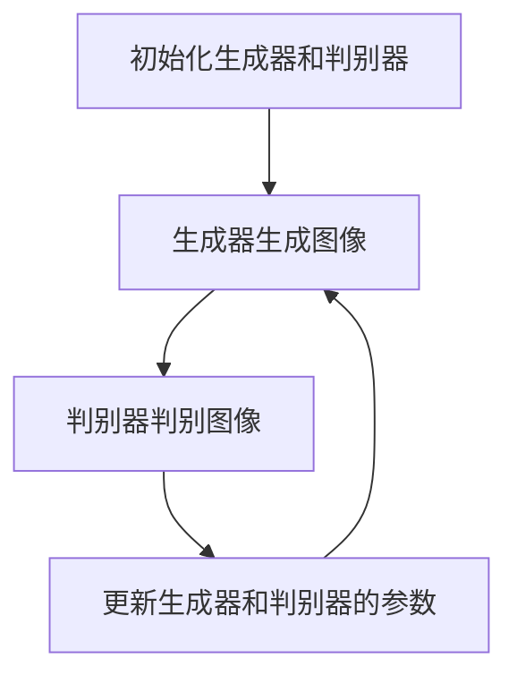

## 1.背景介绍

在过去的十年里，我们见证了计算机视觉领域的巨大变革。特别是在图像生成（Image Generation）方面，深度学习和生成对抗网络（GANs）的发展已经使我们能够生成逼真的图像，这在以前是无法想象的。这篇文章将深入讲解图像生成的原理，以及如何利用深度学习技术进行图像生成。

## 2.核心概念与联系

图像生成的核心概念主要包括以下几个部分：

- **图像生成**：图像生成是计算机视觉中的一个重要任务，其目标是生成新的、以前未见过的图像，这些图像在视觉上与训练数据相似。

- **深度学习**：深度学习是一种机器学习方法，它通过模拟人脑的工作方式来学习数据的内在规律和表示。

- **生成对抗网络（GANs）**：GANs是一种深度学习模型，它由两部分组成：生成器和判别器。生成器的任务是生成新的图像，而判别器的任务是判断一个图像是否是生成器生成的。

- **卷积神经网络（CNNs）**：CNNs是一种深度学习模型，它在图像处理任务中表现出色，特别是在图像识别和生成任务中。

这些概念之间的联系主要表现在：我们通常使用深度学习方法（特别是GANs和CNNs）来实现图像生成任务。

## 3.核心算法原理具体操作步骤

图像生成的核心算法原理是生成对抗网络（GANs）。GANs的工作原理可以概括为以下步骤：

1. **初始化**：初始化生成器和判别器。

2. **生成图像**：生成器接收随机噪声作为输入，然后生成新的图像。

3. **判别图像**：判别器接收生成器生成的图像和真实图像作为输入，然后判断这些图像是否是生成器生成的。

4. **更新模型**：根据判别器的反馈更新生成器和判别器的参数。

5. **重复步骤2-4**：重复步骤2-4，直到生成器生成的图像达到我们的期望。

这个过程可以用下面的Mermaid流程图表示：



## 4.数学模型和公式详细讲解举例说明

GANs的核心是一个最小最大（minimax）游戏，其目标函数可以用以下公式表示：

$$
\min_G \max_D V(D, G) = \mathbb{E}_{x\sim p_{data}(x)}[\log D(x)] + \mathbb{E}_{z\sim p_{z}(z)}[\log(1 - D(G(z)))]
$$

这个公式的含义是：判别器D试图最大化其对真实数据和生成数据的识别能力（即最大化V(D, G)），而生成器G试图最小化判别器正确识别其生成的数据的能力（即最小化V(D, G)）。

## 5.项目实践：代码实例和详细解释说明

以下是一个使用TensorFlow实现的简单GANs的代码示例：

```python
import tensorflow as tf
from tensorflow.keras import layers

# 定义生成器
def make_generator_model():
    model = tf.keras.Sequential()
    model.add(layers.Dense(7*7*256, use_bias=False, input_shape=(100,)))
    model.add(layers.BatchNormalization())
    model.add(layers.LeakyReLU())

    model.add(layers.Reshape((7, 7, 256)))
    assert model.output_shape == (None, 7, 7, 256)

    model.add(layers.Conv2DTranspose(128, (5, 5), strides=(1, 1), padding='same', use_bias=False))
    assert model.output_shape == (None, 7, 7, 128)
    model.add(layers.BatchNormalization())
    model.add(layers.LeakyReLU())

    model.add(layers.Conv2DTranspose(64, (5, 5), strides=(2, 2), padding='same', use_bias=False))
    assert model.output_shape == (None, 14, 14, 64)
    model.add(layers.BatchNormalization())
    model.add(layers.LeakyReLU())

    model.add(layers.Conv2DTranspose(1, (5, 5), strides=(2, 2), padding='same', use_bias=False, activation='tanh'))
    assert model.output_shape == (None, 28, 28, 1)

    return model

# 定义判别器
def make_discriminator_model():
    model = tf.keras.Sequential()
    model.add(layers.Conv2D(64, (5, 5), strides=(2, 2), padding='same',
                                     input_shape=[28, 28, 1]))
    model.add(layers.LeakyReLU())
    model.add(layers.Dropout(0.3))

    model.add(layers.Conv2D(128, (5, 5), strides=(2, 2), padding='same'))
    model.add(layers.LeakyReLU())
    model.add(layers.Dropout(0.3))

    model.add(layers.Flatten())
    model.add(layers.Dense(1))

    return model
```

这段代码首先定义了生成器和判别器的模型结构。生成器使用全连接层和卷积转置层生成图像，判别器使用卷积层和全连接层判断图像的真伪。

## 6.实际应用场景

图像生成技术在许多领域都有广泛的应用，包括但不限于：

- **艺术创作**：艺术家们可以利用图像生成技术创作出独特的艺术作品。

- **游戏开发**：游戏开发者可以使用图像生成技术生成游戏中的角色、场景等元素。

- **医学影像**：在医学影像领域，图像生成技术可以帮助医生生成并理解复杂的医学图像。

## 7.工具和资源推荐

以下是一些用于学习和实践图像生成的推荐工具和资源：

- **TensorFlow**：TensorFlow是一个强大的深度学习框架，它提供了许多用于构建和训练深度学习模型的工具。

- **PyTorch**：PyTorch是另一个流行的深度学习框架，它的API设计得非常直观，易于理解。

- **Keras**：Keras是一个高级深度学习框架，它可以运行在TensorFlow之上，提供了许多方便的API用于构建和训练模型。

- **GANs in Action**：这是一本关于GANs的书，它详细地介绍了GANs的原理和应用。

## 8.总结：未来发展趋势与挑战

图像生成技术在近年来取得了显著的进展，但仍然面临许多挑战。例如，如何生成高质量的图像、如何控制生成图像的特性等。未来，我们期待看到更多的研究和应用来解决这些问题。

## 9.附录：常见问题与解答

- **Q: 为什么我的GANs生成的图像质量很差？**

A: GANs的训练是一个非常复杂的过程，需要仔细调整超参数。此外，GANs需要大量的训练数据和计算资源。

- **Q: 我可以在我的项目中使用预训练的GANs模型吗？**

A: 是的，有许多预训练的GANs模型可供下载和使用，例如BigGAN、StyleGAN等。

- **Q: GANs可以用于生成除图像之外的其他类型的数据吗？**

A: 是的，GANs不仅可以用于生成图像，还可以用于生成文本、音频等数据。

作者：禅与计算机程序设计艺术 / Zen and the Art of Computer Programming