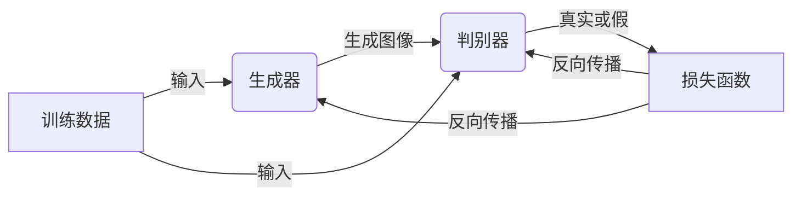
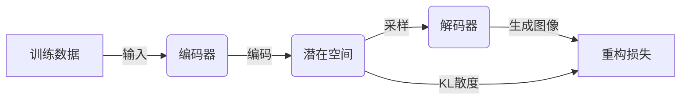
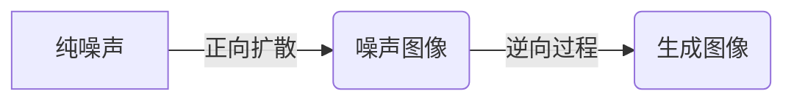

# 《图像生成：深度学习的最新进展》

## 1. 背景介绍

### 1.1 图像生成的重要性

在当今数字时代,图像已经成为人类交流和表达的重要媒介之一。无论是在社交媒体、广告营销还是艺术创作等领域,图像都扮演着至关重要的角色。然而,传统的图像生成方式往往需要耗费大量的人力和时间,难以满足快速迭代和大规模生产的需求。

随着深度学习技术的不断发展,基于深度神经网络的图像生成模型逐渐引起了广泛关注。这些模型能够从数据中自主学习图像的内在特征和分布,并生成逼真、多样化的图像,极大地提高了图像生成的效率和质量。

### 1.2 深度学习图像生成的应用前景

深度学习驱动的图像生成技术在诸多领域展现出巨大的应用潜力:

- **内容创作**:可用于辅助设计师、艺术家等创作图像内容,提高创作效率。
- **虚拟现实**:生成逼真的虚拟场景和角色,增强虚拟现实体验。
- **数据增强**:为数据稀缺的领域生成合成数据,扩充训练集,提高模型性能。
- **图像编辑**:实现图像的语义编辑、风格迁移等,为图像处理带来新的可能。

凭借其强大的生成能力,深度学习图像生成技术正在重塑图像的创作、交互和应用方式,为众多行业带来颠覆性的创新机遇。

## 2. 核心概念与联系

### 2.1 生成对抗网络(GAN)

生成对抗网络(Generative Adversarial Networks, GAN)是深度学习图像生成领域的基础模型。GAN由两个神经网络组成:生成器(Generator)和判别器(Discriminator)。生成器的目标是生成逼真的图像,而判别器则需要区分生成的图像和真实图像。在对抗训练过程中,生成器和判别器相互对抗,相互促进,最终达到生成器能够生成逼真图像的目标。

GAN架构奠定了深度学习图像生成的基础,但也存在训练不稳定、模式坍塌等问题。后续研究提出了各种改进的GAN变体,如WGAN、SAGAN等,旨在提高GAN的稳定性和生成质量。

### 2.2 变分自编码器(VAE)

变分自编码器(Variational Autoencoder, VAE)是另一种常用的深度生成模型。VAE由编码器(Encoder)和解码器(Decoder)组成,能够从数据中学习潜在的分布,并从该分布中采样生成新的图像。

VAE的关键在于使用变分推断(Variational Inference)来近似潜在分布,并引入KL散度(Kullback-Leibler Divergence)作为正则项,确保潜在空间的连续性和平滑性。这使得VAE能够生成多样化且具有语义连续性的图像。

### 2.3 扩散模型

近年来,扩散模型(Diffusion Models)凭借其出色的生成质量和多模态生成能力,成为图像生成领域的新热点。扩散模型通过学习从噪声到数据的逆过程,实现从纯噪声生成高质量图像。

扩散模型的核心思想是将复杂的数据生成过程分解为一系列简单的噪声去噪步骤,通过逆向建模实现图像生成。这种思路使扩散模型能够捕捉数据的细节和多样性,生成质量超越传统GAN。

上述三种模型各有优缺点,在不同场景下表现也不尽相同。实际应用中,研究人员常常结合多种模型的优势,设计出更加强大的混合模型。

## 3. 核心算法原理具体操作步骤

### 3.1 生成对抗网络(GAN)

GAN的核心算法原理可以概括为以下几个步骤:

1. **初始化生成器和判别器网络**:通常使用卷积神经网络(CNN)或其变体作为生成器和判别器的网络结构。

2. **生成器生成图像**:生成器从随机噪声向量开始,经过上采样和卷积操作,生成尺寸与真实图像相同的假图像。

3. **判别器判别真伪**:判别器输入真实图像和生成图像,经过下采样和卷积操作,输出每个图像为真或假的概率。

4. **计算损失函数**:生成器和判别器各自计算损失函数,生成器的目标是使生成图像被判别为真,判别器的目标是正确区分真伪图像。

5. **反向传播和优化**:根据损失函数,分别对生成器和判别器的参数进行反向传播和优化,使生成器生成更逼真的图像,判别器区分真伪更准确。

6. **重复训练**:重复上述步骤,直到生成器和判别器达到动态平衡,生成图像质量满足要求。

在实际操作中,GAN存在训练不稳定、模式坍塌等问题,需要采用特殊的技巧和改进方法,如特征匹配、梯度惩罚等,以提高训练稳定性和生成质量。

### 3.2 变分自编码器(VAE)

VAE的核心算法原理可以概括为以下几个步骤:

1. **编码器推断潜在向量**:将输入图像通过卷积和下采样操作,编码为潜在向量,该向量服从某种概率分布(通常为高斯分布)。

2. **从潜在空间采样**:从编码器推断出的概率分布中采样,获得潜在向量。

3. **解码器生成图像**:将采样得到的潜在向量输入解码器,经过上采样和卷积操作,生成与输入图像尺寸相同的重构图像。

4. **计算重构损失和KL散度**:计算输入图像与重构图像之间的重构损失(如均方误差),以及潜在向量分布与标准正态分布之间的KL散度。

5. **反向传播和优化**:将重构损失和KL散度相加作为总损失函数,对编码器和解码器的参数进行反向传播和优化。

6. **重复训练**:重复上述步骤,直到模型收敛,能够从潜在空间中采样生成新的图像。

VAE的关键在于使用变分推断来近似潜在分布,并引入KL散度作为正则项,确保潜在空间的连续性和平滑性,从而生成多样化且具有语义连续性的图像。

### 3.3 扩散模型

扩散模型的核心算法原理可以概括为以下几个步骤:

1. **正向扩散过程**:将输入图像通过一系列高斯噪声污染步骤,逐步转化为纯噪声图像。每一步都会增加一定量的噪声,直到最终得到纯噪声图像。

2. **逆向过程建模**:训练一个去噪模型,学习从噪声图像中恢复原始图像的逆向过程。该模型通常使用U-Net等编码器-解码器结构。

3. **采样生成图像**:从纯噪声开始,通过多次迭代,每次使用去噪模型预测并去除部分噪声,最终生成无噪声的图像。

4. **损失函数计算**:在训练过程中,将去噪模型的输出与真实图像进行比较,计算损失函数(如均方误差)。

5. **反向传播和优化**:根据损失函数,对去噪模型的参数进行反向传播和优化,使其能够更好地从噪声中恢复图像。

6. **重复训练**:重复上述步骤,直到模型收敛,能够从纯噪声生成高质量图像。

扩散模型的核心思想是将复杂的数据生成过程分解为一系列简单的噪声去噪步骤,通过逆向建模实现图像生成。这种思路使扩散模型能够捕捉数据的细节和多样性,生成质量超越传统GAN。

## 4. 数学模型和公式详细讲解举例说明

### 4.1 生成对抗网络(GAN)

GAN的目标是训练生成器$G$生成的图像分布$p_g$与真实数据分布$p_{data}$尽可能相似。这可以通过最小化生成器和判别器之间的对抗损失来实现。

对抗损失可以表示为:

$$\min_G \max_D V(D, G) = \mathbb{E}_{x \sim p_{data}(x)}[\log D(x)] + \mathbb{E}_{z \sim p_z(z)}[\log (1 - D(G(z)))]$$

其中:
- $G(z)$表示生成器从噪声$z$生成的图像
- $D(x)$表示判别器判断图像$x$为真实图像的概率
- $p_{data}$是真实数据分布
- $p_z$是噪声$z$的先验分布,通常为标准正态分布

在实际操作中,通常采用最小-最大两步游戏的方式交替优化生成器$G$和判别器$D$:

1. 固定生成器$G$,最大化判别器$D$的目标:
   $$\max_D V(D, G) = \mathbb{E}_{x \sim p_{data}(x)}[\log D(x)] + \mathbb{E}_{z \sim p_z(z)}[\log (1 - D(G(z)))]$$

2. 固定判别器$D$,最小化生成器$G$的目标:
   $$\min_G V(D, G) = -\mathbb{E}_{z \sim p_z(z)}[\log D(G(z))]$$

通过不断优化生成器和判别器,最终达到生成器生成的图像分布$p_g$与真实数据分布$p_{data}$相似的目标。

### 4.2 变分自编码器(VAE)

VAE的目标是最大化边缘对数似然$\log p(x)$,其中$x$是输入图像。由于直接优化$\log p(x)$较为困难,VAE引入了潜在变量$z$,并使用变分推断(Variational Inference)来近似$\log p(x)$。

根据Jensen不等式,我们有:

$$\log p(x) \geq \mathbb{E}_{q(z|x)}[\log \frac{p(x, z)}{q(z|x)}] = \mathcal{L}(x)$$

其中:
- $q(z|x)$是近似后验分布,由编码器网络输出
- $p(x, z)$是联合分布$p(x, z) = p(x|z)p(z)$
- $\mathcal{L}(x)$是证据下界(Evidence Lower Bound, ELBO)

为了最大化$\log p(x)$,我们可以最大化ELBO $\mathcal{L}(x)$,它可以进一步分解为:

$$\mathcal{L}(x) = \mathbb{E}_{q(z|x)}[\log p(x|z)] - D_{KL}(q(z|x) \| p(z))$$

其中:
- $\log p(x|z)$是重构项,由解码器网络输出
- $D_{KL}(q(z|x) \| p(z))$是KL散度项,用于约束潜在分布$q(z|x)$与先验分布$p(z)$之间的差异

在训练过程中,VAE通过最大化ELBO $\mathcal{L}(x)$来同时优化重构项和KL散度项,从而学习数据的潜在分布,并从中生成新的图像。

### 4.3 扩散模型

扩散模型的核心思想是将数据生成过程建模为一个由$T$个步骤组成的马尔可夫链,每一步都会向数据添加一定量的高斯噪声。

具体来说,给定一个初始数据分布$x_0 \sim q(x_0)$,