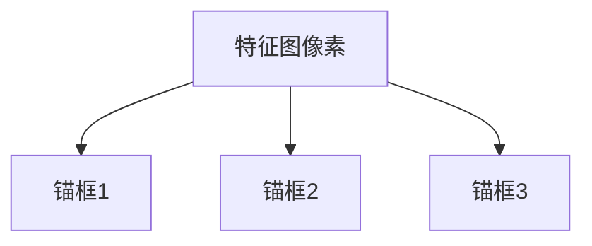

好的,我会严格按照您的要求,以专业的技术语言撰写这篇关于"图像识别:识别图像中的物体"的博客文章。

# 图像识别:识别图像中的物体

## 1.背景介绍

### 1.1 图像识别的重要性

在当今数字时代,图像数据无处不在,从社交媒体上的照片到安防监控视频,从医学影像诊断到自动驾驶汽车的路况检测,图像识别技术已经广泛应用于各个领域。能够自动从图像或视频中识别出感兴趣的目标物体,是实现智能系统的关键一环。

图像识别技术可以极大地提高数据处理效率,减轻人工标注的工作量,并在一些特殊场景下替代人工,如危险环境监测、大规模图像扫描等。因此,图像识别被视为计算机视觉和人工智能领域的核心技术之一,吸引了众多研究人员的关注和投入。

### 1.2 图像识别的挑战

尽管图像识别技术日趋成熟,但仍面临诸多挑战:

- 复杂背景环境下的目标检测
- 遮挡、变形、旋转等情况下的鲁棒性识别 
- 小目标、密集分布目标的精确识别
- 跨领域、跨数据集的泛化能力
- 实时性和计算效率的平衡

这些挑战推动了算法和模型的不断创新和优化。

## 2.核心概念与联系  

### 2.1 图像识别的核心任务

图像识别主要包括以下几个核心任务:

1. **目标检测(Object Detection)**: 在给定图像中定位感兴趣目标的位置,通常以矩形边界框的形式给出。

2. **目标识别(Object Recognition)**: 判断图像中存在哪些目标物体类别。

3. **语义分割(Semantic Segmentation)**: 对图像中的每个像素点进行分类,标注出不同目标物体的精确轮廓。

4. **实例分割(Instance Segmentation)**: 在语义分割的基础上,进一步区分出同类物体的不同实例。

上述任务相互关联且复杂程度递增,目标检测是最基础的任务,实例分割是最为综合和挑战的任务。

### 2.2 图像识别的核心技术路线

传统的图像识别方法主要基于手工设计的特征提取和分类器,如HOG+SVM、Haar+AdaBoost等经典算法。

而当前主流的图像识别技术路线是基于深度学习的端到端方法,主要分为以下两条路线:

1. **基于区域的方法(Region-based Methods)**
   - 先生成候选区域
   - 再对每个区域进行目标分类及位置精修
   - 代表算法:R-CNN、Fast R-CNN、Faster R-CNN等

2. **基于密集预测的方法(Dense Prediction Methods)** 
   - 直接对密集的图像窗口或像素进行预测
   - 无需先生成候选区域
   - 代表算法:YOLO、SSD、Mask R-CNN等

这两条路线在不同的应用场景下各有优缺点,需要根据具体需求进行权衡选择。

## 3.核心算法原理具体操作步骤

### 3.1 基于区域的算法流程

以Faster R-CNN为例,算法主要分为以下四个步骤:

1. **区域候选生成(Region Proposal Generation)**

   使用区域候选网络(Region Proposal Network,RPN)生成图像中可能包含目标的区域候选框。RPN本质上是一个先前的卷积网络,可以高效率地生成高质量的区域建议。

   ```mermaid
   graph TD
       A[输入图像] --> B[卷积特征提取网络]
       B --> C[RPN网络]
       C --> D[候选区域框生成]
   ```

2. **特征提取(Feature Extraction)** 

   利用主干网络(如VGG、ResNet等)提取整个图像的特征图,再结合RPN生成的候选区域框,从特征图中作出相应的感兴趣区域(RoIs)特征。

3. **分类与精修(Classification & Bounding Box Regression)**

   将RoIs特征输入两个并行的全连接网络,一个负责目标分类,另一个负责预测精确的目标边界框位置。

4. **后处理(Post-processing)**

   根据置信度阈值和非极大值抑制(NMS)策略,过滤掉低置信度和高重叠度的预测框,得到最终的检测结果。

### 3.2 基于密集预测的算法流程 

以YOLO v3为例,算法分为以下几个步骤:

1. **特征提取(Feature Extraction)**

   使用Darknet-53作为主干网络,对输入图像进行特征提取。

2. **密集预测(Dense Prediction)** 

   在不同尺度的特征图上,使用锚框机制密集地预测目标边界框、置信度和类别概率。

   ```mermaid
   graph TD
       A[输入图像] --> B[主干网络]
       B --> C[多尺度特征图]
       C --> D[密集预测]
       D --> E[检测结果]
   ```

3. **预测融合(Prediction Merging)**

   将不同尺度特征图上的预测结果进行融合,得到最终的预测框。

4. **后处理(Post-processing)**

   使用非极大值抑制(NMS)策略过滤重叠的预测框,得到最终的检测结果。

### 3.3 注意力机制与变形卷积

近年来,注意力机制和变形卷积等新型网络结构被广泛应用于图像识别任务,以提高模型的表达能力和适应性:

1. **注意力机制(Attention Mechanism)**

   通过自适应地分配不同区域的权重,使模型能够更好地关注重要的特征区域,从而提高检测精度。

2. **变形卷积(Deformable Convolution)**

   通过学习卷积核的偏移,使卷积核能够自适应地变形以适应不规则形状的目标,提高对变形目标的检测能力。

## 4.数学模型和公式详细讲解举例说明

### 4.1 锚框机制

在基于密集预测的算法(如YOLO、SSD等)中,通常采用锚框(Anchor Box)机制来预测目标边界框。锚框是一组预先设定的参考框,用于匹配不同形状和比例的目标。

在每个特征图的每个位置,都会预测一组锚框,每个锚框包含以下几个参数:

- 中心坐标偏移量 $(t_x, t_y)$
- 宽高缩放比例 $(t_w, t_h)$
- 目标置信度得分 $t_c$
- 类别概率分布 $(p_1, p_2, ..., p_C)$

其中,中心坐标偏移量和宽高缩放比例用于从锚框预测出精确的目标边界框,目标置信度得分表示锚框内是否存在目标,类别概率分布表示目标属于每个类别的概率。

以YOLO v3为例,在每个特征图的每个位置,都会预测3个不同比例和尺度的锚框,如下图所示:



通过这种密集的锚框预测方式,模型可以同时检测不同形状和大小的目标。

### 4.2 损失函数

在训练目标检测模型时,通常使用的损失函数是分类损失和回归损失的加权和:

$$
\mathcal{L}(\{p_i\},\{t_i\}) = \frac{1}{N_{pos}}\sum_{i\in Pos}\sum_{m\in\{c,x,y,w,h\}}α_m\mathcal{L}_{m}(p_{i,m},t_{i,m}) + \lambda\sum_{i\in Neg}\mathcal{L}_{c}(p_{i,c},0)
$$

其中:

- $N_{pos}$ 为正样本锚框的数量
- $\{p_i\}$ 为预测的参数集合,包括置信度 $p_{i,c}$ 和坐标偏移量 $(p_{i,x}, p_{i,y}, p_{i,w}, p_{i,h})$
- $\{t_i\}$ 为真实的参数集合
- $\alpha_m$ 为每个参数的损失权重
- $\mathcal{L}_m$ 为对应参数的损失函数,如交叉熵损失(置信度)、平滑L1损失(坐标偏移量)等
- $\lambda$ 为负样本置信度损失的权重系数

这种损失函数结合了分类任务和回归任务,可以同时优化目标分类和边界框精修两个分支网络。

### 4.3 非极大值抑制(NMS)

在目标检测过程中,常常会出现多个预测框重叠在同一目标上的情况。为了去除这种冗余预测,通常使用非极大值抑制(Non-Maximum Suppression, NMS)算法。

NMS算法的基本思路是:

1. 根据预测框的置信度得分对所有预测框进行排序
2. 从置信度最高的预测框开始,将与其重叠程度超过一定阈值的其他预测框全部移除
3. 重复上述过程,直到所有预测框被处理完毕

具体来说,对于两个预测框 $B_1$ 和 $B_2$,它们的重叠程度可以用交并比(Intersection over Union, IoU)来衡量:

$$
\text{IoU}(B_1, B_2) = \frac{\text{Area}(B_1 \cap B_2)}{\text{Area}(B_1 \cup B_2)}
$$

如果 $\text{IoU}(B_1, B_2) > \text{IoU}_\text{thresh}$,则认为 $B_1$ 和 $B_2$ 存在重叠,需要移除置信度较低的那个预测框。

通过NMS算法,可以有效地去除冗余的预测框,提高目标检测的准确性。

## 5.项目实践:代码实例和详细解释说明

为了帮助读者更好地理解图像识别算法的实现细节,这里将提供一个基于PyTorch的Faster R-CNN目标检测项目实践。

### 5.1 项目概述

本项目旨在构建一个Faster R-CNN目标检测模型,并在COCO数据集上进行训练和评估。项目的主要步骤包括:

1. 数据准备
2. 模型构建
3. 模型训练
4. 模型评估
5. 模型推理

### 5.2 数据准备

首先,需要下载COCO数据集,并使用PyTorch提供的`torchvision.datasets.CocoDetection`类加载数据。

```python
from torchvision.datasets import CocoDetection

# 加载训练集和验证集
train_dataset = CocoDetection(root='data/train', annFile='data/annotations/instances_train2017.json')
val_dataset = CocoDetection(root='data/val', annFile='data/annotations/instances_val2017.json')
```

然后,定义数据增强操作和数据加载器:

```python
from torchvision import transforms

# 定义数据增强操作
data_transform = transforms.Compose([
    transforms.ToTensor()
])

# 创建数据加载器
train_loader = torch.utils.data.DataLoader(train_dataset, batch_size=8, shuffle=True, collate_fn=utils.collate_fn)
val_loader = torch.utils.data.DataLoader(val_dataset, batch_size=8, shuffle=False, collate_fn=utils.collate_fn)
```

### 5.3 模型构建

使用PyTorch提供的`torchvision.models.detection`模块构建Faster R-CNN模型:

```python
from torchvision.models.detection import FasterRCNN
from torchvision.models.detection.rpn import AnchorGenerator

# 构建主干网络
backbone = torchvision.models.mobilenet_v2(pretrained=True).features
backbone.out_channels = 1280

# 生成锚框
anchor_generator = AnchorGenerator(sizes=((32, 64, 128, 256, 512),),
                                   aspect_ratios=((0.5, 1.0, 2.0)))

# 定义检测模型
model = FasterRCNN(backbone,
                   num_classes=91,
                   rpn_anchor_generator=anchor_generator)
```

### 5.4 模型训练

定义训练函数,包括前向传播、损失计算、反向传播和优化器更新等步骤:

```python
import torch.optim as optim

# 定义优化器和学习率调度器
optimizer = optim.SGD(model.parameters(), lr=0.005, momentum=0.9, weight_decay=0.0005)
lr_scheduler = optim.lr_scheduler.StepLR(optimizer, step_size=3, gamma=0.1)

# 训练循环
for epoch in range(