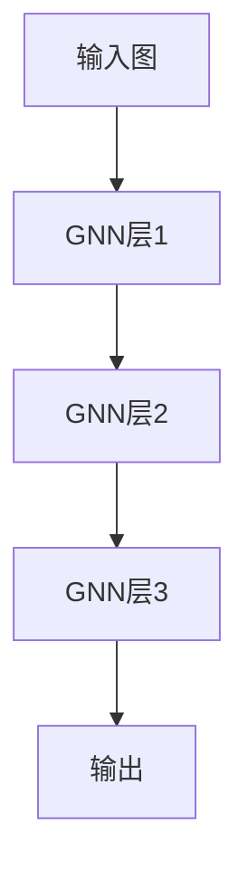

# 图神经网络(GNN)原理与代码实战案例讲解

## 1.背景介绍

### 1.1 什么是图神经网络

图神经网络(Graph Neural Networks, GNNs)是一种将深度学习应用于图结构数据的新兴技术。图是一种非欧几里德数据结构,由节点(节点)和边(边)组成,可用于描述复杂的关系数据,如社交网络、分子结构、交通网络等。传统的神经网络主要处理欧几里得数据(如图像、文本、序列等),而图神经网络则专门设计用于处理图结构数据。

### 1.2 图神经网络的应用

图神经网络已广泛应用于多个领域,包括:

- **社交网络分析**: 预测好友关系、推荐系统等
- **生物信息学**: 预测蛋白质功能、药物分子设计等
- **知识图谱**: 知识表示学习、关系推理等
- **交通网络**: 交通流量预测、路径规划等
- **计算机视觉**: 3D物体识别、人体姿态估计等

## 2.核心概念与联系

### 2.1 图的表示

在图神经网络中,图通常用邻接矩阵或邻接表来表示。邻接矩阵是一种紧凑的表示方式,但对于稀疏图会浪费大量存储空间。邻接表更适合表示稀疏图,但查找效率较低。

### 2.2 信息传播模型

图神经网络的核心思想是在图的节点之间传播信息,使每个节点能够整合来自邻居节点的信息。这种信息传播过程可以通过迭代的消息传递和聚合操作来实现。常见的信息传播模型有:

- **卷积模型**: 将节点的特征与邻居节点的特征进行卷积操作
- **门控循环单元(GRU)模型**: 使用门控循环单元来控制信息流动
- **注意力模型**: 通过注意力机制学习邻居节点的重要性权重

### 2.3 层级结构

与传统神经网络类似,图神经网络也可以构建多层结构。每一层都对节点特征进行转换和信息传播,使得高层节点特征能够捕获更大范围的邻居信息。



## 3.核心算法原理具体操作步骤  

### 3.1 图卷积神经网络(GCN)

图卷积神经网络(Graph Convolutional Networks, GCN)是最早也是最流行的图神经网络模型之一。它的核心思想是将传统卷积神经网络中的卷积操作推广到了图结构数据。

GCN的工作流程如下:

1. **特征初始化**: 为每个节点分配一个初始特征向量,通常使用节点属性或one-hot编码。
2. **信息传播**:
    - 聚合邻居信息: 对每个节点,将其邻居节点的特征进行加权求和,得到邻居信息。
    - 更新节点特征: 将节点的原始特征与聚合的邻居信息相加,并通过激活函数进行非线性变换,得到新的节点特征。
3. **层级传播**: 重复执行步骤2,使信息在图中逐层传播。
4. **输出层**: 根据任务需求,对最终节点特征进行处理(如分类、回归等)。

GCN的数学表达式为:

$$H^{(l+1)} = \sigma(\tilde{D}^{-\frac{1}{2}}\tilde{A}\tilde{D}^{-\frac{1}{2}}H^{(l)}W^{(l)})$$

其中:
- $\tilde{A}$ 是加入自环的邻接矩阵 ($\tilde{A} = A + I_N$)
- $\tilde{D}_{ii} = \sum_j \tilde{A}_{ij}$ 是度矩阵
- $W^{(l)}$ 是第 $l$ 层的权重矩阵
- $\sigma$ 是非线性激活函数,如ReLU

### 3.2 图注意力网络(GAT)

图注意力网络(Graph Attention Networks, GAT)引入了注意力机制,使模型能够自适应地学习邻居节点的重要性权重。

GAT的工作流程与GCN类似,但在聚合邻居信息时使用了注意力机制:

1. **计算注意力系数**:
    - 对于每个节点 $i$ 和其邻居节点 $j$,计算一个注意力系数 $\alpha_{ij}$,表示节点 $j$ 对节点 $i$ 的重要性。
    - 注意力系数通过节点特征向量计算得到,具体方法有多种选择。
2. **加权聚合邻居信息**:
    - 使用注意力系数对邻居节点特征进行加权求和,得到聚合的邻居信息。
3. **更新节点特征**:
    - 将节点的原始特征与聚合的邻居信息相加,并通过非线性变换得到新的节点特征。

GAT的数学表达式为:

$$h_i^{(l+1)} = \sigma\left(\sum_{j\in\mathcal{N}(i)\cup\{i\}}\alpha_{ij}^{(l)}W^{(l)}h_j^{(l)}\right)$$

其中:
- $\mathcal{N}(i)$ 表示节点 $i$ 的邻居集合
- $\alpha_{ij}^{(l)}$ 是第 $l$ 层节点 $j$ 对节点 $i$ 的注意力系数
- $W^{(l)}$ 是第 $l$ 层的权重矩阵
- $\sigma$ 是非线性激活函数,如LeakyReLU

### 3.3 图等变自编码器(GAE)

图等变自编码器(Graph Autoencoder, GAE)是一种无监督的图表示学习模型,它将图编码为低维向量空间,并尝试重构原始图结构。

GAE的工作流程如下:

1. **编码器**:
    - 使用GCN或GAT等模型将节点特征编码为低维向量表示。
2. **解码器**:
    - 根据编码后的节点向量,重构节点之间的邻接关系。
    - 通常使用内积或其他相似度函数来计算节点对之间的连接概率。
3. **重构损失**:
    - 计算重构的邻接矩阵与原始邻接矩阵之间的差异,作为训练的损失函数。

GAE的数学表达式为:

$$\mathcal{L} = \mathbb{E}_{G\sim\mathcal{G}}\left[\left\|A - \sigma\left(Z^TZ\right)\right\|_F^2\right]$$

其中:
- $A$ 是原始邻接矩阵
- $Z$ 是编码后的节点向量矩阵
- $\sigma$ 是sigmoid函数,用于将内积值映射到 $(0, 1)$ 范围内
- $\|\cdot\|_F$ 是Frobenius范数,用于计算矩阵之间的差异

通过训练GAE,可以获得节点的低维向量表示,并将其应用于下游任务,如节点分类、链接预测等。

## 4.数学模型和公式详细讲解举例说明

在上一节中,我们介绍了几种常见的图神经网络模型,并给出了它们的数学表达式。现在,我们将详细解释这些公式,并通过具体示例来加深理解。

### 4.1 GCN公式解释

回顾GCN的公式:

$$H^{(l+1)} = \sigma(\tilde{D}^{-\frac{1}{2}}\tilde{A}\tilde{D}^{-\frac{1}{2}}H^{(l)}W^{(l)})$$

这个公式描述了GCN中节点特征的更新过程。让我们逐步解释每个部分的含义:

1. $\tilde{A}$ 是加入自环的邻接矩阵,即 $\tilde{A} = A + I_N$。自环的引入确保每个节点至少与自身相连,从而在信息传播过程中不会丢失节点的初始特征。
2. $\tilde{D}$ 是度矩阵,其对角线元素 $\tilde{D}_{ii} = \sum_j \tilde{A}_{ij}$ 表示节点 $i$ 的度数(包括自环)。
3. $\tilde{D}^{-\frac{1}{2}}\tilde{A}\tilde{D}^{-\frac{1}{2}}$ 是一种特殊的归一化操作,称为"对称归一化"。它的作用是将邻接矩阵的元素除以节点度数的平方根,从而减小高度节点的影响。这种归一化方式可以防止梯度爆炸或消失,并提高模型的稳定性。
4. $H^{(l)}$ 是第 $l$ 层的节点特征矩阵,每一行表示一个节点的特征向量。
5. $W^{(l)}$ 是第 $l$ 层的权重矩阵,用于线性变换节点特征。
6. $\sigma$ 是非线性激活函数,如ReLU,用于引入非线性。

让我们用一个简单的示例来说明GCN的工作原理。假设我们有一个无向图,包含4个节点和4条边,如下所示:

```mermaid
graph LR
    A((A)) -- B((B))
    A -- C((C))
    B -- D((D))
```

初始节点特征矩阵 $H^{(0)}$ 为:

$$H^{(0)} = \begin{bmatrix}
1 & 0 & 0 & 0\\
0 & 1 & 0 & 0\\
0 & 0 & 1 & 0\\
0 & 0 & 0 & 1
\end{bmatrix}$$

邻接矩阵 $A$ 为:

$$A = \begin{bmatrix}
0 & 1 & 1 & 0\\
1 & 0 & 0 & 1\\
1 & 0 & 0 & 0\\
0 & 1 & 0 & 0
\end{bmatrix}$$

加入自环后的邻接矩阵 $\tilde{A}$ 为:

$$\tilde{A} = \begin{bmatrix}
1 & 1 & 1 & 0\\
1 & 1 & 0 & 1\\
1 & 0 & 1 & 0\\
0 & 1 & 0 & 1
\end{bmatrix}$$

度矩阵 $\tilde{D}$ 为:

$$\tilde{D} = \begin{bmatrix}
3 & 0 & 0 & 0\\
0 & 3 & 0 & 0\\
0 & 0 & 2 & 0\\
0 & 0 & 0 & 2
\end{bmatrix}$$

对称归一化后的矩阵 $\tilde{D}^{-\frac{1}{2}}\tilde{A}\tilde{D}^{-\frac{1}{2}}$ 为:

$$\tilde{D}^{-\frac{1}{2}}\tilde{A}\tilde{D}^{-\frac{1}{2}} = \begin{bmatrix}
\frac{1}{\sqrt{3}} & \frac{1}{\sqrt{6}} & \frac{1}{\sqrt{6}} & 0\\
\frac{1}{\sqrt{6}} & \frac{1}{\sqrt{3}} & 0 & \frac{1}{\sqrt{6}}\\
\frac{1}{\sqrt{6}} & 0 & \frac{1}{\sqrt{2}} & 0\\
0 & \frac{1}{\sqrt{6}} & 0 & \frac{1}{\sqrt{2}}
\end{bmatrix}$$

假设权重矩阵 $W^{(0)}$ 为一个 $4 \times 2$ 的随机矩阵,激活函数 $\sigma$ 为ReLU,则第一层的输出特征矩阵 $H^{(1)}$ 可以计算为:

$$H^{(1)} = \text{ReLU}\left(\tilde{D}^{-\frac{1}{2}}\tilde{A}\tilde{D}^{-\frac{1}{2}}H^{(0)}W^{(0)}\right)$$

通过这个示例,我们可以清楚地看到GCN是如何利用图结构和节点特征进行信息传播和特征转换的。在实际应用中,GCN通常会堆叠多层,使得高层节点特征能够捕获更大范围的邻居信息。

### 4.2 GAT公式解释

回顾GAT的公式:

$$h_i^{(l+1)} = \sigma\left(\sum_{j\in\mathcal{N}(i)\cup\{i\}}\alpha_{ij}^{(l)}W^{(l)}h_j^{(l)}\right)$$

这个公式描述了GAT中节点特征的更新过程,其中引