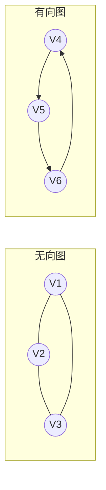
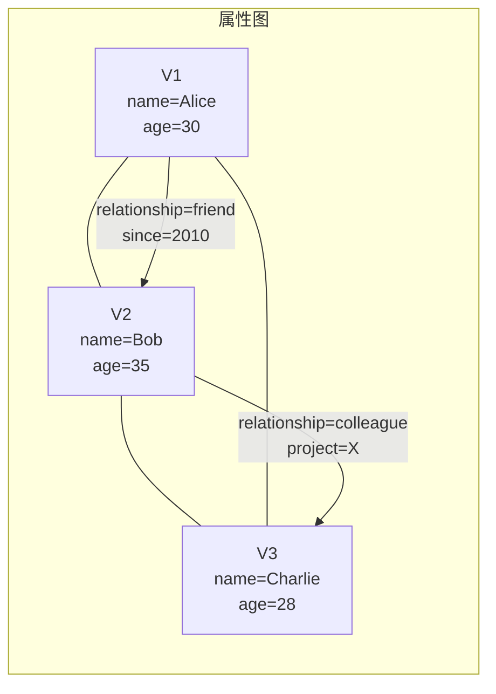
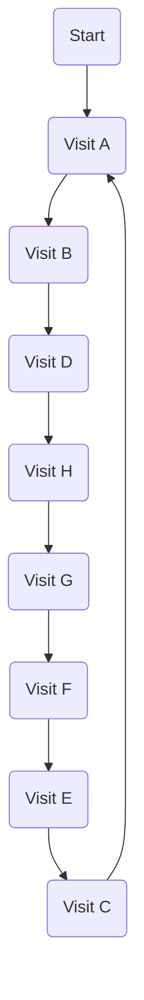
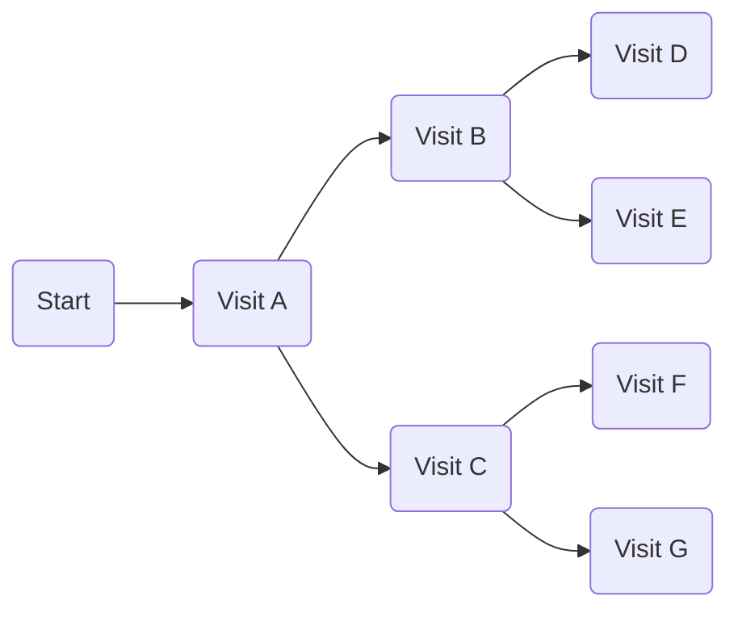
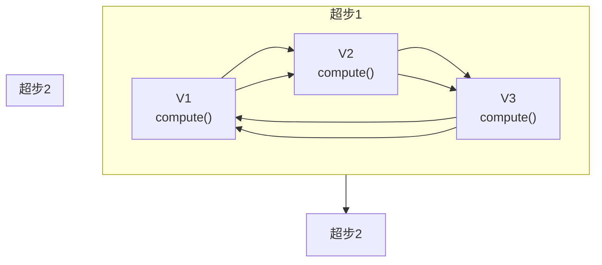
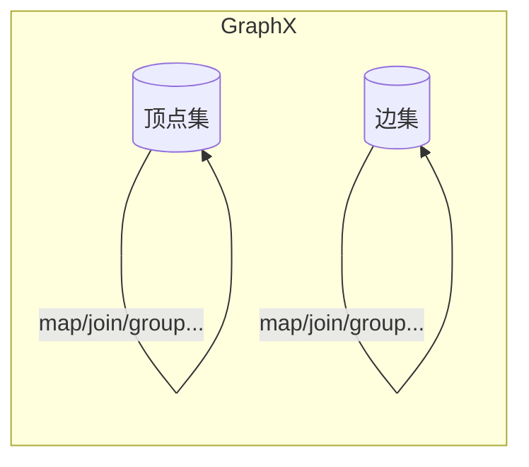
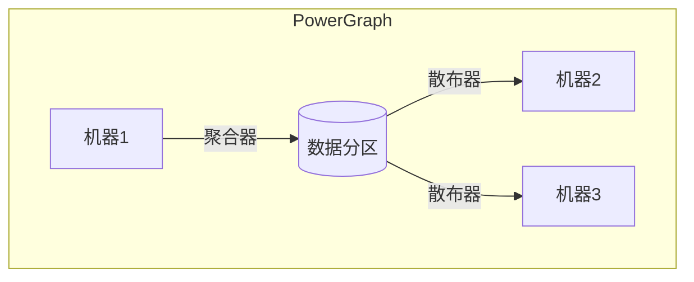

# 图计算引擎 原理与代码实例讲解

## 1.背景介绍

### 1.1 什么是图计算

图计算是一种新兴的计算范式,旨在高效处理大规模图形结构数据。图是一种非常通用和强大的数据结构,可以用来表示各种复杂的现实世界实体及其关系。从社交网络、交通网络到生物网络,从网页链接到知识图谱,无处不在的关系数据都可以用图来建模。

随着大数据时代的到来,图形结构数据的规模也呈现出爆炸式增长,传统的计算系统难以高效处理这些数据。因此,图计算应运而生,旨在提供一种专门的计算模型和系统架构,来满足大规模图数据处理的需求。

### 1.2 图计算的应用场景

图计算广泛应用于各个领域,包括但不限于:

- **社交网络分析**: 发现社交网络中的社区结构、影响力用户、信息传播路径等。
- **推荐系统**: 基于用户之间的关系进行个性化推荐。
- **知识图谱**: 构建和查询大规模知识图谱。
- **反欺诈检测**: 在金融、电信等领域检测欺诈行为。
- **交通路径规划**: 在交通网络中寻找最优路径。
- **生物信息学**: 分析蛋白质互作网络、代谢网络等。

## 2.核心概念与联系

### 2.1 图的数据结构

在图计算中,图是核心的数据结构。一个图 G = (V, E) 由一组顶点(Vertex)集合 V 和一组边(Edge)集合 E 组成。每条边连接两个顶点,用于表示它们之间的关系。

根据边的方向性,图可分为无向图和有向图:

- 无向图: 边没有方向,任意两个顶点之间的连接是双向的。
- 有向图: 边有方向,连接顶点的顺序很重要。

### 2.2 属性图

在实际应用中,顶点和边通常还会携带属性信息。这种附加属性的图称为属性图(Property Graph)。属性可以是任意类型的键值对,用于对实体进行丰富的语义建模。

### 2.3 图数据模型

为了高效处理图数据,图计算系统需要采用特殊的数据组织和存储模型。常见的图数据模型包括:

- **关系数据库**: 将图数据存储在关系数据库中,利用连接操作来模拟遍历。
- **键值存储**: 将顶点和边分别存储为键值对,通过键值查询实现遍历。
- **专用图数据库**: 采用特殊的本地/分布式存储引擎,直接持久化图数据结构。
- **内存计算**: 将整个图加载到内存中,借助并行计算框架实现高效遍历。

## 3.核心算法原理具体操作步骤

### 3.1 图遍历算法

图遍历是图计算的核心操作,用于沿着顶点和边的连接探索整个图。常见的图遍历算法有:

#### 3.1.1 深度优先搜索(DFS)

深度优先搜索是一种遍历或搜索树或图数据结构的算法。它沿着树的深度遍历树的节点,尽可能深的搜索树的分支。当节点v的所有边都己被探寻过,搜索将回溯到发现节点v的那条边的起始节点。这一过程一直进行到已发现从源节点可达的所有节点为止。

#### 3.1.2 广度优先搜索(BFS)

广度优先搜索算法也是一种图形遍历技术,它从根节点开始,沿着广度方向遍历图。简单说,从节点出发,首先访问距离起始点最近的所有节点,然后是次近的,依次递推,直到遍历完所有节点。

#### 3.1.3 遍历策略

在实际应用中,图遍历算法还可以根据不同的策略进行优化和扩展:

- **有状态/无状态**: 是否维护遍历状态,避免重复访问。
- **源点到汇点/点到点**: 从单源点出发还是多点对多点。
- **最短路径/所有路径**: 只找一条最短路径还是枚举所有可能路径。
- **并行化**: 利用现代硬件进行并行遍历以提高效率。

### 3.2 图分析算法

除了基本的遍历操作,图计算还包括许多用于分析图结构的算法,例如:

#### 3.2.1 PageRank

PageRank是一种常用于网页排名的链接分析算法。它通过网页之间的互相链接来确定网页的权重和重要性。一个高权重的网页要么有很多网页链接指向它,要么是被少数几个高权重网页链接指向的。

$$PR(p) = (1-d) + d\sum_{q\in M(p)}\frac{PR(q)}{L(q)}$$

其中:
- $PR(p)$ 表示页面 $p$ 的 PageRank 值
- $M(p)$ 是引入页面 $p$ 的页面集合
- $L(q)$ 是页面 $q$ 的引出链接数量
- $d$ 是阻尼系数,一般取值0.85

#### 3.2.2 社区发现

社区发现算法用于从大规模网络中发现具有紧密内部连接但彼此之间较少连接的节点群集或社区。常见的算法包括:

- 标签传播算法(Label Propagation)
- 行列体现算法(Girvan-Newman)
- 模块度优化算法(Modularity Optimization)
- 基于核心的层次聚类算法(Core-based Hierarchical Clustering)

#### 3.2.3 图模式匹配

图模式匹配是在一个大图中查找与给定模式图同构的子图的过程。它在知识图谱查询、化学分子检测等领域有着广泛应用。常用算法有:

- 基于子图同构性的精确匹配算法
- 基于图同构性的近似匹配算法
- 基于图核的机器学习算法

### 3.3 图并行计算模型

由于图计算具有很强的并行性,因此需要高效的并行计算模型来充分利用现代硬件。常见的图并行计算模型包括:

#### 3.3.1 Pregel 

Pregel是谷歌提出的一种大规模图并行计算模型。它将图计算抽象为一个超步(Superstep)的序列,每个超步包含三个阶段:

1. **顶点并行计算**:所有顶点并行执行用户定义的函数。
2. **顶点之间通信**:顶点之间沿着出边发送消息。
3. **顶点状态同步**:根据收到的消息更新顶点值和边缘值。

#### 3.3.2 GraphX

GraphX是Apache Spark中用于图计算的模块。它基于Spark的弹性分布式数据集(RDD),为图计算提供了一种高效的并行抽象。

GraphX将图建模为一对并行集合:顶点集和边集。通过并行转换操作(如map、join、group等)对这些集合进行处理,从而实现图算法的并行执行。

#### 3.3.3 PowerGraph

PowerGraph是CMU提出的一种基于图分区的并行图计算系统。它将图分区到不同的机器,并使用高效的聚合器(Gatherer)和散布器(Scatter)在分区间传递消息和数据。

PowerGraph的核心思想是通过数据和计算的重新分区,最大程度地减少跨机器通信,从而提高并行图计算的性能。

## 4.数学模型和公式详细讲解举例说明

在图计算中,数学模型和公式扮演着重要角色,用于形式化描述图结构、定义算法以及分析性能。本节将详细讲解一些常见的数学模型和公式。

### 4.1 图的数学表示

图可以用多种方式进行数学表示,常见的有:

#### 4.1.1 邻接矩阵

对于一个有 $n$ 个顶点的图 $G$,邻接矩阵 $A$ 是一个 $n \times n$ 的矩阵,其中 $A_{ij}$ 表示从顶点 $i$ 到顶点 $j$ 是否存在一条边:

$$
A_{ij} = \begin{cases}
1, & \text{如果 $(i, j) \in E(G)$}\\
0, & \text{否则}
\end{cases}
$$

对于无向图,邻接矩阵是对称的;对于有向图,则不对称。

#### 4.1.2 邻接表

邻接表是一种更加紧凑的图表示方式。它为每个顶点维护一个邻居列表,只存储实际存在的边。

对于无向图,邻接表可以表示为:

$$
\begin{aligned}
G &= (V, E)\\
V &= \{1, 2, \ldots, n\}\\
E &= \{(i, j) \mid i \in V, j \in N(i)\}
\end{aligned}
$$

其中 $N(i)$ 表示与顶点 $i$ 相邻的顶点集合。

### 4.2 PageRank 算法数学模型

PageRank 算法是一种常用于网页排名的链接分析算法,其数学模型如下:

设 $p$ 为某个网页,则 $p$ 的 PageRank 值 $PR(p)$ 定义为:

$$PR(p) = (1-d) + d\sum_{q\in M(p)}\frac{PR(q)}{L(q)}$$

其中:

- $M(p)$ 是所有链接到 $p$ 的页面集合
- $L(q)$ 是页面 $q$ 的出链接数量
- $d$ 是一个阻尼系数,一般取值 $0.85$

该公式的含义是:一个页面的 PageRank 值由两部分组成。第一部分 $(1-d)$ 是所有页面初始值的平均分配。第二部分是该页面从所有链入页面获得的 PageRank 值的总和。

PageRank 可以通过简单的迭代计算收敛到平衡值。在第 $k$ 次迭代中,页面 $p$ 的 PageRank 值计算如下:

$$PR_k(p) = (1-d) + d\sum_{q\in M(p)}\frac{PR_{k-1}(q)}{L(q)}$$

通过不断迭代直到收敛,我们可以得到所有页面的最终 PageRank 值。

### 4.3 图同构性

在图模式匹配等问题中,我们需要判断两个图是否同构。设 $G_1 = (V_1,