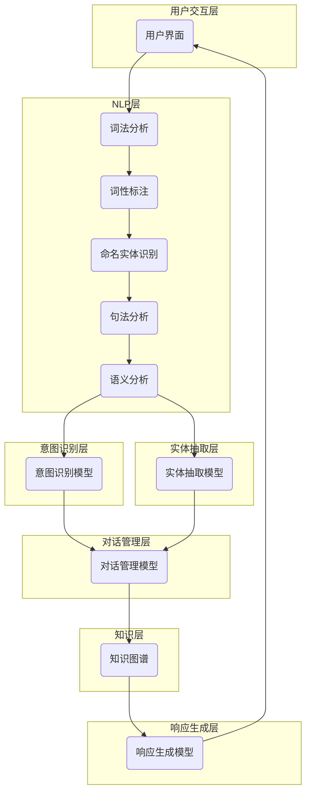

# 在电子商务中部署AI代理工作流的实战指南

## 1.背景介绍

### 1.1 电子商务的发展与挑战

随着互联网技术的飞速发展,电子商务已经成为了一种主流的商业模式。根据统计数据显示,2022年全球电子商务市场规模已经超过5万亿美元,预计未来几年将保持两位数的年增长率。电子商务的兴起极大地改变了人们的消费习惯,为消费者带来了前所未有的便利,同时也给企业带来了新的机遇和挑战。

传统的电子商务网站主要依赖于用户手动搜索和浏览产品信息,这种模式效率较低,难以满足用户个性化和智能化的需求。另一方面,电子商务企业面临着大量的客户咨询和订单处理工作,人工服务成本高且响应效率低下。因此,如何提高电子商务网站的智能化水平,优化用户体验,提高运营效率,成为了企业亟待解决的问题。

### 1.2 AI技术在电子商务中的应用

人工智能(AI)技术在近年来取得了长足的进步,已经广泛应用于各个领域,包括电子商务。AI技术可以通过机器学习、自然语言处理、计算机视觉等方法,实现智能化的产品推荐、客户服务、订单处理等功能,极大地提高了电子商务的运营效率和用户体验。

AI代理工作流是将AI技术应用于电子商务场景的一种有效方式。AI代理可以模拟人类客服的工作,通过自然语言处理技术与用户进行智能对话,了解用户需求,并提供相应的产品推荐、订单处理等服务。同时,AI代理还可以通过机器学习算法不断优化自身的服务质量,提高响应准确度。

本文将详细介绍如何在电子商务中部署AI代理工作流,包括核心概念、算法原理、系统架构、实践案例等内容,为读者提供一个全面的实战指南。

## 2.核心概念与联系

在部署AI代理工作流之前,我们需要先了解一些核心概念,这些概念相互关联,构成了AI代理工作流的基础。

### 2.1 自然语言处理(NLP)

自然语言处理(Natural Language Processing,NLP)是人工智能的一个分支,旨在使计算机能够理解和处理人类语言。NLP技术在AI代理工作流中扮演着关键角色,它能够帮助AI代理理解用户的自然语言输入,并生成相应的自然语言响应。

常见的NLP任务包括:

- 词法分析(Tokenization)
- 词性标注(Part-of-Speech Tagging)
- 命名实体识别(Named Entity Recognition)
- 句法分析(Parsing)
- 语义分析(Semantic Analysis)
- 文本生成(Text Generation)

在AI代理工作流中,NLP技术通常需要与其他技术(如机器学习、知识图谱等)结合使用,以实现更加智能和人性化的对话交互。

### 2.2 机器学习

机器学习(Machine Learning)是人工智能的另一个重要分支,它赋予计算机系统从数据中自动学习和改进的能力。在AI代理工作流中,机器学习技术可以用于以下几个方面:

1. **意图识别(Intent Recognition)**: 根据用户输入的自然语言,识别出用户的意图(如查询产品、下单、投诉等)。这通常是一个分类问题,可以使用监督学习算法(如逻辑回归、支持向量机等)来解决。

2. **实体抽取(Entity Extraction)**: 从用户输入中抽取出关键实体(如产品名称、数量、日期等),为后续的任务处理提供必要信息。这可以看作是一个序列标注问题,常用的算法包括条件随机场(CRF)、Bi-LSTM等。

3. **对话管理(Dialogue Management)**: 根据当前对话状态和历史上下文,选择合适的响应策略。这可以使用强化学习算法(如Q-Learning、Policy Gradient等)来优化。

4. **响应生成(Response Generation)**: 根据对话上下文,生成自然语言的响应内容。这可以使用序列到序列(Seq2Seq)模型(如LSTM、Transformer等)来实现。

机器学习算法需要大量的训练数据,因此数据的质量和数量对于AI代理工作流的性能至关重要。

### 2.3 知识图谱

知识图谱(Knowledge Graph)是一种结构化的知识表示方式,它将实体(Entity)、概念(Concept)以及它们之间的关系(Relation)以图的形式组织起来。在AI代理工作流中,知识图谱可以为AI代理提供必要的背景知识,帮助它更好地理解用户的意图,并生成更加准确和相关的响应。

构建知识图谱的过程包括:

1. **实体抽取**: 从非结构化数据(如文本、网页等)中识别出关键实体。
2. **关系抽取**: 识别实体之间的语义关系。
3. **知识融合**: 将来自不同数据源的知识进行整合和去重。
4. **知识推理**: 基于已有的知识,推导出新的知识。

在电子商务场景中,知识图谱可以包含产品信息、类别层级、属性特征等内容,为AI代理提供丰富的产品知识。同时,知识图谱还可以融合其他领域的知识(如常识知识、时事知识等),使AI代理的对话能力更加自然和人性化。

### 2.4 系统架构

将上述核心概念整合起来,我们可以构建一个完整的AI代理工作流系统。该系统的典型架构如下所示:

上图展示了AI代理工作流系统的基本架构和模块之间的交互流程。用户通过界面与AI代理进行自然语言对话,输入的语句首先经过NLP层进行词法、句法和语义分析,然后分别输入到意图识别模型和实体抽取模型中。意图识别模型判断用户的对话意图,实体抽取模型提取出关键实体信息。

接下来,对话管理模型根据当前的对话状态、意图和实体信息,结合知识图谱中的背景知识,决定系统的响应策略。最后,响应生成模型根据对话上下文生成自然语言的响应内容,并反馈给用户界面,完成一个对话回合。

在实际应用中,我们可以根据具体需求对这个基本架构进行调整和扩展,以满足不同场景的要求。

## 3.核心算法原理具体操作步骤

在上一节中,我们介绍了AI代理工作流系统的核心概念和基本架构。接下来,我们将深入探讨其中几个关键模块的算法原理和具体操作步骤。

### 3.1 意图识别算法

意图识别是AI代理工作流中的一个关键环节,它的目标是根据用户的自然语言输入,准确识别出用户的对话意图。常见的意图包括查询产品信息、下单购买、投诉反馈等。

意图识别可以看作是一个文本分类问题,我们可以使用监督学习算法来解决。以下是一种基于深度学习的意图识别算法的具体步骤:

1. **数据预处理**:对训练数据进行清洗、标注和分词等预处理操作,将文本转换为算法可以处理的向量表示形式。

2. **特征提取**:使用Word2Vec、BERT等模型,将文本转换为dense vector表示,作为模型的输入特征。

3. **模型构建**:构建深度学习模型,常用的模型包括TextCNN、BiLSTM、BERT等。模型的输出层是一个分类层,输出各个意图类别的概率分布。

4. **模型训练**:使用标注好的训练数据,通过反向传播算法优化模型参数,最小化分类损失函数(如交叉熵损失)。

5. **模型评估**:在保留的测试集上评估模型的分类性能,常用的指标包括准确率、精确率、召回率和F1分数。

6. **模型调优**:根据评估结果,通过调整超参数、增加训练数据、特征工程等方式,不断优化模型性能。

7. **模型部署**:将训练好的模型部署到AI代理工作流系统中,用于实时的意图识别任务。

在实际应用中,我们还需要考虑意图识别的鲁棒性,即对于一些异常输入(如拼写错误、语义歧义等),模型仍然能够给出合理的预测结果。此外,我们还可以引入上下文信息,利用对话历史来提高意图识别的准确性。

### 3.2 实体抽取算法

实体抽取是另一个重要的NLP任务,它的目标是从用户的自然语言输入中识别并抽取出关键实体,如产品名称、数量、日期等。这些实体信息对于后续的对话管理和响应生成至关重要。

实体抽取可以看作是一个序列标注问题,我们可以使用基于统计模型或深度学习模型的算法来解决。以下是一种基于Bi-LSTM-CRF的实体抽取算法的具体步骤:

1. **数据预处理**:对训练数据进行清洗、标注和分词等预处理操作,将文本转换为算法可以处理的序列形式,并标注每个token的实体类别(如B-Product、I-Product等)。

2. **词向量表示**:使用Word2Vec、BERT等模型,将每个token转换为dense vector表示。

3. **模型构建**:构建Bi-LSTM-CRF模型,其中Bi-LSTM用于捕获上下文信息,CRF层用于对整个序列进行标注。

4. **模型训练**:使用标注好的训练数据,通过反向传播算法优化模型参数,最小化序列标注的损失函数。

5. **模型评估**:在保留的测试集上评估模型的标注性能,常用的指标包括精确率、召回率和F1分数。

6. **模型调优**:根据评估结果,通过调整超参数、增加训练数据、特征工程等方式,不断优化模型性能。

7. **模型部署**:将训练好的模型部署到AI代理工作流系统中,用于实时的实体抽取任务。

在实际应用中,我们还需要考虑实体抽取的鲁棒性和可扩展性。例如,当出现新的实体类型时,我们需要能够快速地对模型进行扩展和重训练。此外,我们还可以利用知识图谱中的实体信息,提高实体抽取的准确性。

### 3.3 对话管理算法

对话管理是AI代理工作流中的大脑和控制中心,它的目标是根据当前的对话状态、用户意图和实体信息,决定系统的响应策略,并维护对话的连贯性和一致性。

对话管理可以看作是一个序列决策问题,我们可以使用强化学习算法来解决。以下是一种基于Q-Learning的对话管理算法的具体步骤:

1. **定义对话状态**:对话状态可以包括当前的用户意图、已提取的实体信息、对话历史等信息的组合。

2. **定义动作空间**:动作空间包括系统可以执行的所有响应操作,如请求补充信息、提供产品详情、完成订单等。

3. **定义奖励函数**:设计一个合理的奖励函数,用于评估当前状态-动作对的质量。奖励函数可以考虑对话的成功率、效率和用户满意